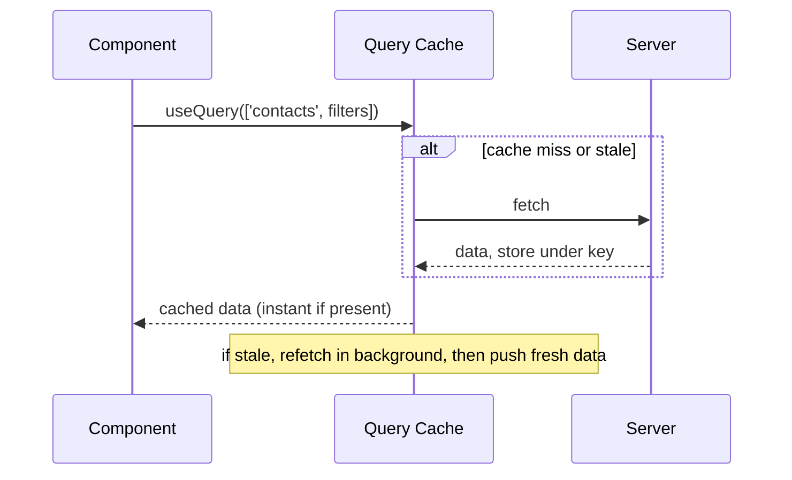

## Why This Matters

Every component that fetches data repeats the same pattern: `useState` for data, loading, and error. `useEffect` to call `fetch`. Two components needing the same data fire two separate requests. Navigate away and back — another request. No cache. No retry. No background refresh.

You've built this. It works until it doesn't. The moment you have shared data, stale-while-revalidate UX, or optimistic updates — the hand-rolled approach falls apart. You're essentially reimplementing a cache badly in every single component.

## The Core Idea

**Server state is a cache, not local state.**

Server data lives on someone else's machine. You don't own it — you're holding a copy. It can go stale the moment after you fetch it. Multiple components read the same data. That's nothing like `useState`, which holds a value local to one component.

So you don't store server data in state. You cache it, keyed by what you asked for (the query key). You show the cached copy instantly and revalidate in the background. This is **stale-while-revalidate**, and TanStack Query is that cache plus that policy engine.



Think of the query cache like a browser cache for your app's data. When a component asks for data, the cache checks: "Do I have this? Is it fresh?" If yes, instant return. If stale or missing, fetch in background while still showing what we have.

Every feature — staleTime, gcTime, refetch, invalidation, optimistic updates — is just a knob on "how fresh must this cached copy be, and when do we re-ask?"

## Key Terms

- **Query key = cache key.** Same key → same cache entry, deduped across components. Two components using `['contacts']` share one fetch. If Component A and Component B both use `['contacts']`, they share one cache entry and one network request.
- **staleTime** = how long data stays fresh (no refetch). Think "how old is too old?"
- **gcTime** = how long an unused entry stays in memory before garbage collection. Think "how long do we keep this around?"
- **isLoading** = true only on first load when no data exists yet. **isFetching** = true during any fetch in flight, including background revalidation.

## The Lifecycle

```jsx
const { data, isLoading, isFetching } = useQuery({
  queryKey: ['contacts', { filters, page }],
  queryFn: () => api.getContacts(filters, page),
  staleTime: 30_000,
  gcTime: 5 * 60_000,
});
```

**Mount (cache miss):** Key not in cache. `queryFn` fires. `isLoading` is true. Response arrives, stored under key. `isLoading` false, data renders.

**Remount within 30s:** Key present and fresh. Cache serves instantly. No network request. Component renders immediately with zero delay.

**Remount after 30s:** Key stale. Cache serves stale data instantly for the initial render. Background refetch fires. `isFetching` is true. Fresh data arrives, swaps in. `isFetching` false. User never sees a spinner.

**Unmount:** Entry becomes inactive. `gcTime` timer starts. 5 minutes with no observers — entry removed. If a component re-mounts before gcTime fires, stale data is still there for instant rendering.

**isLoading vs isFetching:** isLoading is true only on first load when no cached data exists. isFetching is true during any fetch in flight, including background revalidation. Show a full skeleton on isLoading. Show a subtle indicator (or nothing) on isFetching — the old data is still visible. This is the stale-while-revalidate UX.

## Mutations

For simple cases, invalidate after the mutation to mark the cache stale. Next time a component reads it, it refetches:

```ts
useMutation({
  mutationFn: (newStatus) => api.updateContactStatus(id, newStatus),
  onSettled: () => queryClient.invalidateQueries({ queryKey: ['contacts'] }),
});
```

For instant UX on large lists, use optimistic updates — patch the cache immediately, roll back on error:

```ts
useMutation({
  mutationFn: (newStatus) => api.updateContactStatus(id, newStatus),
  onMutate: async (newStatus) => {
    await queryClient.cancelQueries({ queryKey: ['contacts'] });
    const previous = queryClient.getQueryData(['contacts']);
    queryClient.setQueryData(['contacts'], (old) =>
      old.map(c => c.id === id ? { ...c, status: newStatus } : c)
    );
    return { previous };
  },
  onError: (err, newStatus, ctx) => queryClient.setQueryData(['contacts'], ctx.previous),
  onSettled: () => queryClient.invalidateQueries({ queryKey: ['contacts'] }),
});
```

Why `cancelQueries` first? A background refetch might be in flight. If you patch the cache while a refetch is pending, the refetch response overwrites your optimistic patch with stale data — the UI flickers back to the old status. The pattern: cancel races, snapshot for rollback, patch the cache, rollback on error, reconcile on settle.

## How It Works Under the Hood

TanStack Query maintains a JavaScript object mapping query keys to cache entries. Each entry holds data, status, and metadata (staleTime, gcTime, subscribers). When `useQuery` mounts, it subscribes to its key's entry. If the entry exists and is fresh, it returns data immediately. If stale or missing, it schedules a fetch.

The fetch internally calls queryFn, awaits the response, and stores the result. All subscribers (components using that key) receive new data and re-render. This is publish-subscribe: components subscribe, the cache publishes. The cache entry tracks subscriber count. When count hits zero (all components unmounted), the gcTime timer starts.

Invalidation sets the entry's stale flag. Next subscriber check sees the stale flag and triggers a refetch. Optimistic updates directly call `setQueryData`, which pushes patched data to all subscribers.

## Query Cache + Virtualization

For infinite scrolling lists with 500K rows, `useInfiniteQuery` holds fetched pages in the cache. A virtualizer (react-virtual) renders only visible rows in the DOM. The query cache is the data layer. The virtualizer is the view layer. They're independent — you can swap the data source without changing the virtualizer, or vice versa.

Real-time status events call `setQueryData` to patch a single row. If visible, it re-renders in place. If off-screen, it's correct when scrolled to.

## Q&A

**1. Why is server state different from client state?**

Server state is remote, shared across components, and asynchronous. You can't read it synchronously. Multiple components (and users) read the same data. Local state belongs to one component; server state belongs to the whole application. That's why useState + useEffect breaks down — it doesn't deduplicate, share, or handle staleness.

**2. What's the difference between staleTime and gcTime?**

staleTime controls refetching — how long data is considered fresh. gcTime controls memory — how long an unused cache entry survives before being garbage collected. They're orthogonal: one manages freshness, the other manages memory. Too short staleTime means too many requests. Too long means stale data. gcTime too short means frequent refetches on remount.

**3. How do you show stale-while-revalidate in the UI?**

Show a skeleton only when `isLoading` is true (first load). When `isFetching` is true but data exists, keep the old data visible with a subtle indicator. The user never sees a loading spinner for data they've already seen.

**4. Why cancelQueries before optimistic updates?**

A background refetch might be in flight. If you patch the cache while a refetch is pending, the refetch response overwrites your optimistic patch with stale data. Cancelling ensures no in-flight request can race against your cache mutation.

## Mental Trigger

**Server state is a cache, not local state.**
