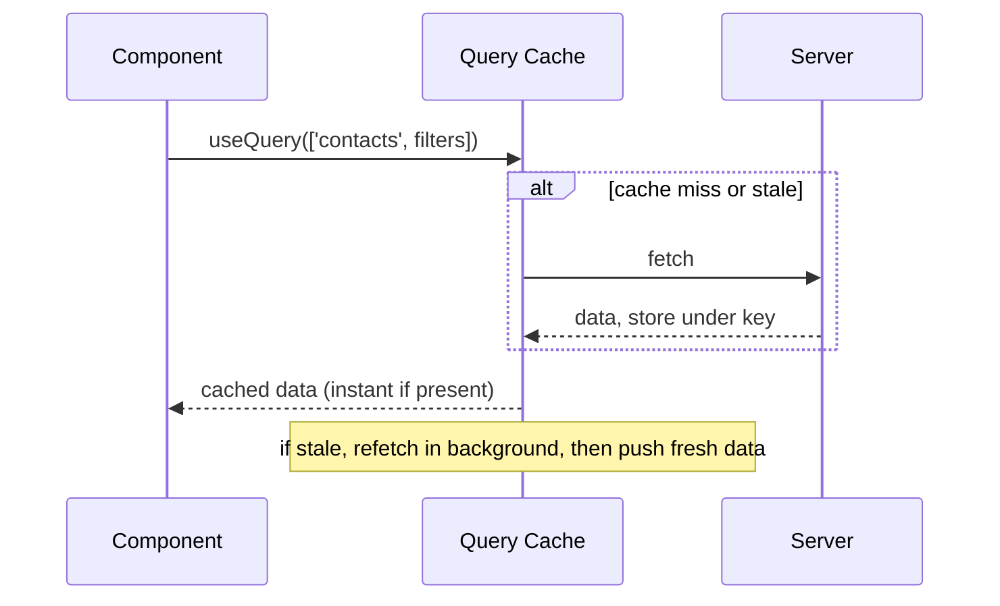
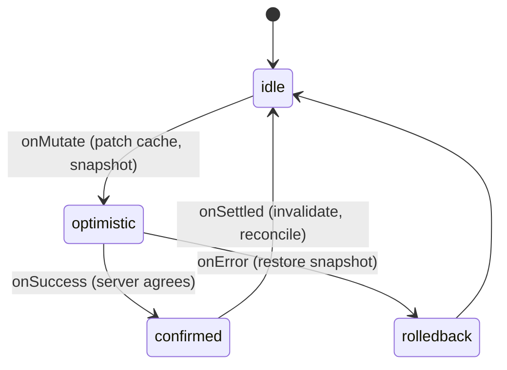

> Prerequisites: async/await, Promise execution, event loop; `useState` and re-render mechanics; `useEffect` lifecycle and stale closures. JD-critical: this company lists TanStack Query twice. It is the data layer behind Interviewer's contacts table.

## Problem

Every component that fetches data repeats the same pattern. `useEffect` with `fetch` inside. Three `useState` calls for data, loading, error. No sharing between components. Two components mounted at the same time fire two identical requests. Remount after navigation fires another request. No cache. No retry. No background refresh. The code is repetitive, bug-prone, and wasteful.

## Why Existing Solution Failed

`useState` plus `useEffect` treats server data as local state. It is not. Server data is remote, shared across components, asynchronous by nature, and can go stale at any moment. Local state belongs to one component. Server data belongs to the application. Hand-rolling this means you reimplement a cache badly in every component. You get no deduplication, no garbage collection for unused entries, no way to invalidate across components, and stale-closure bugs when the effect captures outdated variables.

## Mental Model

Server state is not your state. It is a cache of data that lives on someone else's machine. It can go stale at any moment. So you do not store it in `useState`. You cache it keyed by what you asked for (the query key). You adopt a policy: show the cached copy instantly, and revalidate in the background. This is stale-while-revalidate. TanStack Query is that cache plus that policy engine. Every feature (staleTime, gcTime, refetch, invalidation, optimistic updates) is just a knob on "how fresh must this cached copy be, and when do I re-ask?"

Key terms:
- **Query key = cache key.** Same key means same cached entry, deduped across components.
- **stale-while-revalidate:** serve cache now, refetch in background, swap when fresh arrives.
- **staleTime** = how long data stays fresh (no refetch). **gcTime** = how long an unused entry stays in memory before garbage collection. Different axes.

## Visualization



Mutation lifecycle with optimistic update:



## Engine Simulation

Track what happens with this code:

```jsx
const { data, isLoading, isFetching } = useQuery({
  queryKey: ['contacts', { filters, page }],
  queryFn: () => api.getContacts(filters, page),
  staleTime: 30_000,
  gcTime: 5 * 60_000,
});
```

Execution trace:

Mount #1: key `['contacts',{...}]` not in cache. TanStack calls queryFn. Fetch fires. Response arrives. Stored under key with status 'success'. isLoading flips true to false. data renders.

Remount within 30 seconds: key present and fresh (within staleTime). Serve cache instantly. No fetch. Component renders immediately.

Remount after 30 seconds: key present but stale. Serve cache instantly for instant render. Then refetch in background. isFetching is true during background fetch. data stays visible. When fresh data arrives, swap in. isFetching goes false.

Component unmounts: entry becomes inactive. gcTime timer starts. 5 minutes pass with no observers. Entry garbage collected.

Two timers explained:
- staleTime controls refetching. High staleTime means fewer network requests.
- gcTime controls memory. It determines how long an unused entry survives so a remount can be instant.

isLoading is true only on first load when no data exists yet. isFetching is true during any fetch in flight, including background revalidation while showing stale data. Show a subtle spinner on isFetching but keep content on data. This is the stale-while-revalidate UX.

## Internal Implementation

TanStack Query maintains a JavaScript object acting as a map of query keys to cache entries. Each entry holds the data, status, and metadata (staleTime, gcTime, subscribers). When useQuery mounts, it subscribes to the cache entry for its key. If the entry exists and is fresh, it returns the data immediately. If it is stale or missing, it schedules a fetch.

The fetch internally calls the queryFn, awaits the response, and stores the result in the cache entry. All subscribers (components using that key) receive the new data and re-render. This is a publish-subscribe pattern. The cache entry tracks subscriber count. When count hits zero (all components unmounted), the gcTime timer starts. When it fires, the entry is removed from the map.

Invalidation sets the entry's stale flag. Next subscriber check sees the stale flag and triggers a refetch. Optimistic updates directly call setQueryData on the entry, which pushes the patched data to all subscribers.

## Real World Example

Interviewer's contacts table shows a list of contacts fetched from the server. The user can edit a contact's status inline. With 500,000 rows, refetching on every status change is too expensive.

The solution uses two strategies. For simple cases, call invalidateQueries after the mutation. This marks the contacts cache stale. Next time a component reads it, it refetches. For instant UX, use an optimistic update. On mutate, cancel any in-flight queries for the same key. Snapshot the current cache. Patch just the changed row with setQueryData. The UI flips instantly. If the server rejects the change, roll back to the snapshot. On settle, invalidate to reconcile with the server.

For the infinite scrolling contacts list, useInfiniteQuery holds fetched pages in the cache. A virtualizer (react-virtual or similar) renders only visible rows in the DOM. The query cache is the data layer. The virtualizer is the view layer. Real-time status events call setQueryData to patch a single row. If visible, it re-renders in place. If off-screen, it is correct when scrolled to.

## Tradeoffs

TanStack Query adds bundle size (roughly 10KB gzipped). For a simple app with one or two fetch calls, it might be overkill. You can use plain fetch plus useEffect. But as the app grows, the hand-rolled approach costs more in bugs and maintenance than the library overhead.

staleTime and gcTime need tuning. Too short staleTime means too many requests. Too long staleTime means stale data. gcTime that is too short means frequent refetches on remount. gcTime that is too long wastes memory for data no one views.

Optimistic updates add complexity. You need cancelQueries, snapshot, rollback, and reconcile. For simple mutations, invalidate alone is simpler and safer.

## Common Mistakes

- Putting server data in Redux or useState. You reimplement TanStack badly.
- Confusing staleTime and gcTime. staleTime controls freshness (refetching). gcTime controls memory (how long unused entries survive).
- Unstable query keys. New object identity that represents the same query causes cache misses. Missing a variable the query depends on causes stale data.
- Optimistic update without cancelQueries. An in-flight refetch overwrites your patch.
- Forgetting rollback on error. The UI then shows incorrect data.

## SDE-2 Interview Answer

**Mid-level variant:**
"Server data is different from client data because it is shared, async, and can go stale. useState and useEffect hand-rolling means no caching, no dedup, and stale-closure bugs. TanStack Query wraps fetch in a cache keyed by the query key. It serves cached data instantly and refetches in the background when stale. staleTime controls how long data is fresh. gcTime controls how long unused data stays in memory."

**Senior variant:**
"I frame server state as a cache, not local state. The query key is the cache identity. Two identical keys in different components share one cache entry and one fetch. staleTime and gcTime are orthogonal controls: one for request frequency, one for memory. For mutations, I use invalidation for simple cases and optimistic updates for instant UX on large lists. The optimistic pattern requires four steps: cancelQueries to stop races, snapshot for rollback, setQueryData for the patch, and onSettled invalidate for reconciliation. I pair useInfiniteQuery with virtualization for large lists, giving clean separation between data layer and view layer."

**Engineering Lead variant:**
"At the team level, I establish a pattern: server state always goes through TanStack Query, never into Redux or useState. The team uses consistent staleTime and gcTime defaults based on data freshness requirements. Optimistic updates are documented with a template showing cancel, snapshot, patch, and rollback. Code review catches unstable query keys. The architecture separates data fetching (TanStack Query) from state management (Zustand for client state) from UI components, keeping each layer replaceable. I also ensure the team understands the cache lifecycle so they debug cache issues instead of working around them."

## Follow-up Questions

1. Why is server state different from client state? Give three properties.

2. Walk the cache lifecycle of a query across mount, remount-fresh, remount-stale, and unmount.

3. Implement an optimistic status toggle with rollback. Why must you call cancelQueries first?

4. How do query cache and virtualization split responsibilities in the contacts list?

5. isLoading versus isFetching. When does each fire, and how do you use them in the UI?

## Mental Trigger

Server state is a cache, not local state.

## One Page Revision

- Server state is a cache of remote data, not local state. This frame justifies the whole library.
- Query key = cache identity. Same key means dedup and sharing across components.
- stale-while-revalidate: serve cached data, refetch in background.
- staleTime controls freshness and refetching. gcTime controls how long unused cache survives in memory. They are orthogonal.
- Mutations: invalidateQueries for simple cases. Optimistic update with cancelQueries, snapshot, patch, rollback, reconcile for instant UX.
- Pair useInfiniteQuery (data layer) with virtualization (view layer) for clean separation.
- isLoading = first load, no data yet. isFetching = any fetch in flight including background revalidation.
