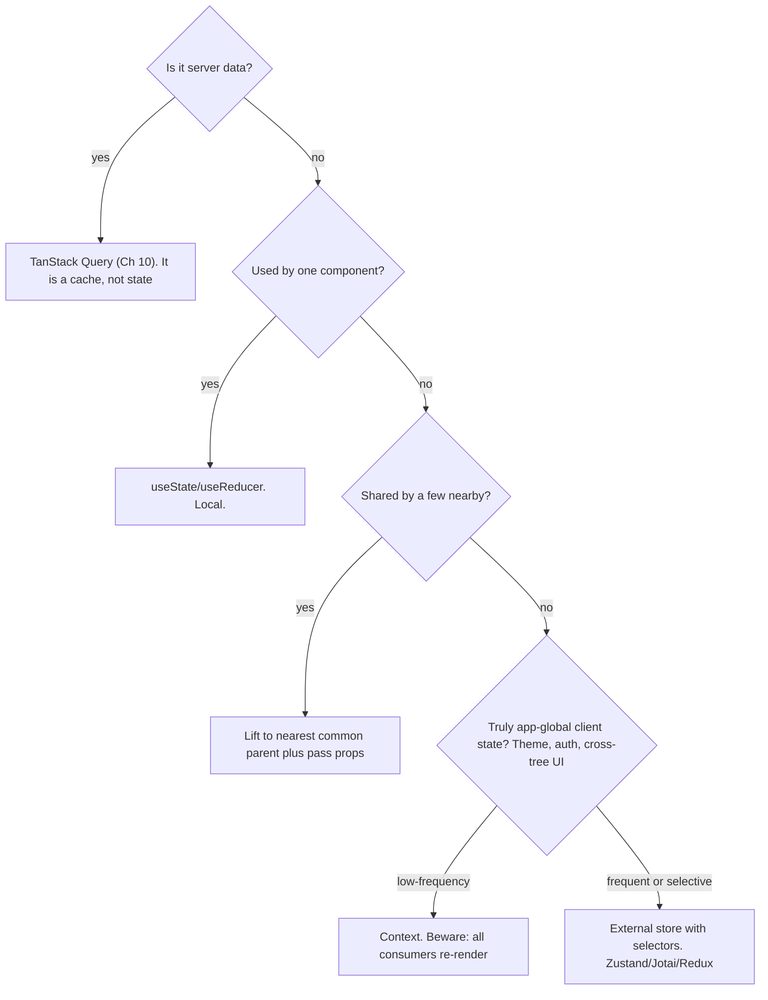

> Prerequisites: TanStack Query cache model (Ch 10), React re-render behavior, useState/Context/Zustand tradeoffs, component composition. Covers the design-system, state-landscape, shadcn-Tailwind ground Interviewer probes, and the system-design framing for the contacts-table question.

## The Problem That Keeps You Up at Night

Picture this: you're building a dashboard. You throw everything into a global store because it seems easy. A week later, changing the search filter breaks the user avatar in a completely unrelated corner of the app. Sound familiar? That's the blast radius problem.

Here's the dilemma: global state couples unrelated features. A change in one place breaks things everywhere. But going fully local means you can't share state that *needs* to be shared. And without a design system, every team reinvents buttons, spacing, and colors. One change requires editing fifty files.

This is the classic architecture trap. Let's fix it.

## Why Existing Solutions Failed

**Global state as the default** fails because it couples unrelated features. Change one part of the store, and anything reading that store might break. It's like wiring every light in your house to the same switch — flip it, and the whole house goes dark.

**Context as the default state manager** fails because every consumer re-renders on every value change. There's no selective subscription. React just re-renders the entire subtree. Context is simple, but it has a dirty secret: performance degrades with frequency.

**Server data in Redux or Context** fails because you reimplement caching and refetching that TanStack Query already handles. You're building a worse version of something that already exists.

**Folder-by-type** (`components/`, `hooks/`, `utils/`) scatters a single feature across many directories. A change to one feature touches many folders. It's like organizing your kitchen by color instead of by function — the salt ends up with the blue towels while the pepper is next to the blue plates.

## The Mental Model: Contain Change

Here's the one idea that changes everything: **Architecture is about containing change**.

Every architecture decision answers one question: *when requirements change, how small can I make the blast radius?*

Two levers do most of the work:

1. **Put state as low as possible** — close to where it's used — so changes stay local.
2. **Hide volatile details behind stable boundaries** — components, hooks, modules — so callers don't break when internals change.

Good structure isn't about folders. It's about **who has to change when something does**.

This mental model explains everything: why colocation beats global state, why server state is its own category (Ch 10), why composition beats configuration, why design systems exist, and how to reason about frontend system-design questions.

## The Decision Tree

Where does state go? Walk through this tree:



This tree gives you a repeatable answer for every piece of state. No more guessing.

## The Theme Toggle: Two Approaches

Let's make this concrete. Take a theme toggle — the user clicks a button to switch from light to dark mode. Theme is a global value needed by every component.

**The Context approach:** The theme context provider holds `{ theme, setTheme }`. The button calls `setTheme('dark')`. The provider re-renders with the new value. Every consumer of `useContext(ThemeContext)` re-renders — even if they only read the value once and never change it.

This is fine for theme because it changes rarely. The re-render tax is negligible. For a full explanation of why Context re-renders all consumers and how to fix it, see Ch 21.

**The Zustand approach:** The store lives outside React.

```js
const useThemeStore = create((set) => ({
  theme: 'light',
  setTheme: (theme) => set({ theme }),
}));
```

A component subscribes to only the `theme` slice:

```jsx
const theme = useThemeStore((s) => s.theme);
```

When `setTheme('dark')` runs, only components that selected `s => s.theme` re-render. A component that selected a different slice doesn't re-render. No provider wrapper. The store sits outside the component tree.

## How It Actually Works Under the Hood

Zustand creates a plain JavaScript store outside React. The store holds state and a list of subscribers. When a component calls `useStore(selector)`, it subscribes with that selector function. The store tracks which selectors depend on which parts of state. When state changes, the store diffs the previous selector output against the new output. Only subscribers whose selected value changed get notified and re-render.

Context uses React's built-in propagation. When a context value changes, React marks the whole subtree below the provider for re-render. There's no selector mechanism (Ch 21 explains this in detail).

**The core distinction:** Zustand does selective subscription at the store level. Context does broadcast re-render at the React tree level.

## The Contacts Table: Putting It All Together

Your interviewer asks you to design a contacts table. The page has a search bar, filter panel, sort controls, and the table itself. Each piece of state goes to its lowest reasonable scope:

- **Search input text** is local to the search component. Not shared. `useState` is enough.
- **Selected filters** need to affect the query sent to the server. They go to the parent page component.
- **TanStack Query** holds the fetched contacts data.
- **Sort column and direction** are URL search params so they survive page refresh.
- **Theme preference** is global and rarely changes, so Context works.

For the UI layer: **shadcn/ui** provides the table, button, and input components. They're copied source files in the repo. The team customizes them for brand colors. **Tailwind** utility classes handle spacing and typography consistently. A design token change in `tailwind.config` updates everywhere.

## The Tradeoffs Nobody Talks About

**Colocation vs duplication:** Keeping state local sometimes means duplicating logic across components. Lifting state adds prop threading. Context solves prop threading but adds re-render overhead. Zustand solves re-render overhead but adds a dependency and a mental model of stores. There's no free lunch — each tool fits a specific state category.

**shadcn vs MUI:** shadcn gives you full ownership of component code. You can customize anything. But you maintain the code yourself. MUI gives you a complete library with less setup, but you fight the theming system and ship a bigger bundle. Choose shadcn when you need custom design and own the maintenance. Choose MUI when speed of shipping matters more than design flexibility.

**Feature folders vs type folders:** Feature folders contain change within one directory. Type folders scatter a feature change across `components/`, `hooks/`, `utils/`, `tests/`. Feature folders win for containment. Type folders can work at very small scale when the whole app fits in one mental model.

## The Mistakes That Come Back to Bite You

- **Global store as a dumping ground.** Wide re-renders and coupling. Colocate first.
- **Server data in Redux or Context.** You reimplement Query badly (Ch 10).
- **Context for high-frequency state.** All consumers re-render every time.
- **Folder-by-type at scale.** A feature change is scattered across many folders.
- **Reaching for Redux reflexively** when Query plus local plus a little Zustand suffices.

## Interview Answers That Sound Human

**Mid-level variant:**
"I match each piece of state to its smallest workable scope. Server data goes to TanStack Query. Local UI state uses `useState`. Shared state goes to the nearest common parent. Global rare state uses Context. Global frequent state uses Zustand with selectors. Colocation is the default. Lifting is a deliberate choice."

**Senior variant:**
"Architecture is about containing change. I apply two rules: put state as low as possible, and hide volatile details behind stable boundaries. The state-location decision tree gives me a repeatable answer for every piece of state. I use Context for low-frequency globals like theme because it's simple and the re-render tax is irrelevant for rare changes. I use Zustand for high-frequency globals because selector subscriptions avoid the Context re-render problem. For design systems, I prefer shadcn because the team owns the code and customizes freely. I organize by feature so a change touches one folder."

**Engineering Lead variant:**
"I establish conventions that encode the state-location decision tree. Server state goes to TanStack Query, never to Redux or Context. Client state uses Zustand with a documented pattern for selectors. The team agrees on feature folders. Design tokens live in one config file. I review architecture decisions through the containment lens: does this decision make future changes safer or riskier? I also run lightweight system-design reviews for new features using the clarify-data-render-state-realtime-crosscuts framework."

## Questions to Practice With

1. Walk the state-location decision tree for: form input, current theme, fetched contacts, a cross-page wizard step.

**Form input text:** Local to the component. Used by one component. Decision: `useState`. The text lives in the search input and isn't shared. **Current theme:** App-global, low-frequency (user toggles it rarely). Decision: Context. The re-render tax is negligible for something that changes once a session. **Fetched contacts:** Server data. Decision: TanStack Query. It's a cache of remote data, not client state. Putting it in Redux or Context reimplements caching badly. **Cross-page wizard step:** Shared by a few components across routes. Decision: Lift to nearest common parent or use URL search params. If the wizard spans multiple routes, URL params survive navigation. If it's a single-page multi-step form, lifting to the page container with `useState` works. If multiple pages need it, Zustand with a small store or URL state is the right call.

2. Why does a Context value change re-render all consumers, and how does Zustand avoid it?

React Context has no selector mechanism. When a provider's value changes, React marks the entire subtree below that provider for re-render. Every component calling `useContext(X)` in that subtree re-renders, even if it only reads a tiny slice of the value. React does this because it can't know which parts of the value each consumer cares about — the whole object is the value, and there's no way to subscribe to a subset. Zustand avoids this because the store lives outside React. Each component subscribes with a selector function like `(s) => s.theme`. When state changes, Zustand diffs the previous selector output against the new output. Only subscribers whose selected value actually changed get notified and re-render. A component selecting `s => s.theme` won't re-render when `s.sidebarOpen` changes, even though both live in the same store. The core distinction: Context broadcasts at the React tree level. Zustand subscribes at the store level with selectors.

3. Explain shadcn vs a component library. What's the tradeoff?

shadcn/ui copies component source files directly into your repo. You own the code, you customize it, you maintain it. There's no package upgrade that breaks your styles — the code is yours. The tradeoff: you must maintain accessibility fixes and feature additions yourself. A component library like MUI or Chakra installs as a dependency. You get a maintained, accessible component set out of the box with less setup. The tradeoff: you fight the theming system when your design diverges from the library's defaults, you ship a larger bundle (MUI alone is ~70KB gzipped), and you're at the mercy of the library's upgrade cycle. Choose shadcn when you need design flexibility and your team can own maintenance. Choose a component library when speed of shipping matters more than custom design.

4. Run the system-design framework on "design a notifications dropdown with unread counts."

**Clarify:** How many notifications? Do they arrive in real-time? What devices? What actions can a user take (mark read, dismiss, navigate)? **Data layer:** REST endpoint `GET /notifications?unread=true` with pagination. TanStack Query caches the list. Unread count is a derived value from the cached array or a separate lightweight endpoint. **Rendering:** Virtualize if 100+ notifications. Show four states: loading (skeleton), empty ("No notifications"), error (retry), data (list). **State:** Dropdown open/close is local state. Read/unread selection updates the cache via `setQueryData`. Filters (all/unread) go in the query key. **Real-time:** WebSocket or SSE pushes new notifications. Patch the cache with `setQueryData` — prepend the new notification and increment the unread count. If the dropdown is open, the list updates instantly. **Cross-cuts:** a11y — `aria-expanded` on trigger, `role="menu"` on list, keyboard navigation (arrow keys, Escape to close). Perf — virtualize long lists, debounce mark-all-read. Errors — retry on network failure. Tradeoffs — polling vs WebSocket depending on notification frequency.

5. Feature folders vs type folders. Argue for one using the concept of blast radius.

Feature folders win for blast radius containment. When you organize by feature — `contacts/`, `auth/`, `settings/` — a change to the contacts feature touches only the `contacts/` folder. The blast radius is one directory. When you organize by type — `components/`, `hooks/`, `utils/`, `tests/` — a change to the contacts feature scatters across four or five directories. The blast radius spans the entire codebase structure. Feature folders also make code ownership clearer: the `contacts/` directory is the domain of whoever owns the contacts feature. Type folders create confusion about where a new contacts-related hook should go. The only advantage of type folders is discoverability at very small scale — when the whole app fits in your head, seeing all hooks in one place is nice. But that advantage disappears once the codebase exceeds ~50 files. At scale, containment beats discoverability every time.

## Mental Trigger

**Architecture = containing change.**

## One Page Revision

- Architecture = containing change. Put state as low as possible. Put stable boundaries around volatile details.
- Match state to its category: local, lifted, Context (rare global), external store (frequent global, selector subscriptions), server (TanStack Query).
- Context re-renders all consumers on any value change. Zustand subscribes to slices. That's the core distinction.
- Design system + tokens + Tailwind + shadcn contain UI change. shadcn copies owned, accessible source instead of installing a constrained library.
- Repeatable system-design framework: clarify, data, rendering, state, realtime, cross-cuts.
- Organize by feature to contain change within one directory.
