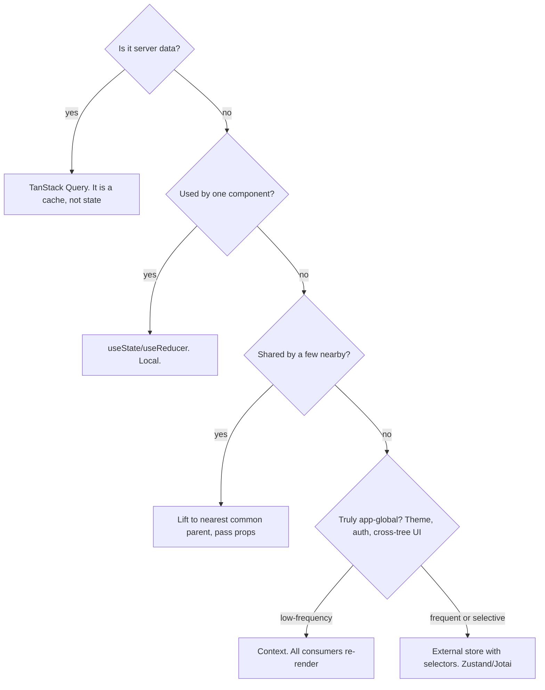

## Why This Matters

You throw everything into a global store because it seems easy. A week later, changing the search filter breaks the user avatar in an unrelated corner of the app. That's the blast radius problem — and it's the core challenge of frontend architecture.

Global state couples unrelated features. Fully local state can't share what needs sharing. Without a design system, every team reinvents buttons. The fix isn't more tools — it's better containment.

## The Core Idea

**Architecture is about containing change.**

Every architecture decision answers one question: *when requirements change, how small can I make the blast radius?*

Two levers do most of the work:
1. **Put state as low as possible** — close to where it's used — so changes stay local.
2. **Hide volatile details behind stable boundaries** — components, hooks, modules — so callers don't break when internals change.

Good structure isn't about folders. It's about who has to change when something does. This explains why colocation beats global state, why server state is its own category, why composition beats configuration, and why design systems exist.

## The State Location Decision Tree



Walk this tree for every piece of state. No more guessing. Server data goes to TanStack Query. Local UI state uses `useState`. Shared state lifts to the nearest common parent. Global rare state uses Context. Global frequent state uses Zustand with selectors.

## Context vs Zustand: The Core Distinction

Context has no selector mechanism. When the provider's value changes, React marks the entire subtree for re-render. Every consumer of `useContext(X)` re-renders, even if it only reads a tiny slice. React does this because it can't know which parts of the value each consumer cares about — the whole object is the value, and there's no way to subscribe to a subset.

Zustand subscribes to slices. Each component selects with a function like `(s) => s.theme`. When state changes, Zustand diffs the previous selector output against the new output. Only subscribers whose selected value changed re-render. A component selecting `s => s.theme` won't re-render when `s.sidebarOpen` changes, even though both live in the same store.

```jsx
// Context: all consumers re-render on any change
const theme = useContext(ThemeContext);

// Zustand: only re-renders when s.theme changes
const theme = useThemeStore((s) => s.theme);
```

The core distinction: Context broadcasts at the React tree level. Zustand subscribes at the store level with selectors.

## The Theme Toggle: Concrete Example

Theme is global, rarely changes. Context works fine — the re-render tax is negligible for something that changes once a session.

```jsx
const useTheme = () => useContext(ThemeContext);
```

For something that changes frequently — a sidebar toggle, an active tab — Zustand avoids re-rendering every consumer:

```jsx
const useTheme = () => useThemeStore((s) => s.theme);
```

No provider wrapper needed. The store sits outside the component tree.

## The Contacts Table: Putting It Together

Your interviewer asks you to design a contacts table. Each piece of state goes to its lowest reasonable scope:

- **Search input text** → local `useState`. Not shared.
- **Selected filters** → parent page component. Affects the query sent to the server.
- **Fetched contacts** → TanStack Query. Server data, not client state.
- **Sort column** → URL search params. Survives page refresh.
- **Theme preference** → Context. Global, rarely changes.

For the UI layer: shadcn/ui provides the table, button, and input components — copied source files you own and customize. Tailwind utility classes handle spacing and typography consistently. A design token change in tailwind.config updates everywhere.

## Design Systems

**shadcn/ui** copies component source files into your repo. You own the code, customize freely, maintain it yourself. No package upgrade breaks your styles. The tradeoff: you maintain accessibility fixes and feature additions yourself.

**Component libraries (MUI, Chakra)** install as dependencies. Less setup, maintained for you, but you fight the theming system and ship a bigger bundle (~70KB gzipped for MUI). You're at the mercy of the library's upgrade cycle.

Choose shadcn when design flexibility and ownership matter. Choose a component library when speed of shipping matters more.

## Feature Folders vs Type Folders

Feature folders (`contacts/`, `auth/`, `settings/`) contain change within one directory. A change to the contacts feature touches one folder. Code ownership is clear: the contacts directory is the domain of whoever owns that feature.

Type folders (`components/`, `hooks/`, `utils/`) scatter a feature change across many directories. A contacts change touches four folders. Where does a new contacts-related hook go? Type folders create confusion about placement.

Feature folders win for blast radius containment. Type folders only work at very small scale when the whole app fits in your head. At scale, containment beats discoverability every time.

## Component Composition Patterns

These patterns answer: *how do you share behavior between components without creating tight coupling?*

### Compound Components

Share implicit state between related components via Context. The parent manages state, children consume it without explicit props:

```jsx
// Usage: implicit state sharing
<Tabs>
  <Tabs.List>
    <Tabs.Tab>Profile</Tabs.Tab>
    <Tabs.Tab>Settings</Tabs.Tab>
  </Tabs.List>
  <Tabs.Panel>...</Tabs.Panel>
  <Tabs.Panel>...</Tabs.Panel>
</Tabs>
```

```jsx
// Implementation: Context + cloneElement or Provider
const TabsContext = createContext();

function Tabs({ children, defaultValue }) {
  const [activeTab, setActiveTab] = useState(defaultValue);
  return (
    <TabsContext.Provider value={{ activeTab, setActiveTab }}>
      {children}
    </TabsContext.Provider>
  );
}

Tabs.List = function TabsList({ children }) {
  return <div role="tablist">{children}</div>;
};

Tabs.Tab = function TabsTab({ value, children }) {
  const { activeTab, setActiveTab } = useContext(TabsContext);
  return (
    <button
      role="tab"
      aria-selected={activeTab === value}
      onClick={() => setActiveTab(value)}
    >
      {children}
    </button>
  );
};
```

**When to use:** Building component libraries, design systems, or any API where the consumer shouldn't need to manage internal state manually.

### Render Props

Pass a function as a child or prop. The function receives internal state and returns JSX. The consumer controls rendering:

```jsx
<DataList
  renderEmpty={() => <p>No results found</p>}
  renderItem={(item) => <ContactRow contact={item} />}
/>
```

**When to use:** When you need to expose internal state for rendering but the component shouldn't decide the UI. Mostly replaced by custom hooks, but still useful for headless component libraries (Downshift, React Table).

### Custom Hooks — The Modern Default

For most shared behavior, extract into a custom hook. The hook manages state and effects; the consumer controls rendering:

```jsx
function useDebounce(value, delay) {
  const [debounced, setDebounced] = useState(value);
  useEffect(() => {
    const timer = setTimeout(() => setDebounced(value), delay);
    return () => clearTimeout(timer);
  }, [value, delay]);
  return debounced;
}

// Consumer controls rendering
function SearchInput() {
  const [query, setQuery] = useState("");
  const debouncedQuery = useDebounce(query, 300);
  // ...
}
```

**When to use:** Default choice for shared stateful logic. Simpler than render props, more flexible than HOCs.

### The Decision Tree

```
Need to share stateful logic between components?
  ├─ Yes → Custom hook (default)
  ├─ Building a component library? → Compound components
  └─ Need to expose state for rendering? → Render props (rare, mostly replaced by hooks)
```

## Error Boundaries — The Safety Net

React calls your component functions inside its own work loop. A try/catch around JSX doesn't catch render errors. Error Boundaries are the only way to catch errors during render:

```jsx
<ErrorBoundary fallback={<SomethingWentWrong />}>
  <ContactsTable />
</ErrorBoundary>
```

**Why this matters for architecture:** Without error boundaries, one broken component crashes the entire app. With them, failures are contained. Each widget, each route, each feature subtree can fail independently.

**Placement strategy:**
- **Route-level:** Each page gets its own boundary. A broken settings page doesn't crash the dashboard.
- **Widget-level:** Each independent widget (chart, table, sidebar) gets its own. One widget fails, others survive.
- **NOT on shared infrastructure:** Don't wrap nav, layout, or theme providers. If those fail, the whole app is broken anyway.

## API Layer Architecture

How you structure API calls affects testability, consistency, and maintainability:

```
features/contacts/api/
  keys.js          ← query key factory
  queries/
    useContactsQuery.js
    useContactDetail.js
  mutations/
    useContactMutations.js
```

**Key principles:**
1. **Centralized error handling.** Axios interceptors or a shared `cxaxios` instance handle auth, retries, and error formatting in one place.
2. **Request/response transformation.** Map API payloads to UI shapes in pure utility functions, not in components.
3. **AbortController everywhere.** Every fetch passes `signal` for cleanup on unmount.
4. **Query key hierarchy.** Hierarchical keys let you invalidate parent to cascade to children.

## Q&A

**1. Where does form input state go?**

Local to the component. `useState`. It's not shared — one component owns the text value. Don't put it in a global store. The decision tree says: used by one component → local.

**2. Why does Context re-render all consumers?**

React Context has no selector mechanism. When the value changes, the entire subtree below the provider is marked for re-render. React can't know which parts of the value each consumer cares about. The whole object is the value.

**3. When should I use Zustand over Context?**

When the global state changes frequently and you need selective subscription. If two components read different slices of the same state, Zustand lets each re-render only when its slice changes. Context re-renders both. For rare globals like theme, Context is simpler and the re-render tax is negligible.

**4. Why feature folders over type folders?**

Blast radius. A change to the contacts feature touches one `contacts/` directory instead of scattering across `components/`, `hooks/`, `utils/`, and `tests/`. At scale, containment beats discoverability. Type folders only work when the whole app fits in your head.

## Mental Trigger

**Architecture = containing change. Put state as low as possible.**
