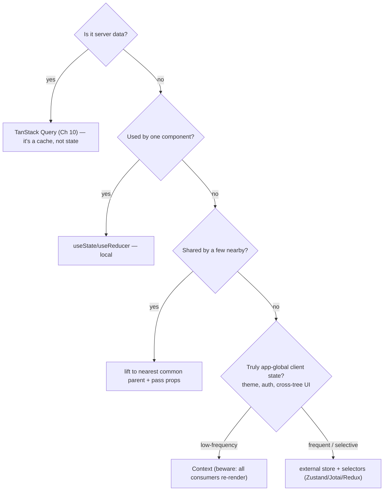

> Prerequisites: TanStack Query cache model (Ch 10), React re-render behavior, `useState`/Context/Zustand tradeoffs, component composition. Covers the design-system, state-landscape, shadcn-Tailwind
> ground Interviewer probes, and the system-design framing for the contacts-table question.

---

## The one mental model

> **Architecture is about CONTAINING CHANGE. Every decision answers: "when requirements change,
> how small can I make the blast radius?" Two levers do most of the work. (1) Put state as LOW
> (close to where it is used) as possible so changes stay local. (2) Hide volatile details
> behind STABLE boundaries (components, hooks, modules) so callers do not break when internals
> change. Good structure is not about folders. It is about who has to change when something does.**

From "contain change" you understand why colocation beats global state. You see why server state is its own category (Ch 10). You know why composition (building complex UIs from small parts) beats configuration (big config objects). You learn why design systems exist. You learn how to reason about a frontend system-design question.

---

## Learning Objectives

1. Choose where state lives (the state-location decision tree). Understand why colocation wins.
2. Map the state-management landscape (local, lifted, context, external store, server). Pick correctly, including Zustand's model.
3. Explain design systems, Tailwind, and shadcn/ui as change-containment strategies.
4. Run a frontend system-design interview (the contacts table) with a repeatable framework.

---

## Key Mental Models

- **Colocation:** keep state next to its only consumer. Lift only when genuinely shared.
- **Boundaries:** a component, hook, or module exposes a stable contract. Internals can change freely.
- **State has categories**, each with a right tool. Do not put one kind in another's tool.
- **Design system = one source of truth for UI.** A change propagates once.

---

## Introduction

At SDE-2, "architecture" means making sane structural calls and defending them with tradeoffs. It is not reciting folder layouts. The throughline is containing change. The same lens answers "where should this state go," "Context or Zustand," "how do we keep UI consistent," and "design the contacts page."

---

## Problem: where does state go?

Put everything in a global store. Every change risks re-rendering and breaking unrelated features. This gives a wide blast radius. Unrelated components re-render on every change (see Ch 08 perf). Put everything local and you cannot share what must be shared. The skill is matching each piece of state to the smallest scope that works.



---

## The state-management landscape

| State kind | Tool | Why |
|---|---|---|
| One component | `useState`/`useReducer` | Lowest blast radius |
| A few nearby | Lift + props | Still local-ish, explicit |
| App-global, rarely changes | **Context** | Simple, but every consumer re-renders on change |
| App-global, changes often or selective reads | **Zustand / Jotai / Redux** | Subscribe to slices |
| Remote, shared, async | **TanStack Query** (Ch 10) | It is a cache with a refetch policy |

**Why Context is not a state manager:** a Context value change re-renders *all* consumers. There is no selective subscription. This is fine for theme and auth (rare changes). It is bad for high-frequency state.

**Zustand's model (interview-ready):** a store outside React. Components subscribe via a **selector** and only re-render when *their selected slice* changes. There is no provider and no context re-render tax. `const count = useStore(s => s.count)`. That selector subscription is the key difference from Context. Jotai is atomic (bottom-up atoms). Redux is a single store with reducers and middleware (more ceremony, great devtools and time-travel, mostly superseded by Query plus Zustand for new apps).

---

## Design systems, Tailwind and shadcn (they ask)

**Problem:** without a single source of truth, every team reinvents buttons, spacing, and color. This leads to inconsistent UI and change-it-in-50-places.

- **Design tokens** (color, spacing, typography scales) are the vocabulary. Change once, propagates everywhere.
- **Tailwind** = utility classes mapped to tokens (config). No CSS-file context switch. Tiny prod CSS (unused classes purged). Consistency by construction. Tradeoff: verbose class lists.
- **shadcn/ui** = NOT an npm dependency. A CLI **copies component source into your repo**. It is built on **Radix UI** primitives (accessible, unstyled behavior) plus Tailwind styles. You **own** the code. It is a starting point you customize, not a locked black box. That is its whole pitch: composable, accessible, owned. (Contrast MUI or AntD: installed, themed but constrained.)
- **Framer Motion** = declarative animation (`layout`, `AnimatePresence` for exit). Respect `prefers-reduced-motion` (the OS-level accessibility setting that disables animations, see Ch 23).

---

## Folder structure and scaling (briefly)

Organize by **feature**, not by file-type. Colocate a feature's components, hooks, API, and tests so a change touches one folder (containment again). Have a shared `ui/` (design system) plus `lib/` (utils) plus `features/<x>/`. *Bulletproof React* is a good reference shape. Monorepos (Turborepo) share packages across apps with enforced boundaries.

---

## Frontend system design framework (use on the contacts table)

```
1. Clarify   — scale, data shape, read/write patterns, real-time?, devices, constraints
2. Data      — API shape, pagination (cursor vs offset), caching layer (Ch 10), source of truth
3. Rendering — virtualization?, what re-renders, the four states (loading/empty/error/data)
4. State     — selection model, filters in URL, optimistic updates
5.   Realtime  — patch-in-place (update only the changed row) vs banner (show "data changed" message) — Ch 08 §2f, scroll anchoring
6.   Cross-cuts— a11y (keyboard nav, screen readers — Ch 23), perf budget (Ch 08), error handling (error boundaries, retry — Ch 22), tradeoffs out loud
```

Apply it and you reproduce the full contacts-table answer in the interview guide §2.

---

## Interview Discussion (reason first)

**Q1. "Context vs Zustand vs Redux: when each?"**
> "Context for low-frequency global values (theme, auth). But every consumer re-renders on change, so not for hot state. Zustand for app-global client state with frequent or selective reads. Selector subscriptions avoid the Context re-render tax. No provider boilerplate. Redux when you need its middleware, devtools, or time-travel, or a big team convention. For new apps, TanStack Query (server) plus Zustand (client) usually covers it."

**Q2. "Where should state live?"**
> Walk the decision tree: server goes to Query. Single consumer goes to local. A few nearby go to lift. Global with rare changes goes to Context. Global with frequent changes goes to a store. "Default to the lowest scope. Lifting is a deliberate choice with a re-render cost."

**Q3. "What is shadcn and why not just use MUI?"**
> "shadcn copies accessible Radix-based components into your repo so you own and customize the code. It is a design-system starting point, not a dependency. MUI and AntD are installed libraries. They are faster to start, but you are constrained by their theming and you ship their bundle. shadcn trades a little setup for full ownership and Tailwind consistency."

*Scoring:* full answer includes containment lens, selector-vs-context-rerender, and shadcn-is-owned-source.

---

## Common Mistakes

- **Global store as a dumping ground.** This causes wide re-renders and coupling. Colocate first.
- **Server data in Redux or Context.** You are re-implementing Query badly (Ch 10).
- **Context for high-frequency state.** All consumers re-render.
- **Folder-by-type at scale.** A feature change is scattered across many folders.
- **Reaching for Redux reflexively** when Query plus local plus a little Zustand suffices.

---

## Interview Questions

1. Walk the state-location decision tree for: form input, current theme, fetched contacts, a cross-page wizard step.
2. Why does a Context value change re-render all consumers, and how does Zustand avoid it?
3. Explain shadcn vs a component library. What is the tradeoff?
4. Run the system-design framework on "design a notifications dropdown with unread counts."
5. Feature-folders vs type-folders. Argue for one using "blast radius."

---

## Homework

1. Take a small app that overuses Context. Move one piece to local state and one to a Zustand selector. Observe re-render differences in the Profiler.
2. Add a shadcn component to a Vite+Tailwind app. Inspect the copied source and customize it.
3. In `NOTES.md`: the state-location decision tree from memory plus one line on Zustand selectors.

---

## Summary

- **Architecture = containing change.** Put state as low as possible. Put stable boundaries around volatile details. Folders come after this.
- **Match state to its category:** local, lifted, Context (rare global), external store (frequent global, selector subscriptions), server (Query, Ch 10).
- **Context re-renders all consumers. Zustand subscribes to slices.** That is the core distinction.
- **Design system + tokens + Tailwind + shadcn** contain UI change. shadcn copies owned, accessible Radix source instead of installing a constrained library.
- A **repeatable system-design framework** (clarify, data, render, state, realtime, cross-cuts) turns the contacts table into a structured answer.

## Go deeper
The design patterns chapter (composition vs configuration patterns) is the component-level companion. Ch 21 (state-manager internals) goes deeper. The contacts-table worked answer is in the interview guide.
