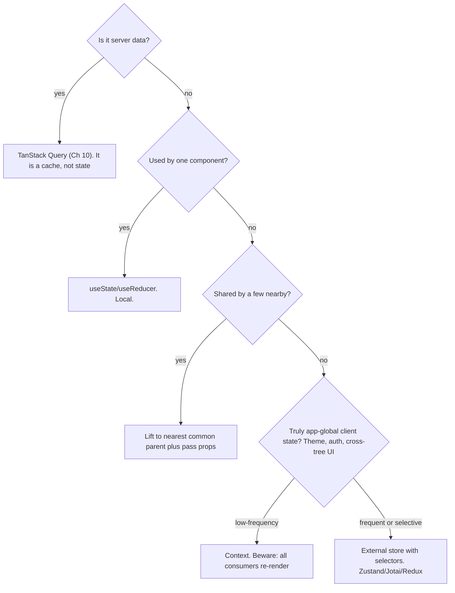

> Prerequisites: TanStack Query cache model (Ch 10), React re-render behavior, useState/Context/Zustand tradeoffs, component composition. Covers the design-system, state-landscape, shadcn-Tailwind ground Interviewer probes, and the system-design framing for the contacts-table question.

## Problem

Where does state go? Put everything in a global store. Every change risks re-rendering and breaking unrelated features. Wide blast radius. Unrelated components re-render on every state change. Put everything local and you cannot share what must be shared. Without a design system, every team reinvents buttons, spacing, and color. Inconsistent UI everywhere. A change requires editing fifty files.

## Why Existing Solution Failed

Global state as a default fails because it couples unrelated features. A change in one part of the store can break anything that reads the store. Context as a default state manager fails because every consumer re-renders on every value change. There is no selective subscription. Putting server data in Redux or Context fails because you reimplement caching and refetching that TanStack Query already handles. Folder-by-type (components/, hooks/, utils/) scatters a single feature across many directories. A change to one feature touches many folders.

## Mental Model

Architecture is about containing change. Every decision answers: when requirements change, how small can I make the blast radius? Two levers do most of the work. Put state as low as possible (close to where it is used) so changes stay local. Hide volatile details behind stable boundaries (components, hooks, modules) so callers do not break when internals change. Good structure is not about folders. It is about who has to change when something does.

From "contain change" you understand why colocation beats global state. You see why server state is its own category (Ch 10). You know why composition (building complex UIs from small parts) beats configuration (big config objects). You see why design systems exist. You learn how to reason about a frontend system-design question.

## Visualization

State-location decision tree:



## Engine Simulation

Take a theme toggle. The user clicks a button to switch from light to dark mode. Theme is a global value needed by every component.

**Context approach:** The theme context provider holds `{ theme, setTheme }`. The button calls `setTheme('dark')`. The provider re-renders with the new value. Every consumer of `useContext(ThemeContext)` re-renders, even if they only read the value once and never change. This is fine for theme because it changes rarely. But if this was a frequently changing value like cursor position, all consumers re-render on every mouse move.

**Zustand approach:** The store is created outside React.

```js
const useThemeStore = create((set) => ({
  theme: 'light',
  setTheme: (theme) => set({ theme }),
}));
```

A component subscribes to only the `theme` slice:

```jsx
const theme = useThemeStore((s) => s.theme);
```

When `setTheme('dark')` runs, only components that selected `s => s.theme` re-render. A component that selected a different slice does not re-render. There is no provider wrapper. The store sits outside the component tree.

## Internal Implementation

Zustand creates a plain JavaScript store outside React. The store holds state and a list of subscribers. When a component calls `useStore(selector)`, it subscribes to the store with that selector function. The store tracks which selectors depend on which parts of state. When state changes, the store diffs the previous selector output against the new selector output for each subscriber. Only subscribers whose selected value changed get notified and re-render.

Context uses React's built-in propagation. When a context value changes, React marks the whole subtree below the provider for re-render. There is no selector mechanism. Every consumer re-renders regardless of whether they use the changed part of the value.

This is the core distinction. Zustand does selective subscription at the store level. Context does broadcast re-render at the React tree level.

## Real World Example

Interviewer's contacts table. The page has a search bar, filter panel, sort controls, and the table itself. Each piece of state goes to its lowest reasonable scope.

Search input text is local to the search component. It is not shared. useState is enough. Selected filters need to affect the query sent to the server. They go to the parent page component. TanStack Query holds the fetched contacts data. The sort column and direction are URL search params so they survive page refresh. The theme preference is global and rarely changes, so Context works.

shadcn/ui provides the table, button, and input components. They are copied source files in the repo. The team customizes them for brand colors. Tailwind utility classes handle spacing and typography consistently. A design token change in tailwind.config updates everywhere.

## Tradeoffs

Colocation vs duplication. Keeping state local sometimes means duplicating logic across components. Lifting state adds props threading. Context solves prop threading but adds re-render overhead. Zustand solves re-render overhead but adds a dependency and a mental model of stores. There is no free lunch. Each tool fits a specific state category.

shadcn vs MUI. shadcn gives full ownership of component code. You can customize anything. But you must maintain the code yourself. MUI gives a complete library with less setup but you fight the theming system and ship a bigger bundle. Choose shadcn when you need custom design and own the maintenance. Choose MUI when speed of shipping matters more than design flexibility.

Feature folders vs type folders. Feature folders contain change within one directory. Type folders scatter a feature change across components/, hooks/, utils/, tests/. Feature folders win for containment. Type folders can work at very small scale when the whole app fits in one mental model.

## Common Mistakes

- Global store as a dumping ground. This causes wide re-renders and coupling. Colocate first.
- Server data in Redux or Context. You reimplement Query badly (Ch 10).
- Context for high-frequency state. All consumers re-render.
- Folder-by-type at scale. A feature change is scattered across many folders.
- Reaching for Redux reflexively when Query plus local plus a little Zustand suffices.

## SDE-2 Interview Answer

**Mid-level variant:**
"I match each piece of state to its smallest workable scope. Server data goes to TanStack Query. Local UI state uses useState. Shared state goes to the nearest common parent. Global rare state uses Context. Global frequent state uses Zustand with selectors. Colocation is the default. Lifting is a deliberate choice."

**Senior variant:**
"Architecture is about containing change. I apply two rules: put state as low as possible, and hide volatile details behind stable boundaries. The state-location decision tree gives me a repeatable answer for every piece of state. I use Context for low-frequency globals like theme because it is simple and the re-render tax is irrelevant for rare changes. I use Zustand for high-frequency globals because selector subscriptions avoid the Context re-render problem. For design systems, I prefer shadcn because the team owns the code and customizes freely. I organize by feature so a change touches one folder."

**Engineering Lead variant:**
"I establish conventions that encode the state-location decision tree. Server state goes to TanStack Query, never to Redux or Context. Client state uses Zustand with a documented pattern for selectors. The team agrees on feature folders. Design tokens live in one config file. I review architecture decisions through the containment lens: does this decision make future changes safer or riskier? I also run lightweight system-design reviews for new features using the clarify-data-render-state-realtime-crosscuts framework."

## Follow-up Questions

1. Walk the state-location decision tree for: form input, current theme, fetched contacts, a cross-page wizard step.

2. Why does a Context value change re-render all consumers, and how does Zustand avoid it?

3. Explain shadcn vs a component library. What is the tradeoff?

4. Run the system-design framework on "design a notifications dropdown with unread counts."

5. Feature folders vs type folders. Argue for one using the concept of blast radius.

## Mental Trigger

Architecture = containing change.

## One Page Revision

- Architecture = containing change. Put state as low as possible. Put stable boundaries around volatile details.
- Match state to its category: local, lifted, Context (rare global), external store (frequent global, selector subscriptions), server (TanStack Query).
- Context re-renders all consumers on any value change. Zustand subscribes to slices. That is the core distinction.
- Design system + tokens + Tailwind + shadcn contain UI change. shadcn copies owned, accessible source instead of installing a constrained library.
- Repeatable system-design framework: clarify, data, rendering, state, realtime, cross-cuts.
- Organize by feature to contain change within one directory.
