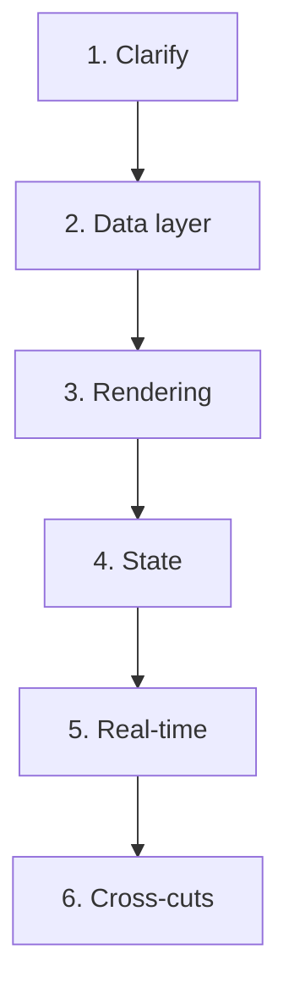

## Why This Matters

You sit down for a machine-coding round. 45 minutes. Vague prompt. You start coding immediately. Build the happy path. Run out of time. Never handled loading, empty, or error state. Didn't mention accessibility or performance. The interviewer can't see your reasoning because you coded silently.

You leave thinking, "But my code worked!" — and it did, but that's not what they were measuring. They were measuring whether you can own a feature end-to-end. The solution working for the default case is the bare minimum.

## The Core Idea

**Interviews score your reasoning, not your answer.**

The interviewer is asking: "Can I trust this person to own a feature end-to-end?" They want to see you clarify the problem, propose a solution, name the tradeoff, and handle the edges. A confident structured walk beats a silent perfect solution. "It depends, here is the tradeoff" is a strong answer, not a weak one.

This is a learned behavior. Most people fail interviews not because they can't code, but because they practiced alone without feedback on what's actually being scored.

## The Four States

Every data UI needs four states. Bring them up unprompted:

1. **Loading** — skeleton or spinner
2. **Empty** — "No results found"
3. **Error** — retry button with message
4. **Data** — the actual content

Plus two cross-cuts: **accessibility** (keyboard support, ARIA) and **performance** (virtualization, memoization only when measured). These six concerns cover what interviewers evaluate for completeness.

## The Machine-Coding Checklist

Follow this order, narrating as you go. Talking through reasoning takes time from coding, but silent coding scores zero on reasoning. The tradeoff is worth it.

1. **Clarify** (0-2 min): "Is this remote search or local filter? How many items? Keyboard support? Empty results behavior?" This buys time and shows ownership. State your assumptions out loud.
2. **Shape state** (2-5 min): Input value (local), debounced value (custom hook or `useDeferredValue`), results array, status as discriminated union (`idle | loading | error | success`).
3. **Build happy path** (5-15 min): Input onChange → debounced effect → API call → render results.
4. **Add four states** (15-25 min): Loading skeleton, empty message, error with retry, data list.
5. **Add edges** (25-35 min): Debounce (300ms), cancel stale requests with AbortController or TanStack Query's built-in cancellation, keyboard navigation (Up/Down/Enter/Escape), click-outside, ARIA attributes (`aria-expanded`, `role="listbox"`, `role="option"`). Highlight matching text in each result.
6. **Performance pass** (35-40 min): Keys on list items. Memo only if measured slow. Virtualize only if list is very long.
7. **Say what you'd add** (40-45 min): Unit tests for debounce hook, integration tests for dropdown, more a11y testing with screen readers.

## The System Design Framework



Walk each step:

1. **Clarify**: scale, data shape, read/write, real-time, devices, constraints
2. **Data layer**: API shape, pagination (cursor vs offset), cache strategy, source of truth
3. **Rendering**: virtualization, what re-renders, four states
4. **State**: selection model, filters in URL, optimistic updates
5. **Real-time**: patch-in-place vs banner, scroll anchoring
6. **Cross-cuts**: a11y, perf budget, errors, tradeoffs

For the contacts table: paginated API with cursor-based pagination, `useInfiniteQuery` for infinite scroll, virtualization with react-virtual (500K rows can't be DOM-mounted), WebSocket for real-time status changes patched via `setQueryData`.

## The Trap Questions

"Should you memoize every component?" — No. `useMemo` has a cost — it stores previous results, runs on every render to check dependencies, and adds code complexity. Most re-renders are cheap. Memo only measured hot spots identified with React DevTools Profiler. Premature optimization adds complexity without benefit. Also consider whether the parent creates new object references on every render — if so, memoizing the child won't help unless you also stabilize the parent's references.

"Do you always use TypeScript?" — It depends. For new projects, yes — the safety pays off. For a quick prototype, maybe not. Name the tradeoff.

The trap is testing judgment, not knowledge. Never answer "yes" or "no" to a question that has a tradeoff.

## Common Mistakes

- **Coding before clarifying.** You solve the wrong problem.
- **Only the happy path.** No loading, empty, or error states.
- **Silent solving.** The interviewer cannot score reasoning they cannot hear.
- **Over-generalizing to trap questions.** "Memo everything" fails the judgment test.
- **Forgetting a11y and perf until prompted.** Bring them up unprompted.
- **Rambling project pitch.** Keep STAR stories under 2 minutes and scoped to the job description. Spend 70% of prep time on coding, 30% on stories.

## Worked Example: Autocomplete (45 minutes)

```text
Minute 0-2: Clarify
  "Is this remote search (API) or local filter?"
  "How many results max? 10? 100?"
  "Keyboard navigation needed?"
  "What happens when no results?"

Minute 2-5: Shape state
  query: string (local input)
  debouncedQuery: string (custom hook, 300ms)
  results: Item[] (from API)
  status: "idle" | "loading" | "error" | "selectedIndex"

Minute 5-15: Happy path
  Input → onChange → setQuery
  useEffect([debouncedQuery]) → fetch → setResults
  Render list below input

Minute 15-25: Four states
  Loading: skeleton rows
  Empty: "No results found"
  Error: "Something went wrong" + retry button
  Data: list of results

Minute 25-35: Edges
  AbortController → cancel stale requests
  Keyboard: ArrowUp/Down moves selectedIndex, Enter selects, Escape closes
  Click-outside → close dropdown
  ARIA: role="combobox", aria-expanded, role="listbox", role="option"
  Highlight matching text in each result

Minute 35-40: Performance
  Memoize result rows if needed
  Debounce hook extracted for reuse

Minute 40-45: Say what you'd add
  "I'd add unit tests for the debounce hook"
  "Integration test for keyboard navigation"
  "Screen reader testing with VoiceOver"
```

## Worked Example: Infinite Scroll Table (System Design)

```text
Minute 0-3: Clarify
  "How many total records?" → 500K
  "Columns?" → 7-8 (name, email, status, etc.)
  "Real-time updates?" → Yes, email status
  "Bulk actions?" → Yes, multi-select

Minute 3-8: Architecture
  Data Layer: TanStack Query + useInfiniteQuery
  Virtualization: react-virtual
  Real-time: WebSocket → patch via setQueryData
  Selection: selectAll/positiveIds/negativeIds model

Minute 8-15: Data layer
  Cursor-based pagination API
  useInfiniteQuery for page fetching
  IntersectionObserver to trigger next page
  Cache with staleTime

Minute 15-22: Virtualization
  Fixed row height (say 48px)
  Container height = totalRows × 48
  Render visibleCount + overscan rows
  Position with transform: translateY

Minute 22-30: Real-time + selection
  WebSocket events → update data layer
  Only visible rows listen to events
  Multi-select: selectAll + positiveIds + negativeIds
  "Select all" sends strategy to API, not 500K IDs

Minute 30-38: Edge cases
  Deletion mid-scroll → "3 items deleted, click to refresh"
  Scroll position preservation
  Empty state after filtering
  Error state for failed pages

Minute 38-45: Tradeoffs
  Pagination vs infinite scroll (discuss tradeoffs)
  Virtualization disadvantages (Ctrl-F, a11y, variable heights)
  Why transform over position:absolute
```

## Time Management

45 minutes is tight. Here's how to allocate:

| Phase | Time | What you do |
|---|---|---|
| Clarify | 0-3 min | Ask questions, state assumptions |
| Shape state | 3-5 min | Define data model and status |
| Happy path | 5-15 min | Core functionality working |
| Four states | 15-25 min | Loading, empty, error, data |
| Edges | 25-35 min | Debounce, keyboard, a11y, AbortController |
| Perf pass | 35-40 min | Keys, memo, virtualization if needed |
| Say what you'd add | 40-45 min | Tests, monitoring, scaling plan |

**The critical rule:** If you're past 15 minutes and haven't rendered any UI, you're over-engineering. Get something visible first, then refine.

## How to Handle "I Don't Know"

The worst answer is silence. The second worst is guessing. The best answer:

1. **Acknowledge the gap:** "I haven't used that specific API, but..."
2. **Show reasoning:** "My understanding is that it works similarly to X, which..."
3. **Ask for direction:** "Could you point me in the right direction?"
4. **Propose a fallback:** "If I were implementing this in production, I'd look up the docs, but based on first principles..."

This scores points for honesty, reasoning ability, and learning agility — all things senior engineers need.

## Q&A

**1. How do I narrate without slowing down?**

Speak your thinking as you type: "I'm reaching for a discriminated union because loading and success are mutually exclusive." Short sentences. State the what and the why. Don't narrate every keystroke — narrate decisions. Practice concise narration until it's natural.

**2. What if I don't know the answer to a system design question?**

Clarify first. The act of asking smart questions buys thinking time and shows ownership. "How many users? What's the read/write ratio? Any real-time requirements?" Then propose your best guess and name the tradeoff. "I'd start with X because Y, knowing the tradeoff is Z."

**3. How should I handle "tell me about a time" behavioral questions?**

Keep stories under 2 minutes. Use STAR: Situation, Task, Action, Result. Focus on what you specifically did, not the team. Align the story to the job description's requirements — ownership, ambiguity, tools-not-guesswork.

**4. What's the single highest-leverage thing I can practice?**

Build an autocomplete from scratch, narrating every decision, covering all four states, with keyboard support and ARIA. Do it three times. The first is rough. The second is structured. The third is smooth. That covers 80% of what interviewers evaluate.

## Mental Trigger

**Interviews score reasoning, not the answer.**
