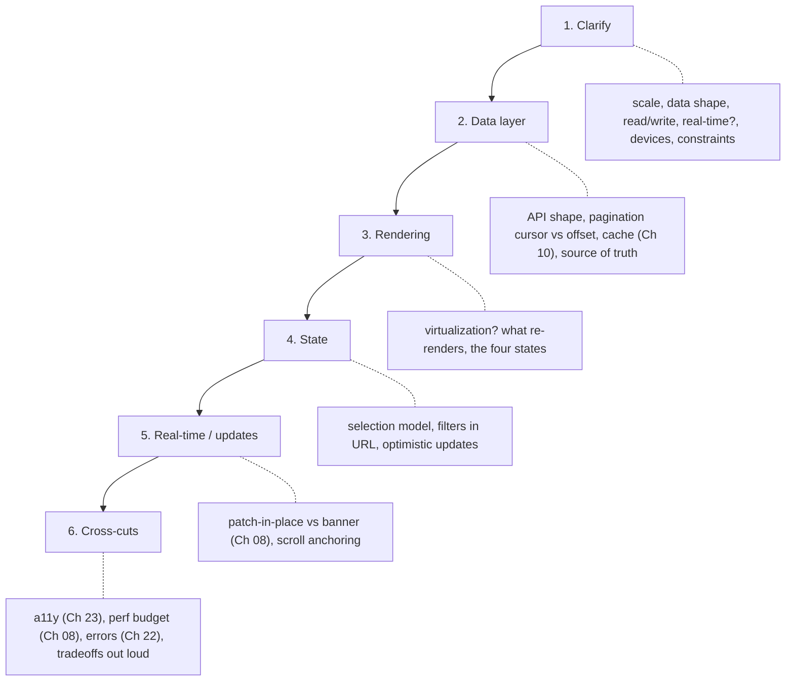

> Prerequisites: all preceding chapters. This chapter synthesizes them. Core: architecture and state (Ch 11), TanStack Query (Ch 10), rendering and perf (Ch 08), a11y (Ch 23), testing (Ch 15). Pair with the interview guide (your interviewer's real flow) and the topic map (JD to topics).

## Problem

You sit down for a machine-coding round. You have 45 minutes. The prompt is vague. You start coding immediately. You build the happy path. You run out of time. You never handled loading state, empty state, or error state. You did not mention accessibility or performance. The interviewer cannot see your reasoning because you coded silently. You fail even though your solution worked for the default case.

## Why Existing Solution Failed

Coding before clarifying solves the wrong problem. Silent solving hides your reasoning. Happy-path-only coding misses loading, empty, error, and edge cases. Over-generalizing to trap questions ("memo everything," "yes") shows lack of judgment. Not covering a11y or performance until prompted shows narrow thinking. Rambling project stories waste time and miss the point. These are all learned behaviors from practicing alone without feedback.

## Mental Model

Interviews score your reasoning, not your answer. Narrate the tradeoff out loud. For any UI problem cover the four states: loading, empty, error, data. Plus accessibility and performance. The interviewer is asking "can I trust this person to own a feature end-to-end?" Show the thinking: clarify, propose, name the tradeoff, handle the edges. A confident structured walk beats a perfect silent solution.

From "they score reasoning plus four states" you learn how to run machine-coding (talk while you build, handle edges) and frontend system design (a repeatable framework). You understand why "it depends, here is the tradeoff" is a strong answer, not a weak one.

## Visualization

Frontend system-design framework:

## Engine Simulation

Walk an autocomplete machine-coding session minute by minute.

Minute 0-2: Clarify. "Is this a remote search or local filter? How many items? Keyboard support? What happens on empty results? On error?" State assumptions.

Minute 2-5: Shape state. You need the input value, debounced value, results array, and status (idle, loading, error, success). Use a discriminated union for status. The input value is local state in the autocomplete component. Debounced value comes from a custom hook.

Minute 5-15: Build the happy path. The input onChange updates the local value. A useEffect watches the debounced value and calls the search API. Store results in state. Render a dropdown list.

Minute 15-25: Add the four states. Loading shows a spinner or skeleton. Empty shows "No results found." Error shows a retry button with the error message. Data renders the results list.

Minute 25-35: Add edges. Debounce the input (300ms). Cancel stale requests with AbortController or TanStack Query. Handle keyboard: Up/Down to navigate, Enter to select, Escape to close. Add click-outside to close. Add aria-expanded and role=listbox for accessibility. Highlight the matching text in each result.

Minute 35-40: Performance pass. Add keys to list items. Memo only if measured slow. Virtualize only if the list is very long.

Minute 40-45: Say what you would add with more time. Unit tests for the debounce hook. Integration tests for the dropdown. More a11y testing.

## Internal Implementation

The interviewer's scoring rubric evaluates four dimensions. Reasoning: did you clarify before coding, state tradeoffs, show your thinking? Completeness: did you cover loading, empty, error, data plus a11y and perf? Communication: was your narration clear and structured? Judgment: did you avoid over-generalizing, make reasonable tradeoffs, know when to optimize?

Each dimension is scored 1-4. A passing score requires at least 3 in reasoning and judgment. Completeness and communication can be lower if the other two are strong. This is why clarifying and stating tradeoffs matters more than building the perfect solution.

## Real World Example

Interviewer asks "design a contacts table page." The prompt is two sentences. The candidate who clarifies asks: "How many contacts? Is there real-time updating? What devices? Read-heavy or write-heavy? Any accessibility requirements?" This buys time and shows ownership. The candidate who starts coding builds a static table. The clarifier designs a virtualized, real-time updated, keyboard-navigable table with optimistic status toggles. Same prompt. Different outcome.

The trap question: "Should you memoize every component?" The candidate who says "yes" fails. The candidate who answers "No. useMemo has a cost. I memo only measured hot spots. Most re-renders are cheap. Premature optimization adds complexity without benefit." This shows judgment and understanding of tradeoffs.

## Tradeoffs

Speed vs completeness. In a 45-minute session, you cannot build a production app. The tradeoff is covering breadth of concerns (loading, empty, error, data, a11y, perf) vs depth of implementation in one area. Breadth wins interviews because it shows you think end-to-end.

Narration vs focus. Talking through your reasoning takes time from coding. But silent coding scores zero on reasoning. The tradeoff is worth it. Practice concise narration.

Preparing STAR stories vs practicing coding. Both matter. STAR stories show behavioral fit. Coding shows technical ability. Spend 70% of prep time on coding and 30% on stories.

## Common Mistakes

- Coding before clarifying. You solve the wrong problem.
- Only the happy path. No loading, empty, or error states.
- Silent solving. The interviewer cannot score reasoning they cannot hear.
- Over-generalizing to trap questions. "memo everything," "yes."
- Forgetting a11y or perf until prompted. Bring them up unprompted.
- Rambling project pitch. Keep it 30 seconds and scoped.

## SDE-2 Interview Answer

**Mid-level variant:**
"For any UI problem, I cover loading, empty, error, and data states. I clarify the prompt before coding. I narrate my reasoning as I build. I add keyboard support and basic a11y. I handle the trap questions with a tradeoff: X has a cost, I apply it only when needed."

**Senior variant:**
"I structure every answer the same way. Clarify first. Propose with tradeoffs. Cover all four states plus a11y and performance. For machine-coding, I follow a checklist: clarify, shape state, build happy path, add states, add edges, perf pass, what I would add. For system design, I use the 6-step framework. The trap questions are judgment tests. I never over-generalize. I name the cost and the alternative."

**Engineering Lead variant:**
"I prepare my team for interviews with a repeatable structure. We practice the autocomplete and contacts table until the checklist is automatic. We review each other's STAR stories against the job description. The key insight I teach is: interviews score reasoning, not perfection. Clarifying, stating tradeoffs, and handling edges matters more than a flawless solution. I also ensure the team understands the scoring rubric so they know where to focus."

## Follow-up Questions

1. Build an autocomplete with debounce, cancel, four states, keyboard support, and a11y. Narrate throughout.

2. Design the contacts table using the framework. Hit real-time, multi-select, and virtualization.

3. "Should you memoize every component?" Answer the trap correctly.

4. Tell an end-to-end ownership story in STAR format. Two minutes or less.

5. Design a notifications dropdown with unread counts and live updates.

## Mental Trigger

Interviews score reasoning, not the answer.

## One Page Revision

- Interviews score reasoning. Clarify, propose, name the tradeoff, handle edges.
- Every data UI needs loading, empty, error, data plus a11y and perf. Bring them up unprompted.
- Machine-coding has a checklist order. System design has a 6-step framework.
- Traps ("do X everywhere?") want a decision rule, not agreement.
- STAR stories aligned to the job description: ownership, tools-not-guesswork, ambiguity, AI workflow.
- Practice narration. Silent solving loses points even with a correct solution.
