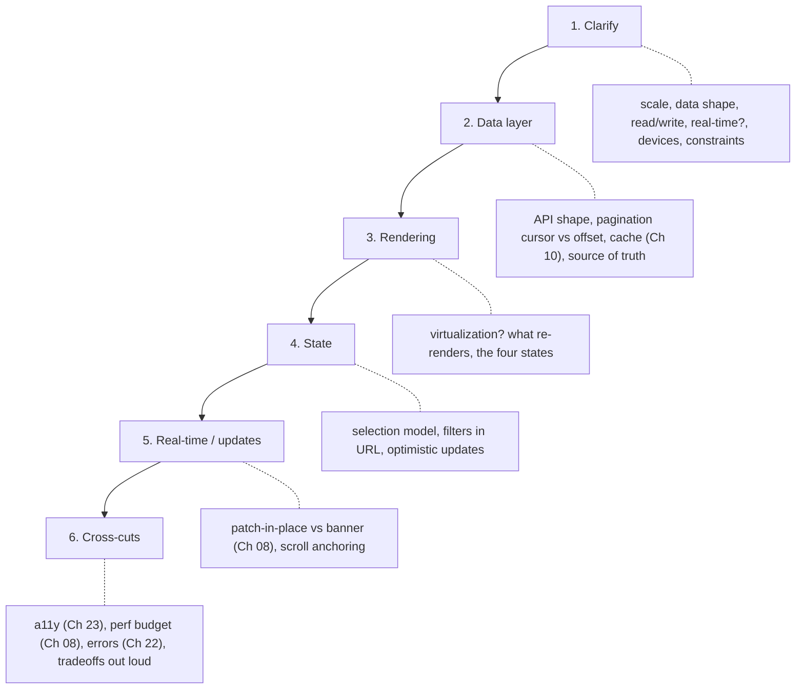

> Prerequisites: all preceding chapters. This chapter synthesizes them. Core: architecture and state (Ch 11), TanStack Query (Ch 10), rendering and perf (Ch 08), a11y (Ch 23), testing (Ch 15). Pair with the interview guide (your interviewer's real flow) and the topic map (JD to topics).

---

## The one mental model

> **Interviews score your REASONING, not your answer. So narrate the tradeoff out loud. For
> any UI problem cover the FOUR STATES: loading, empty, error, data. Plus accessibility and
> performance. The interviewer is asking "can I trust this person to own a feature end-to-end?"
> Show the thinking: clarify, propose, name the tradeoff, handle the edges. A confident
> structured walk beats a perfect silent solution.**

From "they score reasoning plus four states" you learn how to run machine-coding (talk while you build, handle edges) and frontend system design (a repeatable framework). You understand why "it depends, here is the tradeoff" is a strong answer, not a weak one.

---

## Learning Objectives

1. Run a machine-coding round: clarify, structure, narrate, cover the four states plus a11y and perf.
2. Run a frontend system-design round with a repeatable framework (Ch 11).
3. Handle "should I do X everywhere?" traps with a decision rule, not over-generalization.
4. Tell tight behavioral STAR stories aligned to the job description (ownership, debugging, ambiguity).

---

## Key Mental Models

- **Four states for any data UI:** loading, empty, error, data. Forgetting these is the #1 tell.
- **Narrate tradeoffs.** "I would use X because... the cost is... an alternative is Y when..."
- **Clarify before coding or designing.** Scope, scale, constraints. Assumptions sink answers.
- **Decision rules beat absolutes.** "Memo measured hot spots," not "memo everything."

---

## Machine-coding playbook

Common prompts (a product company flavor): autocomplete with debounce and cancel, a virtualized data table with sort and select, infinite-scroll list, reusable modal, `useDebouncedValue`/`usePrevious`.

```
1. Clarify (30s):  inputs, scale, async?, a11y/keyboard?, edge cases. State assumptions.
2. Shape state:    minimal state; discriminated union for status (Ch 09); who owns the value (Ch 18).
3. Build the happy path, narrating:  components, data flow, why this structure.
4. Cover the FOUR STATES:  loading skeleton, empty message, error + retry, data.
5. Edges:  debounce/cancel (Ch 17), race conditions, keyboard nav + focus (Ch 23).
6. Perf pass:  keys (Ch 06), memo only if needed (Ch 08), virtualization for big lists.
7. Say what you would add with more time (tests Ch 15, more a11y).
```

**Autocomplete checklist** (a classic): debounce input, cancel stale requests (AbortController or TanStack), loading/empty/error/results states, keyboard (Up, Down, Enter, Esc), highlight match, click-outside close, `aria-expanded`/`role=listbox`. Hitting these in order sends a senior signal.

---

## Frontend system-design framework



Apply it to "design a contacts table, notifications dropdown, or activity feed" and you produce a structured answer. The full contacts-table worked example is in the interview guide §2.

---

## Handling traps (Interviewer's style)

He asks "should I wrap everything in memo / paginate everything / do X everywhere?" He is testing if you over-generalize. **Answer with the rule and the tradeoff:**
> "No. X has a cost (Y). I apply it when [measured condition], and prefer [alternative] otherwise. Most cases do not need it."

Never agree that the app then "does tons of unnecessary work." Clarify that cheap waste is fine and you optimize measured hot spots (Ch 08). See interview guide §1.

---

## Behavioral (STAR, JD-aligned)

Structure: **Situation → Task → Action → Result.** Prepare 3 stories mapped to the job description:
- **Ownership end-to-end:** a feature you scoped, built, and shipped, handling edge cases and polish.
- **Debugged with tools not guesswork:** a nasty perf or render bug you found via Profiler or DevTools (Ch 25). This matches their culture line.
- **Resolved ambiguity:** unclear spec. You asked the right questions or made a call and unblocked.
Plus an **AI-tools** story (delegate execution, review every diff, see interview guide §3).

---

## Interview Discussion (meta)

**Q. "What separates a good answer from a great one here?"**
> Great = clarifies first, states assumptions, proposes with a tradeoff, covers the four states plus a11y and perf, and handles "do X everywhere?" with a rule. Good = correct happy path but silent reasoning, missing edges. The difference is *visible thinking and ownership*, which is exactly what Interviewer scores.

---

## Common Mistakes

- **Coding before clarifying.** You solve the wrong problem.
- **Only the happy path.** No loading, empty, or error states.
- **Silent solving.** The interviewer cannot score reasoning they cannot hear.
- **Over-generalizing** to trap questions ("memo everything," "yes").
- **Forgetting a11y or perf** until prompted. Bring them up unprompted.
- **Rambling project pitch.** Keep it 30 seconds, scoped.

---

## Interview Questions (practice prompts)

1. Build an autocomplete (debounce, cancel, four states, keyboard, a11y). Narrate throughout.
2. Design the contacts table (use the framework, hit real-time, multi-select, and virtualization).
3. "Should you memoize every component?" Answer the trap correctly.
4. Tell an end-to-end ownership story in STAR, 2 minutes or less.
5. Design a notifications dropdown with unread counts and live updates.

---

## Homework

1. Timed (45 min) build of the virtualized table from the interview guide §2, out loud.
2. Write your 3 STAR stories plus AI-tools story in `NOTES.md`. Rehearse to 2 min each or less.
3. Do one mock autocomplete cold, then self-review against the checklist.

---

## Summary

- Interviews score **reasoning**: clarify, propose, **name the tradeoff**, handle edges.
- Every data UI needs **loading, empty, error, data** plus a11y and perf. Bring them up unprompted.
- Machine-coding has a **checklist order**. System design has a **6-step framework** (Ch 11).
- **Traps** ("do X everywhere?") want a **decision rule**, not agreement.
- **STAR** stories aligned to the job description (ownership, tools-not-guesswork, ambiguity, AI workflow).

## Go deeper
The interview guide (your interviewer's real flow plus model answers) and the topic map (JD map). Every chapter's "Interview Discussion" is drill material.
