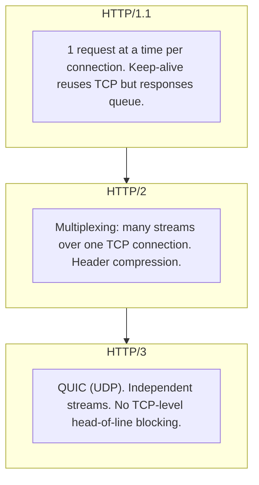
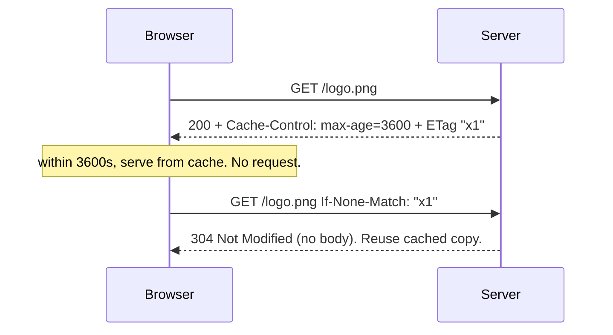
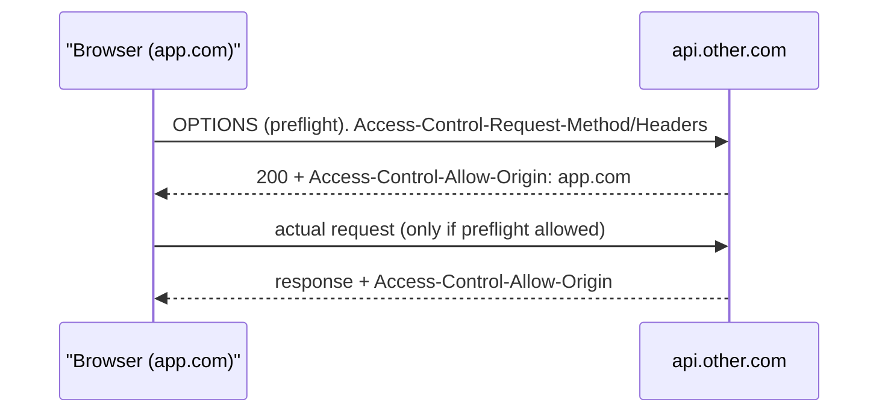
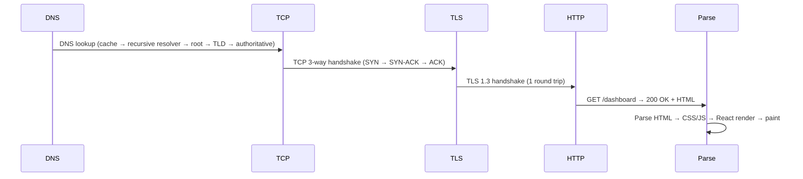

## Why This Matters

You open DevTools and see the same data fetching over and over. Cross-origin API calls fail with cryptic CORS errors. A slow image blocks everything behind it. You're debugging blind because you don't understand the wire.

Knowing HTTP means you can debug network issues without waiting for backend support, choose the right caching strategy, and explain why CORS errors happen — and how to fix them. The JD asks you to "collaborate with backend to resolve ambiguity." That means knowing the wire.

## The Core Idea

**A network request is a typed message over a connection, optimized by reuse and caching.**

Almost every networking topic is one of two things: reuse the expensive connection (HTTP/2 multiplexing, HTTP/3 over QUIC), or avoid the request entirely with caching (headers that say "reuse this" or "ask if it changed"). Security (CORS, cookies) is the browser adding rules about who may send what to whom.

No memorizing header lists. You reason about reuse and freshness.

## Connection Reuse



HTTP/1.1 reused connections but served serially — six connections, six parallel requests max. A slow image on one connection blocked everything behind it. HTTP/2 multiplexed streams over one connection, fixing HTTP-level head-of-line blocking. But TCP still delivers in order — one lost packet stalled all streams. HTTP/3 runs over QUIC (UDP). Each stream is independent. Packet loss on one stream doesn't affect others. Connection setup is faster too (0-RTT vs 1-2 round trips for TCP+TLS).

The tradeoff: HTTP/3 requires QUIC support on both ends. Most modern browsers and CDNs support it, but some enterprise networks block UDP.

## Caching



`Cache-Control: max-age=3600` says "don't even ask the server for 3600 seconds." During that window, the browser serves from disk cache with zero network requests — zero latency, zero bandwidth. After max-age expires, the response is stale. The browser sends a conditional request with `If-None-Match` containing the ETag (a content fingerprint). If nothing changed, the server returns 304 — no body, ~20 bytes instead of 20KB. The browser reuses the cached copy. This is revalidation.

**Strategy:** Static assets with content hashes get `max-age=31536000` (one year) — the URL changes when content changes, so stale content is never served. API responses get short `max-age` (60 seconds) plus ETag for freshness. CDNs cache at the edge, placing copies near users geographically. A CDN node receives a request, checks its cache, serves if fresh, or forwards to origin.

## CORS

CORS is the browser enforcing same-origin policy — not server security. The server opts in by sending headers.



"Simple" requests (GET/POST with standard headers) go straight through. Everything else — PUT, DELETE, custom headers (Authorization, X-Custom), JSON Content-Type with credentials — triggers a preflight OPTIONS request. The browser sends the intended method and headers. The server responds with allowed origins, methods, and headers. The browser checks: is the origin allowed? Is the method allowed? If yes, send the real request. If no, block it. The server never sees a blocked request — CORS is browser-enforced.

A server that doesn't send CORS headers still receives requests from same-origin clients. CORS only restricts cross-origin reads by the browser.

## Auth: Sessions vs JWT

**Sessions:** Server stores session data (user ID, permissions, expiry). Client holds a session ID in a cookie. Revocation is instant — delete server-side and the client is logged out. Scales vertically (needs shared store like Redis across server instances).

**JWTs:** Token contains claims (user ID, permissions, expiry). Server validates signature without a lookup. Stateless, horizontally scalable, but revocation is hard — can't invalidate before expiry without a token blocklist (which defeats the statelessness).

**Storage:** `HttpOnly + Secure + SameSite` cookies are safest. JavaScript can't read HttpOnly cookies (XSS protection). The browser only sends them over HTTPS (Secure). SameSite prevents cross-site credential leakage (CSRF protection). Access tokens live in memory (short-lived, not localStorage). Never store long-lived tokens in localStorage — any XSS can read it.

## The Full Journey — DNS to Pixels

When you type `https://app.com/dashboard` and press Enter, this happens:



**Step 1: DNS Resolution.** Browser checks its cache → OS cache → router cache → ISP recursive resolver → root nameserver → `.com` TLD server → `app.com` authoritative server. Typical: 20-80ms cached, 100-300ms uncached.

**Step 2: TCP Handshake.** Three-way handshake: client sends SYN, server responds SYN-ACK, client confirms ACK. One round trip. Establishes reliable, ordered byte stream.

**Step 3: TLS Handshake.** TLS 1.3: client sends supported cipher suites + key share, server picks suite + sends certificate + key share, both derive session keys. One round trip (vs 2-3 in TLS 1.2). Connection is now encrypted.

**Step 4: HTTP Request.** Browser sends request with headers (cookies, accept, user-agent). Server processes, returns response with status code, headers, and body.

**Step 5: Parse and Render.** Browser parses HTML into DOM, CSS into CSSOM, combines into render tree, computes layout, paints, composites. React hydrates (if SSR) and takes over.

Total for cached connection on fast network: 100-300ms from navigation to first paint.

## TLS — What's Encrypted and What's Not

TLS encrypts the HTTP request body and headers (including cookies and Authorization headers). It does NOT encrypt:
- **SNI (Server Name Indication):** The hostname is visible in the TLS ClientHello — the network can see which domain you're connecting to, even over HTTPS.
- **IP address:** Visible at the IP layer.
- **DNS query:** Unless you use DNS-over-HTTPS (DoH).

### TLS 1.2 vs 1.3

| | TLS 1.2 | TLS 1.3 |
|---|---|---|
| Round trips | 2-RTT | 1-RTT (0-RTT with resumption) |
| Cipher suites | Many (including weak ones) | Only 5 secure ones |
| Key exchange | RSA or DHE | ECDHE only (forward secrecy mandatory) |
| Handshake | ClientHello, ServerHello, Certificate, etc. | Simplified: ClientHello+key_share, ServerHello+certificate+key_share |

TLS 1.3 removed RSA key exchange, RC4, 3DES, compression, and other weak/obsolete features. It's faster and more secure.

## `fetch` API Internals

The `fetch` API is the modern way to make HTTP requests. Understanding its internals is critical for senior interviews.

### Basic Usage

```js
const response = await fetch("https://api.example.com/data", {
  method: "POST",
  headers: { "Content-Type": "application/json" },
  body: JSON.stringify({ name: "Ada" }),
});

if (!response.ok) throw new Error(`HTTP ${response.status}`);
const data = await response.json();
```

### AbortController — Cancelling Requests

```js
const controller = new AbortController();

fetch("/api/data", { signal: controller.signal })
  .then(res => res.json())
  .then(data => console.log(data))
  .catch(err => {
    if (err.name === "AbortError") console.log("Request cancelled");
    else throw err;
  });

// Cancel after 5 seconds
setTimeout(() => controller.abort(), 5000);
```

AbortController is essential for:
- **Component unmount cleanup** (prevent setState on unmounted component)
- **Timeout enforcement** (cancel slow requests)
- **Race condition prevention** (cancel stale requests when new ones fire)

### Streaming Responses — `ReadableStream`

```js
const response = await fetch("/api/stream");
const reader = response.body.getReader();

while (true) {
  const { done, value } = await reader.read();
  if (done) break;
  console.log(`Received ${value.length} bytes`);
}
```

For AI/LLM streaming (OpenAI, Claude), the server sends chunks over a single HTTP connection. `ReadableStream` lets you process each chunk as it arrives instead of waiting for the full response.

### `Response` Object

```js
const res = await fetch("/api/data");
res.ok;           // true if status 200-299
res.status;       // 200, 404, 500, etc.
res.headers;      // Headers object (get, has, entries)
res.url;          // final URL (after redirects)
res.redirected;   // true if redirected
res.body;         // ReadableStream (for streaming)
res.clone();      // clone for reuse (body can only be consumed once)
```

### Interview Answer

"`fetch` returns a Response object with the body as a ReadableStream. Use AbortController to cancel requests — essential for cleanup on unmount and race condition prevention. For streaming (AI APIs), read from `response.body.getReader()` to process chunks incrementally. The body can only be consumed once — clone if you need to reuse it."

## HTTP Status Codes — What They Mean

### 2xx Success

- **200 OK:** Standard success.
- **201 Created:** Resource created (POST). Usually includes `Location` header.
- **204 No Content:** Success, but no body (DELETE, PUT).

### 3xx Redirects

- **301 Moved Permanently:** Bookmark this new URL. Browser caches it.
- **302 Found:** Temporary redirect. Don't cache.
- **307 Temporary Redirect:** Like 302, but preserves HTTP method (POST stays POST).
- **308 Permanent Redirect:** Like 301, but preserves HTTP method.

The difference between 301/302 and 307/308: 301/302 allow the browser to change POST to GET on redirect. 307/308 preserve the original method.

### 4xx Client Errors

- **400 Bad Request:** Malformed syntax, invalid parameters.
- **401 Unauthorized:** Not authenticated (missing or invalid credentials). Client should authenticate.
- **403 Forbidden:** Authenticated but not authorized (insufficient permissions).
- **404 Not Found:** Resource doesn't exist.
- **409 Conflict:** Request conflicts with current state (e.g., duplicate creation).
- **422 Unprocessable Entity:** Valid syntax but semantic errors (validation failures).
- **429 Too Many Requests:** Rate limited. Include `Retry-After` header.

### 5xx Server Errors

- **500 Internal Server Error:** Generic server failure.
- **502 Bad Gateway:** Upstream server returned invalid response.
- **503 Service Unavailable:** Server is down or overloaded. Include `Retry-After`.
- **504 Gateway Timeout:** Upstream server too slow.

### `navigator.sendBeacon` — Fire-and-Forget for Analytics

```js
// Analytics: send data even when the page is unloading
window.addEventListener("unload", () => {
  navigator.sendBeacon("/analytics", JSON.stringify(eventData));
});
```

`sendBeacon` sends a POST request that continues even after the page unloads. Regular `fetch` or `XMLHttpRequest` may be cancelled when the page closes. Use `sendBeacon` for analytics, error reporting, and any data that must reach the server regardless of page lifecycle.

### Interview Answer

"2xx = success, 3xx = redirect (301/302 change method, 307/308 preserve it), 4xx = client error (401 = authenticate, 403 = not authorized, 404 = not found, 429 = rate limited), 5xx = server error. `navigator.sendBeacon` sends data on page unload — essential for analytics where `fetch` might be cancelled."

## When Polling Is Wrong

Polling wastes requests and battery. If the server pushes data to the client (notifications, live feeds), use SSE (Server-Sent Events) — server-to-client streaming over a regular HTTP connection. If you need bidirectional real-time (chat, gaming), use WebSocket — a persistent, full-duplex connection. Only poll when neither fits.

## Q&A

**1. What triggers a CORS preflight?**

Any request that isn't "simple": PUT, DELETE, PATCH, custom headers (Authorization, X-Custom), JSON Content-Type with credentials. The browser sends OPTIONS first, checks the server's response headers, and only sends the real request if allowed. The server never sees blocked requests — it's browser-enforced.

**2. Why does `no-cache` not mean "don't cache"?**

`no-cache` means "cache it, but always revalidate before use." `no-store` means "never cache anything." The naming is confusing, but the distinction matters: `no-cache` still saves bandwidth via 304 responses.

**3. When should I use WebSocket vs SSE vs polling?**

Polling wastes requests — avoid it. SSE is for server-to-client streaming (notifications, live feeds) over HTTP. WebSocket is for bidirectional real-time (chat, gaming, collaborative editing). Pick based on connection direction and whether you need the client to send data frequently.

**4. What's the full journey from fetch to rendered pixels?**

DNS resolution (cache or recursive resolver), TCP handshake, TLS negotiation, HTTP request with headers, server processing, HTTP response (200 with body or 304 for cached), browser parsing, React rendering via TanStack Query cache, DOM updates, paint. Total: 100-500ms for cached connections on fast networks.

## Mental Trigger

**Network = message over connection, optimized by reuse and caching.**
