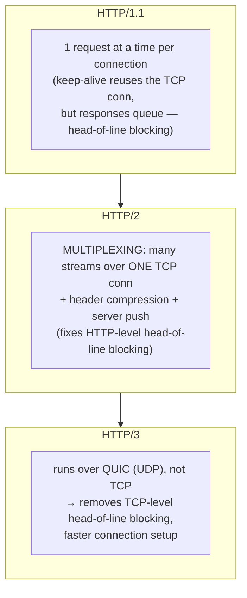
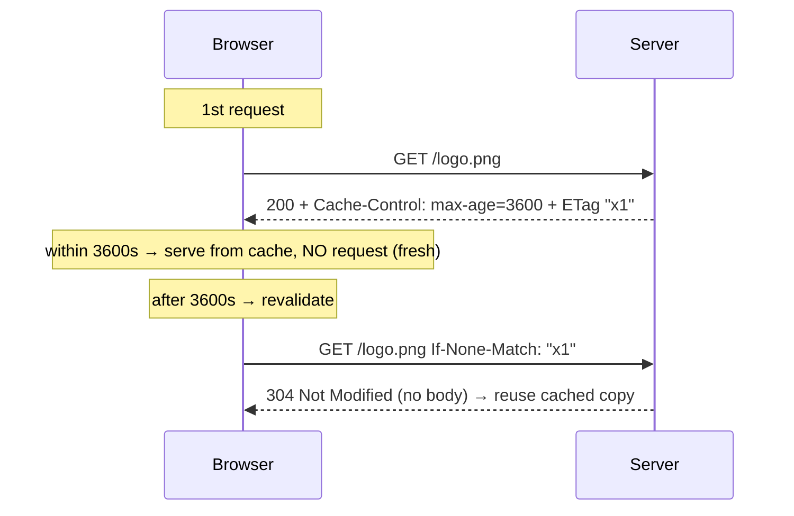
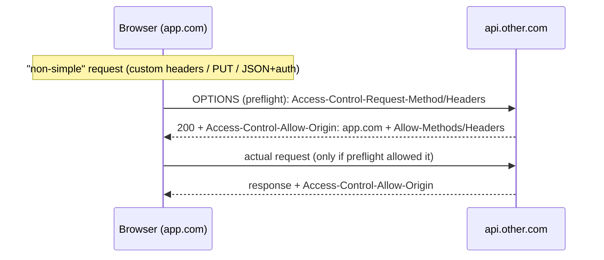

> Prerequisites: `fetch` API, async/await, Promise (Ch 02); stale-while-revalidate caching model (Ch 10). The JD asks you to "collaborate with
> backend to resolve ambiguity." That means knowing the wire.

---

## The one mental model

> **A network request is a typed MESSAGE (method + URL + headers + body) sent over a CONNECTION,
> answered with a typed response (status + headers + body). Almost every networking topic is an
> optimization of one of two things: reuse the expensive CONNECTION (HTTP/1.1 keep-alive → HTTP/2
> multiplexing → HTTP/3 over QUIC), or avoid the request entirely with CACHING (headers that say
> "reuse this for N seconds" or "ask if it changed"). Security (CORS, cookies) is the browser
> adding rules about WHO may send WHAT to WHOM.**

From "message over a connection, optimized by reuse + caching" you can understand why HTTP/2 fixed
head-of-line blocking, what cache headers mean, why CORS preflights, and how cookies/JWT auth
flow. No memorizing header lists. You reason about reuse and freshness.

---

## Learning Objectives

1. Read a request/response as method+headers+body / status+headers+body; know key status classes.
2. Explain HTTP/1.1 vs 2 vs 3 as connection-reuse improvements.
3. Explain caching headers (`Cache-Control`, `ETag`) as freshness vs revalidation.
4. Explain CORS, cookies (SameSite/HttpOnly), and JWT vs session auth at a flow level.

---

## Key Mental Models

- **Request = method + URL + headers + body.** Method conveys intent (GET read, POST create…).
- **Connection reuse** is the perf story: 1.1 keep-alive → 2 multiplexing → 3 QUIC/UDP.
- **Caching** = "don't ask again": `max-age` (fresh window) + `ETag`/`If-None-Match` (revalidate).
- **CORS** is the browser enforcing the same-origin policy with the server's permission headers.

---

## Introduction

Frontend interviews often ask about the network. The slow part of most apps is the
wire, not React. You will be asked "what happens when you type a URL," "explain CORS," "how does
caching work," and "session vs JWT." All these topics come from the message/connection/cache model.

---

## Problem & request anatomy

```
REQUEST                                  RESPONSE
GET /contacts?page=2 HTTP/2              HTTP/2 200 OK
Host: app.a product company.com                Content-Type: application/json
Accept: application/json                Cache-Control: max-age=60
Authorization: Bearer <token>           ETag: "ab12"
Cookie: session=...                      <body: JSON>
(no body for GET)
```

- **Methods:** GET (read, cacheable, no body), POST (create/side-effects), PUT/PATCH (update),
  DELETE. "Safe" means no side effects (GET/HEAD). "Idempotent" means the same result if repeated (GET, PUT,
  DELETE, but not POST).
- **Status classes:** 2xx ok (200, 201, 204), 3xx redirect/cache (301, 304 Not-Modified),
  4xx client error (400, 401 unauth, 403 forbidden, 404, 429 rate-limit), 5xx server error.

---

## Connection reuse: HTTP/1.1 → 2 → 3



- **1.1**: persistent connections (keep-alive) avoid re-handshaking, but a slow response blocks
  the ones behind it on that connection (head-of-line blocking) → browsers opened ~6 connections.
- **2**: multiplex many concurrent streams over one connection + compress headers. Fixes HTTP-
  level HOL, but a lost TCP packet still stalls all streams (TCP-level HOL).
- **3**: QUIC over UDP gives independent streams, so packet loss on one doesn't stall others, plus
  faster (0/1-RTT) setup.

---

## Caching: don't ask again



- **`Cache-Control: max-age=N`** means the response is fresh for N seconds. The browser serves it from cache with no network request. `no-store`
  means never cache. `no-cache` means cache but always revalidate first. `immutable` means the resource never changes and never revalidates.
- **Revalidation:** when the cached response is stale, the browser sends `If-None-Match: <ETag>` (or `If-Modified-Since`). The server
  replies with **304** (reuse the cached copy, no body) or 200 with fresh data. This is the same stale-while-revalidate
  idea that TanStack Query (Ch 10) uses at the app layer.
- **CDN** = cache copies near users (edge) so requests don't travel to origin.

---

## CORS: the browser's cross-origin rules

Same-origin policy: by default JS can't read responses from a *different origin* (scheme+host+
port). CORS is how a server **opts in** to allow it.



- **Preflight** (`OPTIONS`) happens for non-simple requests. These are requests with methods beyond GET/POST, custom
  headers, or JSON content-type. The browser asks "am I allowed?" before sending the real request.
- CORS is enforced **by the browser** when reading responses. It is not server-side security.
  A non-browser client ignores CORS entirely. This is a common interview clarification.

---

## Auth flows: cookies/sessions vs JWT

- **Session cookie:** server stores session state, sends a `Set-Cookie`; browser auto-sends it on
  every same-site request. Stateful (server must look it up), easy to revoke. Secure it with
  `HttpOnly` (JS can't read it → XSS-safe), `Secure` (HTTPS only), `SameSite` (CSRF defense,
  Ch 14).
- **JWT (token):** server signs a token containing claims; client stores and sends it
  (`Authorization: Bearer`). Stateless (server verifies the signature, no lookup), scales well,
  but hard to revoke before expiry → use short-lived access tokens + refresh tokens.
- **Where to store a JWT?** (Ch 14 covers the tradeoff.) `localStorage` is XSS-readable;
  `HttpOnly` cookie is XSS-safe but needs CSRF protection. There's no free lunch.

**Real-time:** **WebSocket** = persistent bidirectional connection (chat, live updates);
**SSE** (Server-Sent Events) = one-way server→client stream over HTTP (simpler, auto-reconnect);
**polling** = repeated requests (simple, wasteful). The contacts table's real-time status (Ch 08)
would use WS or SSE.

---

## Interview Discussion (reason first)

**Q1. "What does HTTP/2 improve over 1.1?"**
> "Multiplexing: many concurrent streams over one TCP connection, so requests don't queue behind
> each other (fixes HTTP-level head-of-line blocking), plus header compression. 1.1 reused the
> connection (keep-alive) but served responses serially. HTTP/3 goes further with QUIC over UDP to
> kill TCP-level HOL and speed up setup."

**Q2. "Explain CORS and preflight."**
> "Same-origin policy blocks JS from reading cross-origin responses unless the server opts in via
> `Access-Control-Allow-*` headers. For non-simple requests the browser first sends an OPTIONS
> preflight to check it's allowed. The browser enforces CORS for response reading. It is not a server
> firewall."

**Q3. "Session vs JWT?"**
> "Sessions are stateful (server stores them, easy to revoke, cookie auto-sent); JWTs are
> stateless (signed claims, server just verifies, scales, but hard to revoke. So use short access +
> refresh tokens). Cookie storage with HttpOnly+SameSite is safer against XSS than localStorage."

*Scoring:* full = multiplexing/HOL + browser-enforced CORS + stateful-vs-stateless auth.

---

## Common Mistakes

- **Thinking CORS is server security.** In reality, the browser enforces CORS for response-read protection.
- **Confusing `no-cache` (revalidate) with `no-store` (never cache).**
- **Storing JWTs in localStorage** without acknowledging XSS exposure (Ch 14).
- **Polling when SSE/WebSocket fits.** Polling wastes requests and battery.
- **Assuming GET can have side effects.** GET should be safe and cacheable.

---

## Interview Questions

1. Walk "what happens when you fetch /contacts" from DNS to rendered. Name caching and connection at each step.
2. HTTP/1.1 vs 2 vs 3. What HOL problem does each version address?
3. Draw the CORS preflight. What triggers it and who enforces it?
4. `Cache-Control: max-age` vs `ETag`/304. How do they work together?
5. Session vs JWT. Where would you store the token and what is the tradeoff?

---

## Homework

1. In DevTools Network: find a 304, read `Cache-Control`/`ETag` on a static asset, and watch a
   CORS preflight (`OPTIONS`) on a cross-origin API call.
2. Compare HTTP/2 vs 1.1 waterfall for a page with many small assets (Protocol column).
3. In `NOTES.md`: write the connection-reuse ladder (1.1 to 2 to 3), cache vs revalidate, and session vs JWT. One
   line each.

---

## Summary

- A request is a **message (method+headers+body)** over a **connection**, with a typed response.
- **Connection reuse** is the perf arc: 1.1 keep-alive (serial) → 2 multiplexing (fixes HTTP HOL)
  → 3 QUIC/UDP (fixes TCP HOL + faster setup).
- **Caching** avoids requests: `Cache-Control: max-age` (fresh window) + `ETag`/304 (revalidate). This is the
  wire-level version of stale-while-revalidate (Ch 10). CDNs cache copies at the edge.
- **CORS** is the browser enforcing same-origin policy. The server sends opt-in headers, and a preflight happens for
  non-simple requests. CORS is not server-side security.
- **Auth:** sessions (stateful, revocable, cookie) vs JWT (stateless, scalable, short-lived +
  refresh); cookie `HttpOnly`/`SameSite` matter for XSS/CSRF (Ch 14). Real-time: WS / SSE / poll.

## Go deeper
Ch 14 (security: where these headers defend XSS/CSRF), Ch 10 (app-level caching). MDN's HTTP
docs are the reference once this model is solid.
