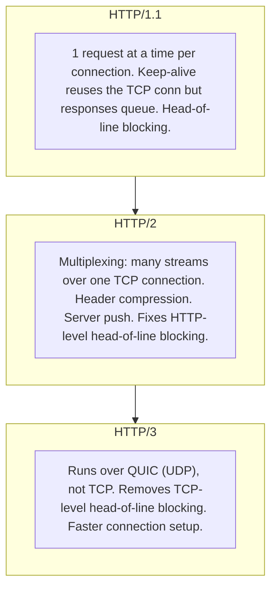
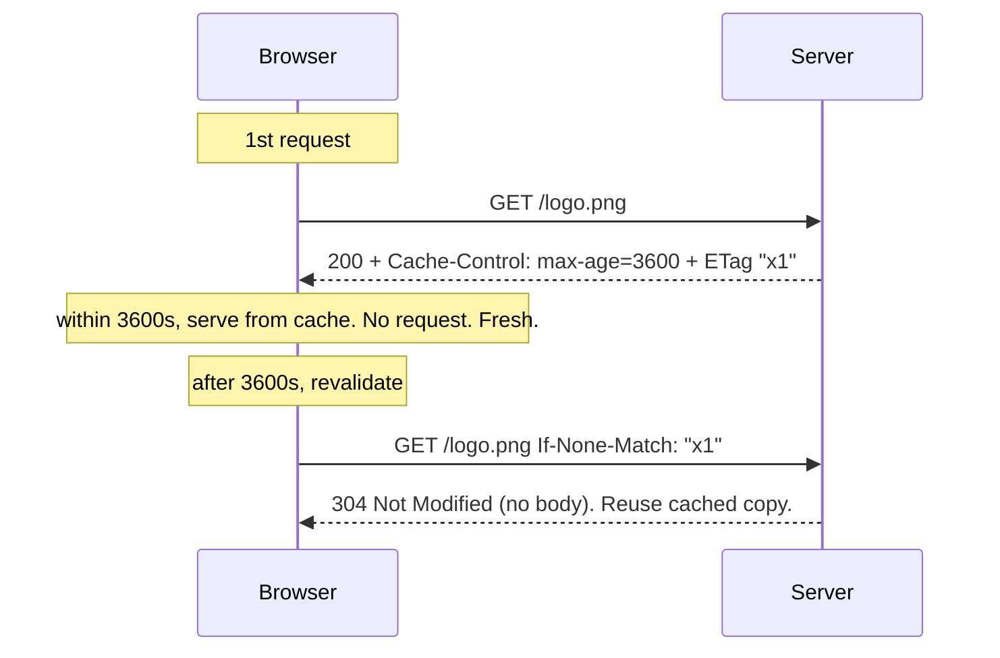
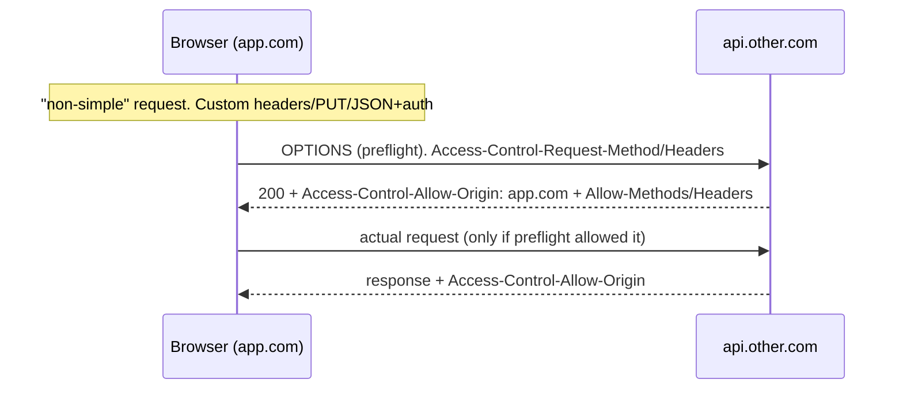

> Prerequisites: `fetch` API, async/await, Promise (Ch 02); stale-while-revalidate caching model (Ch 10). The JD asks you to "collaborate with backend to resolve ambiguity." That means knowing the wire.

## The Problem

Imagine you're at a restaurant, but there's only one waiter for the entire building. Every table has to wait for the one waiter to finish serving the table next to you before you can order. That's what your browser was doing with HTTP/1.1 — one request at a time per connection. Six connections open, but each one handles requests serially. A slow image blocks everything behind it.

Then you open DevTools and see the same data fetching over and over again because nothing is cached. Cross-origin API calls fail with cryptic CORS errors. You're stuck.

## Why Existing Solution Failed

HTTP/1.1 gave us keep-alive — you could reuse a TCP connection instead of opening a new one for every request. Progress! But the catch was that each connection still handled one request at a time. Six connections meant six parallel requests max. Head-of-line blocking meant a slow response delayed everything behind it on that connection. No multiplexing. No server push. No prioritization.

Without caching headers, every page load re-downloaded the same assets. Without CORS, cross-origin API calls failed with cryptic errors. Without understanding the request-response structure, debugging network issues was guesswork.

## Mental Model

Think of a network request as a typed message (method + URL + headers + body) sent over a connection, answered with a typed response (status + headers + body). Almost every networking topic boils down to one of two optimizations: **reuse the expensive connection** (HTTP/1.1 keep-alive to HTTP/2 multiplexing to HTTP/3 over QUIC), or **avoid the request entirely with caching** (headers that say "reuse this for N seconds" or "ask if it changed"). Security (CORS, cookies) is just the browser adding rules about who may send what to whom.

From "message over a connection, optimized by reuse plus caching" you can understand why HTTP/2 fixed head-of-line blocking, what cache headers mean, why CORS preflights exist, and how cookies and JWT auth flow. No memorizing header lists. You reason about reuse and freshness.

## Visualization

Connection reuse evolution:

Cache revalidation flow:

CORS preflight:

## Engine Simulation

Trace what happens when a browser requests an image at https://example.com/logo.png for the first time.

The browser checks its HTTP cache. Cache miss. It opens a TCP connection to example.com:443. TLS handshake negotiates encryption. The browser sends an HTTP request: GET /logo.png with headers like Accept and User-Agent. The server receives the request. It checks the file system for logo.png. Found. It sends back a response: 200 OK with Content-Type: image/png, Cache-Control: max-age=3600, ETag: "abc123", and the image bytes. The browser stores the response in its HTTP cache keyed by the URL.

The browser parses the HTML and sees the same logo.png on the next page. It checks the cache. Cache hit. The response is still fresh (within 3600 seconds). The browser uses the cached copy. No network request. Zero milliseconds.

An hour later, the browser needs logo.png again. Cache hit but stale. The browser sends a conditional request: GET /logo.png with If-None-Match: "abc123". The server checks if the file changed. It has not. The server responds with 304 Not Modified (empty body, 20 bytes instead of 20KB). The browser uses the cached copy. This is revalidation.

## Internal Implementation

The browser maintains an HTTP cache on disk. Each cached response is stored with its URL, cached headers, and a freshness lifetime. When a request is made, the browser checks if the URL exists in the cache. If it exists and is still fresh (current time minus Date header is less than max-age), the response is served from cache with status 200 (from disk cache). No network request.

If the response is stale but has an ETag or Last-Modified, the browser sends a conditional GET. The server can respond with 304 (not modified) and no body, saving bandwidth. If the response has no-store, the browser never caches it. If it has no-cache, the browser caches it but always revalidates before use.

CDNs work the same way but at the edge. A CDN node receives a request, checks its cache, serves if fresh, or forwards to origin. This places cached copies near users geographically.

## Real World Example

Your contacts app loads a JSON payload of contacts, profile images, and static JS bundles. Without caching, every page navigation re-downloads everything. The app feels slow. Here's the fix:

Static assets (JS, CSS, images) get `Cache-Control: max-age=31536000` with a content hash in the filename. They never need revalidation. The browser loads them once and keeps them for a year. The API response for contacts gets `Cache-Control: max-age=60` and an ETag. The browser caches it for 60 seconds. After 60 seconds, it revalidates with `If-None-Match`. If the contacts haven't changed, the server returns 304 and the browser uses the cached copy. This saves bandwidth and speeds up re-renders.

The app also calls a cross-origin API at `api.other.com`. The browser blocks the response because of same-origin policy. The fix: the server sends `Access-Control-Allow-Origin: https://app.com`. For non-simple requests (PUT with JSON body), the browser sends an OPTIONS preflight first. The server must respond with the correct CORS headers. Understanding this flow lets you debug CORS issues without waiting for backend support.

## Tradeoffs

**HTTP/2 vs HTTP/3.** HTTP/2 multiplexes many streams over one TCP connection. This fixes HTTP-level head-of-line blocking. But TCP-level head-of-line blocking remains: one lost packet stalls all streams because TCP delivers in order. HTTP/3 uses QUIC over UDP. Each stream is independent. Packet loss on one stream doesn't affect others. QUIC also has faster connection setup (0-RTT vs 1-2 round trips for TCP+TLS). The tradeoff: HTTP/3 requires QUIC support on server and client. Most modern browsers and CDNs support it, but some enterprise networks block UDP.

**Cache-Control: max-age vs ETag/304.** `max-age` avoids the network entirely during the freshness window. ETag/304 still makes a request but avoids downloading the body. `max-age` saves more bandwidth but risks serving stale content. ETag stays fresh but costs a round trip. Use `max-age` for assets that change infrequently and are OK being slightly stale. Use ETag for content where freshness matters more than speed.

**CORS preflight adds latency.** An extra round trip for non-simple requests. To avoid it, keep requests simple (GET/POST with standard headers and form-encoded body) when possible. But if you need custom headers or JSON content-type, the preflight is unavoidable.

## Common Mistakes

- Thinking CORS is server security. The browser enforces CORS for response-read protection. It is not a server firewall.
- Confusing `no-cache` (must revalidate) with `no-store` (never cache anything).
- Storing JWTs in localStorage without acknowledging XSS exposure (Ch 14).
- Polling when SSE or WebSocket fits. Polling wastes requests and battery.
- Assuming GET can have side effects. GET should be safe and cacheable.

## SDE-2 Interview Answer

**Mid-level variant:**
"HTTP/1.1 handled one request at a time per connection. HTTP/2 multiplexes many requests over one connection. This fixes head-of-line blocking at the HTTP level. HTTP/3 uses QUIC over UDP to fix TCP-level head-of-line blocking. Caching avoids requests entirely through cache headers. CORS is the browser enforcing that cross-origin responses are only read if the server permits it. Sessions are stateful auth on the server. JWTs are stateless token auth."

**Senior variant:**
"I reason about the network as messages over connections, optimized by reuse and caching. HTTP/1.1 reused connections but served serially. HTTP/2 multiplexed streams over one connection but lost packets stalled everything. HTTP/3 gives independent streams over QUIC. For caching, I use max-age for long-lived assets with content hashes and ETag for API responses that need freshness. CORS is browser-enforced, not server security. I distinguish sessions (stateful, revocable) from JWTs (stateless, scalable, hard to revoke). The token storage tradeoff is between XSS exposure (localStorage) and CSRF vulnerability (automatic cookies)."

**Engineering Lead variant:**
"I ensure the team understands the wire so they can debug network issues independently. We use content hashes in filenames for aggressive static asset caching. API responses get appropriate Cache-Control and ETag headers coordinated with the backend team. CORS configuration is documented so new endpoints follow the same pattern. For auth, we standardize on HttpOnly+Secure+SameSite cookies for session tokens to minimize XSS risk, and we document the tradeoffs explicitly. The team knows when to use WebSocket vs SSE vs polling based on connection direction and reliability needs."

## Follow-up Questions

1. Walk "what happens when you fetch /contacts" from DNS to rendered. Name caching and connection at each step.

**DNS resolution:** Browser checks its DNS cache. Miss? Recursive resolver walks root → TLD → authoritative nameserver. IP returned and cached. **TCP connection:** Browser opens a TCP connection to the server's IP on port 443. Three-way handshake (SYN, SYN-ACK, ACK). If HTTP/2 or HTTP/3, this connection is reused for all subsequent requests. **TLS handshake:** Client and server negotiate encryption (TLS 1.3 in one round trip). Server certificate validated against CA store. Session keys established. **HTTP request:** Browser sends `GET /contacts` with headers (Accept, Authorization, Cookie, Cache-Control). If the browser has a cached response with an ETag, it sends `If-None-Match` for conditional revalidation. **Server processing:** Server queries the database, serializes JSON, sets response headers (Cache-Control, ETag, Content-Type). **HTTP response:** 200 with JSON body, or 304 Not Modified (empty body, reuse cached copy). **Browser parsing:** JSON parsed into JavaScript objects. **React rendering:** TanStack Query stores data in cache. Components subscribe, re-render, DOM updates. **Paint:** Browser paints pixels to screen. Total from DNS to pixels: typically 100-500ms for a cached connection, 50-200ms for the network portion on a fast connection.

2. HTTP/1.1 vs 2 vs 3. What head-of-line blocking problem does each version address?

**HTTP/1.1** fixes no head-of-line blocking. Each connection handles one request at a time. Six connections open, but each serializes requests. A slow image on connection 1 blocks everything behind it on that connection. This is HTTP-level head-of-line blocking. **HTTP/2** fixes HTTP-level head-of-line blocking with multiplexing. Multiple streams (requests) share one TCP connection. Each stream is independent at the HTTP layer — a slow response on stream 1 doesn't block stream 2. But TCP still delivers bytes in order. One lost TCP packet stalls all streams because TCP retransmits before delivering to the application layer. This is TCP-level head-of-line blocking. **HTTP/3** fixes TCP-level head-of-line blocking by running over QUIC (UDP-based). Each QUIC stream has independent loss recovery. A lost packet on stream 1 only stalls stream 1. Other streams continue receiving data. QUIC also combines the transport and TLS handshakes, achieving 0-RTT connection setup versus TCP+TLS's 2-3 round trips. The tradeoff: HTTP/3 requires QUIC support on both ends and some enterprise networks block UDP.

3. Draw the CORS preflight. What triggers it and who enforces it?

**What triggers it:** Any request that is not "simple." A simple request is GET, HEAD, or POST with only standard headers (Accept, Content-Language, Content-Type with form-encoded or text/plain) and no credentials. Everything else triggers a preflight: PUT, DELETE, PATCH, requests with custom headers (Authorization, X-Custom), JSON Content-Type with credentials, or any request with `mode: 'cors'` that doesn't fit the simple criteria. **The flow:**

1. Browser detects a non-simple request to a different origin.
2. Browser sends an `OPTIONS` request to the target URL. Headers include `Access-Control-Request-Method` (the intended method) and `Access-Control-Request-Headers` (the custom headers).
3. Server responds with `Access-Control-Allow-Origin`, `Access-Control-Allow-Methods`, `Access-Control-Allow-Headers`.
4. Browser checks: is the intended origin in the allowed list? Is the method allowed? Are the headers allowed?
5. If yes, browser sends the actual request. If no, browser blocks it and the request never leaves the browser.

**Who enforces it:** The browser. The server never sees the preflight if the browser blocks the request. CORS is a browser-enforced policy, not a server firewall. The server opts in by sending the right headers. A server that doesn't send CORS headers still receives requests from same-origin clients — CORS only restricts cross-origin reads by the browser.

4. Cache-Control: max-age vs ETag/304. How do they work together?

`Cache-Control: max-age=3600` tells the browser: "This response is fresh for 3600 seconds. Don't even ask the server." During that window, the browser serves from disk cache with zero network requests. This is the fastest path — no latency, no bandwidth. After max-age expires, the response is stale. The browser needs to revalidate.

`ETag` is a content fingerprint the server sends with the response. When the response goes stale, the browser sends a conditional request: `GET /contacts If-None-Match: "abc123"`. The server checks if the content changed. If not, it responds with `304 Not Modified` — no body, ~20 bytes instead of 20KB. The browser reuses the cached copy.

They work together in a layered strategy: `max-age` avoids the network entirely for fresh content. ETag/304 avoids downloading the body for stale-but-unchanged content. For static assets with content hashes in filenames, `max-age=31536000` (one year) is safe because the URL changes when the content changes. For API responses that change frequently, a short `max-age` (60 seconds) plus ETag gives you the best of both worlds — no requests during the freshness window, minimal bandwidth after.

5. Session vs JWT. Where would you store the token and what is the tradeoff?

**Sessions:** The server stores session data (user ID, permissions, expiry). The client holds only a session ID in a cookie. The server looks up the session on every request. Tradeoffs: the server is stateful (must store and look up sessions), but revocation is instant — delete the session server-side and the client is logged out. Scales vertically (session store must be shared across server instances, typically Redis). **JWTs:** The token itself contains the claims (user ID, permissions, expiry). The server validates the signature without a lookup. Tradeoffs: stateless and horizontally scalable, but revocation is hard — you can't invalidate a JWT before it expires without a token blocklist (which defeats the statelessness). **Storage:** `HttpOnly + Secure + SameSite` cookies are the safest. JavaScript can't read the cookie (HttpOnly protects against XSS stealing it), the browser only sends it over HTTPS (Secure), and it's not sent on cross-site requests (SameSite=Lax prevents CSRF). The tradeoff: cookies are automatically attached, which means the server must still validate CSRF for state-changing requests. `localStorage` is simpler but XSS-readable — if an attacker injects script via stored XSS, they can read the token and exfiltrate it. The modern recommendation: HttpOnly cookies for session/refresh tokens, short-lived access tokens in memory (not localStorage), and strong XSS defenses (CSP, output escaping). Never store long-lived tokens in localStorage.

## Mental Trigger

Network = message over connection, optimized by reuse and caching.

## One Page Revision

- Request = method + URL + headers + body. Response = status + headers + body. Method conveys intent.
- Connection reuse is the performance story: 1.1 keep-alive (serial) to 2 multiplexing (fixes HTTP HOL) to 3 QUIC/UDP (fixes TCP HOL, faster setup).
- Caching avoids requests. `Cache-Control: max-age` sets fresh window. ETag/304 does conditional revalidation. This is stale-while-revalidate at the wire level. CDNs cache at the edge.
- CORS is the browser enforcing same-origin policy. Server sends opt-in headers. Preflight (OPTIONS) happens for non-simple requests. CORS is not server-side security.
- Auth: sessions (stateful, revocable, cookie) vs JWT (stateless, scalable, short-lived plus refresh). Cookie HttpOnly/SameSite matter for XSS/CSRF. Real-time: WebSocket, SSE, or polling.
