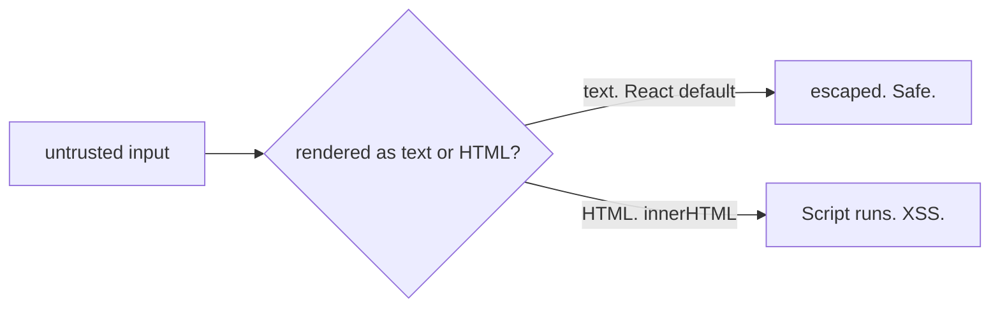
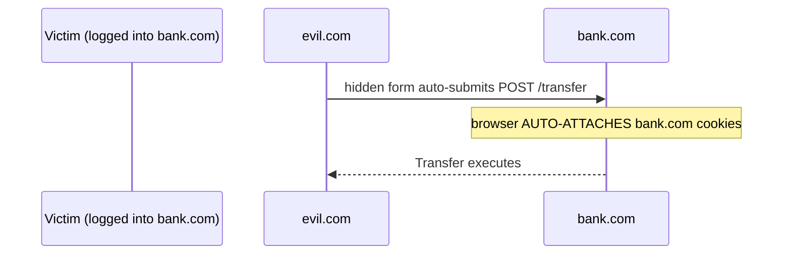

## Why This Matters

An attacker submits a contact with a name that contains a `` as a contact name. React sees `{contact.name}` in JSX, creates a text node — angle brackets become `&lt;` and `&gt;`. The browser displays the literal text. No script executes. Attack dead on arrival.

The hole: `dangerouslySetInnerHTML` or `innerHTML`. These tell the browser "trust this as HTML." The browser parses the string, finds the `<script>` tag, and executes it. The attacker's script runs in your origin, reads `document.cookie`, and sends it to their server.

**Fix:** If you must render rich HTML, sanitize with DOMPurify first — it parses the HTML, strips dangerous elements (script, iframe, event handlers), and returns safe markup. But escaping (the default) always wins when you don't need rich formatting.

## CSRF: When Credentials Leak Across Origins

User is logged into bank.com (session cookie set). Visits evil.com. Evil.com has a hidden form that auto-submits a POST to bank.com/transfer with `to=attacker&amount=1000`. The browser auto-attaches the bank.com session cookie. Bank.com sees a valid cookie. Transfer executes. The user never clicked anything on bank.com.

**`SameSite=Lax` defense:** The browser checks the cookie's SameSite attribute. Lax means: only send cookies for top-level navigations (clicking a link), not cross-site form submissions. The browser strips the cookie. Bank.com receives the POST without authentication and rejects it. Attack neutralized.

`SameSite=Lax` doesn't protect against top-level GET-based CSRF (a link to `bank.com/transfer?to=attacker` still sends cookies). But state-changing operations should never be GET — that's a design constraint, not a SameSite limitation. For defense-in-depth, pair SameSite with anti-CSRF tokens on state-changing endpoints.

## CSP: Defense-in-Depth

A `Content-Security-Policy` header tells the browser which script sources are allowed. Before executing any script, the browser checks the CSP. If the source doesn't match, the browser blocks it and reports the violation.

Even if an attacker injects a `<script>` tag via an unsanitized field, CSP blocks it from executing *and* from phoning home. A strict CSP like `script-src 'self' 'nonce-abc123'` means only scripts from your origin with the correct nonce can execute. This protects against third-party scripts (analytics, widgets), browser extensions, and future code where someone uses `innerHTML` without sanitizing.

Start with `Content-Security-Policy-Report-Only` to discover violations before enforcing. This way you don't break legitimate third-party scripts on day one.

## Token Storage

| Storage | XSS Risk | CSRF Risk |
|---|---|---|
| localStorage | High — XSS reads it | Low — browser won't auto-send |
| HttpOnly cookie | Low — JS can't access it | Medium — browser auto-attaches |
| In-memory variable | Medium — XSS can read it | Low — not auto-attached |

Best practice: refresh token in `HttpOnly + Secure + SameSite` cookie (long-lived, never exposed to JS). Short-lived access token in memory (5-15 minutes). Strong XSS defenses (CSP, output escaping) as primary protection. SameSite + anti-CSRF tokens for remaining CSRF surface. There's no perfect location — the tradeoff is which threat you prioritize.

## Q&A

**1. Why does React prevent XSS by default?**

JSX inserts values as text nodes via `createElement`. Text nodes are not parsed as HTML. Special characters are automatically escaped to HTML entities. The only hole is `dangerouslySetInnerHTML`, which sets `innerHTML` directly — telling the browser to parse the string as HTML. Sanitize with DOMPurify if you must use it.

**2. What does `SameSite=Lax` actually block?**

Cross-site form POSTs, fetch calls, and img tags. It still allows top-level GET navigations (clicking a link to the site). State-changing operations should never be GET, so this covers most CSRF. For defense-in-depth, pair with anti-CSRF tokens on state-changing endpoints.

**3. Why is CSP useful if I already escape output?**

Output escaping handles known injection points. CSP catches what escaping misses: third-party scripts you load (analytics, widgets), browser extensions injecting scripts, subresource integrity failures, and future code where someone uses `innerHTML` without sanitizing. It's the safety net.

**4. Why is `rel=noopener` needed on `target=_blank`?**

When a link opens in a new tab with `target="_blank"`, the new page gets a reference to the original via `window.opener`. The opened page can redirect the original — reverse tabnabbing. `rel="noopener"` sets `window.opener` to null. Modern browsers set this by default, but explicit is still best practice.

## Mental Trigger

**Data is not code. Credentials don't cross origins.**
