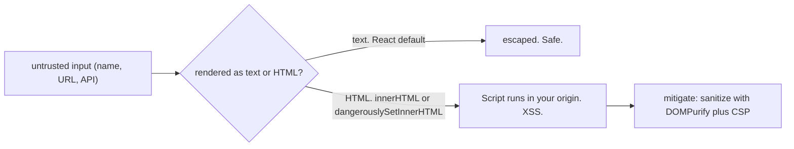
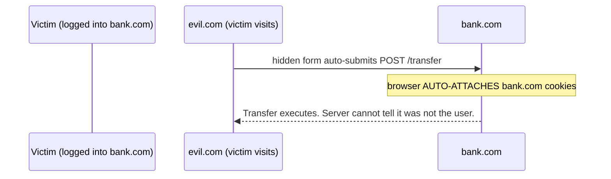

> Prerequisites: HTTP cookies, CORS headers and preflight (Ch 13); React's default text-escaping in JSX (Ch 03). Security is a standard SDE-2 topic and a JD "high ownership" signal.

## Problem

A user types their name into your contact form. They enter ``. You render it on the page. The script runs. Your users' cookies are now on an attacker's server. Or worse: a malicious site embeds a hidden form that submits a POST to your API. The browser automatically sends the logged-in user's session cookie. The server processes the transfer. The user did not authorize it.

## Why Existing Solution Failed

Checking input on the client side only is useless. The attacker can bypass the browser. Server-side validation alone does not prevent DOM-based injection if the server sends back data that the browser renders as HTML. Relying on the user to be honest is not a strategy.

Old defenses were partial. Escaping some characters but not others. Using innerHTML instead of textContent. Setting cookies without SameSite or HttpOnly. Each missing defense was a hole an attacker could exploit. The browser has security features, but they only work if you opt in.

## Mental Model

Two rules cover almost all web security. Rule one: never trust input. Anything from a user, URL, or API can be hostile. Treat data as data, never as code. Rule two: never leak authority. Do not let one origin act with another origin's credentials. The browser's whole job is isolation between origins. Attacks are ways to break that isolation. XSS injects code into your origin. CSRF rides your credentials from another origin. Defenses re-assert that data is not code and credentials only flow where intended.

From those two rules you can understand XSS (and why React's escaping prevents it), CSRF (and why SameSite cookies stop it), CSP, and the token-storage tradeoff. No memorizing an attack list. Each attack is "untrusted input became code" or "authority leaked across origins."

## Visualization

XSS attack flow:

CSRF attack flow:

## Engine Simulation

Trace a stored XSS attack. A user submits a comment on a blog. The comment contains ``. The server stores the comment as-is in the database (no sanitization on the server). Another user visits the blog page. The server sends the comment in the API response. The frontend renders it with innerHTML. The browser parses the script tag and executes it. The victim's cookies are sent to evil.com.

Now trace the same attack with React's default behavior. The server sends the same malicious comment. The frontend renders it with `{comment.body}` in JSX. React escapes the angle brackets. The text `` appears as visible text on the page. The browser does not parse it as HTML. No script executes.

Now trace CSRF. A user is logged into bank.com. The session cookie is set without SameSite. The user visits evil.com. Evil.com has a hidden form that auto-submits to bank.com/transfer with amount=1000 and to=attacker. The browser sends the request to bank.com with the user's session cookie attached automatically. Bank.com sees a valid cookie and processes the transfer.

Now trace SameSite=Lax defense. Bank.com sets the cookie with SameSite=Lax. When evil.com's form tries to submit to bank.com, the browser does not send the cookie. The request arrives at bank.com without authentication. Bank.com rejects it.

## Internal Implementation

React's JSX escaping works at the element creation level. When you write `
{userInput}
`, React calls `React.createElement('div', null, userInput)`. The third argument becomes a text node child in the DOM. Text nodes are not parsed as HTML. The browser treats the content as text and displays it literally. Special characters like `<`, `>`, `&` are automatically converted to their HTML entity equivalents (`&lt;`, `&gt;`, `&amp;`). This is the same mechanism as `element.textContent = userInput` vs `element.innerHTML = userInput`.

SameSite cookies work at the browser's cookie store level. When the browser makes a request, it checks the cookie's SameSite attribute against the request's initiator. For Lax, cookies are sent for top-level navigations (clicking a link) but not for cross-site requests initiated by third-party sites (form submissions, fetch, img tags). For Strict, cookies are not sent for any cross-site request at all. This check happens before the request leaves the browser.

CSP works at the browser's content security policy checker. When the server sends a Content-Security-Policy header, the browser stores the policy rules. Before executing any script, loading any style, or making any request, the browser checks the CSP. If the source does not match the whitelist, the browser blocks the operation and reports the violation. This is defense-in-depth. Even if an attacker injects a script tag, CSP can block it from executing and block it from phoning home.

## Real World Example

Interviewer's contacts app handles real user data and auth tokens. The threat model includes an attacker who posts a contact with a malicious name. The contacts list renders all names. Without React's default escaping, this would be a stored XSS vector. React's JSX escaping handles it by default. The only risk is if the app uses dangerouslySetInnerHTML for rich text profiles. The fix is to sanitize with DOMPurify before passing to dangerouslySetInnerHTML.

The app also uses cookies for session management. Without SameSite, a cross-site request from an attacker's page could trigger authenticated API calls. Setting SameSite=Lax on session cookies prevents this. The app also sets HttpOnly so JavaScript cannot read the cookie. This limits XSS damage: even if XSS executes, the cookie is not readable.

For auth tokens, the app stores refresh tokens in HttpOnly+Secure+SameSite cookies. Access tokens are short-lived and held in memory only. This minimizes the exposure window. A CSP header restricts script sources to the app's own domain. This provides defense-in-depth against injected scripts.

## Tradeoffs

XSS vs CSRF in token storage. LocalStorage is XSS-readable but not vulnerable to cookie-CSRF. HttpOnly cookies are XSS-safe but need SameSite and CSRF tokens. There is no perfect storage location. The tradeoff is which threat you prioritize. Most modern apps prefer HttpOnly+Secure+SameSite cookies because SameSite kills most CSRF and HttpOnly protects against XSS reading the token. But this requires the server to handle CSRF for the remaining cases (cross-site POSTs that should work).

CSP vs development velocity. Strict CSP (script-src 'self' with hashes) blocks all inline scripts and eval. This prevents XSS but also blocks legitimate inline scripts and many third-party integrations. The tradeoff is security vs convenience. Start with report-only mode to discover violations before enforcing.

Sanitization vs escaping. Escaping is safe and simple (React does it by default). Sanitization is complex (you must parse HTML and strip dangerous parts while keeping safe parts). Escaping always wins when you do not need rich HTML. Only use sanitization when you must allow some HTML formatting.

## Common Mistakes

- dangerouslySetInnerHTML without sanitizing user or rich content. This leads to stored XSS.
- Assuming JWT/localStorage is automatically secure. XSS can read it.
- No SameSite on session cookies. This exposes you to CSRF.
- Redirecting to a raw query-param URL. This creates an open redirect or phishing risk.
- Trusting client-side validation or authorization. The server must re-check everything.

## SDE-2 Interview Answer

**Mid-level variant:**
"React prevents XSS by default. JSX inserts values as text and escapes HTML characters. The data stays as data. The hole is dangerouslySetInnerHTML where you must sanitize first. CSRF happens when an attacker's site sends a request to a site you are logged into. The browser auto-sends cookies. SameSite cookies prevent this. The browser does not send them cross-site. For token storage, HttpOnly cookies are XSS-safe but need SameSite. LocalStorage is XSS-readable."

**Senior variant:**
"Two rules: never trust input (data is not code) and never leak authority across origins. XSS happens when untrusted input runs as code in your origin. React escapes by default, inserting values as text nodes. dangerouslySetInnerHTML or innerHTML reopens the hole. I sanitize with DOMPurify and add CSP for defense-in-depth. CSRF happens when an attacker uses your auto-sent cookies from another site. SameSite cookies are the modern primary defense. For token storage, there is no free lunch. I prefer HttpOnly+Secure+SameSite cookies for session tokens, short-lived access tokens in memory, and strong XSS defenses including CSP. The threat model matters more than any single defense."

**Engineering Lead variant:**
"I establish the two rules as team principles. All code reviews check that untrusted input is never rendered as HTML. dangerouslySetInnerHTML requires a comment explaining why it is necessary and confirming sanitization. Our cookie configuration standards mandate HttpOnly+Secure+SameSite for session cookies. We use CSP in report-only mode initially to discover violations, then enforce. The token storage strategy is documented with the explicit tradeoff. I make sure every team member understands that security is layered: escaping, sanitization, CSP, SameSite, HttpOnly, and server-side validation each add a layer. No single layer is sufficient."

## Follow-up Questions

1. Walk a stored XSS attack through a contact's name field. How does React's text-escaping stop it? How would dangerouslySetInnerHTML reopen it?

2. Diagram CSRF. Why does SameSite=Lax stop most of it?

3. localStorage vs HttpOnly cookie for tokens. Give the XSS and CSRF tradeoff table.

4. What does CSP add if you already escape output? (defense-in-depth.)

5. Why is rel=noopener needed on target=_blank?

## Mental Trigger

Two rules: data is not code, do not leak authority.

## One Page Revision

- Two rules: never trust input (data is not code) and never leak authority across origins. The browser enforces origin isolation. Attacks break that isolation.
- XSS happens when untrusted input runs as code in your origin. React escapes by default (text, not HTML). dangerouslySetInnerHTML or innerHTML reopen the hole. Sanitize and add CSP.
- CSRF happens when an attacker uses your auto-sent cookies from another site. Defend with SameSite cookies and anti-CSRF tokens.
- Token storage is a tradeoff. LocalStorage is XSS-readable. HttpOnly cookie is CSRF-prone. Prefer HttpOnly+Secure+SameSite, short-lived access tokens, and strong XSS defenses.
- CSP, noopener, frame-ancestors, HTTPS/HSTS, allowlisted redirects are supporting layers. Always re-validate on the server.
