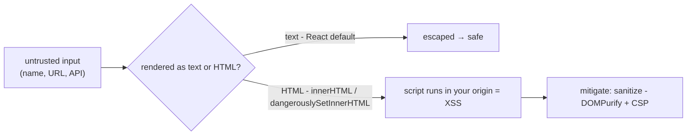
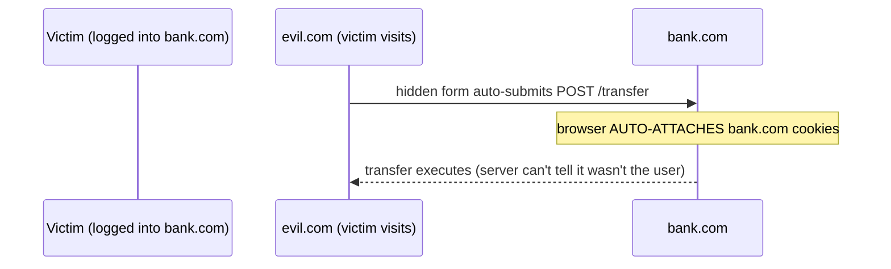

> Prerequisites: HTTP cookies, CORS headers & preflight (Ch 13); React's default text-escaping in JSX (Ch 03). Security is a
> standard SDE-2 topic and a JD "high ownership" signal.

---

## The one mental model

> **Two rules cover almost all web security. One: NEVER TRUST INPUT. Anything from a user, URL,
> or API can be hostile. Treat data as data, never as code. Two: NEVER LEAK AUTHORITY. Do not
> let one origin act with another origin's credentials. The browser's whole job is ISOLATION
> between origins. Attacks are ways to break that isolation. XSS injects code into your origin.
> CSRF rides your credentials from another origin. Defenses re-assert that data is not code and
> credentials only flow where intended.**

From those two rules you can understand XSS (and why React's escaping prevents it), CSRF (and why
SameSite cookies stop it), CSP, and the token-storage tradeoff. No memorizing an attack list.
Each attack is "untrusted input became code" or "authority leaked across origins."

---

## Learning Objectives

1. Explain **XSS** (the #1 frontend threat), how React mitigates it, and where you reintroduce it.
2. Explain **CSRF** and how SameSite cookies / tokens defend it.
3. Explain **CSP** as defense-in-depth, and the token-storage (localStorage vs cookie) tradeoff.
4. Name common pitfalls: `dangerouslySetInnerHTML`, `target=_blank`, clickjacking, open redirects.

---

## Key Mental Models

- **Data ≠ code.** Injection happens when untrusted data is interpreted as code/markup.
- **Origin isolation.** The browser keeps origins apart; attacks cross that boundary.
- **XSS = attacker runs JS in *your* origin** (steals tokens, acts as the user).
- **CSRF = attacker uses *your* logged-in credentials from *their* site** (the browser auto-sends
  cookies).

---

## Introduction

You don't need to be a security engineer. But an SDE-2 must not create security holes and must
answer "how do you prevent XSS/CSRF." Both attacks come down to the two rules. The contacts app handles
real user data and auth, so this matters for the job description's "ownership" requirements.

---

## XSS: untrusted input becomes code

```js
// ❌ classic XSS: a contact's name contains 
element.innerHTML = contact.name;   // the browser parses it as HTML → runs the script
```

If user-supplied data is inserted as **HTML**, embedded scripts run **in your origin**. They can
read non-HttpOnly cookies, make authenticated requests, and impersonate the user.

**Why React is XSS-safe by default:** JSX `{value}` is inserted as **text**, not HTML. React
escapes `<`, `>`, `&`, and other special characters. The data stays as data. You only reopen the hole when you bypass this protection:

```jsx
<div>{contact.name}</div>                                   // ✅ escaped → safe
<div dangerouslySetInnerHTML={{ __html: contact.bio }} />   // ⚠️ raw HTML → sanitize first!
```

If you must render HTML (rich text), **sanitize** with a library like DOMPurify to strip scripts.
This re-asserts the rule that "data isn't code." Types of XSS: **stored** (malicious data saved server-side, served
to others), **reflected** (echoed from the URL or query), **DOM-based** (client writes untrusted
data into the DOM). Every type has the same root cause.



---

## CSRF: riding your credentials



CSRF exploits the fact that the browser **automatically sends cookies** for a site on *any* request to it.
This includes requests triggered by another site. The server sees a valid session cookie and processes the request.

**Defenses (re-assert that authority only flows where intended):**
- **`SameSite` cookies** (`Lax` default, or `Strict`). The browser won't send the cookie on
  cross-site requests. This kills most CSRF. It is the modern primary defense (Ch 13).
- **CSRF tokens** are a per-session secret the server requires in the request body or header. Evil.com
  can't read the token (due to same-origin policy), so it can't forge the request.
- **Note:** token-in-header auth (JWT in `Authorization`) isn't auto-sent by the browser. So it is
  not vulnerable to classic cookie-CSRF. But it *is* readable by XSS if stored in JS-accessible
  storage. The two threats trade off against each other:

| Store token in… | XSS risk | CSRF risk |
|---|---|---|
| `localStorage` (JS reads, sent in header) | **exposed to XSS** | not cookie-CSRF prone |
| `HttpOnly` cookie (JS can't read, auto-sent) | XSS-safe | **needs SameSite/CSRF token** |

There is no perfect spot. Pick based on your threat model. A common best practice is **HttpOnly +
Secure + SameSite cookie** for the session or refresh token.

---

## CSP & other defenses

- **Content-Security-Policy** (header): allows you to whitelist where scripts, styles, and images may load from
  (for example `script-src 'self'`). This is defense-in-depth. Even if XSS injects a script tag, CSP can block it
  from executing or sending data out. Avoid `unsafe-inline`.
- **`rel="noopener noreferrer"`** on `target="_blank"` links. Without this, the opened page can
  control your tab through `window.opener`. This attack is called reverse tabnabbing. Modern browsers default to noopener.
- **Clickjacking:** an attacker puts your site in an iframe and tricks users into clicking. Defend with
  `X-Frame-Options: DENY` or CSP `frame-ancestors`.
- **Open redirects:** never redirect to a URL taken directly from a query parameter. Always validate against an
  allowlist of allowed URLs.
- **HTTPS everywhere** (+ HSTS) so tokens/cookies aren't sniffed.

---

## Interview Discussion (reason first)

**Q1. "How does React prevent XSS, and when is it still vulnerable?"**
> "JSX inserts values as text and escapes HTML metacharacters. So injected markup is shown, not
> executed. Data stays as data. You reintroduce XSS with `dangerouslySetInnerHTML` (or direct
> `innerHTML`). Then you must sanitize with DOMPurify and ideally add a CSP."

**Q2. "What's CSRF and how do you stop it?"**
> "An attacker's site triggers a request to a site you are logged into. The browser auto-attaches
> your cookies, so the server thinks it is you. Stop it with `SameSite` cookies. The browser won't send
> them cross-site. Or use anti-CSRF tokens the attacker can't read. Header-based tokens aren't
> auto-sent. So they sidestep cookie-CSRF. But they are XSS-readable if stored in JS."

**Q3. "Where do you store an auth token?"**
> "It is a tradeoff. localStorage is XSS-readable. HttpOnly cookies are XSS-safe but need SameSite and CSRF
> protection. I prefer HttpOnly+Secure+SameSite cookies for session and refresh tokens. I keep access
> tokens short-lived. I harden against XSS with escaping, sanitizing, and CSP. XSS defeats almost
> any client storage."

*Scoring:* full = data-isn't-code + origin-isolation + the XSS/CSRF storage tradeoff. Fail = "use
JWT, it is secure."

---

## Common Mistakes

- **`dangerouslySetInnerHTML` without sanitizing** user or rich content. This leads to stored XSS.
- **Assuming JWT/localStorage is automatically secure.** XSS can read it.
- **No `SameSite` on session cookies.** This exposes you to CSRF.
- **Redirecting to a raw query-param URL.** This creates an open redirect or phishing risk.
- **Trusting client-side validation or authorization.** The server must re-check everything.

---

## Interview Questions

1. Walk a stored-XSS through a contact's name field; how does React's text-escaping stop it, and
   how would `dangerouslySetInnerHTML` reopen it?
2. Diagram CSRF; why does `SameSite=Lax` stop most of it?
3. localStorage vs HttpOnly cookie for tokens. Give the XSS and CSRF tradeoff table.
4. What does CSP add if you already escape output? (defense-in-depth.)
5. Why is `rel=noopener` needed on `target=_blank`?

---

## Homework

1. Build an input that renders via `dangerouslySetInnerHTML`; inject ``; confirm it
   runs, then add DOMPurify and confirm it's neutralized.
2. Inspect a real app's cookies in DevTools: note `HttpOnly`, `Secure`, `SameSite` flags.
3. In `NOTES.md`: the two rules (data≠code, don't leak authority) + the token-storage tradeoff.

---

## Summary

- Two rules: **never trust input (data is not code)** and **never leak authority across origins**.
  The browser enforces **origin isolation**. Attacks break that isolation.
- **XSS** happens when untrusted input runs as code in your origin. **React escapes by default** (text,
  not HTML). `dangerouslySetInnerHTML` or `innerHTML` reopen the hole. **Sanitize and add CSP**.
- **CSRF** happens when an attacker uses your auto-sent cookies from another site. Defend with **SameSite
  cookies** and **anti-CSRF tokens**.
- **Token storage** is a tradeoff. localStorage is XSS-readable. HttpOnly cookie is CSRF-prone.
  Prefer **HttpOnly+Secure+SameSite**, short-lived access tokens, and strong XSS defenses.
- **CSP, noopener, frame-ancestors, HTTPS/HSTS, allowlisted redirects** are the supporting layers.
  Always re-validate on the server.

## Go deeper
Ch 13 (cookies/CORS the headers live in). OWASP Top 10 is the canonical reference once the two
rules are internalized.
