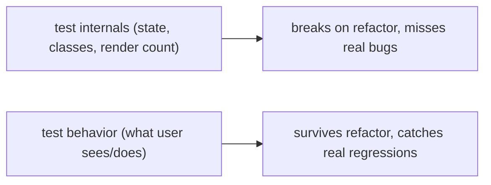

## Problem

Your test suite breaks every time you refactor. You rename a state variable and twenty tests fail. You swap a div for a section and ten more fail. These tests do not catch real bugs. They just make you afraid to change code. The team stops refactoring. Technical debt piles up. Shipping slows down.

## Why Existing Solution Failed

The old approach tested implementation details. Tests checked internal state with `wrapper.state('isOpen')`. They checked CSS classes with `wrapper.find('.dropdown-inner')`. They snapshot entire component trees. None of this tests what the user experiences. These tests pass when the UI is broken and fail when the UI works fine. They give false confidence with high maintenance cost.

The test pyramid said write lots of unit tests, some integration tests, and a few e2e tests. For UI code this is wrong. Unit tests for components are brittle. They test rendering, not behavior. The pyramid misses the real confidence zone.

## Mental Model

Test BEHAVIOR at a boundary, not implementation details. Pick the boundary a real consumer sees. For a component that is what the USER sees and does, rendered output and interactions. For a module that is its public API. Tests coupled to internals, state names, private methods, render counts, break on every refactor and test nothing real. The goal is confidence per unit of maintenance. A test should fail when the behavior breaks and only then.

## Visualization



The testing trophy shows where to invest:

```
        /\        e2e (Playwright/Cypress): real browser, whole flows.
       /  \       High confidence, slow/flaky/expensive. Few, critical paths.
      /----\
     /      \     INTEGRATION (RTL + MSW): components plus real interactions plus mocked network.
    /        \    Best confidence per cost. The bulk of UI tests.
   /----------\
  /            \  unit: pure functions, hooks, utils. Fast, cheap. Many, for logic.
 /--------------\
  static: TypeScript and ESLint (catch whole class of bugs for free)
```

## Engine Simulation

```jsx
test("submitting the form shows a success message", async () => {
  render(<ContactForm />);
  await userEvent.type(screen.getByLabelText(/email/i), "ada@x.com");
  await userEvent.click(screen.getByRole("button", { name: /save/i }));
  expect(await screen.findByText(/saved/i)).toBeInTheDocument();
});
```

Why this test is strong: it names elements the way a user does, the label "Email", the button "Save". It uses real interactions with `userEvent`. It asserts visible output. Rename a state variable, swap a div for a section, or refactor to a hook. The test still passes because the behavior is unchanged.

Internally, RTL uses DOM testing library utilities. `getByLabelText` finds the input by searching for a label element with matching text. It uses the `htmlFor` attribute or `aria-labelledby` to find the associated input. It does not care about your CSS class or component structure. `findByText` uses a combination of text content matching and waits up to a default timeout of 1000ms using a polling mechanism. It retries every 50ms until the element appears or the timeout expires. This is why async content works: the test waits for the data to arrive and render.

## Internal Implementation

RTL query priority, most preferred first:

1. **Role**: `getByRole('button', { name: /save/i })`. Looks up the accessible role computed from the element. This tests accessibility and behavior together.
2. **Label**: `getByLabelText(/email/i)`. Finds an input by its associated label. Matches how screen readers navigate.
3. **Text**: `getByText(/saved/i)`. Finds by visible text content.
4. **Test ID**: `getByTestId('submit-btn')`. Last resort when nothing user-facing fits.

`findBy*` is async. It returns a promise that resolves when the element appears. Internally, it uses `waitFor` which runs the query in a loop checking every 50ms. This is essential for data that arrives after a fetch.

`getBy*` is sync. It throws if the element is not found immediately. Use it for elements that must exist now.

`queryBy*` is sync. It returns null instead of throwing. Use it for asserting absence.

MSW (Mock Service Worker) intercepts requests at the network layer. In test environments it uses a polyfill that intercepts at the `fetch` or `XMLHttpRequest` level. The code never knows it is talking to a mock. This is better than stubbing your own `api.getContacts` function because stubbing skips the real code path. MSW tests the actual integration with a controlled server.

## Real World Example

A contacts list that fetches from an API. The test must cover loading, success, and error states.

```js
const server = setupServer(
  http.get("/contacts", () => HttpResponse.json([{ id: 1, name: "Ada" }]))
);

beforeAll(() => server.listen());
afterEach(() => server.resetHandlers());
afterAll(() => server.close());

test("renders contacts from the API", async () => {
  render(<Contacts />);
  expect(await screen.findByText("Ada")).toBeInTheDocument();
});

test("shows error when API fails", async () => {
  server.use(http.get("/contacts", () => HttpResponse.error()));
  render(<Contacts />);
  expect(await screen.findByText(/error/i)).toBeInTheDocument();
});
```

Internally, MSW uses a Service Worker in the browser to intercept fetch requests at the network level. The real `fetch` function runs. The request never reaches the server. The response comes from the handler. This tests loading, success, and error paths through the actual data fetching code including TanStack Query, error boundaries, and retries.

## Tradeoffs

| Approach | Confidence | Cost | Best for |
|---|---|---|---|
| Static (TS, ESLint) | Medium | Near zero | Catching type errors and null bugs |
| Unit | High per bug | Low | Pure logic: reducers, formatters, validators |
| Integration (RTL + MSW) | Highest per cost | Medium | Feature-level UI: forms, lists, search |
| E2E (Playwright) | Highest overall | High (slow, flaky) | Critical journeys: login, checkout, signup |

The old pyramid said mostly unit tests. The testing trophy says mostly integration for UI. That is where real confidence lives for component apps. E2E is too slow and flaky for everything. Unit tests do not catch UI bugs. Integration tests hit the sweet spot.

## Common Mistakes

- Asserting internal state, render counts, or CSS classes. This makes tests brittle and hostile to refactors.
- Mocking your own functions instead of the network. This tests the mock, not the code.
- Using `getBy` for async content. It throws before the content arrives. Use `findBy` instead.
- Over-investing in e2e. This creates slow, flaky suites that people start ignoring.
- Snapshot tests of everything. This creates noise. Snapshots assert structure, not behavior.

## SDE-2 Interview Answer

**Mid-level variant:**

"I write tests that assert behavior, not implementation. I use React Testing Library and query by role or label, not by CSS class. I mock the network with MSW so the real data fetching code runs. For a form, I render it, type into the email field using getByLabelText, click save using getByRole, and assert the success message appears with findByText. This test survives refactors because it tests what the user sees and does."

**Senior variant:**

"I choose the testing strategy by confidence per cost. Static analysis and unit tests cover pure logic. The bulk of my UI tests are integration tests with RTL and MSW. These give the best confidence per dollar. E2E is reserved for three to five critical user journeys because it is slow and flaky. I do not snapshot entire components. I do not assert internal state. I treat the testing trophy as my guide: static base, unit for logic, heavy integration, light e2e."

**Engineering Lead variant:**

"I establish testing standards for the team. The rule is simple: test behavior at a consumer boundary. For components that boundary is the rendered output and user interaction. For modules it is the public API. I enforce this in code review. If a test asserts internal state I ask the author to rewrite it. I push the team to use MSW for network mocking instead of stubbing. This keeps the test suite fast and reliable. I measure test quality by whether a refactor breaks the tests. If tests break on behavior-preserving changes we have a coupling problem."

## Follow-up Questions

1. Rewrite an implementation-coupled test as a behavior test. Why does the new one survive a refactor?
2. RTL query priority: why role first and test-id last? What does each query actually search in the DOM?
3. Why mock with MSW instead of stubbing `api.getX`? What code path does each approach cover?
4. Place these on the trophy: a date formatter, a checkout flow, a search-and-filter feature. Justify each.
5. `getBy` vs `findBy` vs `queryBy`: when do you use each? What happens internally when you pick the wrong one?

## Mental Trigger

Test what the user sees and does.

## One Page Revision

- Test behavior at a consumer boundary, not implementation.
- RTL queries like a user: role first, label second, text third, test-id last.
- Use `findBy` for async content. `getBy` for sync content. `queryBy` for absence.
- Mock real boundaries (network via MSW), not your own internals.
- Testing trophy: static base, unit for logic, heavy integration, light e2e.
- Integration tests give best confidence per cost for UI.
- A test survives refactors when it asserts behavior, not structure.
- E2E is for critical journeys only.
