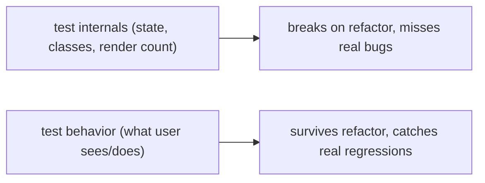

## The Problem You Already Know

You rename a variable. Twenty tests break. You swap a `<div>` for a `<section>`. Ten more break. None of these tests caught a real bug — they just made you afraid to touch the code. The team stops refactoring. Technical debt piles up. Shipping slows to a crawl.

Sound familiar? You're not alone. Most teams are stuck here.

## Why the Old Approach Failed

Here's what happened: we tested the wrong things. We checked internal state with `wrapper.state('isOpen')`. We hunted for CSS classes with `wrapper.find('.dropdown-inner')`. We snapshotted entire component trees and prayed they didn't change.

None of that tests what the user actually experiences. These tests pass when the UI is broken. They fail when the UI works fine. They give false confidence with brutal maintenance costs.

Then someone introduced the "test pyramid" — lots of unit tests at the bottom, fewer integration tests, a handful of e2e at the top. For UI code, that pyramid is upside down. Unit tests for components are brittle. They test rendering, not behavior. The pyramid was designed for backend services, not React apps.

## Mental Model

**Test the behavior at a boundary, not the machinery underneath.**

Think of it like testing a vending machine. You don't open the back panel and check if the gears turn correctly. You put in a dollar, press B3, and expect a soda to drop. That's the behavior. That's the boundary. If the soda drops, the internals don't matter — someone can rewrite the entire mechanism and your test still passes.

For a React component, the boundary is what the user sees and does: the rendered output and the interactions. For a module, the boundary is its public API. Tests coupled to internals — state names, private methods, render counts — break on every refactor and test nothing real.

The goal is confidence per unit of maintenance. A test should fail when the behavior breaks, and only then.

## Visualization



The testing trophy shows where to invest:

```
        /\        e2e (Playwright/Cypress): real browser, whole flows.
       /  \       High confidence, slow/flaky/expensive. Few, critical paths.
      /----\
     /      \     INTEGRATION (RTL + MSW): components plus real interactions plus mocked network.
    /        \    Best confidence per cost. The bulk of UI tests.
   /----------\
  /            \  unit: pure functions, hooks, utils. Fast, cheap. Many, for logic.
 /--------------\
  static: TypeScript and ESLint (catch whole class of bugs for free)
```

## Engine Simulation

Let's see what a behavior-driven test looks like:

```jsx
test("submitting the form shows a success message", async () => {
  render(<ContactForm />);
  await userEvent.type(screen.getByLabelText(/email/i), "ada@x.com");
  await userEvent.click(screen.getByRole("button", { name: /save/i }));
  expect(await screen.findByText(/saved/i)).toBeInTheDocument();
});
```

Why this test is strong: it names elements the way a user does — the label "Email", the button "Save". It uses real interactions with `userEvent`. It asserts visible output. Rename a state variable, swap a div for a section, or refactor to a hook — the test still passes because the behavior hasn't changed.

Under the hood, RTL uses DOM testing library utilities. `getByLabelText` finds the input by searching for a label element with matching text, using the `htmlFor` attribute or `aria-labelledby` to find the associated input. It doesn't care about your CSS class or component structure. `findByText` uses text content matching and waits up to 1000ms by default, polling every 50ms until the element appears. That's why async content works — the test waits for the data to arrive and render.

## Internal Implementation

RTL query priority, most preferred first:

1. **Role**: `getByRole('button', { name: /save/i })`. Looks up the accessible role computed from the element. This tests accessibility and behavior together.
2. **Label**: `getByLabelText(/email/i)`. Finds an input by its associated label. Matches how screen readers navigate.
3. **Text**: `getByText(/saved/i)`. Finds by visible text content.
4. **Test ID**: `getByTestId('submit-btn')`. Last resort when nothing user-facing fits.

`findBy*` is async. It returns a promise that resolves when the element appears. Internally, it uses `waitFor` which runs the query in a loop checking every 50ms. This is essential for data that arrives after a fetch.

`getBy*` is sync. It throws if the element is not found immediately. Use it for elements that must exist now.

`queryBy*` is sync. It returns null instead of throwing. Use it for asserting absence.

MSW (Mock Service Worker) intercepts requests at the network layer. In test environments it uses a polyfill that intercepts at the `fetch` or `XMLHttpRequest` level. The code never knows it's talking to a mock. This is better than stubbing your own `api.getContacts` function because stubbing skips the real code path. MSW tests the actual integration with a controlled server.

## Real World Example

A contacts list that fetches from an API. The test must cover loading, success, and error states:

```js
const server = setupServer(
  http.get("/contacts", () => HttpResponse.json([{ id: 1, name: "Ada" }]))
);

beforeAll(() => server.listen());
afterEach(() => server.resetHandlers());
afterAll(() => server.close());

test("renders contacts from the API", async () => {
  render(<Contacts />);
  expect(await screen.findByText("Ada")).toBeInTheDocument();
});

test("shows error when API fails", async () => {
  server.use(http.get("/contacts", () => HttpResponse.error()));
  render(<Contacts />);
  expect(await screen.findByText(/error/i)).toBeInTheDocument();
});
```

MSW uses a Service Worker in the browser to intercept fetch requests at the network level. The real `fetch` function runs. The request never reaches the server. The response comes from the handler. This tests loading, success, and error paths through the actual data fetching code — including TanStack Query, error boundaries, and retries.

## Testing Strategies: Where to Test What

The question isn't whether to test — it's where to spend your limited time. Each level of the trophy has a job, and confusing them wastes effort.

**Unit tests** cover isolated logic — a reducer, a date formatter, a price calculator, a custom hook that transforms data. No DOM, no network, no component tree. They run in milliseconds. They catch logic bugs fast.

```ts
// Unit test: pure logic, no React
test("formatPrice adds dollar sign and two decimals", () => {
  expect(formatPrice(42)).toBe("$42.00");
  expect(formatPrice(1234.5)).toBe("$1,234.50");
  expect(formatPrice(0)).toBe("$0.00");
});
```

**Integration tests** compose multiple units — a component with its children, a form with validation, a list with filtering. They use the real DOM via RTL. They mock the network with MSW, not your own functions. They catch interaction bugs: "the form validates but doesn't show the error message."

**E2E tests** run in a real browser against a running app. They cover critical journeys — login, checkout, signup. They catch infrastructure bugs: routing, cookies, third-party scripts. They are slow and flaky. Use them sparingly.

The **ice cream cone** is the anti-pattern: many e2e tests, few unit tests, almost no integration. It's expensive, slow, and gives false confidence (the cone looks solid until it melts). The **testing trophy** inverts this: heavy integration, moderate unit, light e2e, static analysis at the base.

**What to test at each level:**

| Level | Test these | Don't test these |
|---|---|---|
| Unit | Reducers, formatters, validators, utility functions, hooks with pure logic | Components, anything with DOM, anything with side effects |
| Integration | Component rendering, user interactions, form submissions, data display, error states | Internal state, CSS classes, render counts |
| E2E | Login flow, checkout, signup, critical multi-page journeys | Individual components, edge cases, validation logic |

## React Testing Library Patterns

RTL has a vocabulary. Master it and you write tests that read like user stories.

**Query priority matters.** RTL's docs define a priority order — not because of arbitrary rules, but because each query tests a different contract:

```jsx
// 1. Role — tests accessibility. If this passes, the element has the right role.
screen.getByRole("button", { name: /submit/i });

// 2. Label — tests form accessibility. Screen readers use this.
screen.getByLabelText(/email/i);

// 3. Text — tests visible content. Good for status messages.
screen.getByText(/saved successfully/i);

// 4. Test ID — last resort. Tests nothing about the user experience.
screen.getByTestId("submit-button");
```

**`fireEvent` vs `userEvent`:** `fireEvent.click(element)` dispatches a single synthetic event. `userEvent.click(element)` simulates the full browser sequence: `pointerDown`, `mouseDown`, `pointerUp`, `mouseUp`, `click`. It also focuses the element, handles disabled states, and respects `event.preventDefault`. Always prefer `userEvent` — it catches bugs that `fireEvent` misses.

```jsx
// ❌ fireEvent — misses focus management, disabled states
fireEvent.change(input, { target: { value: "hello" } });

// ✅ userEvent — simulates real typing, handles focus
await userEvent.type(input, "hello");
```

**Async queries:** `findBy*` is the async variant of `getBy*`. It waits for an element to appear (default 1000ms, polling every 50ms). Essential for data fetched after render. `getBy*` throws immediately if the element isn't in the DOM — you'll get cryptic "unable to find" errors on async content.

```jsx
// ❌ This throws because data hasn't loaded yet
expect(screen.getByText("Ada")).toBeInTheDocument();

// ✅ This waits for the data to arrive
expect(await screen.findByText("Ada")).toBeInTheDocument();
```

**`waitFor` for non-query assertions:** Sometimes you need to wait for something that isn't a DOM query — like a function to have been called, or a state update to propagate:

```jsx
await waitFor(() => {
  expect(mockHandler).toHaveBeenCalledWith({ email: "ada@x.com" });
});
```

`waitFor` runs the callback repeatedly until it stops throwing or times out. It's slower than `findBy` — prefer `findBy` for DOM assertions.

## Mocking Patterns

Mocking is a spectrum. The goal is to control boundaries you don't own, not to replace the code you're testing.

**`jest.fn()` — the spy:** Records calls, arguments, and return values. Use it to assert that something happened:

```jsx
const handleSubmit = jest.fn();
render(<Form onSubmit={handleSubmit} />);
await userEvent.click(screen.getByRole("button", { name: /save/i }));
expect(handleSubmit).toHaveBeenCalledWith({ email: "ada@x.com" });
```

**`jest.mock()` — the module mock:** Replaces an entire module. Use sparingly — it replaces all exports, which means you lose the real implementation. If you mock a utility function, you're no longer testing that it works correctly.

```jsx
// ⚠️ This replaces ALL of utils — including functions you didn't intend to mock
jest.mock("./utils");
```

**Partial mocking:** Mock only what you need while keeping the rest real:

```jsx
// ✅ Mock one export, keep the module's other exports real
jest.mock("./api", () => ({
  ...jest.requireActual("./api"),
  getContacts: jest.fn(),
}));
```

**MSW — the right boundary to mock:** MSW intercepts at the network layer. The real `fetch` runs. Your real API client code runs. Only the server response is controlled. This tests the full stack from your component through your data-fetching logic:

```jsx
// MSW handler: controls the network boundary
http.get("/api/contacts", () => HttpResponse.json(contacts));

// What this tests:
// 1. Your component renders
// 2. Your useEffect triggers
// 3. Your fetch call runs
// 4. Your error handling runs
// 5. Your loading state renders
// 6. Your success state renders
```

Compare with `jest.mock("./api")` — that skips steps 3-5 entirely. You're testing the mock, not the code.

**Common mocking mistake:** Mocking too much. If you mock the network, your own API client, your own utility functions, and your own state management — what's left to test? The test assertions. Mock boundaries you don't control (network, third-party SDKs). Let your own code run.

## Testing Hooks: renderHook

Custom hooks encapsulate logic that would otherwise live in components. Testing them directly avoids wrapping them in throwaway test components.

`renderHook` renders a hook outside a component tree. It returns `result.current` (the hook's return value) and a `rerender` function:

```jsx
import { renderHook, act } from "@testing-library/react";

test("useCounter increments", () => {
  const { result } = renderHook(() => useCounter(0));

  act(() => result.current.increment());
  expect(result.current.count).toBe(1);

  act(() => result.current.increment());
  expect(result.current.count).toBe(2);
});
```

**Hooks that depend on context** need a wrapper:

```jsx
test("useAuth returns user from AuthProvider", () => {
  const wrapper = ({ children }) => (
    <AuthProvider>
      <QueryClientProvider client={queryClient}>
        {children}
      </QueryClientProvider>
    </AuthProvider>
  );

  const { result } = renderHook(() => useAuth(), { wrapper });
  expect(result.current.user).toEqual({ name: "Ada" });
});
```

**When to test hooks directly vs as integration:** If the hook is pure logic (a reducer, a transformer), test it directly with `renderHook`. If the hook orchestrates side effects (fetching, subscriptions, DOM manipulation), test it through a component — the component is the real boundary. Don't test `useFetch` in isolation; render a component that uses it and test the output.

**Common mistake:** Testing hook internals instead of behavior. If your hook returns `{ count, increment }`, test that calling `increment` changes `count`. Don't test the `useState` calls inside — that's implementation detail.

## Testing Forms

Forms are where most bugs live: validation logic, submission handling, error display, field interactions.

**Controlled inputs:** Type into fields the way a user does — via `userEvent.type`. Don't set `value` directly (that bypasses React's event system):

```jsx
test("validates email on submit", async () => {
  render(<SignupForm />);

  await userEvent.type(screen.getByLabelText(/email/i), "not-an-email");
  await userEvent.click(screen.getByRole("button", { name: /sign up/i }));

  expect(screen.getByText(/invalid email/i)).toBeInTheDocument();
});
```

**Validation timing:** Some validation runs on blur, some on change, some on submit. Test each path:

```jsx
// On blur validation
test("shows error when email field loses focus with invalid value", async () => {
  render(<SignupForm />);
  const email = screen.getByLabelText(/email/i);
  await userEvent.type(email, "bad");
  await userEvent.tab(); // triggers blur
  expect(screen.getByText(/invalid email/i)).toBeInTheDocument();
});

// On change validation (real-time)
test("shows error immediately while typing", async () => {
  render(<SignupForm />);
  await userEvent.type(screen.getByLabelText(/email/i), "bad");
  expect(screen.getByText(/invalid email/i)).toBeInTheDocument();
});
```

**Submission with network:** Use MSW to control the API response. Test loading state, success state, and error state:

```jsx
test("submits form and shows success", async () => {
  server.use(
    http.post("/api/signup", () => HttpResponse.json({ success: true }))
  );

  render(<SignupForm />);
  await userEvent.type(screen.getByLabelText(/email/i), "ada@x.com");
  await userEvent.type(screen.getByLabelText(/password/i), "secret123");
  await userEvent.click(screen.getByRole("button", { name: /sign up/i }));

  expect(await screen.findByText(/welcome/i)).toBeInTheDocument();
});
```

**Disabled button during submission:** Verify the button is disabled while the request is in flight — prevents double-submits:

```jsx
test("disables submit button while request is pending", async () => {
  server.use(
    http.post("/api/signup", () => new Promise(() => {})) // never resolves
  );

  render(<SignupForm />);
  await userEvent.type(screen.getByLabelText(/email/i), "ada@x.com");
  await userEvent.click(screen.getByRole("button", { name: /sign up/i }));

  expect(screen.getByRole("button", { name: /sign up/i })).toBeDisabled();
});
```

## Testing Error Boundaries

Error boundaries catch rendering errors. Testing them requires triggering an actual render error — not just an incorrect prop.

**The problem:** You can't just throw in a test. You need a component that throws during render. Create a minimal component that always throws:

```jsx
function ThrowingComponent() {
  throw new Error("Test error");
}

test("error boundary catches render errors", () => {
  // Suppress the expected console.error from the thrown error
  const spy = jest.spyOn(console, "error").mockImplementation(() => {});

  render(
    <ErrorBoundary>
      <ThrowingComponent />
    </ErrorBoundary>
  );

  expect(screen.getByText(/something went wrong/i)).toBeInTheDocument();
  expect(screen.queryByText(/ThrowingComponent/)).not.toBeInTheDocument();

  spy.mockRestore();
});
```

**Testing the fallback UI:** The boundary should show a fallback message, not the broken component. Assert the fallback is present and the crashed component is gone:

```jsx
test("shows fallback UI and hides crashed component", () => {
  const spy = jest.spyOn(console, "error").mockImplementation(() => {});

  render(
    <ErrorBoundary fallback={<p>Custom error message</p>}>
      <ThrowingComponent />
    </ErrorBoundary>
  );

  expect(screen.getByText(/custom error message/i)).toBeInTheDocument();
  spy.mockRestore();
});
```

**Testing recovery:** Some error boundaries have a "Try Again" button. Test that clicking it re-renders the children:

```jsx
test("try again re-renders children", async () => {
  let shouldThrow = true;
  function ConditionalThrower() {
    if (shouldThrow) throw new Error("fail");
    return <p>Working</p>;
  }

  const spy = jest.spyOn(console, "error").mockImplementation(() => {});

  render(
    <ErrorBoundary>
      <ConditionalThrower />
    </ErrorBoundary>
  );

  shouldThrow = false;
  await userEvent.click(screen.getByRole("button", { name: /try again/i }));
  expect(screen.getByText(/working/i)).toBeInTheDocument();

  spy.mockRestore();
});
```

**Common mistake:** Mocking `console.error` but forgetting to restore it. This leaks between tests and hides real errors. Always use `spy.mockRestore()` in an `afterEach` or at the end of the test.

## Contract Testing: Microservices Agreement

Unit and integration tests verify your code works. Contract tests verify your code works *with another team's code*.

In a microservices architecture, Service A calls Service B. Both are developed by different teams. They agree on a contract: "I will send this shape of request, you will return this shape of response." Contract testing verifies that agreement holds.

**Without contract testing:** Team A's frontend sends `{ userId: "123" }`. Team B's backend expects `{ user_id: "123" }`. Both pass their own tests. Production breaks. Nobody knows until users complain.

**With contract testing:** A contract file describes the expected request/response shape. Both sides test against it. If Team B changes the response shape, their contract test fails before they deploy. If Team A changes the request shape, their contract test fails before they deploy.

**Pact** is the most common contract testing framework. The consumer (frontend) writes a contract: "When I call GET /contacts, I expect a 200 with `[{ id: number, name: string }]`." The provider (backend) verifies it fulfills that contract. If either side breaks the contract, CI fails.

**Why this matters for frontend:** In a microservices world, your frontend is a consumer of multiple APIs. You need to know that when the backend deploys a change, your data-fetching code still works. Contract tests give you that confidence without running full e2e tests against a live backend.

**The mental model:** Contract testing is like a shared API schema, but verified at test time instead of documentation time. It's the "vending machine" analogy at the service level — both sides agree on the interface, and tests verify the contract holds.

## Tradeoffs

| Approach | Confidence | Cost | Best for |
|---|---|---|---|
| Static (TS, ESLint) | Medium | Near zero | Catching type errors and null bugs |
| Unit | High per bug | Low | Pure logic: reducers, formatters, validators |
| Integration (RTL + MSW) | Highest per cost | Medium | Feature-level UI: forms, lists, search |
| E2E (Playwright) | Highest overall | High (slow, flaky) | Critical journeys: login, checkout, signup |

The old pyramid said mostly unit tests. The testing trophy says mostly integration for UI. That's where real confidence lives for component apps. E2E is too slow and flaky for everything. Unit tests don't catch UI bugs. Integration tests hit the sweet spot.

## Common Mistakes

- **Asserting internal state, render counts, or CSS classes.** This makes tests brittle and hostile to refactors.
- **Mocking your own functions instead of the network.** This tests the mock, not the code.
- **Using `getBy` for async content.** It throws before the content arrives. Use `findBy` instead.
- **Over-investing in e2e.** This creates slow, flaky suites that people start ignoring.
- **Snapshot tests of everything.** This creates noise. Snapshots assert structure, not behavior.

## SDE-2 Interview Answer

**Mid-level variant:**

"I write tests that assert behavior, not implementation. I use React Testing Library and query by role or label, not by CSS class. I mock the network with MSW so the real data fetching code runs. For a form, I render it, type into the email field using getByLabelText, click save using getByRole, and assert the success message appears with findByText. This test survives refactors because it tests what the user sees and does."

**Senior variant:**

"I choose the testing strategy by confidence per cost. Static analysis and unit tests cover pure logic. The bulk of my UI tests are integration tests with RTL and MSW. These give the best confidence per dollar. E2E is reserved for three to five critical user journeys because it is slow and flaky. I do not snapshot entire components. I do not assert internal state. I treat the testing trophy as my guide: static base, unit for logic, heavy integration, light e2e."

**Engineering Lead variant:**

"I establish testing standards for the team. The rule is simple: test behavior at a consumer boundary. For components that boundary is the rendered output and user interaction. For modules it is the public API. I enforce this in code review. If a test asserts internal state I ask the author to rewrite it. I push the team to use MSW for network mocking instead of stubbing. This keeps the test suite fast and reliable. I measure test quality by whether a refactor breaks the tests. If tests break on behavior-preserving changes we have a coupling problem."

## Follow-up Questions

1. Rewrite an implementation-coupled test as a behavior test. Why does the new one survive a refactor?

**Implementation-coupled (brittle):**
```jsx
test("dropdown opens when isOpen state is true", () => {
  const { result } = renderHook(() => useDropdown());
  act(() => result.current.setIsOpen(true));
  expect(result.current.isOpen).toBe(true);
  const wrapper = render(<Dropdown />);
  expect(wrapper.container.querySelector('.dropdown-menu')).not.toBeNull();
});
```
This test breaks if you rename `isOpen` to `expanded`, change the CSS class, or extract the dropdown into a compound component. It tests internal state names and DOM structure — implementation details.

**Behavior test (robust):**
```jsx
test("clicking the trigger opens the dropdown menu", async () => {
  render(<Dropdown trigger={<button>Options</button>} />);
  await userEvent.click(screen.getByRole("button", { name: /options/i }));
  expect(screen.getByRole("menu")).toBeInTheDocument();
  expect(screen.getByRole("menuitem", { name: /edit/i })).toBeInTheDocument();
});
```
This test survives refactoring because it asserts what the user sees and does: click a button, see a menu. Rename the state, swap the CSS class, extract to a hook — the test still passes because the behavior hasn't changed. It queries by role and text (user-visible), not by class names or state variables (implementation details).

2. RTL query priority: why role first and test-id last? What does each query actually search in the DOM?

RTL's priority order maps to how accessible the element is to assistive technology. **Role** (`getByRole`) queries the computed ARIA role. If this passes, a screen reader can find and announce the element correctly. It tests accessibility and behavior simultaneously. **Label** (`getByLabelText`) searches for a `<label>` element whose `for` attribute or `aria-labelledby` points to the target input. This tests form accessibility — screen readers use labels to announce inputs. **Text** (`getByText`) searches visible text content. Good for status messages and headings, but doesn't test accessibility semantics. **Test ID** (`getByTestId`) searches for a `data-testid` attribute. It tests nothing about the user experience — it's a raw DOM query that can pass even if the element is invisible, inaccessible, or mislabeled. The priority exists because each query tests a different contract with the user. Role-first forces you to build accessible components. Test-id last is the escape hatch when nothing user-facing fits.

3. Why mock with MSW instead of stubbing `api.getX`? What code path does each approach cover?

Stubbing `api.getX` replaces the entire function with a mock. The test calls the mock directly — it never runs the real `fetch`, the real URL construction, the real error handling, or the real response parsing. You're testing the mock's return value, not your code. If the API response shape changes, the stub still returns the old shape and the test passes — but production breaks.

MSW intercepts at the network layer. The real `fetch` function runs. Your real API client constructs the real URL, sends real headers, parses the real response. MSW returns a controlled response, but the entire code path from component → hook → fetch → response handling executes. If the API changes a field name, MSW can simulate the new shape and your test catches the break. MSW tests the integration between your component, your data-fetching logic, and the network boundary — not just the assertion.

4. Place these on the trophy: a date formatter, a checkout flow, a search-and-filter feature. Justify each.

**Date formatter → Unit test.** Pure function, no DOM, no network. `formatDate('2024-01-15')` returns `"January 15, 2024"`. Fast, cheap, many edge cases to cover (timezones, invalid dates, locale formatting). No benefit from integration testing — there's no UI or network involved. **Checkout flow → E2E test.** Multi-page, involves routing, payment forms, cookies, third-party scripts (payment processor), and state that persists across pages. Too many moving parts for integration testing in jsdom. Run in a real browser with Playwright. Cover it once as a critical journey — slow and expensive, but high confidence for the highest-stakes flow. **Search-and-filter feature → Integration test (RTL + MSW).** Component renders, user types in search input, filter checkboxes toggle, results update. MSW returns controlled search results. Test that filtering narrows the list, search debounce works, loading state shows during fetch, empty state appears for no results. This is the sweet spot: real DOM interactions, real component tree, controlled network. Fast enough to run hundreds of times, comprehensive enough to catch interaction bugs.

5. `getBy` vs `findBy` vs `queryBy`: when do you use each? What happens internally when you pick the wrong one?

**`getBy`** is synchronous. It searches the DOM immediately and throws if the element isn't found. Use it for elements that must exist right now — buttons, labels, headings that are in the DOM on render. If you use `getBy` for async content (data fetched after mount), it throws before the data arrives and you get a cryptic "unable to find" error. **`findBy`** is asynchronous. It returns a promise that resolves when the element appears. Internally it uses `waitFor`, polling the DOM every 50ms for up to 1000ms (configurable). Use it for any content that arrives after a fetch, mutation, or timer. If you use `findBy` for content that's already in the DOM, it resolves immediately — no harm, just slightly slower. **`queryBy`** is synchronous and returns `null` instead of throwing. Use it for asserting absence — `expect(screen.queryByText(/error/i)).not.toBeInTheDocument()`. If you use `getBy` for absence, it throws instead of letting you make the assertion. Wrong choice consequences: `getBy` on async content → test fails with misleading error. `findBy` on sync content → works but adds unnecessary async overhead. `queryBy` on present content → returns the element, can't assert presence (use `getBy` or `getByText` instead).

6. Why does `userEvent` catch bugs that `fireEvent` misses? What's the difference in the browser event sequence?

`fireEvent.click(element)` dispatches a single synthetic `click` event. That's it. It doesn't focus the element, doesn't trigger the full pointer/mouse sequence, and doesn't respect disabled states or `event.preventDefault`. `userEvent.click(element)` simulates the complete browser sequence: `pointerDown` → `mouseDown` → `pointerUp` → `mouseUp` → `click`. It also focuses the element first, checks if it's disabled (and skips the event if so), and respects `event.preventDefault`. For typing, the difference is even larger. `fireEvent.change(input, { target: { value: "hello" } })` directly sets the value — bypassing React's synthetic event system and any `onChange` logic that depends on keystroke-by-keystroke events. `userEvent.type(input, "hello")` fires `keyDown`, `keyPress`, `input`, and `keyUp` for each character, just like a real keyboard. This catches bugs where your validation runs on each keystroke, where `keyDown` handlers exist, or where the input's behavior depends on the event sequence. Always prefer `userEvent` — it catches real browser behavior that `fireEvent` skips.

7. You're testing a form with email validation on blur, real-time password strength, and submit validation. Write the test structure for each validation timing.

```jsx
// Email validation on blur
test("shows email error when field loses focus with invalid value", async () => {
  render(<SignupForm />);
  const email = screen.getByLabelText(/email/i);
  await userEvent.type(email, "not-an-email");
  await userEvent.tab(); // triggers blur
  expect(screen.getByText(/invalid email/i)).toBeInTheDocument();
});

// Password strength in real-time (on every keystroke)
test("shows password strength indicator while typing", async () => {
  render(<SignupForm />);
  const password = screen.getByLabelText(/password/i);
  await userEvent.type(password, "weak");
  expect(screen.getByText(/weak/i)).toBeInTheDocument();
  await userEvent.type(password, "Strong1!");
  expect(screen.getByText(/strong/i)).toBeInTheDocument();
});

// Submit validation
test("shows all errors when submitting with invalid fields", async () => {
  render(<SignupForm />);
  await userEvent.type(screen.getByLabelText(/email/i), "bad");
  await userEvent.type(screen.getByLabelText(/password/i), "123");
  await userEvent.click(screen.getByRole("button", { name: /sign up/i }));
  expect(screen.getByText(/invalid email/i)).toBeInTheDocument();
  expect(screen.getByText(/password must be at least 8/i)).toBeInTheDocument();
});
```

Each timing path is a separate test because the trigger and expected behavior differ. Blur validation needs `userEvent.tab()`. Real-time validation asserts after each `type` call. Submit validation fills all fields, clicks submit, and asserts all error messages appear.

8. How do you test an error boundary without mocking `console.error`? What happens if you forget to restore the mock?

Create a component that always throws during render:

```jsx
function ThrowingComponent() {
  throw new Error("Test error");
}

test("error boundary catches render errors", () => {
  const spy = jest.spyOn(console, "error").mockImplementation(() => {});

  render(
    <ErrorBoundary>
      <ThrowingComponent />
    </ErrorBoundary>
  );

  expect(screen.getByText(/something went wrong/i)).toBeInTheDocument();

  spy.mockRestore();
});
```

You must mock `console.error` because React logs the caught error to the console during rendering — without the mock, the test output is flooded with noise. But the critical part is `spy.mockRestore()`. If you forget it, the mock leaks between tests. The next test that logs a legitimate error gets silently swallowed. You'll have tests that pass but hide real bugs. Always restore in an `afterEach` or at the end of the test. The pattern is: mock at the start, restore at the end, no exceptions.

9. When should you test a custom hook with `renderHook` vs rendering it through a component? What's the deciding factor?

The deciding factor is whether the hook is **pure logic** or **orchestrates side effects**. Use `renderHook` when the hook is a pure function — a reducer, a data transformer, a formatter. For example, `usePagination(currentPage, totalPages)` returns `{ pages, hasNext, hasPrev }`. Test it directly: `renderHook(() => usePagination(3, 10))` and assert the return value. No DOM needed. Render through a component when the hook orchestrates side effects — fetching data, subscribing to events, manipulating the DOM. For example, `useFetch(url)` triggers a network request, manages loading/error/success states, and cleans up on unmount. Testing it in isolation with `renderHook` misses the real boundary: the component that uses it. Render a component that calls the hook and test the output — loading spinner appears, data renders, error shows. The component is the real consumer boundary. Don't test `useFetch` internals; test that the component using it behaves correctly.

10. A teammate stubs `api.getContacts` in their tests. The API contract changes and production breaks. Explain why MSW would have caught this and the stub didn't.

The stub replaces `api.getContacts` with a function that returns a hardcoded object. The test calls the stub, gets the mock data, and asserts against it. The test passes. But the stub never runs the real `api.getContacts` function. It doesn't construct the URL, doesn't send the request, doesn't parse the response. When the backend team renames `contacts` to `items` in the response, the stub still returns `{ contacts: [...] }`. The test passes. In production, the real `api.getContacts` gets `{ items: [...] }` and the component tries to read `.contacts` — undefined. Crash.

MSW intercepts at the network layer. The real `api.getContacts` runs, constructs the real URL, sends the real fetch, and MSW returns the new response shape. Your test now fails because the component tries to access `.contacts` on the new response and gets undefined. The test catches the contract change before deployment. MSW tests the actual integration path. The stub tests a mock that bypasses your code entirely.

## Mental Trigger

Test what the user sees and does. Mock boundaries you don't own, not your own code. Use `findBy` for async, `userEvent` over `fireEvent`. Testing trophy: heavy integration, light e2e, unit for pure logic.

## One Page Revision

- Test behavior at a consumer boundary, not implementation.
- RTL queries like a user: role first, label second, text third, test-id last.
- Use `findBy` for async content. `getBy` for sync content. `queryBy` for absence.
- `userEvent` over `fireEvent` — simulates real browser events, catches focus bugs.
- Mock real boundaries (network via MSW), not your own internals. `jest.fn()` for spies, `jest.mock()` sparingly, MSW for network.
- Testing trophy: static base, unit for logic, heavy integration, light e2e.
- Integration tests give best confidence per cost for UI.
- A test survives refactors when it asserts behavior, not structure.
- E2E is for critical journeys only.
- Use `renderHook` for custom hooks; test behavior, not useState calls.
- Forms: test validation timing (blur vs change vs submit), disabled states during submission.
- Error boundaries: trigger with a component that throws, assert fallback UI, restore console mocks.
- Contract testing verifies API agreements between services — prevents "works on my machine" across teams.
- Ice cream cone (many e2e, few integration) is the anti-pattern. Trophy inverts it.
