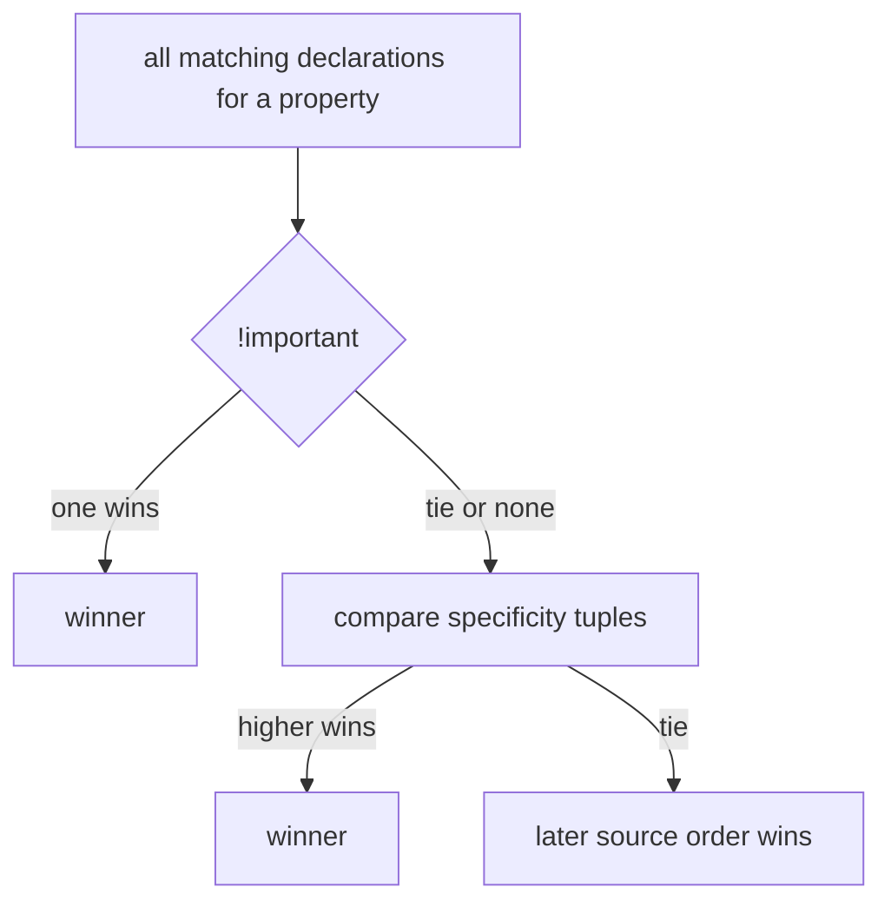

## Problem

You write a CSS rule but it does not apply. Another rule wins and you do not know why. Your width says 100px but the box is 124px. Your z-index is 9999 but the element sits behind something else. These are not browser bugs. They are predictable outcomes of the CSS constraint solver. Most people fight them with `!important` or higher z-index values. Those are hacks, not fixes.

## Why Existing Solution Failed

The old approach was trial and error. Add `!important` until the rule sticks. Keep raising z-index until something shows on top. Use magic numbers for widths. This works temporarily and breaks later. It does not teach you why CSS behaves the way it does. The root causes, the cascade, the box model, and stacking contexts, stay unknown. Every new layout problem becomes a guessing game.

## Mental Model

CSS is a CONSTRAINT SOLVER. The browser computes each box by resolving a cascade of constraints in order: which rule wins (the cascade and specificity), how big the box is (the box model), where it flows (normal flow, flex, or grid), and who paints on top (stacking contexts). Every CSS confusion like "why did this rule lose," "why is my width wrong," or "why won't z-index work" happens because you and the solver disagree about one of those four resolutions.

## Visualization

Cascade resolution order:

```
1. Importance:   !important > normal declarations
2. Specificity:  inline(1,0,0,0) > #id(0,1,0,0) > .class/[attr]/:pseudo-class(0,0,1,0) > element/::pseudo-element(0,0,0,1)
3. Source order: last matching rule wins ties
```



Box model:

```
   ┌─────────── margin (outside, transparent) ───────────┐
   │  ┌──────── border ────────┐                         │
   │  │  ┌───── padding ─────┐ │                         │
   │  │  │   content (w x h)   │ │                         │
   │  │  └───────────────────┘ │                         │
   │  └────────────────────────┘                         │
   └──────────────────────────────────────────────────────┘
```

## Engine Simulation

```html
<div style="position: relative; z-index: 1; opacity: 0.99;">
  <div style="position: relative; z-index: 9999;">A</div>
</div>
<div style="position: relative; z-index: 2;">B</div>
```

A has z-index 9999 but renders BEHIND B (z-index 2). Why? A's z-index only competes within its parent's stacking context. The parent created a stacking context via `opacity less than 1` plus positioned z-index. The whole parent subtree is ordered as one unit at the parent's level (z-index 1). That level is below B (z-index 2). A's 9999 is meaningless across contexts.

Internally, the browser maintains a stacking context tree during the paint phase. Each stacking context has its own z-index ordering. Elements inside a context are sorted and painted relative to each other, but the entire context is treated as a single unit by the parent context. This is why raising the z-index on a child does nothing if the parent is below another element. The paint order is computed after layout. The browser walks the stacking context tree from back to front, painting each context's contents as a group.

## Internal Implementation

The cascade algorithm in the browser:

1. Collect all declarations that match the element.
2. Sort by importance. `!important` declarations beat normal ones.
3. Sort by specificity as a tuple `(inline, ids, classes, elements)`. Compare left to right. `#nav a` equals `(0,1,0,1)`. `.menu .link a` equals `(0,0,2,1)`. The first tuple wins because ids column is higher.
4. If specificity is equal, the declaration that appears later in source order wins.

The box model computation:

- `box-sizing: content-box` (default): `width` sets the content area width. Padding and border add on top. A 100px width with 10px padding and 2px border becomes 124px total (100 + 10*2 + 2*2).
- `box-sizing: border-box`: `width` includes padding and border. The same element stays exactly 100px. Content area shrinks to 76px (100 minus 10*2 minus 2*2).

Margin collapse: adjacent vertical margins in normal flow merge to the larger value. Two boxes with 20px and 30px margins have a 30px gap, not 50px. This happens during layout when the browser computes the box's margin edge. Flex and grid items do not collapse margins because they establish new formatting contexts.

Stacking context creation: the browser creates a new stacking context for certain properties. This includes `opacity less than 1`, `transform`, `filter`, `will-change`, `position: fixed/sticky`, a positioned element with a z-index, and `isolation: isolate`. The context isolates its children from the parent stacking order.

Flexbox layout: the browser distributes space along one axis. It checks `flex-direction` to determine the main axis. It places items according to `justify-content` (main axis) and `align-items` (cross axis). Each item's `flex: grow shrink basis` determines how it takes or gives space. The algorithm subtracts the total basis from available space, then distributes the remainder proportionally by grow factors.

Grid layout: the browser creates a grid of rows and columns from the template definitions. It places items into cells using line-based placement or auto-placement. The algorithm computes column widths and row heights from the template, gaps, and content.

## Real World Example

A navigation bar with a dropdown menu. The nav has `position: relative; z-index: 10`. The dropdown has `position: absolute; z-index: 9999`. A modal overlay appears with `position: fixed; z-index: 100`. The dropdown appears behind the overlay even though its z-index is higher.

The fix: understand stacking contexts. The dropdown's z-index is only meaningful inside the nav's stacking context. The modal creates a new stacking context at the root level.

```css
/* Problem: dropdown behind modal */
.nav { position: relative; z-index: 10; }
.dropdown { position: absolute; z-index: 9999; }
.modal-overlay { position: fixed; z-index: 100; }

/* Fix: modal must be above nav context */
.modal-overlay { position: fixed; z-index: 1000; }
/* Or remove the stacking context from nav */
.nav { position: relative; /* no z-index */ }
/* Or use isolation to create a fresh stacking context for modal */
.modal-overlay { isolation: isolate; z-index: 100; }
```

Internally, when the browser paints, it creates a paint order list. Elements without a stacking context are painted in standard CSS order: background, borders, positioned descendants. Elements with a stacking context are painted as a group at their position in the parent's paint order. The z-index values only sort elements within the same context.

## Tradeoffs

| Approach | When to use | Cost |
|---|---|---|
| Specificity with low-specificity selectors | Maintainable, easy to override | More classes in markup |
| Specificity with `!important` | Quick emergency fix | Hard to override later, breaks cascade |
| `content-box` | When you need exact content sizing | Box renders wider than width |
| `border-box` | Most layouts, predictable sizing | Content shrinks to accommodate border |
| Flexbox | 1-D layouts, content-driven distribution | Wrong tool for 2-D grids |
| Grid | 2-D layouts, template-driven placement | Overkill for simple rows |
| Single stacking context | Simple z-index management | Cannot isolate complex widgets |
| Multiple stacking contexts | Isolate component paint order | Children cannot escape their context |

## Common Mistakes

- Fighting specificity with `!important` instead of lowering selector specificity.
- Bumping z-index higher when the real problem is a stacking context boundary.
- Forgetting `box-sizing: border-box` and being surprised by rendered widths.
- Expecting vertical margins to add in normal flow. They collapse to the larger value.
- Using flex for 2-D grids or grid for a simple row. Pick by axis count.
- Creating a stacking context unintentionally with `opacity less than 1`, `transform`, or `filter`.

## SDE-2 Interview Answer

**Mid-level variant:**

"CSS is a constraint solver with four steps: cascade, box model, layout mode, and stacking context. When a rule does not apply I compare specificity as a tuple: inline, id, class, element. The higher tuple wins. If tied, the later rule wins. When a width surprises me I check `box-sizing`. The default `content-box` adds padding and border on top. When z-index fails I look for a parent with `opacity less than 1` or `transform` that creates a stacking context. The child's z-index is sealed inside that context."

**Senior variant:**

"I design CSS systems that minimize specificity battles. I use BEM or similar naming conventions to keep specificity flat. I set `box-sizing: border-box` globally so width means what I expect. I use flex for 1-D layouts and grid for 2-D layouts. I avoid `!important` except for utility classes. When z-index fails I trace the stacking context tree in DevTools instead of raising the number. I teach the team the cascade tuple model so they stop guessing."

**Engineering Lead variant:**

"I establish CSS conventions for the team. We use a consistent methodology like BEM or CSS Modules for scoping. We set `box-sizing: border-box` globally. We avoid `!important` and deep nesting. We use design tokens for colors and spacing instead of hard-coded values. The team knows the cascade resolution order. They know how stacking contexts work. They inspect computed styles and the Layers panel instead of guessing. A rule using `!important` needs a comment explaining why."

## Follow-up Questions

1. Rank these by specificity: `#a .b`, `.b .c .d`, `li`, inline style. Compare the tuple for each.
2. A 200px width box looks 232px wide. Why? Give two fixes using `box-sizing`.
3. Explain a real z-index failure using stacking contexts. Name three properties that create a new context.
4. When do you use flex vs grid? Center a box both ways and explain the difference.
5. Why do vertical margins collapse in normal flow but not in flex or grid? What happens during layout?

## Mental Trigger

CSS is a constraint solver, not a guessing game.

## One Page Revision

- CSS resolves rules in order: importance, specificity tuple, source order.
- Specificity tuple: (inline, id, class, element). Compare left to right.
- `box-sizing: border-box` makes width include padding and border.
- Vertical margins collapse in normal flow (merge to larger value).
- Flex is 1-D distribution. Grid is 2-D template.
- z-index only compares within the same stacking context.
- Stacking contexts created by `opacity less than 1`, `transform`, `filter`, `will-change`, `position: fixed/sticky`, positioned element with z-index, `isolation: isolate`.
- When z-index fails, find the ancestor that created a context. Do not raise the number.
- Use `border-box` globally. Keep specificity flat. Avoid `!important`.
