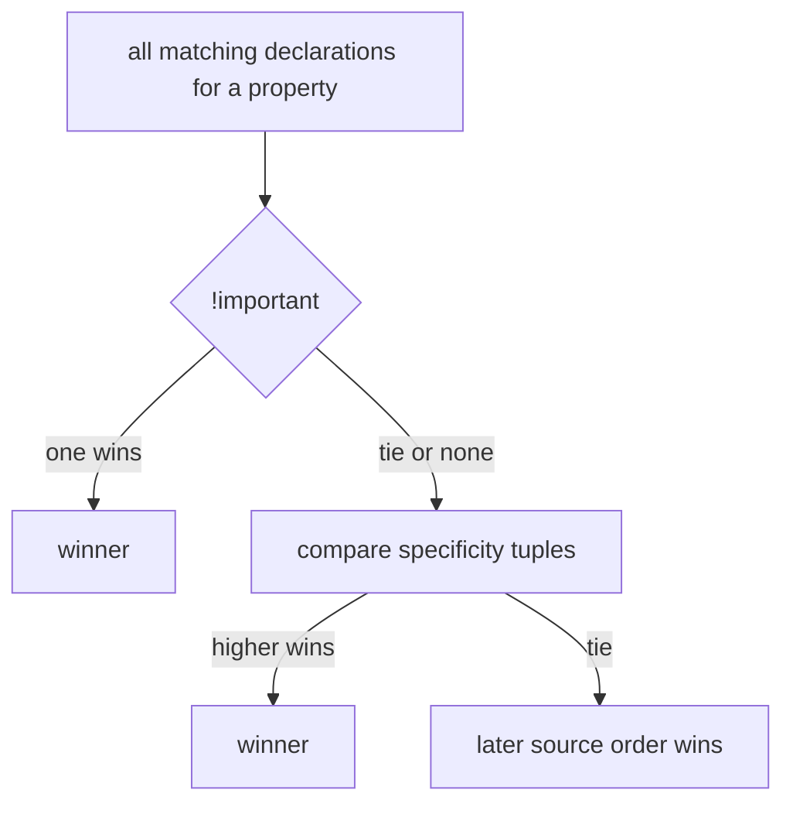

## Problem

You've been there. You add a CSS rule, refresh the page, and nothing changes. You bump the z-index to 9999 and your element still hides behind something else. You set `width: 100px` and the box renders at 124px. So you add `!important`, raise the number higher, and pray.

None of these are bugs. They're predictable outcomes. But you'd never know that from how most people debug CSS — they just throw more specificity at it and hope something sticks.

## Why Existing Solution Failed

Here's what most developers do: trial and error. They slap `!important` on a rule until it wins. They increment z-index from 10 to 100 to 9999. They adjust widths by eye. It "works" until the next feature breaks it, and then you're back to the same game.

The problem isn't that CSS is broken. It's that nobody taught you the rules of the game. The cascade, the box model, the stacking context — these aren't random behaviors. They're a system. And once you see the system, the debugging stops.

## Mental Model

**CSS is a constraint solver.**

Imagine you're solving a puzzle where every piece has four locks on it. The browser has to unlock each one, in order, to figure out what to render:

1. **Which rule wins?** — That's the cascade. It compares specificity tuples.
2. **How big is the box?** — That's the box model. Padding and border do or don't add to your width.
3. **Where does it sit?** — That's the layout mode. Normal flow, flex, or grid.
4. **Who paints on top?** — That's stacking contexts. z-index only works within its own context.

Every CSS confusion — "why did this rule lose," "why is my width wrong," "why won't z-index work" — happens because you and the solver disagree about one of these four resolutions. That's it. Four locks. That's all CSS is doing.

## Visualization

Cascade resolution order:

```
1. Importance:   !important > normal declarations
2. Specificity:  inline(1,0,0,0) > #id(0,1,0,0) > .class/[attr]/:pseudo-class(0,0,1,0) > element/::pseudo-element(0,0,0,1)
3. Source order: last matching rule wins ties
```



Box model:

```
   ┌─────────── margin (outside, transparent) ───────────┐
   │  ┌──────── border ────────┐                         │
   │  │  ┌───── padding ─────┐ │                         │
   │  │  │   content (w x h)   │ │                         │
   │  │  └───────────────────┘ │                         │
   │  └────────────────────────┘                         │
   └──────────────────────────────────────────────────────┘
```

## Engine Simulation

```html
<div style="position: relative; z-index: 1; opacity: 0.99;">
  <div style="position: relative; z-index: 9999;">A</div>
</div>
<div style="position: relative; z-index: 2;">B</div>
```

A has z-index 9999 but renders BEHIND B (z-index 2). Here's why this trips people up.

The parent div created a stacking context because of `opacity: 0.99` plus a positioned element with z-index. That means A's z-index only competes within its parent's context. The whole parent subtree is treated as one unit at the parent's level — z-index 1. B sits at z-index 2. So the parent (with all its children packed inside) gets painted before B. A's 9999 is meaningless across contexts.

Think of it like a filing cabinet. A has a huge sticky note on it saying "put me on top." But the entire drawer is below another drawer on the shelf. The sticky note on the paper inside doesn't matter — the drawer itself is in the wrong spot.

The browser maintains a stacking context tree during the paint phase. Each context has its own z-index ordering. Elements inside are sorted relative to each other, but the whole context is a single unit to its parent. Raising z-index on a child does nothing if the parent is below another element. Paint happens after layout — the browser walks the tree from back to front.

## Internal Implementation

**The cascade algorithm:**

1. Collect all declarations that match the element.
2. Sort by importance. `!important` beats normal.
3. Sort by specificity as a tuple `(inline, ids, classes, elements)`. Compare left to right. `#nav a` is `(0,1,0,1)`. `.menu .link a` is `(0,0,2,1)`. First wins because the ids column is higher — even though `.menu .link a` has more selectors total.
4. If specificity is a tie, the later source order wins.

**Box model computation:**

- `box-sizing: content-box` (default): `width` sets content area width. Padding and border add on top. So 100px width + 10px padding each side + 2px border each side = 124px total.
- `box-sizing: border-box`: `width` includes padding and border. Same element stays 100px. Content shrinks to 76px (100 minus 20 padding minus 4 border).

**Margin collapse:** Adjacent vertical margins in normal flow merge to the larger value. Two boxes with 20px and 30px margins? The gap is 30px, not 50px. This happens during layout when the browser computes the box's margin edge. Flex and grid items don't collapse margins because they establish new formatting contexts.

**Stacking context creation:** The browser creates a new stacking context for: `opacity` less than 1, `transform`, `filter`, `will-change`, `position: fixed/sticky`, a positioned element with a z-index, and `isolation: isolate`. The context isolates its children from the parent stacking order.

**Flexbox layout:** The browser distributes space along one axis. It checks `flex-direction` to determine the main axis, then places items by `justify-content` (main axis) and `align-items` (cross axis). Each item's `flex: grow shrink basis` determines how it takes or gives space. The algorithm subtracts the total basis from available space, then distributes the remainder proportionally by grow factors.

**Grid layout:** The browser creates a grid of rows and columns from template definitions. It places items into cells using line-based placement or auto-placement. Column widths and row heights come from the template, gaps, and content.

## Real World Example

A navigation bar with a dropdown menu. The nav has `position: relative; z-index: 10`. The dropdown has `position: absolute; z-index: 9999`. A modal overlay appears with `position: fixed; z-index: 100`. The dropdown shows up behind the overlay — even though its z-index is way higher.

The fix is understanding stacking contexts. The dropdown's z-index only works inside the nav's stacking context. The modal creates its own context at the root level. So we're comparing the nav context (z-index 10) against the modal context (z-index 100) — the dropdown's 9999 never enters that comparison.

```css
/* Problem: dropdown behind modal */
.nav { position: relative; z-index: 10; }
.dropdown { position: absolute; z-index: 9999; }
.modal-overlay { position: fixed; z-index: 100; }

/* Fix: modal must be above nav context */
.modal-overlay { position: fixed; z-index: 1000; }
/* Or remove the stacking context from nav */
.nav { position: relative; /* no z-index */ }
/* Or use isolation to create a fresh stacking context for modal */
.modal-overlay { isolation: isolate; z-index: 100; }
```

Internally, when the browser paints, it builds a paint order list. Elements without a stacking context are painted in standard CSS order: background, borders, positioned descendants. Elements with a stacking context are painted as a group at their position in the parent's paint order. z-index values only sort elements within the same context.

## Tradeoffs

| Approach | When to use | Cost |
|---|---|---|
| Specificity with low-specificity selectors | Maintainable, easy to override | More classes in markup |
| Specificity with `!important` | Quick emergency fix | Hard to override later, breaks cascade |
| `content-box` | When you need exact content sizing | Box renders wider than width |
| `border-box` | Most layouts, predictable sizing | Content shrinks to accommodate border |
| Flexbox | 1-D layouts, content-driven distribution | Wrong tool for 2-D grids |
| Grid | 2-D layouts, template-driven placement | Overkill for simple rows |
| Single stacking context | Simple z-index management | Cannot isolate complex widgets |
| Multiple stacking contexts | Isolate component paint order | Children cannot escape their context |

## Common Mistakes

- Fighting specificity with `!important` instead of lowering selector specificity.
- Bumping z-index higher when the real problem is a stacking context boundary.
- Forgetting `box-sizing: border-box` and being surprised by rendered widths.
- Expecting vertical margins to add in normal flow. They collapse to the larger value.
- Using flex for 2-D grids or grid for a simple row. Pick by axis count.
- Creating a stacking context unintentionally with `opacity` less than 1, `transform`, or `filter`.

## SDE-2 Interview Answer

**Mid-level variant:**

"CSS is a constraint solver with four steps: cascade, box model, layout mode, and stacking context. When a rule doesn't apply, I compare specificity as a tuple — inline, id, class, element. Higher tuple wins. If tied, the later rule wins. When a width surprises me, I check `box-sizing`. The default `content-box` adds padding and border on top. When z-index fails, I look for a parent with `opacity` less than 1 or `transform` that creates a stacking context. The child's z-index is sealed inside that context."

**Senior variant:**

"I design CSS systems that minimize specificity battles. I use BEM or similar naming conventions to keep specificity flat. I set `box-sizing: border-box` globally so width means what I expect. I use flex for 1-D layouts and grid for 2-D layouts. I avoid `!important` except for utility classes. When z-index fails, I trace the stacking context tree in DevTools instead of raising the number. I teach the team the cascade tuple model so they stop guessing."

**Engineering Lead variant:**

"I establish CSS conventions for the team. We use a consistent methodology like BEM or CSS Modules for scoping. We set `box-sizing: border-box` globally. We avoid `!important` and deep nesting. We use design tokens for colors and spacing instead of hard-coded values. The team knows the cascade resolution order. They know how stacking contexts work. They inspect computed styles and the Layers panel instead of guessing. A rule using `!important` needs a comment explaining why."

## Follow-up Questions

1. Rank these by specificity: `#a .b`, `.b .c .d`, `li`, inline style. Compare the tuple for each.

Ranked highest to lowest: **inline style `(1,0,0,0)`** > **`#a .b` `(0,1,1,0)`** > **`.b .c .d` `(0,0,3,0)`** > **`li` `(0,0,0,1)`**. The specificity tuple is `(inline, ids, classes, elements)`. Inline styles always win because they have a 1 in the first column. `#a .b` has one ID and one class — `(0,1,1,0)`. `.b .c .d` has three classes but no IDs — `(0,0,3,0)`. The ID column beats the class column regardless of count, so `#a .b` wins over `.b .c .d` even though the latter has more selectors. `li` is a single element selector — `(0,0,0,1)` — the lowest possible specificity for a type selector. Ties are broken by source order: the later rule wins when specificity is identical. This is why `!important` exists as the nuclear option — it overrides everything regardless of specificity, but makes future overrides extremely difficult.

2. A 200px width box looks 232px wide. Why? Give two fixes using `box-sizing`.

The default `box-sizing: content-box` means `width` sets only the content area. Padding and border are added on top. If the box has `width: 200px`, `padding: 10px` on each side (20px total), and `border: 6px` on each side (12px total), the rendered width is 200 + 20 + 12 = 232px. The content is 200px, but the box including padding and border is 232px.

**Fix 1: Switch to border-box.**
```css
.box { box-sizing: border-box; width: 200px; }
```
Now `width` includes padding and border. The total box is 200px. Content shrinks to 200 - 20 - 12 = 168px. The box renders exactly where you expect.

**Fix 2: Set the width to account for padding/border.**
```css
.box { width: 188px; } /* 200 - 20 - 12 = 168px content + 20px padding + 12px border = 200px */
```
This works but is fragile — every time you change padding or border, you recalculate. The global fix is better:

```css
*, *::before, *::after { box-sizing: border-box; }
```

3. Explain a real z-index failure using stacking contexts. Name three properties that create a new context.

**The failure:** A nav bar has `position: relative; z-index: 10`. A dropdown inside the nav has `position: absolute; z-index: 9999`. A modal overlay at the root level has `position: fixed; z-index: 100`. The dropdown renders behind the modal even though its z-index is way higher. The dropdown's 9999 never competes with the modal's 100 — they're in different stacking contexts. The nav creates a stacking context (positioned element with z-index), so the entire nav subtree — including the dropdown — is painted as one unit at the nav's z-index level (10). The modal's z-index (100) is in the root stacking context. Comparing 10 vs 100, the modal wins.

**Three properties that create new stacking contexts:**
1. **`opacity` less than 1** — even `opacity: 0.99` creates one. This is the most commonly missed.
2. **`transform`** — any value, even `transform: none` if set explicitly.
3. **`position` with `z-index`** — `position: relative; z-index: 1` creates a context even with z-index of 1.

Others: `filter`, `will-change`, `position: fixed/sticky`, `isolation: isolate`. The fix is to either remove the stacking context from the nav (drop the z-index) or ensure the modal's stacking context is at the same or higher level.

4. When do you use flex vs grid? Center a box both ways and explain the difference.

**Flexbox** is for **one-dimensional** layouts — a single row or a single column. It distributes space along one axis. Use it for nav bars, card rows, centering a single element, and component-level alignment. **Grid** is for **two-dimensional** layouts — rows and columns simultaneously. It defines a template and places items into cells. Use it for page layouts, dashboards, and any layout where you need to control both axes.

**Center a box with flex:**
```css
.container { display: flex; justify-content: center; align-items: center; }
```
`justify-content` centers on the main axis (horizontal by default). `align-items` centers on the cross axis (vertical). Both axes, one declaration each.

**Center a box with grid:**
```css
.container { display: grid; place-items: center; }
```
`place-items: center` is shorthand for `justify-items: center` and `align-items: center`. One line does both axes. Grid also supports `place-content: center` for centering the grid itself within its container.

**The difference:** Flexbox computes layout by distributing free space along one axis after items are placed. Grid computes layout by defining the track structure first, then placing items into cells. Flexbox is content-first (items determine the layout). Grid is layout-first (you define the grid, items fill it). A row of buttons is flex. A dashboard with sidebar + main + header is grid.

5. Why do vertical margins collapse in normal flow but not in flex or grid? What happens during layout?

In normal flow, the browser computes margin edges during layout. Two adjacent block-level elements with `margin-bottom: 20px` and `margin-top: 30px` don't create a 50px gap — the browser collapses them to the larger value (30px). This happens because the browser calculates the margin edge of each box relative to the nearest block-level ancestor, and adjacent margins in the same formatting context merge. It's a design choice to prevent double-spacing between paragraphs and sections.

Flex and grid items establish new formatting contexts. When an element becomes a flex item or grid item, it creates a new Block Formatting Context (BFC). Inside a BFC, margins don't collapse with elements outside it. The flex/grid container becomes the containing block, and margins are resolved independently for each item. So two flex items with `margin-top: 20px` create a 40px total gap (20 + 20), not 20px. This is intentional — in flex and grid layouts, you want precise control over spacing. The `gap` property is the preferred way to add space between flex/grid items, giving you explicit control without margin collapse surprises.

## Mental Trigger

CSS is a constraint solver, not a guessing game.

## One Page Revision

- CSS resolves rules in order: importance, specificity tuple, source order.
- Specificity tuple: (inline, id, class, element). Compare left to right.
- `box-sizing: border-box` makes width include padding and border.
- Vertical margins collapse in normal flow (merge to larger value).
- Flex is 1-D distribution. Grid is 2-D template.
- z-index only compares within the same stacking context.
- Stacking contexts created by `opacity` less than 1, `transform`, `filter`, `will-change`, `position: fixed/sticky`, positioned element with z-index, `isolation: isolate`.
- When z-index fails, find the ancestor that created a context. Do not raise the number.
- Use `border-box` globally. Keep specificity flat. Avoid `!important`.
