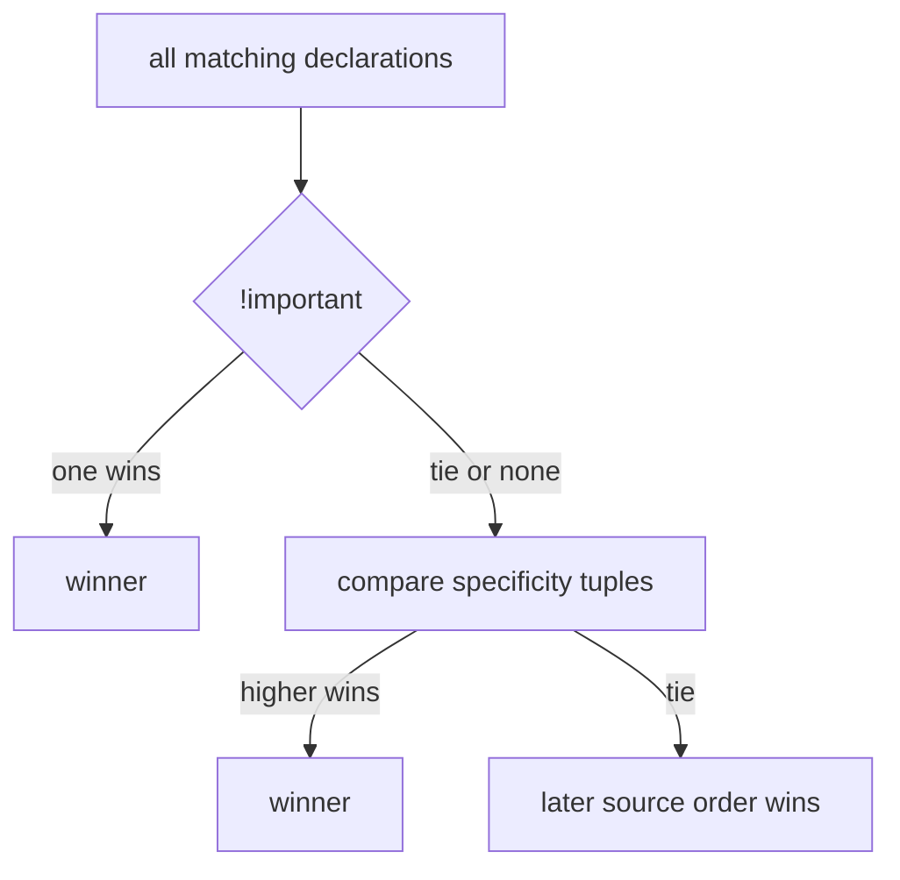

## Why This Matters

You add a CSS rule, refresh, nothing changes. You bump z-index to 9999 and the element still hides behind something else. You set `width: 100px` and the box renders at 124px. So you add `!important`, raise the number higher, and pray.

None of these are bugs. They're predictable outcomes of a system you haven't learned yet. The cascade, the box model, the stacking context — these aren't random. They're a system. Once you see the system, the debugging stops.

## The Core Idea

**CSS is a constraint solver with four steps.**

The browser resolves every element through four locks, in order:

1. **Which rule wins?** — The cascade. Compare specificity tuples.
2. **How big is the box?** — The box model. Padding and border may or may not add to width.
3. **Where does it sit?** — Layout mode. Normal flow, flex, or grid.
4. **Who paints on top?** — Stacking contexts. z-index only works within its own context.

Every CSS confusion — "why did this rule lose," "why is my width wrong," "why won't z-index work" — happens because you and the solver disagree about one of these resolutions.

## The Cascade

```
1. Importance:   !important > normal
2. Specificity:  inline(1,0,0,0) > #id(0,1,0,0) > .class(0,0,1,0) > element(0,0,0,1)
3. Source order: last matching rule wins ties
```



Specificity is a tuple `(inline, ids, classes, elements)`. Compare left to right. `#nav a` is `(0,1,0,1)`. `.menu .link a` is `(0,0,2,1)`. The ID column wins regardless of how many classes the other has. Don't memorize — just compare columns left to right.

## The Box Model

```
   ┌─────────── margin (outside, transparent) ───────────┐
   │  ┌──────── border ────────┐                         │
   │  │  ┌───── padding ─────┐ │                         │
   │  │  │   content (w x h)   │ │                         │
   │  │  └───────────────────┘ │                         │
   │  └────────────────────────┘                         │
   └──────────────────────────────────────────────────────┘
```

Default `box-sizing: content-box` means `width` sets only the content area. Padding and border add on top. A 100px box with 10px padding each side and 2px border each side renders at 124px. This is the single most common CSS surprise.

`box-sizing: border-box` makes `width` include padding and border. Same element stays 100px. Content shrinks to 76px (100 minus 20 padding minus 4 border). Set this globally:

```css
*, *::before, *::after { box-sizing: border-box; }
```

**Margin collapse:** Adjacent vertical margins in normal flow merge to the larger value. Two boxes with 20px and 30px margins? The gap is 30px, not 50px. This is by design — it prevents double-spacing between paragraphs. Flex and grid items don't collapse margins because they establish new formatting contexts.

## Stacking Contexts: Why z-index Fails

```html
<div style="position: relative; z-index: 1; opacity: 0.99;">
  <div style="position: relative; z-index: 9999;">A</div>
</div>
<div style="position: relative; z-index: 2;">B</div>
```

A has z-index 9999 but renders **behind** B (z-index 2). The parent created a stacking context (`opacity: 0.99` + positioned element with z-index). A's 9999 only competes within its parent's context. The whole parent is painted as one unit at z-index 1. B is at z-index 2. B wins.

Think of it like drawers. A has a huge sticky note saying "put me on top." But the entire drawer is below another drawer on the shelf. The sticky note doesn't matter — the drawer itself is in the wrong spot.

**Properties that create stacking contexts:**
- `opacity` less than 1 (even 0.99)
- `transform` (any value)
- `filter`
- `will-change`
- `position: fixed/sticky`
- Positioned element with `z-index`
- `isolation: isolate`

The fix is never to raise the child's number. It's to find the ancestor that created the context and fix the context boundary.

## Flexbox vs Grid

**Flexbox** = 1-dimensional. One row or one column. Distributes space along one axis. Use for nav bars, card rows, centering a single element.

```css
.container { display: flex; justify-content: center; align-items: center; }
```

`justify-content` centers on the main axis (horizontal). `align-items` centers on the cross axis (vertical). Both axes, one declaration each.

**Grid** = 2-dimensional. Rows and columns simultaneously. Define a template, items fill cells. Use for page layouts, dashboards.

```css
.container { display: grid; place-items: center; }
```

`place-items: center` is shorthand for both axes. One line.

**The difference:** Flexbox is content-first — items determine the layout. Grid is layout-first — you define the grid, items fill it. A row of buttons is flex. A dashboard with sidebar + main + header is grid. Pick by axis count.

## Q&A

**1. Why does my z-index not work?**

A parent element created a stacking context. The child's z-index only competes within that context. Check DevTools for parents with `opacity` less than 1, `transform`, or `position` with z-index. Fix the parent's context, not the child's number.

**2. What's the specificity tuple and how do I compare?**

`(inline, ids, classes, elements)`. Compare left to right. Inline `(1,0,0,0)` beats everything. One ID beats any number of classes. Classes beat elements. When specificity is tied, the later source rule wins.

**3. When do margins collapse and when don't they?**

In normal flow, adjacent vertical margins merge to the larger value. In flex and grid, items establish new formatting contexts — margins don't collapse. Use `gap` for explicit spacing in flex/grid.

**4. How do I center a box?**

Flex: `display: flex; justify-content: center; align-items: center;`. Grid: `display: grid; place-items: center;`. Grid is one line. Both work.

## Mental Trigger

**CSS is a constraint solver, not a guessing game.**
