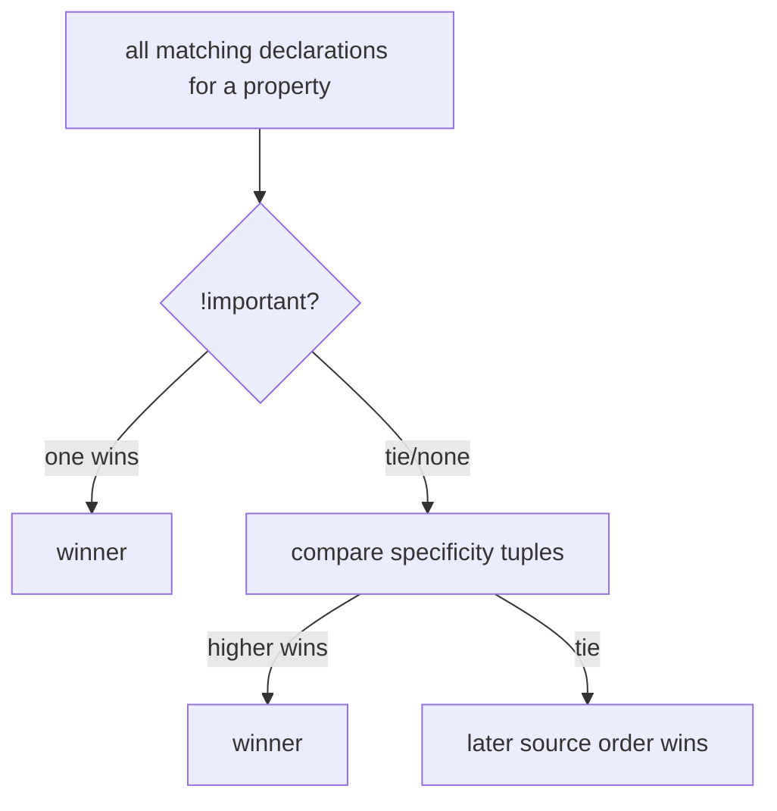

> **Prerequisites:** understanding of the browser render pipeline. This includes the layout and paint phases where the browser computes element positions, sizes, and stacking order.

---

## The one mental model

> **CSS is a CONSTRAINT SOLVER. The browser computes each box by resolving a cascade of
> constraints in order: which rule wins (the cascade and specificity), how big the box is (the box
> model), where it flows (normal flow, flex, or grid), and who paints on top (stacking contexts).
> Every CSS confusion like "why did this rule lose," "why is my width wrong," or "why won't z-index
> work" happens because you and the solver disagree about one of those four resolutions.**

From this you understand specificity outcomes, box-model surprises, how flex/grid place items, and
the real reason z-index fails (a parent created a stacking context). No memorizing. You trace
the solver.

---

## Learning Objectives

1. Resolve "which rule wins" via the cascade + specificity (derive, don't guess).
2. Reason about the box model incl. `box-sizing` and margin collapse.
3. Explain flexbox (1-D) vs grid (2-D) placement at a mental-model level.
4. Explain **stacking contexts**. This is the actual reason z-index behaves "weirdly."

---

## Key Mental Models

- **Cascade order:** importance → specificity → source order. Higher wins.
- **The box is `content + padding + border (+ margin outside)`**. `box-sizing` changes what
  `width` measures.
- **Flex = distribute space along ONE axis; Grid = place into a 2-D template.**
- **z-index only compares within the SAME stacking context.** New contexts are created by many
  common properties.

---

## Introduction

CSS feels random until you see the solver. At SDE-2 the CSS questions are "explain specificity,"
"box-sizing," "center a thing," "flex vs grid," and the classic "z-index: 9999 and it is still
behind something, why." All of these reduce to the constraint-resolution model.

---

## Problem: the cascade and specificity

Many rules can target one element. The browser needs a deterministic winner. The order:

```
1. Importance:   !important  >  normal declarations
2. Specificity:  inline(1,0,0,0) > #id(0,1,0,0) > .class/[attr]/:pseudo-class(0,0,1,0) > element/::pseudo-element(0,0,0,1)
3. Source order: last matching rule wins ties
```



Read specificity as a tuple `(inline, ids, classes, elements)`, compared left to right. `#nav a`
= (0,1,0,1) beats `.menu .link a` = (0,0,2,1) because ids dominate classes. This is *why* your
`.link` rule "lost." It is not random.

---

## Box model & box-sizing

```
   ┌─────────── margin (outside, transparent) ───────────┐
   │  ┌──────── border ────────┐                          │
   │  │  ┌───── padding ─────┐ │                          │
   │  │  │   content (w×h)   │ │                          │
   │  │  └───────────────────┘ │                          │
   │  └────────────────────────┘                          │
   └──────────────────────────────────────────────────────┘
```

- `box-sizing: content-box` (default): `width` equals content only. Padding and border add *on top*. So
  the rendered box is wider than `width`. This is the source of "why is my 100px box 124px."
- `box-sizing: border-box`: `width` includes padding and border. The box is exactly `width`. Most teams
  set this globally. Understand the surprise instead of memorizing.
- **Margin collapse:** adjacent vertical margins merge to the larger one (not the sum) in normal flow.
  This is another "where did my spacing go" moment. Flex and grid items do not collapse margins.

---

## Flexbox vs Grid (the placement model)

- **Flexbox = one axis.** You have a row (or column) of items and distribute free space along it:
  `justify-content` (main axis), `align-items` (cross axis), `flex: grow shrink basis` (how each
  item takes/gives space). Use for toolbars, row of buttons, a centered thing.
- **Grid = two axes.** You define a template of rows/columns and place items into cells:
  `grid-template-columns`, `gap`, line-based placement. Use for page/section layouts, the
  contacts table's column structure.

Mental shortcut: *content-driven 1-D distribution → flex; layout-driven 2-D template → grid.*
Centering: `display:flex; align-items:center; justify-content:center` (or `display:grid;
place-items:center`).

---

## Engine Simulation: why z-index "fails"

```html
<div style="position: relative; z-index: 1; opacity: 0.99;">
  <div style="position: relative; z-index: 9999;">A</div>
</div>
<div style="position: relative; z-index: 2;">B</div>
```

`A` has `z-index: 9999` but renders **behind** `B` (z-index 2). Why? `A`'s z-index only competes
*within its parent's stacking context*. The parent created a stacking context (via `opacity < 1`
plus positioned z-index). The whole parent subtree is ordered as one unit at the parent's level
(z-index 1). That level is below `B` (z-index 2). `A`'s 9999 is meaningless across contexts.

```
stacking order at root:   [parent context z=1  (contains A:9999)]  <  [B z=2]
                           └ A is sealed inside here, can't escape to beat B
```

**Things that create a new stacking context** (the "z-index won't work" culprits): `opacity < 1`,
`transform`, `filter`, `will-change`, `position: fixed/sticky`, a positioned element with a
`z-index`, and `isolation: isolate`. When z-index does not behave as expected, look for the ancestor that made a context.

---

## Interview Discussion (reason first)

**Q1. "Why did my `.btn` color lose to another rule?"**
> "Cascade resolution: compare `!important`, then specificity tuples (ids beat classes beat elements),
> then source order. The winning rule had higher specificity. For example, an id or inline style beat
> a class. It is not random. I would inspect computed styles to see the winner."

**Q2. "My element has z-index 9999 but sits behind another. Why?"**
> "z-index only orders siblings within the *same stacking context*. An ancestor probably created
> a new stacking context (opacity less than 1, transform, positioned plus z-index, and so on). That
> seals my element's z-index inside it. The fix is changing where the context boundary is, not raising the number."

**Q3. "content-box vs border-box?"**
> "`content-box` (default): `width` is content only. Padding and border add to the visible size.
> `border-box`: `width` includes padding and border. The box is exactly that wide. It is predictable,
> so most projects set it globally."

*Scoring:* full = cascade tuple + stacking-context cause + box-sizing semantics. Fail = "use
!important or bump z-index higher."

---

## Common Mistakes

- **Fighting specificity with `!important`** instead of lowering selector specificity.
- **Bumping z-index higher** when the real problem is a stacking context boundary.
- **Forgetting `box-sizing: border-box`** and being surprised by widths.
- **Expecting vertical margins to add.** They collapse in normal flow.
- **Using flex for 2-D grids** (or grid for a simple row). Pick by axis count.

---

## Interview Questions

1. Rank these by specificity: `#a .b`, `.b .c .d`, `li`, inline style. Explain the tuple compare.
2. A 200px `width` box looks 232px wide. Why? Give two fixes.
3. Explain a real z-index failure via stacking contexts; name 3 context-creating properties.
4. When flex vs grid? Center a box two ways.
5. Why do margins collapse, and when don't they?

---

## Homework

1. Build a z-index failure on purpose (wrap a high-z child in an `opacity:0.99` parent), then fix
   it by removing the context. Inspect in DevTools' Layers panel.
2. Toggle `box-sizing` on a padded/bordered box and measure the rendered width both ways.
3. In `NOTES.md`: the cascade order, the specificity tuple, and the z-index rule in 3 lines.

---

## Summary

- **CSS is a constraint solver.** It resolves which rule wins (cascade: importance, then specificity
  tuple, then source order), the box size (box model plus `box-sizing`), the flow (normal, flex, or grid),
  and stacking (contexts).
- **Specificity** is a tuple `(inline, id, class, element)` compared left to right.
- **`border-box`** makes `width` include padding and border. Vertical **margins collapse** in normal flow.
- **Flex = 1-D distribution. Grid = 2-D template.**
- **z-index only compares within a stacking context.** Ancestors with `opacity` less than 1, `transform`,
  or positioned plus z-index create contexts that seal children. This is the real reason z-index fails.

## Go deeper
Ch 07 is the pipeline this feeds; Ch 23 (a11y) builds on semantic elements. Josh Comeau's CSS
writing is the best practice ground once this model is solid.
