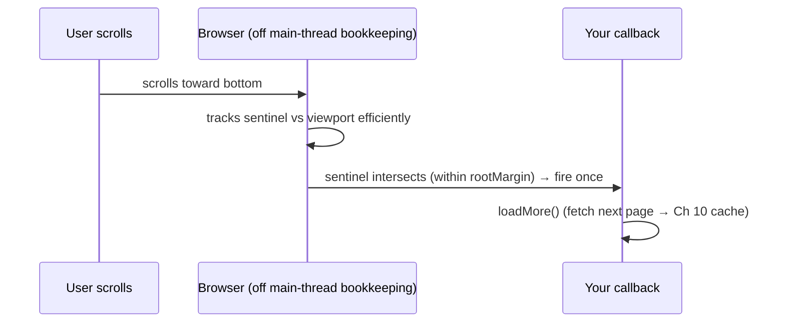

> **Prerequisites:** understanding of the browser event loop and off-main-thread execution. You need to know why blocking the main thread freezes the UI. You also need to know paint timing and layout phases of the render pipeline. Basic performance measurement concepts help too.

---

## The one mental model

> **The browser gives you EVENT-DRIVEN primitives so you never have to POLL or BLOCK. Instead of
> saying "every frame, check if this element is on screen or resized or changed," you register a callback.
> The browser calls you when it matters. It does this efficiently, off your hot path. The pattern is
> always the same: create an observer or scheduler, hand it a callback, the browser invokes it at
> the right time. And when you need real computation without freezing the one thread (Ch 02),
> you move it to another thread with a Web Worker.**

From "don't poll, get notified" you understand why IntersectionObserver beats scroll-handler math.
You understand why ResizeObserver beats window-resize listeners. You understand why `requestAnimationFrame` is the right place
for visual updates, and why heavy work belongs in a Worker.

---

## Learning Objectives

1. Use **IntersectionObserver** for visibility (infinite scroll, lazy-load) instead of scroll math.
2. Use **ResizeObserver** for element-size reactions; **rAF** vs **requestIdleCallback** timing.
3. Move heavy compute to a **Web Worker** to keep the main thread free (Ch 02).
4. Pick the right **storage** (localStorage / sessionStorage / IndexedDB / cookies) and use the
   History API for client routing.

---

## Key Mental Models

- **Observer pattern:** register a callback. The browser fires it on the event. No polling.
- **`rAF` = right before paint** (Ch 07) → visual updates. **`requestIdleCallback` = spare time**
  → low-priority work.
- **Web Worker = a second thread** with no DOM access; talk via `postMessage`.
- **Storage tiers** differ by size, lifetime, sync/async, and whether they're sent to the server.

---

## Introduction

These APIs show up all the time in the job description's world. Infinite scroll uses IntersectionObserver.
Responsive components use ResizeObserver. Smooth interactions use rAF. Keeping a 500k-row table
responsive uses Workers (Ch 08). They become simple once you see them all as "register a callback and get
notified."

---

## Problem: polling is wasteful and janky

The simple but bad way to do "load more when the user nears the bottom":

```js
window.addEventListener("scroll", () => {
  const rect = sentinel.getBoundingClientRect();  // forces layout every scroll event (Ch 07!)
  if (rect.top < window.innerHeight) loadMore();
});
```

Scroll fires dozens of times a second, and `getBoundingClientRect()` forces synchronous layout
each time (Ch 07 thrashing). You're polling geometry on the hot path. The browser already knows
when elements enter the viewport. So let the browser tell you.

---

## Engine Simulation: IntersectionObserver (infinite scroll)

```js
const io = new IntersectionObserver((entries) => {
  for (const e of entries) if (e.isIntersecting) loadMore();   // browser calls us, no polling
}, { rootMargin: "200px" });   // fire 200px early so data loads before the user hits bottom
io.observe(sentinel);
```



No scroll handler. No layout-forcing reads. Fires only when it matters. This is the right
infinite-scroll trigger for the contacts table (Ch 08). **ResizeObserver** is the same pattern
for "react when an element's size changes" (responsive charts and virtualizer row measurement).
It is better than a window `resize` listener because it works per element and fires on any cause.

---

## Timing: rAF vs requestIdleCallback

- **`requestAnimationFrame(cb)`** runs `cb` right before the next paint (Ch 07). Use for visual
  updates and animations so they sync to the frame and batch together. Reading layout then writing in
  rAF avoids thrashing.
- **`requestIdleCallback(cb)`** runs `cb` when the main thread is idle. Use for low-priority,
  non-visual work like prefetch and analytics. This way it does not compete with input and paint.

```
frame:  [ input ] → [ rAF callbacks ] → [ style→layout→paint→composite ] → [ idle? → rIC ]
```

---

## Web Workers: escape the one thread

A 200ms sort or parse on the main thread freezes scroll and paint (Ch 02). Move it off the main thread:

```js
// main.js
const worker = new Worker("sort.js");
worker.postMessage(bigArray);                 // structured-clone copy crosses the boundary
worker.onmessage = (e) => render(e.data);     // result comes back; main thread stayed free

// sort.js (separate thread, NO DOM access)
onmessage = (e) => postMessage(heavySort(e.data));
```

Workers have **no DOM** access. They communicate by message passing. Data is copied or transferred, not
shared by reference (this is a Ch 01 mental shift). Use Workers for CPU-heavy work: parsing, sorting big datasets,
crypto, and image processing. This is the "do it elsewhere" lever from Ch 08.

---

## Storage & History (quick map)

| API | Size | Lifetime | Sync? | Sent to server? |
|---|---|---|---|---|
| **localStorage** | ~5MB | until cleared | sync (blocks!) | no |
| **sessionStorage** | ~5MB | per tab session | sync | no |
| **IndexedDB** | large | persistent | **async** | no |
| **Cookies** | ~4KB | configurable | sync | **yes, every request** (Ch 13/14) |

- `localStorage` is synchronous. So do not put hot or large reads in render paths. Big or structured data should go to
  **IndexedDB** (which is async). For tokens, think carefully (Ch 14 covers cookies vs storage tradeoffs).
- **History API** (`pushState` and `popstate`) is how client routers like React Router change the URL
  without a full page load. This is the basis of SPA routing (Ch 19).

---

## Interview Discussion (reason first)

**Q1. "How do you trigger infinite-scroll loading?"**
> "Use IntersectionObserver on a sentinel near the list bottom. Add a `rootMargin` so it loads early.
> It beats a scroll handler because the browser tracks visibility efficiently. I avoid
> `getBoundingClientRect` layout-thrashing on every scroll event (Ch 07)."

**Q2. "A 300ms data transform freezes the UI. What is the fix?"**
> "Move it to a Web Worker. A Worker runs on a separate thread with message-passing and no DOM. The main thread stays free
> for paint and input (Ch 02). If it must stay on the main thread, chunk it across frames or use a transition."

**Q3. "localStorage vs IndexedDB vs cookies?"**
> "localStorage is small, synchronous, and not sent to the server. Good for simple key-value data. IndexedDB is
> large and async. Good for structured and offline data. Cookies are tiny and sent on every request. Use for
> server-read auth with SameSite and HttpOnly (Ch 14). I avoid synchronous localStorage in hot paths."

*Scoring:* full = observer-not-polling + worker-for-CPU + storage-tier tradeoffs.

---

## Common Mistakes

- **Scroll handlers doing `getBoundingClientRect`** instead of IntersectionObserver. This causes layout thrashing.
- **Forgetting to `disconnect()` or `unobserve()`** observers on unmount. This causes memory leaks.
- **Heavy work on the main thread** such as parsing or sorting big arrays instead of a Worker.
- **Synchronous `localStorage` in render paths or for large blobs.** This blocks the main thread. Use IndexedDB.
- **Using `setTimeout` for animation** instead of `requestAnimationFrame`.

---

## Interview Questions

1. Why is IntersectionObserver better than a scroll listener for lazy-loading? (Tie to Ch 07.)
2. rAF vs requestIdleCallback. What runs in each and when?
3. What can't a Web Worker do, and how does data cross the boundary?
4. Map a token, a 50MB cache, and a user preference to the right storage and justify.
5. How does a client-side router change the URL without reloading?

---

## Homework

1. Implement infinite scroll with IntersectionObserver + `rootMargin`; remove a scroll handler
   version and compare CPU in the Performance panel.
2. Move a deliberately slow sort into a Web Worker; confirm the page stays scrollable during it.
3. In `NOTES.md`: the observer pattern in one line + the storage-tier table from memory.

---

## Summary

- The platform gives **event-driven primitives so you do not poll or block**. Register a callback.
  The browser fires it at the right time.
- **IntersectionObserver** handles visibility and infinite scroll. **ResizeObserver** handles element size.
  Both beat scroll and resize-listener math. They avoid layout thrashing (Ch 07).
- **`rAF`** runs pre-paint visual updates. **`requestIdleCallback`** runs spare-time low-priority work.
- **Web Workers** run heavy computation on another thread. They have no DOM and use message-passing.
  The main thread stays responsive (Ch 02 and 08).
- **Storage tiers** differ by size, lifetime, sync behavior, and whether data is sent to the server.
  **History API** powers SPA routing (Ch 19).

## Go deeper
Ch 08 (these as perf levers), Ch 13/14 (cookies & token storage security), Ch 19 (History +
routing). MDN's observer/worker pages are good references once the pattern is internalized.
