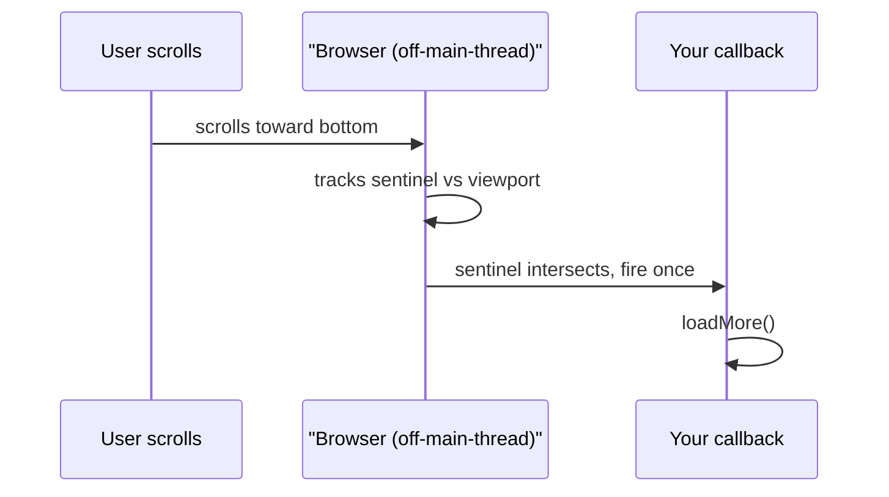

## The Page That Freezes

Your page freezes when the user scrolls. A scroll listener checks element positions sixty times per second. Each check calls `getBoundingClientRect`, forcing the browser to recalculate layout synchronously. You also have a 200ms data transformation that blocks everything — scrolling stops, animations freeze, typing produces no output until the transform finishes.

Here is the truth: the browser already knows when elements enter the viewport, resize, or become visible. You do not need to ask it every frame. And the browser has a second thread for heavy computation. You are just not using them.

## The Mental Model

The browser gives you event-driven primitives so you never have to poll or block. Instead of checking element positions every frame, you register a callback and the browser calls you when it matters. The same pattern applies to heavy computation — move it to a Web Worker on a separate thread instead of freezing the main thread.

**Analogy:** The browser is a secretary who knows exactly when your mail arrives. Instead of you walking to the mailbox every minute, the secretary calls you when something shows up. You get the same information with zero wasted trips.

The core insight: **the browser is a better event tracker than you are.**



Frame timing:

```
frame: [ input ] -> [ rAF callbacks ] -> [ style -> layout -> paint -> composite ] -> [ idle? -> rIC ]
```

## IntersectionObserver

Registers a callback that fires when an element enters or exits the viewport. The browser tracks this on its compositor thread — no layout recalculation forced on the main thread.

```js
const io = new IntersectionObserver((entries) => {
  for (const e of entries) if (e.isIntersecting) loadMore();
}, { rootMargin: "200px" });
io.observe(sentinel);
```

Constructor options: `root` (default viewport), `rootMargin` (expands root bounding box for early triggering), `threshold` (0-1 percentage of target visibility). Callback receives `IntersectionObserverEntry` objects with `isIntersecting`, `intersectionRatio`, `boundingClientRect`. Always call `disconnect()` or `unobserve()` on unmount to prevent memory leaks.

In React:

```jsx
useEffect(() => {
  const io = new IntersectionObserver(([entry]) => {
    if (entry.isIntersecting && hasMore && !isLoading) fetchNextPage();
  }, { rootMargin: "400px" });
  if (sentinelRef.current) io.observe(sentinelRef.current);
  return () => io.disconnect();
}, [hasMore, isLoading, fetchNextPage]);
```

## ResizeObserver

Same pattern — create observer, pass callback, observe elements. Callback receives entries with `contentRect`. Fires when element size changes regardless of cause. Better than `window.resize` because it works per element.

## rAF vs requestIdleCallback

`requestAnimationFrame` callbacks run before each paint. Use for visual updates — DOM mutations the user will see next frame. Receives a high-resolution timestamp.

`requestIdleCallback` runs when the main thread has idle time. Receives a `Deadline` with `timeRemaining()`. Use for non-visual work — prefetching, analytics. The browser may never call it if the thread stays busy.

## Web Workers

A Worker runs on a separate OS thread with its own memory space. No DOM access. No `window`, `document`, or `parent`.

```js
const worker = new Worker("sort.js");
worker.postMessage(bigArray);
worker.onmessage = (e) => render(e.data);
```

Data crosses the thread boundary via `postMessage`, which uses the structured clone algorithm — a full deep copy. A 10MB object takes ~10ms to clone and doubles memory usage. For large binary data, use Transferable objects (like ArrayBuffer) which move ownership without copying. The original buffer becomes detached (zero-length).

```js
const buffer = new ArrayBuffer(1024 * 1024);
worker.postMessage(buffer, [buffer]); // transfer, no clone
console.log(buffer.byteLength); // 0 — ownership moved
```

## Storage

| API | Size | Lifetime | Sync? | Sent to server? |
|---|---|---|---|---|
| localStorage | ~5MB | until cleared | sync (blocks) | no |
| sessionStorage | ~5MB | per tab | sync | no |
| IndexedDB | large | persistent | async | no |
| Cookies | ~4KB | configurable | sync | yes |

**Rule of thumb:** Auth tokens in HttpOnly cookies (XSS-safe, sent with requests). Large structured data in IndexedDB (async, no size limit). Small preferences in localStorage (simple, sync).

## Common Mistakes

- Scroll handlers calling `getBoundingClientRect` instead of IntersectionObserver — causes layout thrashing.
- Forgetting to `disconnect()` observers on unmount — memory leaks.
- Heavy computation on the main thread instead of a Worker.
- Synchronous `localStorage` in render paths — blocks the thread.

## Q&A

**Q: Why is IntersectionObserver better than a scroll listener?**
A scroll listener fires up to 60 times per second, each call to `getBoundingClientRect` forces synchronous layout reflow. IntersectionObserver runs on the compositor thread, fires once per intersection change, and never forces layout.

**Q: What can a Web Worker not do?**
No DOM access — no `document`, `window`, `navigator`, or `localStorage`. Data crosses via `postMessage` with structured cloning (full deep copy). Use Transferable objects for large ArrayBuffers to avoid the copy cost.

**Q: Where does an auth token go?**
HttpOnly cookie. It is ~4KB (plenty for a JWT), sent with every request automatically, and inaccessible to JavaScript (prevents XSS theft). Never put tokens in localStorage.

**Q: rAF vs requestIdleCallback — which for what?**
rAF for visual updates (runs before paint). rIC for deferrable work (prefetch, analytics). rIC may never fire if the thread is busy — it is a hint, not a guarantee.

## Mental Trigger

**The browser already knows. Stop asking. Start listening.**
