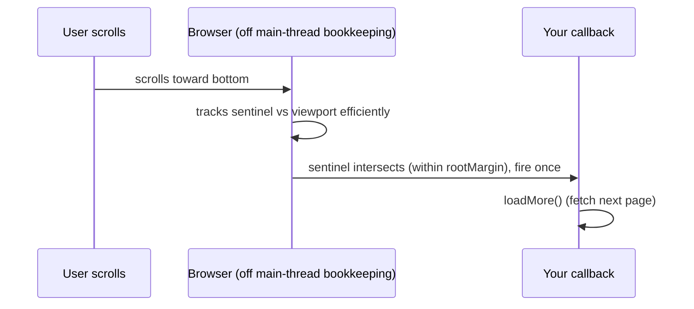

## The Page That Freezes

Your page freezes when the user scrolls. You added a scroll listener that checks element positions. It fires sixty times a second. Each check calls `getBoundingClientRect` which forces the browser to recalculate layout synchronously. The UI stutters. You also have a 200ms data transformation that freezes the page while it runs. The scrolling stops. The animation stops. The user types and nothing appears until the transform finishes.

Here is the uncomfortable truth: the browser already knows when elements enter the viewport, resize, or become visible. You do not need to ask it every frame. And the browser already has a second thread you can use for heavy computation. You are just not using them.

## Why Polling Is Always Wrong

The old approach polled. Scroll listeners polled position data every frame. Window resize listeners polled window size. `setTimeout` polled for visibility changes. Each poll forced layout recalculations on the hot path. The polling was wasteful because the browser already knows when these things change. The browser tracks scroll position, element visibility, and element size internally. Old code asked the browser to compute what it already knew, on every tick.

For heavy computation, the old approach ran everything on the main thread. Browsers give you one thread for rendering, JavaScript, and user input. A 200ms sort blocked all three. Users saw a frozen page with no feedback. The mental model was wrong: developers treated the main thread as the only thread.

Think of it like a chef who insists on stirring every pot himself instead of delegating. He can only do one thing at a time. The kitchen grinds to a halt.

## The Mental Model: Stop Polling, Start Listening

The browser gives you EVENT-DRIVEN primitives so you never have to POLL or BLOCK. Instead of saying "every frame, check if this element is on screen or resized or changed," you register a callback. The browser calls you when it matters. It does this efficiently, off your hot path. The pattern is always the same: create an observer or scheduler, hand it a callback, the browser invokes it at the right time. When you need real computation without freezing the main thread, you move it to another thread with a Web Worker.

The core insight: **the browser is a better event tracker than you are.** Trust it to tell you when things change, rather than you asking it every frame.

## Visualization



Frame timing:

```
frame: [ input ] -> [ rAF callbacks ] -> [ style -> layout -> paint -> composite ] -> [ idle? -> rIC ]
```

## Engine Simulation

```js
const io = new IntersectionObserver((entries) => {
  for (const e of entries) if (e.isIntersecting) loadMore();
}, { rootMargin: "200px" });
io.observe(sentinel);
```

No scroll handler. No layout-forcing reads. Fires only when it matters.

Internally, IntersectionObserver uses the browser's compositor thread to track element positions. The compositor runs at frame rate and has access to the layer tree. It checks intersection without forcing layout on the main thread. This is why it is efficient. The callback fires asynchronously, after the compositor detects the intersection. The `rootMargin` option expands the root's bounding box by 200px. The callback fires when the sentinel enters that expanded area, giving you time to load data before the user reaches the bottom.

```js
const worker = new Worker("sort.js");
worker.postMessage(bigArray);
worker.onmessage = (e) => render(e.data);

// sort.js
onmessage = (e) => postMessage(heavySort(e.data));
```

Internally, `postMessage` uses the structured clone algorithm to copy data across threads. The data is serialized and deserialized. It is not shared by reference. Large objects have a serialization cost. For very large data you can use Transferable objects like ArrayBuffer which move ownership without copying. The old buffer becomes detached in the original thread. The worker runs on a separate OS thread with its own event loop and memory space. It has no access to the DOM, window, or document.

## Internal Implementation

**IntersectionObserver:**
- Constructor takes a callback and options object with `root` (default viewport), `rootMargin`, and `threshold`.
- `rootMargin` expands or shrinks the root's bounding box for early triggering.
- `threshold` is a number or array from 0 to 1 indicating what percentage of target must be visible.
- Callback receives array of `IntersectionObserverEntry` objects with `isIntersecting`, `intersectionRatio`, `boundingClientRect`, `target`.
- Must call `disconnect()` or `unobserve()` on unmount to prevent memory leaks.

**ResizeObserver:**
- Same pattern: create observer, pass callback, observe elements.
- Callback receives entries with `contentRect` (element's content box size).
- Fires when element size changes regardless of cause.
- Better than window resize listeners because it works per element and catches all size changes.

**requestAnimationFrame vs requestIdleCallback:**
- `rAF` callbacks run in a queue before each paint. Browser schedules them to batch visual updates. They receive a high-resolution timestamp.
- `requestIdleCallback` runs when the main thread has idle time. Receives a deadline object with `timeRemaining()`.
- `rAF` is for visual updates. `requestIdleCallback` is for non-visible work like prefetch or analytics.

**Web Worker:**
- Runs in separate OS thread. No DOM access. No `window`, `document`, `parent`.
- Communication via `postMessage` and `onmessage`.
- Data is cloned, not shared (except Transferable objects like ArrayBuffer).
- Workers can import scripts with `importScripts` or ES module imports (if type is module).

**Storage tiers:**

| API | Size | Lifetime | Sync? | Sent to server? |
|---|---|---|---|---|
| localStorage | about 5MB | until cleared | sync (blocks) | no |
| sessionStorage | about 5MB | per tab session | sync | no |
| IndexedDB | large | persistent | async | no |
| Cookies | about 4KB | configurable | sync | yes, every request |

## Real World Example

Infinite scroll in a contacts table. The bad way:

```js
window.addEventListener("scroll", () => {
  const rect = sentinel.getBoundingClientRect();
  if (rect.top < window.innerHeight) loadMore();
});
```

This forces layout on every scroll event. The browser recalculates positions synchronously. If loadMore triggers a re-render with new data, the combined scroll handler plus re-render causes dropped frames.

The good way with IntersectionObserver:

```js
useEffect(() => {
  const io = new IntersectionObserver(([entry]) => {
    if (entry.isIntersecting && hasMore && !isLoading) {
      fetchNextPage();
    }
  }, { rootMargin: "400px" });
  if (sentinelRef.current) io.observe(sentinelRef.current);
  return () => io.disconnect();
}, [hasMore, isLoading, fetchNextPage]);
```

Internally, the IntersectionObserver callback fires asynchronously. It does not block scroll. It does not force layout. The browser detects the intersection in the compositor thread. Your callback runs after detection during a frame's idle time or as a microtask. The fetchNextPage call is also async. The scroll stays smooth. The cleanup function calls `disconnect()` which tells the browser to stop tracking the sentinel element. This prevents memory leaks when the component unmounts.

## Tradeoffs

| API | Problem solved | Tradeoff |
|---|---|---|
| IntersectionObserver | Detect element visibility | Cannot detect exact scroll position values |
| ResizeObserver | Detect element size changes | Fires synchronously before paint, can cause thrashing if you mutate layout |
| requestAnimationFrame | Sync visual updates to paint | Not for non-visual work, runs even when tab is visible |
| requestIdleCallback | Run work during idle | May never fire if thread is always busy |
| Web Worker | Offload CPU work from main thread | No DOM access, serialization cost for messages, complexity |
| localStorage | Small persistent key-value storage | Sync, blocks main thread, small size limit |
| IndexedDB | Large structured data storage | Complex API, async but no callback blocking |

## Common Mistakes

- Scroll handlers calling `getBoundingClientRect` instead of IntersectionObserver. This causes layout thrashing.
- Forgetting to `disconnect()` or `unobserve()` observers on unmount. This causes memory leaks.
- Heavy work on the main thread such as parsing or sorting big arrays instead of a Worker.
- Synchronous `localStorage` in render paths or for large blobs. Use IndexedDB instead.
- Using `setTimeout` for animation instead of `requestAnimationFrame`.

## SDE-2 Interview Answer

**Mid-level variant:**

"For infinite scroll I use IntersectionObserver on a sentinel element. The browser tells me when the element is visible. I do not poll with scroll handlers. For expensive computations like sorting a large array I move the work to a Web Worker. The worker runs on a separate thread. I communicate with it using postMessage. The main thread stays responsive for paint and input."

**Senior variant:**

"I choose the right observer or scheduler based on the problem. IntersectionObserver for visibility detection. ResizeObserver for element size changes. requestAnimationFrame for visual updates. requestIdleCallback for low-priority background work. I use Web Workers for any CPU-heavy task that would block the main thread. I avoid synchronous localStorage in render paths. I use IndexedDB for large or structured data because it is async. I clean up observers and workers in useEffect to prevent leaks."

**Engineering Lead variant:**

"I set patterns for the team. Observers go in custom hooks with proper cleanup. The hooks accept callbacks and return the observer instance. Workers are wrapped in a messaging layer that handles serialization, errors, and lifecycle. We have a simple API: `workerRef.current.postMessage(data)` and listen for results. Storage choices are documented: cookies for auth with HttpOnly, IndexedDB for large cache data, localStorage for simple preferences. The team knows that synchronous storage in render paths is a performance bug."

## Follow-up Questions

1. Why is IntersectionObserver better than a scroll listener for lazy-loading? What happens internally in each approach?

**Q1: Why is IntersectionObserver better than a scroll listener for lazy-loading? What happens internally in each approach?**

A scroll listener fires on every scroll event (up to 60 times per second). Inside the handler, calling `getBoundingClientRect()` forces the browser to perform a synchronous layout reflow — it recalculates element positions on the main thread. This is called layout thrashing: each scroll event triggers a style/layout/paint cycle, blocking the main thread and causing dropped frames. The IntersectionObserver, by contrast, runs its callback asynchronously on the compositor thread. The compositor already tracks element positions as part of its layer tree for painting. When the target enters the root's bounding box (adjusted by `rootMargin`), the compositor queues a single callback. No layout reflow is forced. No synchronous reads happen. The callback fires once per intersection change, not per scroll pixel. The internal implementation uses an observer list maintained by the browser's compositor — it compares the target's bounding rect against the root rect at frame boundaries, and only dispatches when the intersection state changes.

```js
// Bad: forces layout reflow on every scroll tick
window.addEventListener("scroll", () => {
  const rect = sentinel.getBoundingClientRect(); // synchronous layout
  if (rect.top < window.innerHeight) loadMore();
});

// Good: no layout forced, fires once per intersection change
const io = new IntersectionObserver(([e]) => {
  if (e.isIntersecting) loadMore();
}, { rootMargin: "200px" });
io.observe(sentinel);
```

2. rAF vs requestIdleCallback: what runs in each and when? What happens if the main thread is too busy for idle callbacks?

**Q2: rAF vs requestIdleCallback: what runs in each and when? What happens if the main thread is too busy for idle callbacks?**

`requestAnimationFrame` (rAF) callbacks run in a queue before each paint — the browser guarantees them before the style/layout/paint/composite pipeline. They receive a high-resolution timestamp and are designed for visual updates: DOM mutations that the user will see in the next frame. `requestIdleCallback` (rIC) runs when the browser's main thread has idle time between frames. It receives a `Deadline` object with a `timeRemaining()` method so you can check how much idle time is left. It is meant for non-visual, deferrable work: prefetching data, sending analytics, or pre-computing results. If the main thread is continuously busy (heavy JavaScript execution, long animations), rIC callbacks may never fire. The browser has no obligation to call them. There is also a `timeout` option — if you pass `{ timeout: 1000 }`, the browser guarantees the callback fires within 1000ms even if the thread is busy, but this defeats the purpose of idle scheduling. In practice, rIC is a hint, not a guarantee. For critical background work, fall back to `setTimeout` or a Web Worker. React uses rAF internally for scheduling visual updates, and some frameworks use rIC for low-priority prefetching.

3. What can a Web Worker not do? How does data cross the thread boundary? What is the cost of structured cloning?

**Q3: What can a Web Worker not do? How does data cross the thread boundary? What is the cost of structured cloning?**

A Web Worker runs on a separate OS thread with its own memory space. It has no access to the DOM — no `document`, no `window`, no `navigator`, no `localStorage`, no `fetch` (though it has its own `fetch` and `XMLHttpRequest` in modern browsers). It cannot touch any shared-memory structures with the main thread. Data crosses the thread boundary via `postMessage`, which uses the **structured clone algorithm**. This algorithm recursively copies the object — it handles Date, RegExp, Map, Set, ArrayBuffer, and nested objects, but it creates a full deep copy. The cost is CPU time and memory: a 10MB object takes ~10ms to clone and doubles memory usage. For large binary data, use `Transferable` objects (like `ArrayBuffer`) which move ownership without copying — the original thread's buffer becomes detached (zero-length) and the worker gets the memory. For very high-performance cases, `SharedArrayBuffer` allows true shared memory between threads, but requires careful synchronization (atomics) to avoid data races.

```js
const buffer = new ArrayBuffer(1024 * 1024); // 1MB
worker.postMessage(buffer, [buffer]); // transfer, no clone — buffer is detached in main
console.log(buffer.byteLength); // 0 — ownership moved to worker
```

4. Map a token, a 50MB cache, and a user preference to the right storage. Justify each choice by size, lifetime, and security.

**Q4: Map a token, a 50MB cache, and a user preference to the right storage. Justify each choice by size, lifetime, and security.**

An **auth token** goes in an **HttpOnly cookie**. Cookies are ~4KB but a JWT is typically well under that. They are sent with every HTTP request automatically, so the server can authenticate without client-side JavaScript reading the token. HttpOnly prevents XSS from stealing it. Do not put tokens in localStorage — it is accessible to any script on the page and persists indefinitely. A **50MB cache** (e.g., cached API responses, offline data) goes in **IndexedDB**. IndexedDB has no meaningful size limit (browser quotas are typically hundreds of MB to GB), it stores structured data asynchronously (no main-thread blocking), and it persists across sessions. localStorage is capped at ~5MB and is synchronous — it would block the render thread on a 50MB read. A **user preference** (theme, language, collapsed sidebar) goes in **localStorage**. Preferences are small (well under 5KB), rarely change, and need synchronous access for the initial render to avoid a flash of wrong theme. localStorage is simpler than IndexedDB and synchronous reads are acceptable for small payloads. The tradeoff is that localStorage blocks the main thread, but for a few hundred bytes that is negligible.

5. How does a client-side router change the URL without reloading the page? (tie to History API, pushState, popstate)

**Q5: How does a client-side router change the URL without reloading the page?**

Client-side routers use the **History API** — specifically `history.pushState()` and `history.replaceState()`. When you navigate to `/about`, the router calls `history.pushState({ page: "about" }, "", "/about")`. This updates the browser's address bar to show `/about` and pushes a new entry onto the session history stack, but it does **not** trigger a page reload or even a network request. The router then renders the matching component for that route. When the user clicks the browser's back button, the browser fires a `popstate` event with the state object that was passed to `pushState`. The router listens for `popstate`, reads the new URL via `window.location.pathname`, and re-renders the appropriate component. The key insight is that `pushState` is purely a URL and history manipulation — the browser does nothing else. The router is entirely responsible for reading the URL and deciding what to render. This is why SPA deep links need a server fallback: the server must return the SPA shell for any route so the client-side router can take over.

```js
// Router navigates to /dashboard
history.pushState({ page: "dashboard" }, "", "/dashboard");
renderRoute("/dashboard"); // React renders the Dashboard component

// User clicks back
window.addEventListener("popstate", (e) => {
  renderRoute(window.location.pathname); // re-renders based on new URL
});
```

## Mental Trigger

**The browser already knows. Stop asking. Start listening.**

## One Page Revision

- Browser gives event-driven primitives so you never poll or block.
- IntersectionObserver: browser tracks element visibility. No layout forcing.
- ResizeObserver: detect element size changes per element, not window resize.
- rAF: run callbacks right before paint. For visual updates only.
- requestIdleCallback: run work during idle time. For low-priority non-visual work.
- Web Worker: separate thread for CPU work. No DOM access. Message passing with postMessage.
- Data crosses boundary via structured clone. Use Transferable for large ArrayBuffers.
- localStorage: small sync storage. Do not use in render paths.
- IndexedDB: large async storage. Use for structured data and cache.
- Cookies: small, sent with every request. Use for server-read auth with HttpOnly.
- Always disconnect observers and terminate workers on cleanup.
