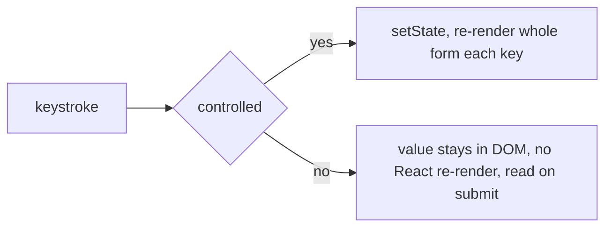

## The Form That Drags

Your form is slow. Every keystroke makes the whole page jank. You have thirty fields and every character typed re-renders every one of them. Users feel the delay. The form also has validation bugs. Errors appear at the wrong time. The submit handler sends bad data to the server. Types do not match the API. Form state is messy with loading, error, and submission race conditions.

Here is the question that separates good forms from bad ones: **who owns each field's value?** If React owns it (controlled), every keystroke re-renders the whole form. If the DOM owns it (uncontrolled), React stays out of the way until submit. That one decision determines performance, validation timing, and complexity.

## Why the Naive Approach Burns You

The old approach put every input value in React state with `useState`. Each keystroke called `setState`, triggering a re-render of the entire form component and all its children. For a form with thirty fields, every keystroke reconciled thirty inputs. React cannot know which input changed so it diffs them all. This is wasted work.

Validation was also messy. Teams wrote validation logic inline inside event handlers. Or they maintained a separate type definition and a separate validation schema that drifted apart. Types said `email: string` but the validator allowed empty strings. These two sources of truth inevitably diverged. When types changed the validation did not update, or vice versa.

Think of it like a librarian who re-shelves the entire library every time someone checks out one book. Technically correct, absurdly wasteful.

## The Mental Model: Who Owns the Value?

A form is just state plus a validation function: `errors = validate(values)`. The UI is a function of `(values, errors, touched, submitting)`. The only real decision is WHO OWNS each field's value. React controlled means the value lives in state and every keystroke re-renders. DOM uncontrolled means the value lives in the input and React reads it on submit via a ref. Performance and usability both come from that ownership choice.

The core insight: **the form's performance is determined by how many times React touches the inputs on each keystroke.**

## Visualization



Form state model:

```ts
type FormState = {
  values: FormValues;
  errors: Partial<Record<keyof FormValues, string>>;
  touched: Partial<Record<keyof FormValues, boolean>>;
  status: "idle" | "submitting" | "error" | "success";
};
```

## Engine Simulation

```jsx
// Controlled: React owns the value
const [email, setEmail] = useState("");
<input value={email} onChange={e => setEmail(e.target.value)} />;

// Uncontrolled: DOM owns the value, read it lazily
const ref = useRef();
<input defaultValue="" ref={ref} />;
<button onClick={() => console.log(ref.current.value)}>submit</button>;
```

In the controlled version, every keystroke calls `setEmail`. This triggers a re-render of the component. React reconciles the input, comparing the new virtual DOM with the old one. The input value changed so React updates the DOM. This is correct but expensive for large forms.

In the uncontrolled version, the DOM manages the input's value. React does not re-render on keystrokes. The value stays in the DOM node's `value` property. React only reads it when the user clicks submit. This is cheaper but you cannot run validation on every keystroke or show live error messages.

React Hook Form is fast because it keeps inputs uncontrolled and subscribes to changes outside React's render cycle. It uses `useRef` internally to register each input. It listens for change events directly on the DOM node. When a field changes, RHF updates its internal value map without causing the form component to re-render. Only the specific field that has a changed error re-renders. This is the same pattern as selector subscriptions in a state store.

## Internal Implementation

**Controlled input internals:**
- React stores the value in fiber state.
- On each keystroke the `onChange` handler fires, calling `setState`.
- React schedules a re-render of the component.
- During reconciliation, React compares the new virtual DOM with the previous one.
- React detects the input's `value` prop changed and updates the DOM.

**Uncontrolled input internals:**
- React sets `defaultValue` once during initial render.
- After that React does not touch the input's value.
- The browser manages the input's internal state.
- When the user types, the browser updates the input's `value` property directly.
- React does not re-render. No reconciliation happens.

**React Hook Form internals:**
- `useForm` creates a `FormStore` outside React's render cycle.
- `register` attaches a ref to the input and subscribes to change events.
- On change, the store updates the field value without triggering a React re-render.
- Validation runs inside the store, not in React's render cycle.
- When validation produces errors, RHF triggers a targeted re-render only on fields with changed errors using `useSyncExternalStore` or subscription-based updates.

**Zod validation internals:**
- `z.object({...})` creates a schema object.
- `schema.safeParse(data)` runs validations and returns `{success: true, data}` or `{success: false, error}`.
- `z.infer<typeof Schema>` extracts the TypeScript type from the schema at compile time.
- The type reflects the schema's structure. If the schema requires `email` to be a valid email string, the inferred type has `email: string`. The type and validation logic share one definition.

## Real World Example

A user registration form with ten fields: name, email, password, confirm password, and more. The form must validate on blur (show error after leaving a field), on change (clear error when user fixes it), and on submit (prevent submission with errors).

Controlled approach with `useState`:

```jsx
function RegistrationForm() {
  const [values, setValues] = useState({ name: "", email: "", password: "", confirmPassword: "" });
  const [errors, setErrors] = useState({});
  const [submitting, setSubmitting] = useState(false);
}
```

Every keystroke re-renders this entire component. All four inputs reconcile. All validation runs again. The user feels the delay.

React Hook Form approach:

```jsx
const { register, handleSubmit, formState: { errors } } = useForm();
const schema = z.object({
  name: z.string().min(2),
  email: z.string().email(),
  password: z.string().min(8),
  confirmPassword: z.string(),
}).refine(data => data.password === data.confirmPassword, { message: "Passwords must match" });
```

No re-render on keystroke. Validation runs from the schema. The type is inferred. The submit handler receives typed data. Performance stays smooth even with hundreds of fields.

Internally, `handleSubmit` calls `schema.parse` (or `safeParse`) on the form data. If validation fails the errors are mapped to field names and stored in `formState.errors`. The component re-renders only if the error state for a subscribed field changed. Each field subscribes to its own error, not the entire error object. This targeted re-rendering is why RHF stays fast at scale.

## Tradeoffs

| Approach | Performance | Live validation | Complexity |
|---|---|---|---|
| Controlled (useState) | Poor for large forms | Easy, always have live values | Low |
| Uncontrolled (refs) | Excellent | Hard, must read on demand | Low |
| React Hook Form | Excellent for any size | Built-in subscriptions | Medium |
| Formik (controlled) | Poor for large forms | Built-in | Medium |

| Validation timing | UX | Performance | When to use |
|---|---|---|---|
| On submit | Basic | Best | Simple forms |
| On blur | Better | Good | Most forms |
| On change | Best (instant feedback) | Worst | Required fields or matching passwords |
| Debounced change | Good | Good | Expensive async validation |

## Common Mistakes

- Large controlled forms that re-render on every keystroke. Use uncontrolled or RHF instead.
- Switching an input from uncontrolled to controlled during its lifetime. When value goes from undefined to a string, React throws a warning and causes bugs. Pick one mode and stick with it.
- Trusting client validation only. Always validate server-side too. Client validation is for UX, not security.
- Validating on every keystroke with expensive or async checks without debounce.
- Duplicating shape in a type and a validator instead of inferring the type from the schema.

## SDE-2 Interview Answer

**Mid-level variant:**

"I use React Hook Form for complex forms because it does not re-render on every keystroke. It keeps inputs uncontrolled under the hood. I use Zod for validation and infer the TypeScript type from the schema. This way the type and validation logic come from one source. I validate on submit, on blur for better UX, and on change with debounce for critical fields."

**Senior variant:**

"The core decision is who owns the value. Controlled means React state, re-renders every keystroke, but gives live values for validation. Uncontrolled means the DOM owns it, cheap, but you read on submit. React Hook Form gives the best of both: uncontrolled inputs with subscription-based reactivity. I pick controlled only for small forms or when I need real-time values for a few fields. I always validate on the server too. Client validation is for UX, not security."

**Engineering Lead variant:**

"I standardize form patterns for the team. We use React Hook Form with Zod for all new forms. The Zod schema is the single source of truth for both validation and TypeScript types. We validate on submit always, on blur for better UX, and on change with debounce for async checks. We never trust client validation for security. Every form has corresponding server-side validation. The team knows that controlled inputs are for small forms only. Large forms use RHF. We measure form render performance in the React Profiler to catch regressions."

## Follow-up Questions

1. Controlled vs uncontrolled: where does the value live and what is the performance consequence of each?

**Q1: Controlled vs uncontrolled: where does the value live and what is the performance consequence of each?**

In a **controlled** input, the value lives in React state. Every keystroke triggers `onChange`, which calls `setState`, which schedules a re-render of the component. React reconciles the entire component tree (or at least the subtree), diffs the virtual DOM, and updates the input's `value` prop in the real DOM. This means every keystroke causes a full render cycle for the form component and all its children. For a form with 30 fields, each keystroke reconciles all 30 inputs even though only one changed. In an **uncontrolled** input, the value lives in the DOM node itself. React sets `defaultValue` once during the initial render and then never touches the input's value again. The browser manages the input's internal state natively. On submit, you read `ref.current.value` to get the current value. The performance consequence is significant: uncontrolled inputs cause zero re-renders on keystroke because React is not involved in the update loop. The tradeoff is that you cannot run live validation or show real-time error messages without reading the ref manually. React Hook Form exploits this by keeping inputs uncontrolled under the hood but subscribing to change events outside React's render cycle, giving you the performance of uncontrolled with the reactivity of controlled.

2. Why does react-hook-form not re-render the whole form on each keystroke? What internal mechanism does it use instead?

**Q2: Why does react-hook-form not re-render the whole form on each keystroke? What internal mechanism does it use instead?**

React Hook Form (RHF) keeps inputs **uncontrolled** internally. When you call `register("email")`, RHF attaches a `ref` to the input and subscribes to its native `change` and `blur` events directly on the DOM node — outside of React's render cycle. When the user types, the DOM event fires and RHF updates its own internal `FormStore` (a plain JavaScript object, not React state). No `setState` is called, so no React re-render is triggered. RHF's internal store is a `useRef`-backed map of field values, errors, and touched states. When you need to read form state (e.g., `{ values, errors }`), RHF uses `useSyncExternalStore` or a custom subscription mechanism to subscribe only to the specific slices you read. If your component reads `formState.errors.email`, it only re-renders when the `errors.email` value changes — not when any other field's error changes. This is the same selector subscription pattern used by Zustand. The result: keystroke in field A causes zero re-renders in the form component. Only when validation runs and an error changes does the affected field re-render.

3. Write a Zod schema and infer its type from it. Why validate at runtime if you have TypeScript types?

**Q3: Write a Zod schema and infer its type from it. Why validate at runtime if you have TypeScript types?**

```ts
import { z } from "zod";

const UserSchema = z.object({
  name: z.string().min(2, "Name must be at least 2 characters"),
  email: z.string().email("Invalid email address"),
  age: z.number().int().min(18, "Must be at least 18"),
});

type User = z.infer<typeof UserSchema>;
// Equivalent to: { name: string; email: string; age: number }
```

TypeScript types are erased at compile time — they exist only during development and in your IDE. The JavaScript runtime has no concept of `string` or `number`. When data arrives from an API, a form submission, or `localStorage`, it is untyped `any`. A response that should be `{ name: string, age: number }` could actually be `{ name: 42, age: "eighteen" }` — TypeScript cannot catch this because the data doesn't originate from your code. Zod validation runs at runtime and catches these mismatches. It also gives you a single source of truth: the schema defines both the runtime validation rules AND the TypeScript type via `z.infer`. You never maintain a separate interface that drifts out of sync. When the schema changes, the type updates automatically. This is especially critical at API boundaries — server responses, URL params, form inputs, environment variables — where untrusted data enters your system.

4. When do you validate: on change, on blur, or on submit? Why mark `touched` and what order gives best UX?

**Q4: When do you validate: on change, on blur, or on submit? Why mark `touched` and what order gives best UX?**

The best UX follows a progression: **on submit** (always — prevents bad data from reaching the server), **on blur** (shows errors after the user leaves a field — catches mistakes without being annoying), and **on change with debounce** (for fields that benefit from instant feedback, like password strength or confirmation matching). Validating on every keystroke without debounce feels hostile — the user types "j" and sees "Name must be at least 2 characters." The `touched` state tracks which fields the user has interacted with (blurred at least once). It prevents showing errors on fields the user hasn't visited yet. Without `touched`, a form with 10 fields shows errors on all 10 immediately on submit, even fields the user hasn't filled in. With `touched`, you only show errors for fields the user has visited or tried to submit. The ideal order: first render shows no errors. On blur, validate that specific field and show its error. On change, clear the error if the user fixes it (re-validate on change only for fields that already have an error). On submit, validate all fields and show all errors. This gives progressive disclosure of validation feedback — the user is guided, not overwhelmed.

5. Model form state so that "submitting" cannot coexist with a stale error. Use a discriminated union approach.

**Q5: Model form state so that "submitting" cannot coexist with a stale error. Use a discriminated union approach.**

A discriminated union makes impossible states unrepresentable. Instead of three independent booleans (`isSubmitting`, `isError`, `isSuccess`), use a single `status` field as the discriminant:

```ts
type FormState =
  | { status: "idle" }                                    // no submission in progress
  | { status: "submitting" }                              // mid-flight, no error possible
  | { status: "error"; error: string }                    // failed, with error message
  | { status: "success"; data: Response };                // succeeded, with response

// Usage in a reducer:
function formReducer(state: FormState, action: FormAction): FormState {
  switch (action.type) {
    case "SUBMIT":
      return { status: "submitting" };          // clears any old error automatically
    case "ERROR":
      return { status: "error", error: action.message };
    case "SUCCESS":
      return { status: "success", data: action.data };
    case "RESET":
      return { status: "idle" };
    default:
      return state;
  }
}
```

When you dispatch `SUBMIT`, the state transitions to `{ status: "submitting" }` — there is no `error` field in this variant. A stale error from a previous attempt is structurally impossible because the shape doesn't include it. You cannot accidentally display a stale error during submission because the TypeScript type won't let you access `state.error` without narrowing to the `"error"` variant first. This eliminates an entire class of bugs: "error shown during loading," "error persists after new submission," "success and error both displayed." Three independent booleans (`isSubmitting && isError && !isSuccess`) allow states like `(true, true, false)` which is logically impossible but structurally representable. The discriminated union makes the state machine explicit and the compiler enforces valid transitions.

## Mental Trigger

**Who owns the value decides the cost.**

## One Page Revision

- Form equals state plus validate(values). UI is f(values, errors, touched, status).
- Core decision: controlled (value in React state, re-renders every keystroke) vs uncontrolled (value in DOM, read on submit, cheap).
- React Hook Form is fast because it uses uncontrolled inputs with subscription-based updates outside React's render cycle.
- Zod schema is the single source of truth for validation and type inference.
- Type comes FROM the schema. Do not duplicate.
- Validate on submit always. Validate on blur for UX. Validate on change with debounce for instant feedback.
- Client validation is for UX. Server validation is for security.
- Never switch an input between controlled and uncontrolled during its lifetime.
- Form state should use a discriminated union for status to prevent impossible states.
