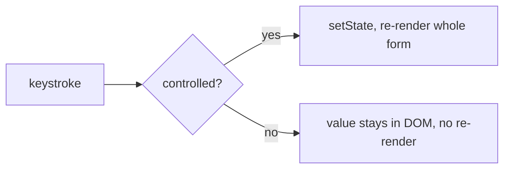

## The Form That Drags

Your form has thirty fields. Every keystroke re-renders every one of them. Users feel the delay. Validation errors appear at the wrong time. The submit handler sends bad data. Types do not match the API.

Here is the question that separates good forms from bad ones: **who owns each field's value?** If React owns it (controlled), every keystroke re-renders the whole form. If the DOM owns it (uncontrolled), React stays out of the way until submit. That one decision determines performance, validation timing, and complexity.

## The Mental Model

A form is just state plus a validation function: `errors = validate(values)`. The UI is a function of `(values, errors, touched, submitting)`. The only real decision is who owns each field's value.

**Analogy:** A controlled form is like a librarian who re-shelves the entire library every time someone checks out one book. Technically correct, absurdly wasteful. An uncontrolled form lets readers handle books themselves and only checks in at the desk.

The core insight: **the form's performance is determined by how many times React touches the inputs on each keystroke.**



## Controlled vs Uncontrolled

```jsx
// Controlled: React owns the value
const [email, setEmail] = useState("");
<input value={email} onChange={e => setEmail(e.target.value)} />;

// Uncontrolled: DOM owns the value, read on submit
const ref = useRef();
<input defaultValue="" ref={ref} />;
<button onClick={() => console.log(ref.current.value)}>submit</button>;
```

Controlled: every keystroke triggers `setState`, which reconciles all inputs. Correct but expensive for large forms.

Uncontrolled: the DOM manages the value. React does not re-render on keystrokes. Cheap but you cannot run live validation or show real-time errors without reading the ref.

## React Hook Form

RHF is fast because it keeps inputs uncontrolled and subscribes to changes outside React's render cycle. It uses `useRef` internally to register each input, listens for change events directly on the DOM node, and updates its internal value map without triggering a React re-render. Only the specific field with a changed error re-renders.

```jsx
const { register, handleSubmit, formState: { errors } } = useForm();
const schema = z.object({
  name: z.string().min(2),
  email: z.string().email(),
  password: z.string().min(8),
  confirmPassword: z.string(),
}).refine(data => data.password === data.confirmPassword, { message: "Passwords must match" });
```

No re-render on keystroke. Validation runs from the schema. The type is inferred via `z.infer<typeof schema>`. The submit handler receives typed data.

## Zod: One Schema, Two Truths

```ts
const UserSchema = z.object({
  name: z.string().min(2),
  email: z.string().email(),
  age: z.number().int().min(18),
});
type User = z.infer<typeof UserSchema>;
```

TypeScript types are erased at compile time. When data arrives from an API or form, it is untyped `any`. Zod validates at runtime AND gives you the TypeScript type via `z.infer`. One definition, no drift.

## Validation Timing

| Timing | UX | Performance | When to use |
|---|---|---|---|
| On submit | Basic | Best | Always (security) |
| On blur | Better | Good | Most forms (UX) |
| On change (debounced) | Best | Good | Critical fields (password match) |

The best UX follows a progression: validate on submit (prevents bad data), on blur (shows errors after leaving a field), on change with debounce (instant feedback for critical fields). Without debounce, seeing "Name must be at least 2 characters" when the user types "j" feels hostile.

Mark `touched` to track which fields the user has visited. Without it, a 10-field form shows errors on all fields immediately on submit, even ones the user has not filled in.

## Form State: Discriminated Union

```ts
type FormState =
  | { status: "idle" }
  | { status: "submitting" }
  | { status: "error"; error: string }
  | { status: "success"; data: Response };
```

When you dispatch `SUBMIT`, the state becomes `{ status: "submitting" }` — there is no `error` field in this variant. A stale error from a previous attempt is structurally impossible. Three independent booleans (`isSubmitting`, `isError`, `isSuccess`) allow impossible states like `(true, true, false)`. The discriminated union makes the compiler enforce valid transitions.

## Common Mistakes

- Large controlled forms that re-render on every keystroke — use uncontrolled or RHF.
- Switching an input from uncontrolled to controlled during its lifetime — React throws a warning. Pick one mode.
- Trusting client validation only — client validation is for UX, server validation is for security.
- Duplicating shape in a type and a validator — infer the type from the schema.

## Q&A

**Q: Why does RHF not re-render the whole form on each keystroke?**
RHF keeps inputs uncontrolled internally. It attaches refs and subscribes to change events outside React's render cycle. Keystrokes update an internal store without `setState`. Components subscribe to specific slices via `useSyncExternalStore` — only the field with a changed error re-renders.

**Q: Why validate at runtime if you have TypeScript types?**
TypeScript is erased at compile time. The JavaScript runtime has no concept of `string` or `number`. Data from APIs, forms, and `localStorage` is untyped `any`. A response that should be `{ name: string, age: number }` could actually be `{ name: 42, age: "eighteen" }` — Zod catches this at runtime.

**Q: When should you validate on every keystroke?**
Only for fields where instant feedback is essential — password confirmation matching, character limits. Always debounce. For everything else, validate on blur and on submit.

## Mental Trigger

**Who owns the value decides the cost.**
