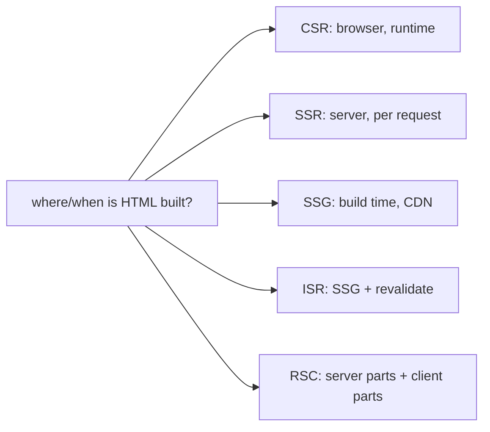
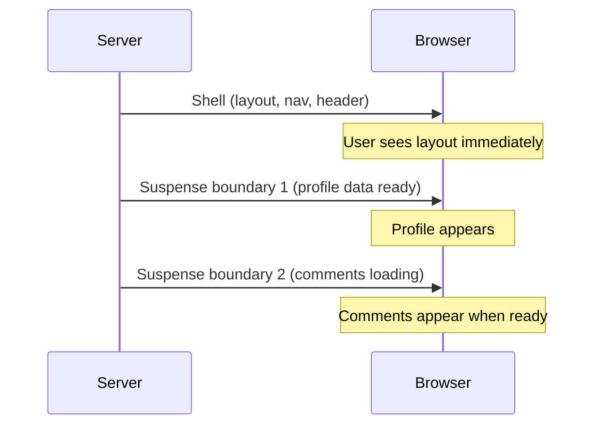

## The Blank Screen Problem

Your app takes too long to show content. The user sees a blank white screen. The JavaScript bundle must download, parse, and execute before anything appears. Search engines see an empty page. You try server-side rendering. The first paint is fast now, but the page is not interactive — users click buttons and nothing happens.

Here is what nobody tells you upfront: there is no single "best" rendering strategy. Every approach is a tradeoff. The real skill is knowing which tradeoff fits which page.

## The Mental Model

The only question is: **where and when does the HTML get built?** Four places and times:

1. **CSR** — in the browser at runtime. Blank screen, then JS builds the DOM.
2. **SSR** — on the server per request. HTML appears fast, but JS must hydrate before interactivity.
3. **SSG** — at build time. Prebuilt HTML on a CDN. Fastest delivery.
4. **ISR** — SSG plus revalidation. Stale pages rebuild in the background.

Plus **RSC** (React Server Components), which splits the component tree into server-rendered (no JS shipped) and client-interactive parts.

**Analogy:** A restaurant has three models. A food truck optimizes for speed. A fine dining restaurant optimizes for experience. A buffet optimizes for variety. Trying to run all three from one kitchen is chaos. Pick the model that fits each page.

The core insight: **rendering strategy is a per-page decision, not an app-wide decision.**



```
                     first paint   freshness     server cost   SEO    interactivity
CSR (Vite SPA)        slow*         always live    none         poor   full (after JS)
SSR                   fast          per request    high         good   full (after hydrate)
SSG                   fastest       stale          CDN-cheap    good   full (after hydrate)
ISR                   fastest       near-live      low          good   full (after hydrate)
RSC                   fast          flexible       medium       good   only client parts ship JS
* CSR first paint is blank until JS bundle downloads and executes
```

## CSR vs SSR Timeline

```
CSR:
  request -> server sends empty div + bundle.js
  browser: download JS -> execute -> React renders -> DOM appears
  user sees: BLANK until JS finishes

SSR:
  request -> server runs React -> sends full HTML
  browser: paint HTML immediately (visible, NOT interactive)
           -> download JS -> hydrate (attach listeners) -> interactive
  user sees: content FAST, clickable later
```

## Hydration

After SSR, SSG, or ISR deliver HTML, React must hydrate on the client. `hydrateRoot` walks the existing DOM, matches nodes to the virtual DOM, and attaches event listeners. The page is visible but not interactive during this gap.

If server HTML and client render do not match (e.g., `Date.now()` in render), React discards the server HTML entirely and re-renders from scratch — extremely expensive.

Hydration cost hurts INP (Interaction to Next Paint). The user sees buttons but clicking them does nothing until hydration completes.

## Streaming SSR — Progressive Rendering

Traditional SSR waits for the entire component tree to render before sending any HTML. Streaming SSR sends HTML in chunks as they become ready:



```jsx
// Server
import { renderToPipeableStream } from "react-dom/server";

app.get("/", (req, res) => {
  const { pipe, abort } = renderToPipeableStream(<App />, {
    bootstrapScripts: ["/client.js"],
    onShellReady() {
      res.setHeader("content-type", "text/html");
      pipe(res); // start streaming immediately
    },
  });
});
```

**How it works:**
1. React renders the shell (layout, nav, static content) and sends it immediately
2. Suspense boundaries with pending data show fallbacks
3. When data resolves, React streams the resolved HTML and patches the DOM
4. The browser progressively renders each chunk

**Benefits:**
- Time to First Byte (TTFB) improves dramatically — no waiting for slow data
- Time to First Paint improves — user sees layout immediately
- Works with React Suspense — each `<Suspense>` boundary is an independent streaming boundary

### Selective Hydration

With streaming SSR, React can hydrate visible components first. If a Suspense boundary resolves early, React hydrates that part before the rest:

```jsx
<Suspense fallback={<Skeleton />}>
  <UserProfile />  {/* hydrates first — visible and interactive */}
</Suspense>
<Suspense fallback={<Skeleton />}>
  <Comments />     {/* hydrates later — still loading */}
</Suspense>
```

The user can interact with `UserProfile` while `Comments` is still loading. This improves INP.

## React 19 Features

### `use()` — Unwrap Promises in Render

```jsx
function UserProfile({ userPromise }) {
  const user = use(userPromise); // suspends until resolved
  return <h1>{user.name}</h1>;
}
```

`use()` is like `await` but works during render. It suspends the component until the promise resolves. Works with Suspense for loading states and Error Boundary for rejection.

### Server Actions

```jsx
// Server Action — runs on the server, no API route needed
async function createTodo(formData) {
  "use server";
  const title = formData.get("title");
  await db.todos.create({ data: { title } });
  revalidatePath("/todos");
}

// Client component
<form action={createTodo}>
  <input name="title" />
  <button type="submit">Add</button>
</form>
```

Server Actions let client components call server functions directly. No fetch, no API route, no loading state management. React handles the transition, pending state, and error handling.

### `useFormStatus` and `useOptimistic`

```jsx
function SubmitButton() {
  const { pending } = useFormStatus(); // reads parent <form>'s status
  return <button disabled={pending}>{pending ? "Saving..." : "Save"}</button>;
}

function TodoList({ todos, addTodo }) {
  const [optimisticTodos, addOptimistic] = useOptimistic(
    todos,
    (state, newTodo) => [...state, { ...newTodo, pending: true }]
  );
  // optimisticTodos shows the new todo immediately before server confirms
}
```

## Edge Rendering

Run your server code at the CDN edge — close to the user, not in a single region:

```
User in Tokyo → Edge node in Tokyo → SSR → response
User in London → Edge node in London → SSR → response
```

**Benefits:** Lower latency (edge nodes are `{'<'}50ms` from users), automatic geo-distribution.

**Limitations:** No Node.js APIs (no `fs`, no native modules), limited runtime (Vercel Edge uses V8 isolates, Cloudflare Workers use V8 isolates). Cold starts are fast, but execution time is limited (typically 30s).

**When to use:** SSR for pages with mostly static content + a few dynamic slots. API routes that do light computation. Not for heavy server-side logic.

## Common Mistakes

- Using SSG for highly dynamic per-user data — data is stale until rebuild.
- Forgetting the SPA server fallback for deep links — causes 404s on direct navigation.
- Over-engineering a simple authenticated dashboard with SSR or RSC when CSR works fine.
- Not measuring hydration cost — fast SSR does not guarantee good INP.

## Q&A

**Q: CSR vs SSR — when does the user first see content, first interact?**
CSR: first content appears after JS downloads, parses, and React renders (2-5s on 3G). SSR: first content appears immediately (server-rendered HTML), but interaction waits for hydration (JS download + execution). The gap between visible and interactive is what hurts INP.

**Q: What is hydration?**
React walks the existing server-rendered HTML, matches it to the virtual DOM, and attaches event listeners — without creating new DOM nodes. If server and client output mismatch, React discards the HTML and re-renders entirely.

**Q: What does RSC change about the bundle?**
Server components ship zero JS. Their output is serialized as the RSC payload. Only client components (`"use client"`) ship JavaScript and hydrate. This reduces bundle size and hydration cost.

**Q: How does client-side routing change the URL without reloading?**
The router calls `history.pushState()` which updates the address bar and pushes a history entry — no page reload. The router reads the URL, matches it to a route, and renders the component. `popstate` fires on back/forward navigation.

## Mental Trigger

**Where and when is the HTML built? That decides everything.**
