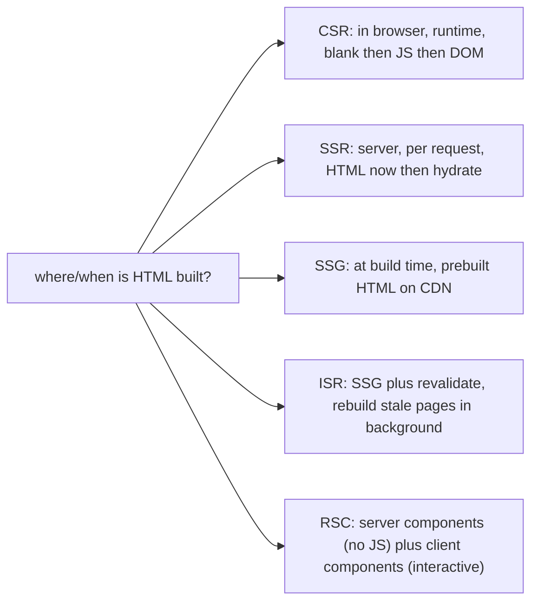

## Problem

Your app takes too long to show content. The user sees a blank white screen. The JavaScript bundle must download, parse, and execute before anything appears. This hurts first impressions and SEO. Search engines see an empty page. You try server-side rendering. The first paint is fast now, but the page is not interactive. Users click buttons and nothing happens. The page feels broken. Each fix introduces a new problem.

## Why Existing Solution Failed

The single-page application model, CSR, sent a nearly empty HTML file with a JavaScript bundle. The browser had to download, parse, compile, and execute the entire JS bundle before rendering anything useful. This could take seconds on slow networks or devices. SEO suffered because crawlers did not execute JavaScript reliably.

SSR fixed the blank screen but introduced hydration. The server rendered HTML, but React had to re-run on the client to attach event handlers. Users saw content fast but could not interact with it until hydration finished. The page was visible but dead. This visible-but-unresponsive gap hurt Core Web Vitals, especially INP.

SSG fixed both problems for static content but broke for dynamic or personalized data. Every user got the same prebuilt HTML. You could not show user-specific content without client-side fetching, which brought back the CSR blank state for that data.

The real problem was not the strategy itself. It was picking one strategy for the whole app. Different pages have different needs. Different parts of a page have different interactivity needs.

## Mental Model

The only question is: WHERE and WHEN does the HTML get built? There are four places and times. In the browser at runtime (CSR). On the server per request (SSR). At build time (SSG). Or a hybrid that rebuilds stale pages (ISR). Plus RSC, which splits a component tree into server-rendered and client-interactive parts. Each choice trades off time to content, server cost, freshness, and interactivity. Pick by asking: how fresh must this be, how fast must first paint be, and how interactive is it.

## Visualization



Tradeoff table:

```
                     first paint   freshness     server cost   SEO    interactivity
CSR (Vite SPA)        slow*         always live    none         poor   full (after JS)
SSR                   fast          per request    high         good   full (after hydrate)
SSG                   fastest       stale till build CDN-cheap   good   full (after hydrate)
ISR                   fastest       near-live       low          good   full (after hydrate)
RSC                   fast          flexible        medium       good   only client parts ship JS
* CSR first paint is blank until JS bundle downloads and executes
```

CSR vs SSR timeline:

```
CSR:
  request -> server sends empty div + bundle.js
  browser: download JS -> execute -> React renders -> DOM appears -> interactive
  user sees: BLANK until JS finishes

SSR:
  request -> server runs React -> sends full HTML
  browser: paint HTML immediately (visible, NOT interactive)
           -> download JS -> HYDRATE (attach event listeners) -> interactive
  user sees: content FAST, clickable later
```

## Engine Simulation

CSR loading sequence:

1. Browser requests page. Server returns HTML with `<div id="root"></div>` and a `<script>` tag pointing to bundle.js.
2. Browser downloads bundle.js. This can be 100KB to 1MB or more gzipped.
3. Browser parses and compiles the JavaScript.
4. React renders the component tree, creating virtual DOM and committing to real DOM.
5. The page appears all at once. The user saw nothing until this moment.

Internally, the browser's HTML parser encounters the empty root div and the script tag. It stops parsing HTML when it hits the script tag (unless the script is async or defer). It downloads, parses, and executes the JavaScript. Only after execution finishes does the browser have content to paint. The white screen duration equals JS download time plus parse time plus compile time plus React render time.

SSR loading sequence:

1. Browser requests page. Server runs `ReactDOMServer.renderToString(<App />)`. This produces a string of HTML.
2. Server sends the full HTML with embedded `<script>` tags for hydration.
3. Browser paints the HTML immediately. The user sees content.
4. Browser downloads the JS bundle while content is visible.
5. React hydrates. It renders components on the client, matching against the existing DOM. It attaches event handlers.
6. The page becomes interactive. There is a gap between visible and interactive.

Internally, `renderToString` walks the React component tree synchronously. It calls each component's render function, produces React elements, and serializes them to an HTML string. It does not support Suspense or streaming in its basic form. During hydration, React calls `hydrateRoot` instead of `createRoot`. React renders the component tree, produces a virtual DOM, then walks the existing real DOM and matches nodes to the virtual DOM. It does not create new DOM nodes. It attaches event listeners and builds the fiber tree. If server HTML and first client render do not match, React discards the server HTML and re-renders the entire tree on the client. This is expensive.

## Internal Implementation

**CSR:**
- Server returns minimal HTML shell with root div and script tags.
- Browser downloads and executes JavaScript.
- React creates DOM from scratch using `createRoot` and `render`.
- No server-side computation. Server is a static file server.
- All routing, data fetching, and rendering happens on the client.

**SSR:**
- Server hosts Node.js application that imports React components.
- `ReactDOMServer.renderToString(<App />)` produces HTML string.
- Server injects HTML into template and sends response.
- Client receives HTML and calls `hydrateRoot(<App />, document.getElementById('root'))`.
- React attaches event listeners without recreating DOM nodes.

**SSG:**
- At build time a script renders each page to an HTML file.
- HTML files are deployed to a CDN.
- Browser receives prebuilt HTML. No server runs on request.
- Hydration still happens on the client for interactivity.

**ISR:**
- Like SSG, pages are prebuilt at build time.
- On first request after a configured time, server generates a new version in the background.
- Stale page is served immediately. New version replaces it when ready.
- Keeps freshness without rebuilding the entire site.

**RSC:**
- Server components run on the server. They return a serialized format called the RSC payload, not HTML.
- The RSC payload is a stream of JSON-like chunks describing the component tree.
- Client components are marked with `"use client"` directive. Their JavaScript ships to the browser.
- Browser receives server component output (no JS for it) and client component bundles (with JS).
- React reconciles the RSC payload with the client component tree.

## Real World Example

A marketing website with a blog, documentation, and a dashboard.

The marketing pages do not change often. SEO matters. First paint must be fast. These are a perfect fit for SSG. Generate HTML at build time. Cache on CDN. Fastest possible delivery. The blog posts are published occasionally. ISR works well here. Prebuild on deploy. Revalidate individual posts when they update. No full rebuild needed.

The documentation is similar to the blog. SSG or ISR works. Fast and cacheable.

The dashboard shows user-specific data. Every user sees different content. SEO does not matter because it is behind authentication. CSR is fine. The user already logged in and the app is interactive. No need for SSR or SSG for authenticated pages. The tradeoff of faster first paint does not apply to a returning user.

A common mistake is to use SSR everywhere because "it is faster." SSR improves first paint for the first page load but adds server cost and hydration overhead. For marketing pages, SSG is faster than SSR because the HTML is prebuilt and served from CDN edge. For the dashboard, CSR is simpler and cheaper. Each page gets the strategy that fits its requirements.

Internally, when a user hits an SSG page, the CDN serves a prebuilt HTML file. No server function runs. The browser receives the full HTML immediately. When the user hits an ISR page that is stale, the CDN serves the stale HTML first, then triggers a serverless function to rebuild that page in the background. The fresh version replaces the stale one on the CDN for the next request. This gives the speed of SSG with the freshness of SSR for pages that change occasionally.

## Tradeoffs

| Strategy | First paint | Freshness | Server cost | SEO | Interactivity |
|---|---|---|---|---|---|
| CSR | Blank until JS loads | Always fresh | None (static files) | Poor | After JS loads |
| SSR | Fast (server builds HTML) | Per request | High (server per request) | Good | After hydration |
| SSG | Fastest (prebuilt CDN) | Stale until rebuild | Minimal (CDN) | Good | After hydration |
| ISR | Fastest (prebuilt CDN) | Stale then revalidated | Low (revalidate per page) | Good | After hydration |
| RSC | Fast | Per request for server parts | Medium | Good | Only client parts ship JS |

Hydration cost: after SSR, SSG, or ISR deliver HTML, React must still hydrate on the client. The JS bundle must be downloaded and executed. The page is visible but not interactive during hydration. Heavy hydration hurts INP. RSC and islands architecture reduce JS that must hydrate.

## Common Mistakes

- Thinking SSR makes apps faster universally. It improves first paint and SEO but adds server cost and hydration overhead. Interactivity still waits on JS.
- Using SSG for highly dynamic per-user data. Data is stale until rebuild. Use SSR, ISR, or CSR instead.
- Forgetting the SPA server fallback for deep links. This causes deep links to return 404.
- Assuming RSC equals SSR. RSC is about which components ship JS, not just where HTML is built.
- Over-engineering a simple authenticated dashboard with SSR or RSC when CSR works fine.
- Not measuring the hydration cost. A page that renders fast with SSR can still have poor INP if hydration is heavy.

## SDE-2 Interview Answer

**Mid-level variant:**

"The rendering strategy depends on where and when HTML is built. CSR builds HTML in the browser after JS loads. It is simple but has a blank screen. SSR builds HTML on the server per request. It gives fast first paint but the page is not interactive until hydration finishes. SSG builds HTML at build time on the CDN. It is fast but stale. ISR adds background revalidation to SSG. RSC splits components into server parts (no JS) and client parts (interactive with JS). I pick CSR for authenticated apps where SEO does not matter. I pick SSR or SSG for public content that needs SEO."

**Senior variant:**

"I choose the rendering strategy per page, not per app. Public marketing pages use SSG or ISR for fast CDN delivery and SEO. Blog posts use ISR for freshness without full rebuilds. The authenticated dashboard uses CSR because the user is logged in and values interactivity over first paint. I consider hydration cost carefully. If SSR makes the page visible but hydration takes three seconds, the INP suffers. I measure with Lighthouse and Web Vitals. RSC is interesting for reducing JS shipped, but it needs a framework that supports it like Next.js App Router."

**Engineering Lead variant:**

"I define the rendering strategy for the architecture. We use CSR for the main app because it is a dashboard with authentication. SEO is not relevant. Server cost is zero for static file serving. For the public marketing site and blog we use SSG with ISR for content updates. Each new page gets a strategy assigned based on three criteria: how fresh must it be, how fast must first paint be, and how interactive is it. I ensure the team understands the hydration cost. We profile SSR pages to measure time-to-interactive. If hydration is slow we investigate partial hydration or lazy-loading non-critical components. The team knows the difference between SSR and RSC. SSR builds HTML on the server per request. RSC decides which components ship JS to the client."

## Follow-up Questions

1. Place CSR, SSR, SSG, and ISR on first-paint, freshness, and server-cost axes. Give a realistic use case for each.
2. Walk the CSR vs SSR load timeline. When does the user first see content? When does the user first interact?
3. What is hydration? How does it relate to INP? What happens if the server HTML and client render do not match?
4. What does RSC change about the JavaScript bundle? What still ships JS and what does not? What is the RSC payload?
5. How does client-side routing change the URL without a page reload? (tie to History API, pushState, popstate)

## Mental Trigger

Where and when is the HTML built? That decides everything.

## One Page Revision

- Rendering strategy = where and when HTML is built.
- CSR: browser at runtime. Simple but blank until JS loads.
- SSR: server per request. Fast first paint, but visible-not-interactive gap.
- SSG: build time. Fastest delivery, stale until next build.
- ISR: SSG plus revalidation. Fresh without full rebuild.
- RSC: server components ship no JS. Client components ship JS and hydrate.
- Hydration: React attaches listeners to server HTML. Costs JS download and execution.
- Hydration mismatch causes React to discard server HTML and re-render on client. Very expensive.
- Pick strategy per page, not per app. Consider freshness, first paint, server cost, SEO, interactivity.
- CSR is fine for authenticated apps. SSG or ISR is better for public content. SSR adds cost for first paint gain.
- RSC is relevant only with frameworks that support it (Next.js App Router).
- Measure time-to-interactive. Fast first paint does not guarantee good INP.
