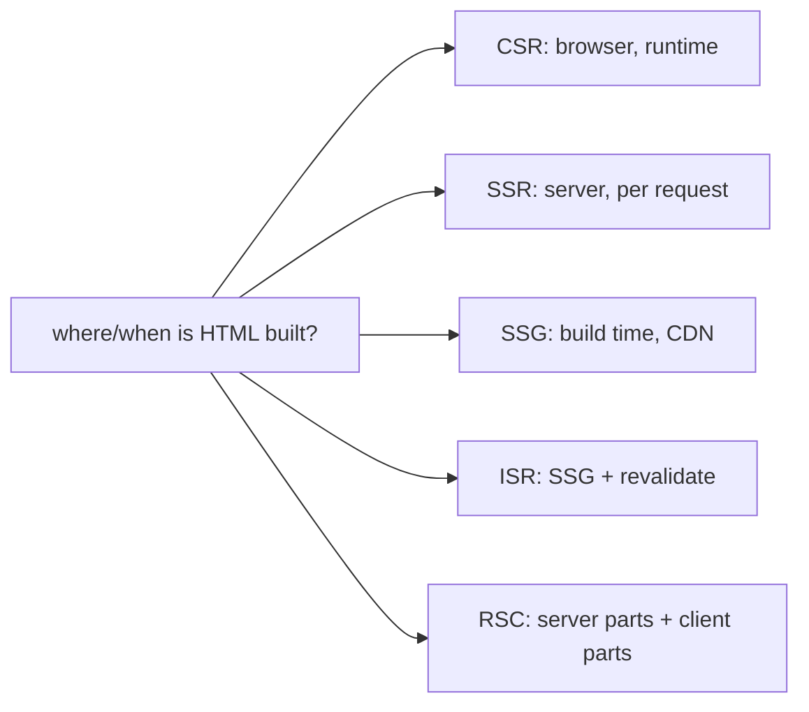

## The Blank Screen Problem

Your app takes too long to show content. The user sees a blank white screen. The JavaScript bundle must download, parse, and execute before anything appears. Search engines see an empty page. You try server-side rendering. The first paint is fast now, but the page is not interactive — users click buttons and nothing happens.

Here is what nobody tells you upfront: there is no single "best" rendering strategy. Every approach is a tradeoff. The real skill is knowing which tradeoff fits which page.

## The Mental Model

The only question is: **where and when does the HTML get built?** Four places and times:

1. **CSR** — in the browser at runtime. Blank screen, then JS builds the DOM.
2. **SSR** — on the server per request. HTML appears fast, but JS must hydrate before interactivity.
3. **SSG** — at build time. Prebuilt HTML on a CDN. Fastest delivery.
4. **ISR** — SSG plus revalidation. Stale pages rebuild in the background.

Plus **RSC** (React Server Components), which splits the component tree into server-rendered (no JS shipped) and client-interactive parts.

**Analogy:** A restaurant has three models. A food truck optimizes for speed. A fine dining restaurant optimizes for experience. A buffet optimizes for variety. Trying to run all three from one kitchen is chaos. Pick the model that fits each page.

The core insight: **rendering strategy is a per-page decision, not an app-wide decision.**



```
                     first paint   freshness     server cost   SEO    interactivity
CSR (Vite SPA)        slow*         always live    none         poor   full (after JS)
SSR                   fast          per request    high         good   full (after hydrate)
SSG                   fastest       stale          CDN-cheap    good   full (after hydrate)
ISR                   fastest       near-live      low          good   full (after hydrate)
RSC                   fast          flexible       medium       good   only client parts ship JS
* CSR first paint is blank until JS bundle downloads and executes
```

## CSR vs SSR Timeline

```
CSR:
  request -> server sends empty div + bundle.js
  browser: download JS -> execute -> React renders -> DOM appears
  user sees: BLANK until JS finishes

SSR:
  request -> server runs React -> sends full HTML
  browser: paint HTML immediately (visible, NOT interactive)
           -> download JS -> hydrate (attach listeners) -> interactive
  user sees: content FAST, clickable later
```

## Hydration

After SSR, SSG, or ISR deliver HTML, React must hydrate on the client. `hydrateRoot` walks the existing DOM, matches nodes to the virtual DOM, and attaches event listeners. The page is visible but not interactive during this gap.

If server HTML and client render do not match (e.g., `Date.now()` in render), React discards the server HTML entirely and re-renders from scratch — extremely expensive.

Hydration cost hurts INP (Interaction to Next Paint). The user sees buttons but clicking them does nothing until hydration completes.

## RSC: What Ships JS, What Does Not

Server components run on the server. Their JavaScript never ships to the browser. Client components (marked `"use client"`) ship JS and hydrate normally.

The RSC payload is a streaming JSON-like format describing the component tree. Server component output is serialized statically. Client component bundles ship separately. Net effect: the JS bundle contains only client component code.

You can import large libraries (markdown parsers, syntax highlighters) in server components without affecting bundle size.

## When to Use What

| Strategy | Best for | Avoid when |
|---|---|---|
| CSR | Authenticated dashboards | SEO matters, first paint matters |
| SSR | Personalized per-request pages | Static content (SSG is faster) |
| SSG | Marketing pages, docs | Dynamic per-user data |
| ISR | Product pages that update occasionally | Real-time data |
| RSC | Mixed static + interactive pages | Simple apps without framework support |

A common mistake is using SSR everywhere because "it is faster." SSR improves first paint but adds server cost and hydration overhead. For marketing pages, SSG is faster (CDN edge). For dashboards, CSR is simpler and cheaper.

## Common Mistakes

- Using SSG for highly dynamic per-user data — data is stale until rebuild.
- Forgetting the SPA server fallback for deep links — causes 404s on direct navigation.
- Over-engineering a simple authenticated dashboard with SSR or RSC when CSR works fine.
- Not measuring hydration cost — fast SSR does not guarantee good INP.

## Q&A

**Q: CSR vs SSR — when does the user first see content, first interact?**
CSR: first content appears after JS downloads, parses, and React renders (2-5s on 3G). SSR: first content appears immediately (server-rendered HTML), but interaction waits for hydration (JS download + execution). The gap between visible and interactive is what hurts INP.

**Q: What is hydration?**
React walks the existing server-rendered HTML, matches it to the virtual DOM, and attaches event listeners — without creating new DOM nodes. If server and client output mismatch, React discards the HTML and re-renders entirely.

**Q: What does RSC change about the bundle?**
Server components ship zero JS. Their output is serialized as the RSC payload. Only client components (`"use client"`) ship JavaScript and hydrate. This reduces bundle size and hydration cost.

**Q: How does client-side routing change the URL without reloading?**
The router calls `history.pushState()` which updates the address bar and pushes a history entry — no page reload. The router reads the URL, matches it to a route, and renders the component. `popstate` fires on back/forward navigation.

## Mental Trigger

**Where and when is the HTML built? That decides everything.**
