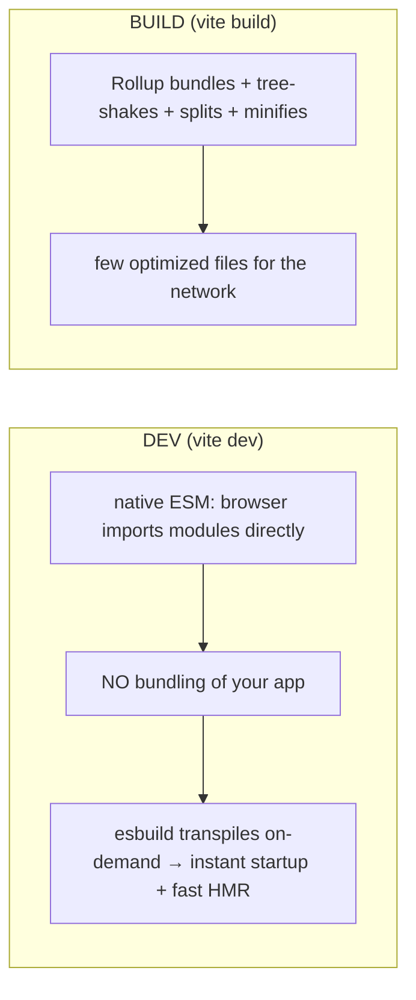

> **Prerequisites:** understanding of JavaScript loading and parsing costs. You need to know why smaller bundles load faster. You need performance strategies like shipping less code and splitting bundles. You also need to know that SSR produces a bundle sent to the browser.

---

## The one mental model

> **A bundler is a GRAPH OPTIMIZER. It starts at your entry file. It follows every `import` to build
> a dependency graph of modules. Then it emits the smallest, fastest set of files the browser can
> load. It has two jobs. One: RESOLVE and COMBINE modules so the browser makes few requests.
> Two: SHIP LESS. Drop unused code (tree-shaking). Split rarely-used code into separate chunks
> (code-splitting). Minify. Everything, including ESM vs CJS, Vite's dev-vs-build split, and source maps, serves
> the goal of "build the graph, then ship the least JS possible."**

From "graph optimizer that ships less" you understand why ESM (static imports) enables tree-shaking.
CJS (dynamic require) cannot do this. You understand why Vite is fast in dev (native ESM, no bundling) but bundles
for prod (Rollup). You understand why code-splitting helps first load.

---

## Learning Objectives

1. Explain the module graph and ESM vs CJS (and why ESM enables tree-shaking).
2. Explain tree-shaking and code-splitting as "ship less / ship later."
3. Explain Vite's two-mode design (esbuild dev server + Rollup prod build) and why.
4. Know what source maps and minification do.

---

## Key Mental Models

- **Build = walk imports → dependency graph → emit optimized files.**
- **ESM is static** (`import` at top, analyzable) → enables tree-shaking. **CJS is dynamic**
  (`require()` anywhere) → hard to shake.
- **Tree-shaking** drops unused exports; **code-splitting** defers rarely-used code to lazy chunks.
- **Vite dev = unbundled native ESM (instant HMR); Vite build = bundled (Rollup) for the network.**

---

## Introduction

"Why is my bundle huge?" "Why is my dev server fast?" "Why is this import not tree-shaken?" These are real SDE-2
questions. The job description names Vite. The whole area becomes small once you see the bundler as a graph
optimizer whose job is shipping less.

---

## Problem: modules and why bundling existed

The browser can fetch JS. But hundreds of separate module files mean hundreds of requests. This is slow,
especially before HTTP/2 (Ch 13). Browsers historically could not run Node's CJS `require`. So bundlers
combine modules into a few files and transform the syntax. Module systems:

- **CommonJS (CJS)** uses Node's `require()` and `module.exports`. It is **dynamic**. You can `require()`
  conditionally at runtime. So a tool cannot statically know which exports are used. This means poor
  tree-shaking.
- **ES Modules (ESM)** use `import` and `export`. They are **static**. Imports are top-level and resolved before
  running. They are statically analyzable. The bundler *knows* exactly which exports each module uses and
  drops the rest. ESM is the modern standard and the reason tree-shaking works.

```mermaid
flowchart TD
  entry["entry: main.tsx"] --> a[import App]
  a --> b[import Button from ui]
  a --> c[import { debounce } from lodash-es]
  b --> d[import styles]
  subgraph graph["dependency graph"]
    entry; a; b; c; d
  end
  graph --> opt["tree-shake unused + split + minify"] --> out["few optimized files"]
```

---

## Tree-shaking & code-splitting (ship less / later)

```js
// tree-shaking: import one function from a 70-fn library
import { debounce } from "lodash-es";   // ESM → bundler includes ONLY debounce, drops the rest
import _ from "lodash";                 // CJS default import → often pulls the WHOLE library

// code-splitting: defer a route's code to a separate chunk loaded on demand
const Settings = lazy(() => import("./Settings"));   // its JS only downloads when navigated to
```

- **Tree-shaking** means dead-code elimination across the ESM graph. Unused exports never reach the
  bundle. It requires ESM and side-effect-free modules. Setting `"sideEffects": false` in package.json helps.
- **Code-splitting** means breaking the graph at `import()` boundaries into chunks. The entry bundle
  shrinks. Rarely-used code loads later (Ch 08 "ship less now"). Route-level splitting is the
  most effective form of code-splitting.

---

## Vite's two modes: why it is fast in dev



- **Dev:** the browser supports native ESM. So Vite serves your modules **unbundled** and only
  transpiles what is requested. It uses esbuild, which is written in Go and very fast. The result is near-instant
  server start and HMR that updates only the changed module. This works regardless of app size. Webpack
  bundled everything up front and got slow as apps grew.
- **Build:** unbundled ESM means too many requests for production. So Vite uses **Rollup** to bundle,
  tree-shake, code-split, and minify into a few cache-friendly files.

Two modes because dev optimizes *iteration speed* and prod optimizes *network delivery*. These are different
goals that need different tools.

---

## Source maps & minification

- **Minification** strips whitespace/comments and shortens names → smaller bundle (less to
  download/parse, Ch 02). Done at build.
- **Source maps** map minified prod code back to your original source so stack traces and
  debugging (and Sentry, Ch 22) point to real lines. Ship them to your error tracker, not always
  to users.

---

## Interview Discussion (reason first)

**Q1. "Why is Vite's dev server so fast?"**
> "In dev it does not bundle your app. It serves native ESM so the browser imports modules
> directly. It transpiles on demand with esbuild, which is written in Go and very fast. Startup and HMR do not slow down
> with app size like Webpack's full bundling did. For production it switches to Rollup to bundle,
> tree-shake, and split. Unbundled ESM means too many requests for production."

**Q2. "Why does ESM tree-shake but CJS often does not?"**
> "ESM imports are static and top-level. So the bundler can statically decide exactly which
> exports are used and drop the rest. CJS `require()` is dynamic and runtime. So the tool cannot
> be sure what is used and tends to include everything."

**Q3. "My bundle is huge. How do you fix it?"**
> "Analyze it with rollup-plugin-visualizer. Import named ESM exports, not whole libraries. Use route-
> level code-splitting with `lazy` and `import()`. Drop heavy dependencies or swap for lighter ones. Make sure
> tree-shaking is not blocked by side effects. Measure first, then cut the biggest chunks (Ch 08)."

*Scoring:* full = graph-optimizer + ESM-static-enables-shaking + Vite dev/build split.

---

## Common Mistakes

- **`import _ from "lodash"`** (whole library) instead of `lodash-es` named imports. This prevents tree-shaking.
- **No code-splitting.** One giant entry bundle blocks first paint.
- **Assuming dev performance equals prod performance.** Dev is unbundled. Prod is bundled.
- **Side-effectful modules** that silently defeat tree-shaking.
- **Shipping source maps publicly** when they should only go to the error tracker.

---

## Interview Questions

1. What does a bundler do, start to finish? (entry → graph → optimize → emit.)
2. ESM vs CJS. Why does the difference matter for tree-shaking?
3. Why is Vite fast in dev and what changes for the production build?
4. How does code-splitting help first load, and where do you split?
5. What are source maps for, and where should they go?

---

## Homework

1. Add `rollup-plugin-visualizer` to a Vite build; find the biggest dependency; replace a whole-
   library import with named ESM imports and re-measure.
2. Route-split a page with `React.lazy` + `Suspense`; confirm a separate chunk loads on navigation
   in the Network tab.
3. In `NOTES.md`: bundler-as-graph-optimizer + ESM-vs-CJS-shaking + Vite dev/build in 3 lines.

---

## Summary

- A **bundler is a graph optimizer**. It walks imports to build a dependency graph. Then it emits the fewest, smallest
  files. Two jobs: **resolve and combine** and **ship less** (tree-shake, split, minify).
- **ESM is static and tree-shakeable. CJS is dynamic and not tree-shakeable.** You can drop unused exports only with ESM.
- **Code-splitting** defers rarely-used code to lazy chunks. You ship less now (Ch 08).
- **Vite** uses unbundled native ESM with esbuild in **dev** for instant HMR. It uses **Rollup** bundling in
  **build** for network-optimized output. Different goals need different tools.
- **Minification** shrinks the bundle. **Source maps** map prod code back to source for debugging and Sentry (Ch 22).

## Go deeper
Ch 08 (bundle as a perf lever), Ch 19 (what the bundle feeds), Ch 22 (source maps + Sentry). Vite
and Rollup docs are the reference once this model is solid.
