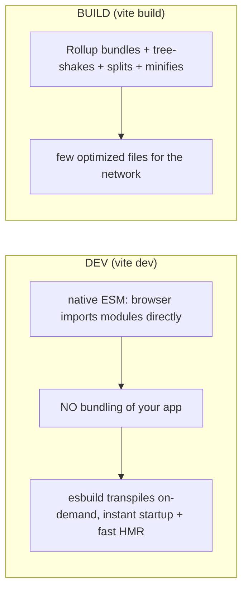

> **Prerequisites:** understanding of JavaScript loading and parsing costs. You need to know why smaller bundles load faster. You need performance strategies like shipping less code and splitting bundles. You also need to know that SSR produces a bundle sent to the browser.

---

## The 70KB Library You Never Asked For

Your bundle is huge. The dev server is slow. You ship a full library but use one function. Your app takes seconds to load on a slow network. These are real SDE-2 questions. The job description names Vite. The whole area becomes small once you see the bundler as a graph optimizer whose job is shipping less.

The browser can fetch JavaScript. But hundreds of separate module files mean hundreds of requests. This is slow, especially before HTTP/2. Browsers historically could not run Node's CJS `require`. So bundlers combine modules into a few files and transform the syntax.

Here is the mistake that wastes kilobytes on every deploy: `import _ from "lodash"` brings in the entire 70KB library. You use one function. The bundler cannot help you because CJS does not let it know what you actually need.

## Why CJS Broke the Browser

Before bundlers, you loaded scripts with individual `<script>` tags. Every dependency was a separate HTTP request. This worked for small apps but collapsed as apps grew. You also had global scope pollution. One library overwrote another's globals. There was no dependency management.

CommonJS (CJS) came from Node. It was better: explicit requires, no globals. But CJS has a fatal flaw for browsers. `require()` is dynamic. You can call it conditionally at runtime. A tool cannot statically know which exports are used. So it cannot safely drop unused code. CJS was designed for servers where loading cost is irrelevant. It was not designed for browsers where every kilobyte matters.

```js
// CJS require is dynamic. The bundler cannot analyze this statically.
const lib = someCondition ? require("heavy-lib") : require("light-lib");
// The bundler must include both because it doesn't know which path runs.
```

The bundler conservatively includes everything from a CJS module. You pay for code you never use.

Think of CJS like a restaurant that preps every dish on the menu every morning, even though most will never be ordered. Wasteful, but safe. ESM is like ordering — the kitchen only prepares what you ask for.

## The Mental Model: Graph Optimizer That Ships Less

A bundler is a GRAPH OPTIMIZER. It starts at your entry file. It follows every `import` to build a dependency graph of modules. Then it emits the smallest, fastest set of files the browser can load. It has two jobs. One: RESOLVE and COMBINE modules so the browser makes few requests. Two: SHIP LESS. Drop unused code (tree-shaking). Split rarely-used code into separate chunks (code-splitting). Minify. Everything, including ESM vs CJS, Vite's dev-vs-build split, and source maps, serves the goal of "build the graph, then ship the least JavaScript possible."

The core insight: **ESM is static and analyzable. CJS is dynamic and opaque. That one difference determines everything about what a bundler can optimize.**

From "graph optimizer that ships less" you understand why ESM (static imports) enables tree-shaking. CJS (dynamic require) cannot do this. You understand why Vite is fast in dev (native ESM, no bundling) but bundles for prod (Rollup). You understand why code-splitting helps first load.

## Visualization

```mermaid
flowchart TD
  entry["entry: main.tsx"] --> a[import App]
  a --> b[import Button from ui]
  a --> c[import { debounce } from lodash-es]
  b --> d[import styles]
  subgraph graph["dependency graph"]
    entry; a; b; c; d
  end
  graph --> opt["tree-shake unused + split + minify"] --> out["few optimized files"]
```

The dependency graph starts at the entry file and follows every import. The bundler then optimizes and emits a few files.



Vite uses two modes. Dev uses native ESM with esbuild for fast iteration. Build uses Rollup for network-optimized output.

## Engine Simulation

Trace what happens when you write this import:

```js
import { debounce } from "lodash-es";
```

Step by step:

1. The bundler reads your entry file. It finds this import statement.
2. It resolves `lodash-es` in node_modules. It reads the package's `package.json` to find the entry point.
3. It parses the entry file of lodash-es. It builds an AST (Abstract Syntax Tree) of every export.
4. It marks `debounce` as "used." All other exports are "unused."
5. It checks each unused export for side effects. If a top-level statement runs code on import (like `console.log` or modifying a global), the bundler must keep it even if the export is unused.
6. It walks deeper into only the modules that `debounce` depends on. It follows that chain until every import resolves.
7. It dead-code eliminates everything not marked "used" and not "side-effectful."
8. It outputs a single chunk (or multiple chunks with code-splitting) containing only `debounce` and its transitive dependencies.

Result: Instead of the full 70KB lodash library, your bundle gets maybe 4KB for `debounce` plus its helpers.

Now trace what happens with CJS:

```js
import _ from "lodash";
```

Many libraries ship a CJS default export. When you `import _ from "lodash"`, the bundler sees a default import of the whole module. It cannot trace which properties are accessed because they could be accessed dynamically (`_[someKey]`). It includes the entire library. Tree-shaking is defeated.

## Internal Implementation

Tree-shaking is dead code elimination at the module boundary level. It works because ESM has a static structure. The bundler knows the full import/export relationship graph before any code runs.

Rollup (used by Vite for production builds) pioneered effective tree-shaking. It uses a technique called "live binding." It tracks exactly which bindings are imported and re-exported. It then eliminates any binding that is never referenced.

Vite uses two different tools for two different phases:

- **Dev (esbuild):** written in Go. It transpiles TypeScript and JSX on demand. It does NOT bundle your code. The browser imports modules via native ESM. This gives instant startup. HMR only re-transpiles the changed file.
- **Build (Rollup):** bundles everything. Tree-shakes, code-splits, minifies. Output is a few optimized files for the network.

```js
// esbuild in dev: transpiles one file at a time, no bundling
// Browser does: import { debounce } from "/@fs/node_modules/lodash-es/debounce.js"
// Each file is a separate HTTP request (fast with HTTP/2)

// Rollup in build: bundles everything into a few files
// Output: dist/assets/index-abc123.js (all code in one file, tree-shaken)
```

Source maps map the minified output back to your original source. They are generated during build. They should be uploaded to your error tracker (Sentry) but not always shipped to users.

## Real World Example

You have a calendar app built with Vite. The entry point imports `date-fns` for date formatting. Without tree-shaking, `date-fns` adds over 100KB to the bundle. With tree-shaking and named imports:

```js
import { format, addDays, isToday } from "date-fns";
```

The bundler includes only these three functions. The bundle shrinks from 100KB to 8KB. You also route-split your Settings page which users rarely visit. Settings code (40KB) loads only when someone navigates there.

Before optimization: initial bundle 340KB, load time 3.2 seconds on 3G.
After optimization: initial bundle 120KB, load time 1.1 seconds on 3G.

The difference came from two changes: named ESM imports instead of default imports, and route-level code-splitting. No architecture change. No library swap. Just understanding how the bundler works.

## Tradeoffs

**Native ESM in dev (Vite):** Fast startup. Instant HMR. But every module is a separate HTTP request. This works because HTTP/2 multiplexes requests. It can still fail if you have thousands of modules.

**Bundled ESM in prod (Rollup):** Fewer requests. Better compression ratio (one big file compresses better than many small ones). But the build step is slower. Changing one import can invalidate the entire bundle.

**CJS dependencies:** Many npm packages still ship CJS. They cannot be tree-shaken. You import the whole thing or nothing. This is a real problem that the ecosystem is slowly fixing.

**Side effects:** If a module has side effects (modifies a global, sets up a polyfill), the bundler must keep it even if you do not use its exports. You can tell the bundler with `"sideEffects": false` in package.json, but if you are wrong, code breaks.

**Source maps in production:** They help debugging but expose your source code. Best practice: upload to error tracker only. Do not ship to end users unless you have a privacy review.

## Common Mistakes

- `import _ from "lodash"` (whole library) instead of `lodash-es` named imports. This prevents tree-shaking.
- No code-splitting. One giant entry bundle blocks first paint.
- Assuming dev performance equals prod performance. Dev is unbundled. Prod is bundled.
- Side-effectful modules that silently defeat tree-shaking.
- Shipping source maps publicly when they should only go to the error tracker.
- Using CJS-only libraries in an ESM project without understanding the bundler penalty.

## SDE-2 Interview Answer

**Question: "How does a bundler work and why does ESM matter for tree-shaking?"**

### Mid-level

"A bundler combines multiple JavaScript files into fewer files that the browser can load efficiently. ESM imports are static, so the bundler knows which exports are used and can drop the rest. That is tree-shaking. CJS require is dynamic, so the bundler cannot do this and includes everything. Vite is fast in dev because it uses native ESM. The browser imports files directly instead of waiting for the bundler to process everything first. In production, Vite bundles with Rollup for network efficiency."

### Senior

"A bundler is a graph optimizer. It starts at the entry file and follows every import to build a dependency graph. Then it emits the smallest, fastest set of files. There are two jobs: resolve and combine modules so the browser makes few requests, and ship less through tree-shaking, code-splitting, and minification.

ESM enables this because it is static. The bundler can analyze the entire graph before executing any code. It knows exactly which exports are used and drops the rest. CJS is dynamic. `require()` can appear anywhere. The bundler cannot know which exports are used, so it conservatively includes everything.

Vite uses two different strategies because dev and prod optimize different things. Dev optimizes iteration speed. It uses native ESM with esbuild for on-demand transpilation. No bundling means instant startup and fast HMR regardless of app size. Prod optimizes network delivery. It uses Rollup to bundle, tree-shake, code-split, and minify. Unbundled ESM means too many HTTP requests for production."

### Engineering Lead

"I focus on making build performance a team concern. The first step is measuring. I add bundle analysis to CI so every PR shows before and after sizes. I set a bundle budget and make it part of the definition of done.

I establish patterns. Named ESM imports everywhere. Route-level code-splitting as the default for new pages. Side-effect tracking in package.json. I make sure the team understands that CJS dependencies have a real cost. When adding a dependency, the question is always: does it ship ESM? Can we import only what we need?

I also think about dev experience. Vite's fast dev server improves team velocity. But I ensure the production build is part of the CI pipeline. No one should be surprised that the prod bundle is much heavier than the dev experience suggests.

The organizational pattern is: measure, set standards, automate enforcement, review when new dependencies are added."

## Follow-up Questions

1. Start with an entry file. Walk through what the bundler does step by step from entry to emitted files.

**Q1: Start with an entry file. Walk through what the bundler does step by step from entry to emitted files.**

Starting from `main.tsx` as the entry:

1. **Parse**: The bundler reads `main.tsx` and parses it into an Abstract Syntax Tree (AST). It identifies every `import` statement.
2. **Resolve**: For each import (e.g., `import App from "./App"`), the bundler resolves the actual file path — checking file extensions (.tsx, .ts, .js), `index` files, and `package.json` `main`/`module` fields for node_modules.
3. **Build the dependency graph**: It recursively follows every import from every resolved module. `main.tsx` imports `App`, which imports `Button` from `./components`, which imports `styles.css`. The graph is a tree of all modules your app depends on.
4. **Transform**: Each module is transformed — TypeScript is stripped, JSX is compiled to `React.createElement` (or the automatic runtime), CSS might be extracted. In Vite dev, esbuild handles this on-demand per file. In Vite build, Rollup does it during bundling.
5. **Tree-shake**: The bundler marks which exports from each module are actually used. Unused exports are eliminated. If `lodash-es` exports 300 functions but you import `debounce`, only `debounce` and its transitive dependencies survive.
6. **Code-split**: If the bundler finds dynamic `import()` expressions (e.g., `import("./Dashboard")`), it splits those into separate chunks. The initial bundle loads first; lazy chunks load on demand.
7. **Bundle**: All remaining modules are combined into one or a few output files. References between modules are resolved — `require()` calls are replaced with inlined module code or a module registry.
8. **Minify**: Variable names are shortened, whitespace is removed, dead code is eliminated. The output shrinks significantly.
9. **Emit**: The final files are written to the output directory (e.g., `dist/`) with content hashes in filenames for cache busting.

2. A teammate imports `_ from "lodash"`. Explain why it bypasses tree-shaking and how to fix it.

**Q2: A teammate imports `_ from "lodash"`. Explain why it bypasses tree-shaking and how to fix it.**

`lodash` ships CommonJS (CJS) by default. When you `import _ from "lodash"`, the bundler sees a default import of the entire CJS module. CJS modules are opaque to the bundler — `module.exports` is a dynamic object, and properties can be accessed dynamically (`_[someKey]`). The bundler cannot statically determine which properties of `_` are actually used, so it must conservatively include the entire 70KB library. Tree-shaking requires static import/export relationships — the bundler needs to know exactly which named exports are referenced. CJS provides no such structure. The fix: switch to `lodash-es`, the ESM build of lodash. Change the import to a named import:

```js
import { debounce } from "lodash-es";
```

Now the bundler sees a named ESM import. It can statically trace that only `debounce` is used, follow its dependencies, and eliminate everything else. The bundle shrinks from ~70KB to ~4KB. The package.json can also add `"sideEffects": false` to further assist the bundler. If you must use the CJS `lodash` package, you can use babel-plugin-lodash or webpack's `ContextReplacementPlugin` to cherry-pick, but `lodash-es` with named imports is the standard solution.

3. Vite's dev server is fast for small apps. Does it stay fast as the app grows to 1000 modules? Explain why or why not.

**Q3: Vite's dev server is fast for small apps. Does it stay fast as the app grows to 1000 modules? Explain why or why not.**

Vite's dev server uses **native ESM** — the browser imports modules directly via `<script type="module">` without bundling. esbuild transpiles individual files on-demand (TypeScript, JSX) when the browser requests them. For small apps (under ~500 modules), this is near-instant: the server starts immediately, and each file is transpiled in milliseconds. At 1000+ modules, two bottlenecks emerge. First, **HTTP request waterfall**: each module is a separate HTTP request. Even with HTTP/2 multiplexing, the browser must discover, request, and resolve each module. The initial page load might need 100+ module requests before anything renders. Second, **dependency pre-bundling**: Vite pre-bundles node_modules dependencies with esbuild on first startup. A large `node_modules` with hundreds of packages can take seconds to pre-bundle. Subsequent startups use a cache, but the initial cold start slows. Vite mitigates this with `optimizeDeps` (pre-bundling) and dep caching, but the fundamental constraint remains: unbundled ESM means many HTTP requests. For very large apps (1000+ modules), the initial load has a noticeable delay compared to a bundled approach. Production builds (Rollup) don't have this issue because everything is bundled into a few files. In practice, Vite stays fast enough for most apps up to ~1000 modules, but beyond that you'll notice cold start degradation. The HMR (Hot Module Replacement) stays fast regardless because it only re-transpiles the changed file.

4. You add a charting library (200KB) but only use it on one route. How do you prevent it from blocking the initial page load? Show the code change and explain what the bundler does with it.

**Q4: You add a charting library (200KB) but only use it on one route. How do you prevent it from blocking the initial page load?**

Use **route-level code-splitting** with dynamic `import()`:

```tsx
// Before: static import — chart lib is in the initial bundle
import Chart from "./Chart";

// After: dynamic import — chart lib is in a separate chunk
const Chart = React.lazy(() => import("./Chart"));

function Dashboard() {
  return (
    <Suspense fallback={<div>Loading chart...</div>}>
      <Chart data={data} />
    </Suspense>
  );
}
```

What the bundler does: Rollup (in Vite's build) sees the `import("./Chart")` and creates a **separate chunk** — a different JavaScript file containing `Chart` and all its dependencies (the 200KB library). The initial bundle no longer includes the chart code. When the user navigates to the dashboard route, the browser fetches the chart chunk on demand. The `React.lazy` wrapper handles the loading state via `Suspense`. The result: initial page load drops by ~200KB. The chart chunk is only downloaded when the user actually needs it. You can verify this with Vite's build output — the chart chunk will have its own content hash filename. For route-level splitting, many frameworks (Next.js, React Router) support this pattern directly. The key principle: if a large dependency is only used on one route, it should not be in the initial bundle.

5. A library you depend on has `"sideEffects": true` in its package.json. You know it has no side effects. What happens to tree-shaking? How do you override this? What could go wrong?

**Q5: A library you depend on has `"sideEffects": true` in its package.json. What happens to tree-shaking? How do you override this? What could go wrong?**

When a library declares `"sideEffects": true`, the bundler treats **every module** in that package as potentially side-effectful. Even if you import only one named export, the bundler must include every module that gets pulled into the dependency graph — because any of them might run code on import (like modifying a global, registering a polyfill, or patching a prototype). Tree-shaking is effectively disabled for that package. You get the entire library in your bundle regardless of what you import. To override this, you can set `"sideEffects": false` in **your** project's `package.json` for that specific package using a glob:

```json
{
  "sideEffects": ["./src/polyfills.js", "lodash/*.js"]
}
```

Or use `/*#__PURE__*/` comments in the library's source to mark specific imports as pure. What could go wrong: if the library actually **does** have side effects (e.g., a CSS-in-JS library that injects styles on import, a polyfill that patches `Array.prototype`, or a library that calls `fetch` on import), marking it as side-effect-free tells the bundler to drop it. The code will be eliminated, and runtime behavior breaks — missing styles, missing polyfills, or silent failures. Always verify by testing the library in production mode. A safer approach: list only the side-effectful files in the `"sideEffects"` array rather than blanket-setting `false`. This preserves tree-shaking for pure modules while keeping the side-effectful ones.

## Mental Trigger

**Graph optimizer that ships less.**

## One Page Revision

- Bundler walks imports from entry point, builds dependency graph, emits optimized files.
- ESM is static and analyzable. CJS is dynamic and not analyzable.
- Tree-shaking drops unused exports. Code-splitting defers rarely-used code to lazy chunks.
- Vite dev = unbundled native ESM with esbuild for instant HMR.
- Vite build = Rollup bundles, tree-shakes, code-splits, minifies for the network.
- Side effects block tree-shaking. Use `"sideEffects": false` in package.json.
- Minification shrinks bundle size. Source maps map prod code back to source for debugging.
- Bundle analysis in CI prevents regressions. Set a budget.
