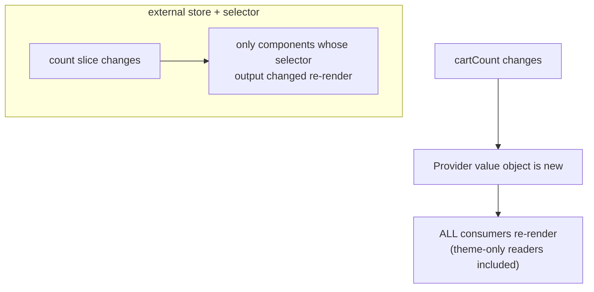

> **Prerequisites:** understanding of React re-render mechanics and hooks. You need to know how components update when state changes. You need to understand the difference between server state and client state. You also need the decision tree for where state should live in the component tree.

---

## The one mental model

> **There is no single "state." There are KINDS of state. Each kind has different access patterns.
> The right tool matches the kind. Two axes decide everything: WHO needs it (from one
> component to the whole app) and HOW OFTEN it changes or how selectively it is read. Every tool,
> including useState, useReducer, Context, Zustand, Jotai, Redux, and TanStack Query, sits on those two
> axes. Picking wrong is the root of both prop-drilling pain and global re-render pain.**

From the two axes you understand when to lift state, when Context causes problems, why external stores use
selectors, and why server state is its own universe (Ch 10). No memorizing libraries. You place
the state on the grid and read off the right tool.

---

## Learning Objectives

1. Classify state by scope × change-frequency and pick the tool from that.
2. Explain `useReducer` vs `useState` (when state transitions get complex).
3. Explain the **Context re-render problem** and how external stores (Zustand) solve it.
4. Compare Zustand / Jotai / Redux models and when each fits.

---

## Key Mental Models

- **Two axes: scope (local→global) × volatility/selectivity (rare→frequent, broad→selective).**
- **`useReducer`** centralizes complex transitions into one pure function (an interview favorite
  for "manage a multi-field form/wizard state").
- **Context delivers a value but has no selective subscription** → all consumers re-render.
- **External stores subscribe via selectors** → only components reading a changed slice re-render.

---

## Introduction

"How do you manage state in React?" is a trap if you answer with a library name. The senior answer
is the taxonomy. Most state is local. Some state is server state (Query). A little is genuinely global
client state. Only *that* kind needs a store. We make this taxonomy automatic.

---

## Problem: Context looks like a store but is not

```jsx
const AppCtx = createContext();
function Provider({ children }) {
  const [user, setUser] = useState();
  const [theme, setTheme] = useState("light");
  const [cartCount, setCartCount] = useState(0);   // changes often
  return <AppCtx.Provider value={{ user, theme, cartCount, setTheme, setCartCount }}>
    {children}</AppCtx.Provider>;
}
```

Every time `cartCount` changes, the `value` object is new. **Every component consuming `AppCtx`
re-renders**, even ones that only read `theme`. Context has no way to say "I only care about
`theme`." That is the core limitation. Context is a *dependency injection and broadcast* mechanism.
It is not a fine-grained store.



Two ways to fix this within Context: **split contexts** into separate `ThemeContext` and `CartContext` so
changes are scoped. Or memoize the value. But for state that changes often and is read widely, an
external store with selectors is the clean answer.

---

## useReducer: centralizing transitions

When state has many fields that change together with rules, scattered `useState` setters become
buggy. `useReducer` moves all transitions into one pure function:

```js
function reducer(state, action) {
  switch (action.type) {
    case "field":   return { ...state, [action.name]: action.value };
    case "submit":  return { ...state, status: "submitting", error: null };
    case "error":   return { ...state, status: "idle", error: action.error };
    default:        return state;
  }
}
const [state, dispatch] = useReducer(reducer, initial);
```

Why it helps: transitions are **testable in isolation** as a pure function. The next state is
predictable. It pairs well with discriminated-union state (Ch 09). Reach for `useReducer` when "set
this also implies set that" rules appear. Use it for wizards and forms. Redux is `useReducer` scaled to
app level with middleware and devtools.

---

## Engine Simulation: Zustand's selector subscription

```js
const useStore = create((set) => ({
  count: 0,
  user: null,
  inc: () => set((s) => ({ count: s.count + 1 })),
}));

function Counter() {
  const count = useStore((s) => s.count);   // subscribe to the count slice only
  return <button onClick={useStore.getState().inc}>{count}</button>;
}
function Profile() {
  const user = useStore((s) => s.user);     // subscribes to user only
  return <span>{user?.name}</span>;          // does NOT re-render when count changes
}
```

The store lives **outside React**. Each component's selector runs on every store change. If its
*output* has not changed (`Object.is`), React skips that component. So `inc()` re-renders `Counter`
but not `Profile`. No provider. No context-broadcast re-render. That selector subscription is the
whole reason external stores scale where Context cannot.

---

## The landscape (derived)

| Tool | Model | Reach for it when |
|---|---|---|
| `useState` | local cell | one component's state |
| `useReducer` | local plus pure transitions | complex multi-field transitions, wizards |
| **Context** | broadcast and DI, no selectors | rarely-changing global values (theme, auth, locale) |
| **Zustand** | external store plus selectors | frequent or selective global client state, minimal API |
| **Jotai** | bottom-up atoms | derived and composable atomic state, fine-grained |
| **Redux Toolkit** | single store plus reducers plus middleware | big teams, complex flows, devtools and time-travel |
| **TanStack Query** | server cache (Ch 10) | anything from a server. This is not client state |

Modern default for a new app: **Query (server) plus local state plus a little Zustand (global client)**.
Redux is still common in large and legacy codebases. It works well when its middleware ecosystem is useful.

---

## Interview Discussion (reason first)

**Q1. "Isn't Context a state manager? Why use Zustand or Redux?"**
> "Context is dependency injection plus broadcast. It is not a fine-grained store. A value change
> re-renders *all* consumers no matter what they read. It works great for rarely-changing global
> values like theme and auth. For state that changes often and is read widely, use selector subscriptions
> with Zustand, Jotai, or Redux. Only components reading the changed slice re-render."

**Q2. "useState vs useReducer?"**
> "Use useState for independent simple values. Use useReducer when transitions are complex or
> interdependent. It centralizes them in a pure, testable function and makes the next state
> predictable. It also scales conceptually to Redux."

**Q3. "How does Zustand avoid Context's re-render problem?"**
> "The store lives outside React. Components subscribe with a selector and only re-render when their
> selector's *output* changes (using Object.is). There is no provider value object, so no broadcast re-render."

*Scoring:* full = scope times volatility taxonomy + context-broadcast + selector subscription + server
state is separate. Fail = "always use Redux" or "Context is global state, done."

---

## Common Mistakes

- **One giant Context** for everything that changes often. This causes app-wide re-renders.
- **Server data in a client store.** This means re-implementing Query badly. See Ch 10.
- **Redux for trivial state.** Boilerplate with no payoff.
- **Selectors returning new objects each call** like `s => ({a: s.a})`. This always looks "changed" and defeats
  the optimization. Return primitives or use shallow-equality.
- **Lifting state too high** "just in case." This causes re-renders and coupling (Ch 11).

---

## Interview Questions

1. Place these on the scope×volatility grid and pick a tool: theme, contacts list, a modal's
   open flag, cart count read across the app, a multi-step form.
2. Write the Context re-render problem and two ways to mitigate it within Context.
3. Convert a tangle of `useState` setters into a `useReducer`; why is it more testable?
4. Explain Zustand's selector subscription and a selector that accidentally defeats it.
5. When is Redux Toolkit still the right call over Query+Zustand?

---

## Homework

1. Build a provider with `theme` + a fast-changing counter; log renders in a theme-only consumer
   and watch it re-render on counter change. Fix by splitting contexts, then by moving the counter
   to Zustand; compare.
2. Refactor a 4-field form from `useState`×4 to `useReducer`; unit-test the reducer with no React.
3. In `NOTES.md`: the scope×volatility grid with one tool per cell.

---

## Summary

- **State has kinds.** Pick by **scope times volatility and selectivity**. Most state is local. Server
  state is a cache (Query, Ch 10). Only genuinely global client state needs a store.
- **`useReducer`** centralizes complex transitions into a pure, testable function.
- **Context broadcasts.** A value change re-renders all consumers. Good for rare global values.
  Bad for hot state. Split contexts or memoize to work around this.
- **External stores (Zustand, Jotai, Redux) subscribe via selectors.** Only readers of a changed slice
  re-render. That is why they scale where Context cannot.
- Modern default: **Query plus local plus a little Zustand**. Redux for large, complex, or legacy needs.

## Go deeper
Ch 10 (server state), Ch 11 (state-location decision tree), Ch 24 (composition as a state-sharing
alternative). Zustand's docs are short and worth a full read once this model is solid.
