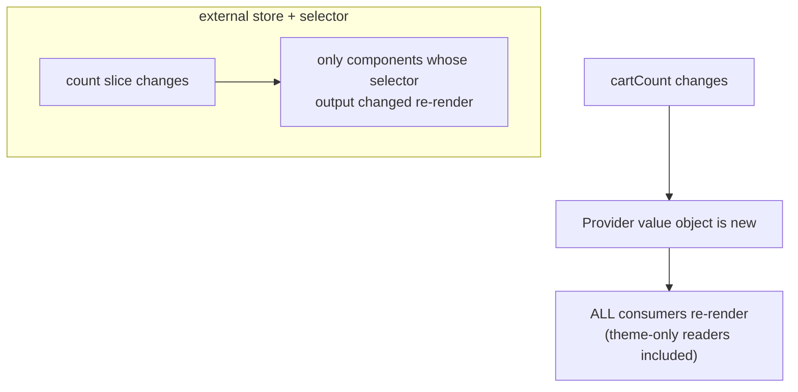

> **Prerequisites:** understanding of React re-render mechanics and hooks. You need to know how components update when state changes. You need to understand the difference between server state and client state. You also need the decision tree for where state should live in the component tree.

---

## Problem

"How do you manage state in React?" is a trap if you answer with a library name. The real problem is that most teams pick a single tool (usually Redux or Context) for everything. Then they hit pain. Components re-render too much. State is in the wrong place. Server data gets stuffed into a client store. Prop drilling spirals. The fix is not a better library. The fix is a taxonomy.

Most state is local. Some state is server state. A little is genuinely global client state. Only that kind needs a store.

## Why Existing Solution Failed

Before React had hooks, state lived in classes. You used `setState` on class components. Then Redux became the default for "serious" apps. It was overkill for most state. Every state change dispatched an action, went through a reducer, and updated a single store. Even toggle state went through this pipeline.

Then Context arrived. It looked like a store. You put everything in one provider. But Context has a critical limitation. It cannot selectively subscribe.

```jsx
const AppCtx = createContext();
function Provider({ children }) {
  const [user, setUser] = useState();
  const [theme, setTheme] = useState("light");
  const [cartCount, setCartCount] = useState(0);   // changes often
  return (
    <AppCtx.Provider value={{ user, theme, cartCount, setTheme, setCartCount }}>
      {children}
    </AppCtx.Provider>
  );
}
```

Every time `cartCount` changes, the `value` object is new. Every component consuming `AppCtx` re-renders, even ones that only read `theme`. Context has no way to say "I only care about `theme`." That is the core limitation. Context is a dependency injection and broadcast mechanism. It is not a fine-grained store.

## Mental Model

There is no single "state." There are KINDS of state. Each kind has different access patterns. The right tool matches the kind. Two axes decide everything: WHO needs it (from one component to the whole app) and HOW OFTEN it changes or how selectively it is read.

Every tool, including useState, useReducer, Context, Zustand, Jotai, Redux, and TanStack Query, sits on those two axes. Picking wrong is the root of both prop-drilling pain and global re-render pain.

From the two axes you understand when to lift state, when Context causes problems, why external stores use selectors, and why server state is its own universe. No memorizing libraries. You place the state on the grid and read off the right tool.

| Tool | Model | Reach for it when |
|---|---|---|
| `useState` | local cell | one component's state |
| `useReducer` | local plus pure transitions | complex multi-field transitions, wizards |
| **Context** | broadcast and DI, no selectors | rarely-changing global values (theme, auth, locale) |
| **Zustand** | external store plus selectors | frequent or selective global client state, minimal API |
| **Jotai** | bottom-up atoms | derived and composable atomic state, fine-grained |
| **Redux Toolkit** | single store plus reducers plus middleware | big teams, complex flows, devtools and time-travel |
| **TanStack Query** | server cache | anything from a server. This is not client state |

Modern default for a new app: Query (server) plus local state plus a little Zustand (global client). Redux is still common in large and legacy codebases. It works well when its middleware ecosystem is useful.

## Visualization



Context broadcasts changes to all consumers. External stores with selectors only update components that read the changed slice. This is the key difference.

## Engine Simulation

```js
const useStore = create((set) => ({
  count: 0,
  user: null,
  inc: () => set((s) => ({ count: s.count + 1 })),
}));

function Counter() {
  const count = useStore((s) => s.count);   // subscribe to the count slice only
  return <button onClick={useStore.getState().inc}>{count}</button>;
}
function Profile() {
  const user = useStore((s) => s.user);     // subscribes to user only
  return <span>{user?.name}</span>;          // does NOT re-render when count changes
}
```

The store lives outside React. Each component's selector runs on every store change. If its output has not changed (using `Object.is` comparison), React skips that component. So `inc()` re-renders `Counter` but not `Profile`. No provider. No context-broadcast re-render.

Here is how it works internally. When `inc()` is called, Zustand calls the update function. This creates a new state object. Zustand then runs every subscriber's selector. It compares the old selector output with the new one. If they are the same (by `Object.is`), the subscriber is skipped. If different, the subscriber tells React to re-render.

The selector output comparison is what makes external stores scale where Context cannot. Context has no selectors. It always sends a new object reference. All consumers re-render.

## Internal Implementation

useReducer centralizes complex state transitions into one pure function. This is the pattern that scales conceptually to Redux.

```js
function reducer(state, action) {
  switch (action.type) {
    case "field":   return { ...state, [action.name]: action.value };
    case "submit":  return { ...state, status: "submitting", error: null };
    case "error":   return { ...state, status: "idle", error: action.error };
    default:        return state;
  }
}
const [state, dispatch] = useReducer(reducer, initial);
```

The reducer is a pure function. Given state and action, it returns the next state. No side effects. No mutations. This makes it testable in isolation. You can unit test a reducer without rendering any React component.

Redux scales this pattern. A Redux reducer handles actions from anywhere in the app. Middleware intercepts actions for logging, async, or side effects. The devtools log every action and enable time-travel debugging.

Zustand's internal implementation is simpler. It uses a publish-subscribe pattern. Each selector is a subscriber. Zustand stores subscribers in a Set. When state changes, it iterates the Set and calls each subscriber's listener. The listener compares old and new selector output. If different, it triggers a React re-render via `useSyncExternalStore`.

## Real World Example

You have a dashboard app. The current code uses one Context provider for everything: user, theme, notifications, and a real-time counter. The counter updates every few seconds. Every update re-renders the entire app.

You split the provider into `ThemeContext`, `UserContext`, and move the counter to Zustand. The counter store:

```js
const useCounterStore = create((set) => ({
  value: 0,
  increment: () => set((s) => ({ value: s.value + 1 })),
}));
```

Only components that call `useCounterStore((s) => s.value)` re-render. The theme picker and user avatar stop re-rendering on every counter tick. The app feels faster. The profiler confirms fewer renders.

Later, you add server-side data. You use TanStack Query instead of putting it in Zustand. Query handles caching, refetching, and loading states. Zustand only holds the small amount of truly client-side global state.

## Tradeoffs

**Context for global state:** Simple setup, no extra deps. But re-renders all consumers. Good for rarely-changing values like theme. Bad for hot state.

**Zustand:** Minimal API. External store with selectors. Good for frequent global state. Small bundle. But it is another dependency. Components subscribe manually.

**Redux Toolkit:** Predictable state updates. Excellent devtools. Middleware ecosystem. Mature patterns. But boilerplate-heavy for simple cases. Overkill for most apps.

**Jotai:** Fine-grained atoms. Good for derived state. Composable. But the mental model is different from the store pattern. Can be confusing for teams.

**Server state in client stores:** You re-implement caching, deduplication, and refetching badly. Use TanStack Query instead.

## Common Mistakes

- One giant Context for everything that changes often. This causes app-wide re-renders.
- Server data in a client store. This means re-implementing Query badly.
- Redux for trivial state. Boilerplate with no payoff.
- Selectors returning new objects each call like `s => ({a: s.a})`. This always looks "changed" and defeats optimization. Return primitives or use shallow-equality.
- Lifting state too high "just in case." This causes re-renders and coupling.

## SDE-2 Interview Answer

**Question: "How do you decide what state management tool to use?"**

### Mid-level

"I classify state by who needs it and how often it changes. Local state stays in useState. Server state goes to TanStack Query. Global client state that changes a lot uses Zustand for selector subscriptions. Context works for rarely-changing things like theme. useReducer helps when state transitions are complex, like a multi-step form."

### Senior

"State management is not about picking a library. It is about classifying state along two axes: scope (local to global) and volatility (how often and how selectively it is read). Each tool fits a region on this grid.

Context is dependency injection with broadcast. It works for rare global values. External stores like Zustand use selector subscriptions. Only components reading a changed slice re-render. That is the fundamental scaling difference.

useReducer centralizes complex transitions. It pairs well with discriminated union state. Redux is useReducer at app scale with middleware and devtools.

Server state is not client state. TanStack Query handles caching, re-fetching, and background sync. Putting server data in a client store means re-inventing Query badly.

My default for a new app: Query for server data, local state for component state, a small Zustand store for genuine global client state. Redux only when the middleware ecosystem is needed at scale."

### Engineering Lead

"I set guidelines so the team does not have to debate this on every feature. We document the decision tree: is this server state, local UI state, or global client state? Server state goes to Query. Local state goes to useState or useReducer. Global client state uses Zustand.

We ban putting everything in one Context. We ban Redux for trivial features. We ban server data in client stores.

I also make sure the team understands the re-render cost. We use the React profiler in CI to catch regressions. When a developer reaches for a new state tool, they need to explain which cell of the grid it fills and why existing tools do not work."

## Follow-up Questions

1. Place these on the scope x volatility grid and pick a tool: theme, contacts list, a modal's open flag, cart count read across the app, a multi-step form. (application)

2. The team has one giant Context for all app state. It re-renders everything on every change. Walk through two ways to fix this within Context and one way outside it. (analysis)

3. Write a `useReducer` for a 4-field form with submit, error, and field-update actions. Why is this more testable than four `useState` calls? (application plus analysis)

4. A component reads `useStore((s) => ({ a: s.a, b: s.b }))` and re-renders too often. Explain why and fix the selector. (debugging)

5. Design the state architecture for a real-time collaborative document editor. Multiple users edit simultaneously. Offline support needed. Walk through your tool choices and why. (synthesis)

## Mental Trigger

**Two axes: scope x volatility. Pick the tool from the cell.**

## One Page Revision

- State has kinds. Pick by scope x volatility and selectivity.
- Most state is local. Server state is a cache (Query). Only genuinely global client state needs a store.
- Context broadcasts. A value change re-renders all consumers. Good for rare global values. Bad for hot state.
- Split contexts or memoize to mitigate within Context.
- External stores (Zustand, Jotai, Redux) subscribe via selectors. Only readers of a changed slice re-render.
- useReducer centralizes complex transitions into a pure, testable function.
- Redux is useReducer at app scale with middleware and devtools.
- Modern default: Query + local + a little Zustand. Redux for large, complex, or legacy needs.
- Selectors returning new objects defeat optimization. Return primitives or use shallow equality.
