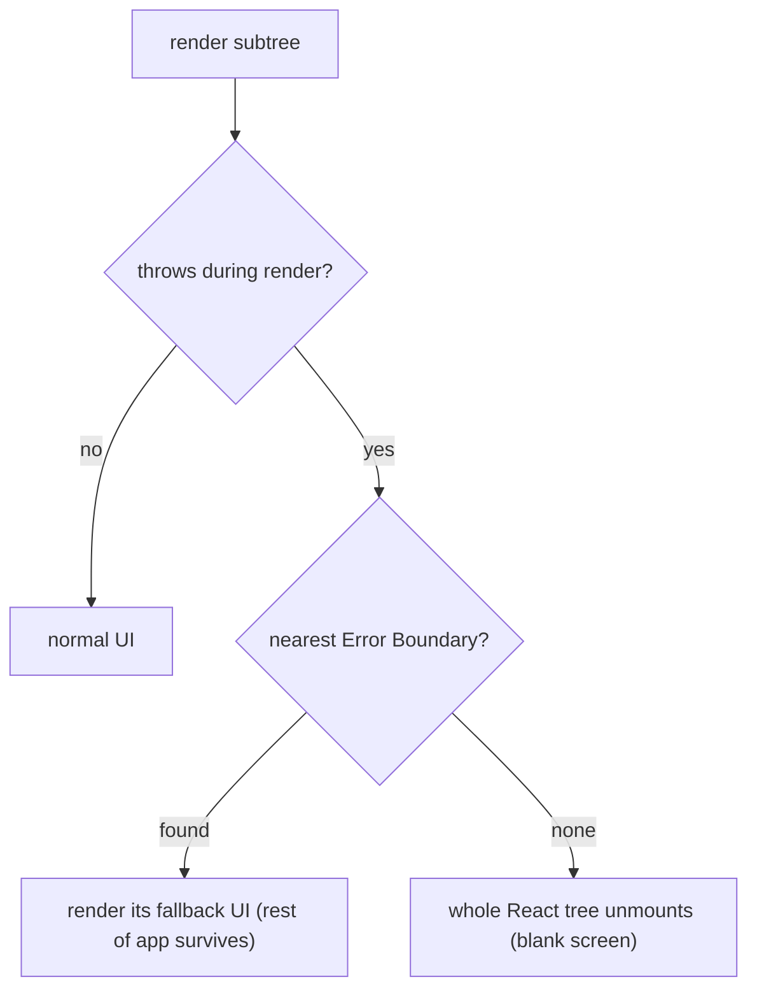

> **Prerequisites:** understanding of React's render/commit work loop (it calls your component during the "render" step to build the element tree), modeling UI states as a discriminated union (loading | error | empty | data), and TanStack Query's pending/error/data conventions for async data.

---

## Problem

A single null value crashes your entire app. One component throws during render and the whole screen goes white. Users see a blank page instead of a graceful error message. You cannot wrap a try/catch around a React component render. React calls your function internally.

```jsx
function Profile({ user }) {
  return <div>{user.name.toUpperCase()}</div>;   // if user is null, throws DURING render
}
```

Before Error Boundaries (React 15), one such throw corrupted React's internal tree and could blank the entire app. There was no way to contain the damage.

## Why Existing Solution Failed

Before Error Boundaries, you had no way to catch render-time errors. You could add try/catch in event handlers. You could validate props. But a render error was fatal. React's internal reconciler would get into an inconsistent state. The entire React tree would unmount. You got a white screen.

```jsx
// Old approach: try/catch in the parent render - does not work!
function Parent() {
  try {
    return <Profile user={null} />;  // try/catch does NOT catch this throw
  } catch (e) {
    return <div>Error</div>;          // this never runs
  }
}
```

React calls your components during the render phase. That call is inside React's own work loop, not inside your code's call stack. So your try/catch does not intercept the error. React needed a primitive that could catch errors from one component and let the rest of the tree survive.

Error Boundaries are that primitive. They are class components with `componentDidCatch` and `getDerivedStateFromError`. They catch errors from their subtree's render and swap in a fallback UI. They contain the blast radius.

## Mental Model

An error is just another STATE your UI must render. It is not an exception to handle somewhere else. The design question is always: at which BOUNDARY do I catch it, and what do I render instead? Three boundaries cover everything.

- **Error Boundaries** catch errors thrown during RENDER in a subtree.
- **try/catch + query error state** catch ASYNC errors (events, fetch).
- **Suspense** catches "not ready yet."

Pick the boundary. Design the fallback. Keep the blast radius small.

From "error is a state, caught at a boundary" you can see why React needs Error Boundaries (you cannot try/catch a render), why they do NOT catch event/async errors, and how Suspense plus error boundaries plus normal render put together pending/failed/ready.

## Visualization



An error during render propagates upward. If an Error Boundary exists, it catches the error and shows a fallback. Without a boundary, the entire React tree unmounts.

## Engine Simulation

```jsx
class ErrorBoundary extends React.Component {
  state = { hasError: false };
  static getDerivedStateFromError() { return { hasError: true }; }   // render fallback
  componentDidCatch(error, info) { logToSentry(error, info); }       // side effect: report
  render() { return this.state.hasError ? <Fallback/> : this.props.children; }
}

<ErrorBoundary>
  <Profile/>                {/* render throw here, caught, <Fallback/> shown */}
</ErrorBoundary>
```

What happens when `Profile` throws during render:

1. React calls `Profile` during the render phase (the "render" step of the render/commit work loop).
2. `Profile` throws an error (e.g., `user.name` on `null`).
3. The throw propagates up through React's fiber tree.
4. React's work loop catches it. It checks for the nearest Error Boundary ancestor.
5. It finds `<ErrorBoundary>`. It calls `getDerivedStateFromError` which sets `hasError: true`.
6. React re-renders `ErrorBoundary` with the new state. It shows `<Fallback/>`.
7. It calls `componentDidCatch` as a side effect. You can log to Sentry here.

**Caught:** errors thrown during render, lifecycle, or constructor of the subtree.

**NOT caught** (and why): these do not happen during React's render pass.
- Event handlers (`onClick`). They run later on the call stack of an event. Use try/catch.
- Async (`setTimeout`, `fetch().then`, `await`). They run in a later task or microtask. Use try/catch or the query's error state.
- SSR/hydration and errors in the boundary itself.

So: render errors go to boundary. Async and event errors get handled at the call site. Two different ways for two different execution contexts.

## Internal Implementation

Suspense and Error Boundaries share the same throw/catch machinery in React's work loop. Internally, `performUnitOfWork` is wrapped in try/catch. When a component throws, `throwException` inspects the thrown value.

**If the thrown value is an Error instance:** it is an Error Boundary catch. React calls `markErrorBoundaryShouldCapture`. The nearest Error Boundary re-renders with fallback state.

**If the thrown value is a thenable (a promise):** it is a Suspense catch. React calls `markSuspenseBoundaryShouldCapture`. The nearest `<Suspense>` shows its fallback.

Modern `use()` does not throw a real promise. It throws an internal sentinel called `SuspenseException`. React recovers the actual thenable via `getSuspendedThenable()`. This matches the old behavior where developers literally threw promises.

React finds the enclosing boundary with `getSuspenseHandler()`. This uses a maintained handler stack, not a parent traversal. When a boundary captures, it sets the `ShouldCapture` flag. Unwinding clears it and sets `DidCapture`. Then `completeWork` re-renders the boundary showing its fallback.

A Suspense boundary is actually two fibers: a `SuspenseComponent` wrapping an `OffscreenComponent` (the primary children) plus a separate fallback fragment.

When the promise resolves, `attachPingListener` fires `ping`, which goes to `pingSuspendedRoot` and `markRootPinged`. React re-renders on a dedicated retry lane (`claimNextRetryLane`). Fallback commits are throttled by `FALLBACK_THROTTLE_MS = 300`. This prevents fast resolves from flashing a fallback.

If a boundary already shows content and then re-suspends, the fallback reappears unless the update was wrapped in `startTransition` or `useDeferredValue`. A transition keeps the stale UI with `isPending` for a busy indicator instead of yanking it back to a spinner.

## Real World Example

Your team ships a new version of the dashboard. Minutes later, Sentry lights up with errors. A null value slipped through in a new feature. Users see a white screen. The production incident response:

1. **Mitigate first:** roll back the release or disable via feature flag to stop user impact. Do not debug a live fire.
2. **Triage in Sentry:** examine the error, stack trace (source maps), release version, and affected users.
3. **Reproduce locally** with the same env and inputs. Confirm root cause.
4. **Fix and guard:** add an Error Boundary around the risky widget. Write a test so it cannot silently recur. Communicate status.
5. **Postmortem:** why did CI and review miss it? Add the check.

The fix is minimal:

```jsx
<ErrorBoundary fallback={<WidgetError />}>
  <NewFeature />
</ErrorBoundary>
```

If `NewFeature` crashes, only the widget shows an error state. The rest of the dashboard continues working. Sentry receives the stack trace for debugging.

## Tradeoffs

**Error Boundary placement:** One top-level boundary catches everything but shows a blank page. Too many boundaries create complex fallback states. Place boundaries around independent widgets and routes. Each should fail independently.

**Suspense vs manual loading states:** Suspense moves pending/ready logic to the tree structure. You do not write `if (loading)` in every component. But it requires the data fetching library to support Suspense. TanStack Query supports it. Raw fetch calls do not.

**try/catch vs Error Boundary:** try/catch works for event handlers and async. Error Boundaries work for render errors. Using the wrong one means the error escapes. Know which execution context you are in.

**Fallback design:** A generic "Something went wrong" is not helpful. Design fallbacks with retry buttons, error details, and a path to recovery.

## Common Mistakes

- Expecting boundaries to catch async/event errors. They do not. Handle these at the call site.
- One top-level boundary only, then any error blanks everything. Place boundaries around risky subtrees.
- No fallback design. You get a white screen instead of a retry or empty UI.
- Debugging production before mitigating. Users keep hitting the bug.
- Treating error/loading as afterthoughts instead of modeled states.

## SDE-2 Interview Answer

**Question: "How do you handle errors in a React application?"**

### Mid-level

"I use Error Boundaries to catch render errors and show a fallback UI. They do not catch async or event errors. For those I use try/catch or the error state from TanStack Query. I model loading, error, empty, and data states. I use Suspense with an Error Boundary for async data. In production, I mitigate first by rolling back, then I debug."

### Senior

"An error is a renderable state. The question is always: at which boundary do I catch it, and what do I render instead?

Three mechanisms cover everything. Error Boundaries catch render-phase errors in a subtree. try/catch catches event handlers and async code. Suspense catches pending state.

The key insight is why Error Boundaries exist. React calls your function during its render phase. You cannot wrap that call in your own try/catch. So React provides a primitive that catches errors from child renders.

Error Boundaries do NOT catch async errors because those run in a different execution context (later task or microtask, not during the render pass). This maps directly to the JavaScript event loop: render is synchronous, events are tasks.

For production incidents, I mitigate first (rollback or feature-flag), then use Sentry to triage, then reproduce, fix, and postmortem."

### Engineering Lead

"I define the team's error handling strategy upfront. Every feature defines its fallback states. Every route has an Error Boundary. Every async operation has a loading, error, and empty state.

We use Sentry with source maps for visibility. We have a standard incident response playbook: mitigate first, then triage, reproduce, fix, postmortem.

I make sure the team understands the three boundaries and when each applies. Code review catches patterns like a boundary placed at the top level only, or async errors expected to be caught by a boundary.

The organizational pattern: standardize the pattern, automate the visibility (Sentry), and make the response playbook muscle memory."

## Follow-up Questions

1. Why can't you try/catch a render error, and what catches it instead? (foundational)

2. List what Error Boundaries do and do not catch, and why (tie to JavaScript execution contexts). (application)

3. Compose Suspense plus an error boundary for a data-fetching component. Show the pending, failed, and ready states. (application)

4. Walk through your production incident response. What is the first action and why? (analysis)

5. Where do you place boundaries to limit blast radius in a complex app with independent widgets? Design the boundary hierarchy. (synthesis)

## Mental Trigger

**Error is a state. Catch it at a boundary. Render a fallback.**

## One Page Revision

- An error is a renderable state. Design the fallback at a boundary.
- Error Boundaries catch render-phase errors in their subtree.
- Error Boundaries do NOT catch event/async errors. Handle those at the call site.
- Suspense catches pending state. Pair with Error Boundary for failed state.
- Three boundaries: Error Boundary (render), try/catch (events/async), Suspense (pending).
- Incident response: mitigate first (rollback or feature-flag), then Sentry, reproduce, fix, postmortem.
- Place boundaries around independent subtrees (widgets, routes) for isolated failure.
- Model four states: loading, error, empty, data.
- Suspense internally throws thenables (or sentinels) caught by the work loop.
- Boundaries form a handler stack, not a tree walk. Fast lookup.
