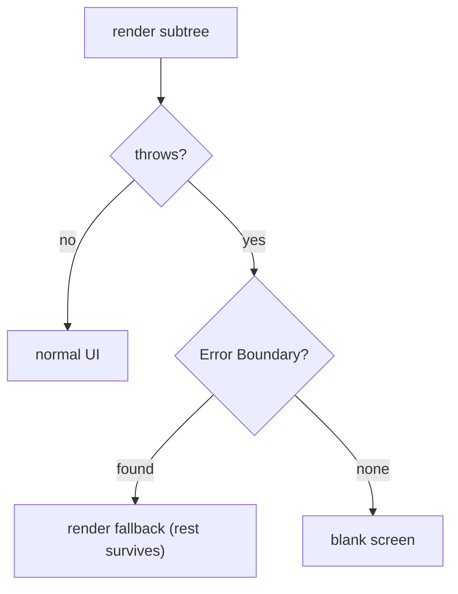

## The White Screen of Death

A single null value crashes your entire app. One component throws during render and the whole screen goes white. You cannot wrap a try/catch around a React component render — React calls your function internally.

```jsx
function Profile({ user }) {
  return <div>{user.name.toUpperCase()}</div>; // if user is null, throws DURING render
}
```

Here is the mental shift: **an error is not an exception to hide. It is a state your UI must render.** You catch it at a boundary and render a fallback. The error is just another possible state, like loading or empty.

## Why try/catch Does Not Work

React calls your component functions during its render phase — inside React's own internal work loop. When your component throws, the throw propagates through React's fiber reconciliation, not through your component's call stack.

```jsx
function Parent() {
  try {
    return <Child />; // this creates an element, does not execute Child yet
  } catch (e) {
    return <Fallback />; // never catches Child's render error
  }
}
```

`<Child />` is `React.createElement(Child, null)`. The element is created immediately, but `Child`'s function is called later by React's reconciler — outside your `try/catch` scope. Error Boundaries are the only way to catch render-phase errors.

## The Mental Model

An error is just another state. The design question is: **at which boundary do I catch it, and what do I render instead?**

Three boundaries cover everything:

- **Error Boundaries** — catch errors thrown during render in a subtree.
- **try/catch** — catch event handler and async errors (different execution context).
- **Suspense** — catches "not ready yet" (pending state).

**Analogy:** A ship with watertight compartments. One compartment floods, but the doors close. The rest of the ship stays afloat. Error Boundaries are those watertight doors.

The core insight: **React calls your component inside its own work loop. You cannot intercept that call with try/catch. So React gives you Error Boundaries.**



## Error Boundaries

```jsx
class ErrorBoundary extends React.Component {
  state = { hasError: false };
  static getDerivedStateFromError() { return { hasError: true }; }
  componentDidCatch(error, info) { logToSentry(error, info); }
  render() { return this.state.hasError ? <Fallback/> : this.props.children; }
}

<ErrorBoundary>
  <Profile/>
</ErrorBoundary>
```

When `Profile` throws during render:

1. React's work loop catches the error.
2. Walks the fiber tree to find the nearest Error Boundary.
3. Calls `getDerivedStateFromError` → `hasError: true`.
4. Re-renders the boundary with `<Fallback/>`.
5. Calls `componentDidCatch` for logging.

**Caught:** errors during render, lifecycle methods, and constructors of the subtree.

**NOT caught:** event handlers (use try/catch), async code like `setTimeout`/`fetch` (use try/catch or query error state), SSR/hydration errors.

## What Error Boundaries Catch

| Caught | Not Caught | Why |
|---|---|---|
| Render function errors | Event handler errors | Different execution context |
| Lifecycle method errors | Async (`setTimeout`, `fetch`) | Runs in later task/microtask |
| Constructor errors | Errors in the boundary itself | Propagates to next boundary |
| `use()` rejected promises (React 19+) | SSR errors | Different rendering pipeline |

## Composing Suspense + Error Boundary

```tsx
function UserPage({ userId }) {
  return (
    <ErrorBoundary fallback={<ErrorMessage />}>
      <Suspense fallback={<LoadingSpinner />}>
        <UserProfile userId={userId} />
      </Suspense>
    </ErrorBoundary>
  );
}
```

**Pending:** query in-flight → Suspense shows `<LoadingSpinner/>`.
**Failed:** query rejects → Error Boundary catches, shows `<ErrorMessage/>`.
**Ready:** query resolves → component renders with data.

Order matters: **ErrorBoundary wraps Suspense wraps the component.** Errors bubble past Suspense to the Error Boundary.

## Incident Response

1. **Mitigate first** — rollback or disable via feature flag. Stop user impact immediately.
2. **Triage in Sentry** — examine error, stack trace, release version, affected users.
3. **Reproduce locally** — confirm root cause with same inputs.
4. **Fix and guard** — add Error Boundary around risky component, write a failing test.
5. **Postmortem** — why did CI and review miss this? Add the missing check.

## Common Mistakes

- Expecting boundaries to catch async/event errors — they do not.
- One top-level boundary only — any error blanks everything.
- No fallback design — white screen instead of retry button.
- Debugging production before mitigating — users keep hitting the bug.

## Q&A

**Q: Why can't you try/catch a render error?**
React calls your component inside its own work loop (`performUnitOfWork`). The throw propagates through React's fiber tree, not your call stack. `<Child />` creates an element immediately but executes later when React processes the fiber — outside your try/catch.

**Q: What do Error Boundaries catch vs not catch?**
Caught: render errors, lifecycle errors, constructor errors. Not caught: event handlers (browser event dispatch), async code (later tasks/microtasks), SSR errors. The distinction maps to JavaScript execution contexts — React's render phase is synchronous inside its work loop, event handlers run in the browser's event loop.

**Q: Where do you place boundaries?**
Around independent subtrees that should fail independently — each widget gets its own boundary. Route-level boundaries catch route failures. Do not wrap shared infrastructure (nav, layout). One top-level boundary only means any error blanks everything.

## Mental Trigger

**Error is a state. Catch it at a boundary. Render a fallback.**
