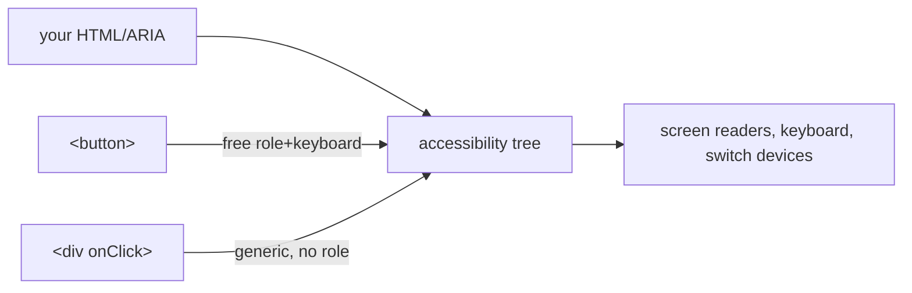

## The Button That Nobody Can Click

Your app looks perfect visually. But for assistive technology, it is invisible. A clickable `<div>` shows nothing to a screen reader — no role, no name, no keyboard behavior.

```jsx
<div className="btn" onClick={save}>Save</div>
```

The browser builds two trees from your HTML. One is the DOM you know. The other is the **accessibility tree**. Assistive technology reads the accessibility tree, not your pixels. A `<div>` is a generic node with no role, no name, and no state. It might as well not exist.

Here is the uncomfortable truth: every clickable `<div>`, every `outline: none`, every image without `alt` — you excluded users who cannot see or use a mouse.

## The Mental Model

The browser builds a second, invisible UI from your markup — the accessibility tree. Each node has a **role** (what it is), a **name** (what it is called), and **state** (checked/expanded/disabled).

Semantic HTML elements populate this tree correctly AND come with keyboard behavior for free. The rule: use the right element first. Reach for ARIA only to patch what no element provides.

**Analogy:** Semantic HTML is a ramp. It works for everyone — wheelchair users, people with strollers, delivery carts. ARIA is like building a ramp out of spare parts. It works but requires more effort and is easier to get wrong. The existing ramp is free and maintained by the browser.

The core insight: **ARIA changes the tree, but not the behavior.** `role="button"` on a `<div>` tells the screen reader it is a button, but does not make it keyboard-operable.



## `<button>` vs `<div onClick>`

| Property | `<button>` | `<div>` |
|---|---|---|
| Role | `button` | `generic` |
| Focusable | Yes (Tab) | No (need `tabIndex=0`) |
| Keyboard | Enter/Space activate | Nothing (need `onKeyDown`) |
| Disabled | Built-in `disabled` | Nothing (need `aria-disabled` + logic) |
| Screen reader | "Save, button" | "Save, clickable" or nothing |

To make the `<div>` match, you must add `role="button"`, `tabIndex={0}`, `onKeyDown` for Enter/Space, `aria-disabled` for disabled state, and CSS for `:focus-visible`. You are reinventing a `<button>` — badly.

## ARIA: When to Use It

ARIA fills gaps in what native HTML can express. For example, `aria-live="polite"` announces dynamic content changes without moving focus. No HTML element provides this.

**Cardinal rules:**
1. Don't use ARIA if a native element provides the semantics.
2. Don't change native semantics (no `role="navigation"` on a `<button>`).
3. All interactive ARIA controls must be keyboard operable.
4. All interactive elements must have an accessible name.

Bad ARIA lies to assistive technology. `role="heading"` on a `<div>` that is not a heading confuses navigation. No ARIA is better than wrong ARIA.

## ARIA Roles — The Complete Picture

### Landmark Roles

These define the page structure for screen reader navigation:

| Role | HTML Equivalent | Purpose |
|---|---|---|
| `banner` | `<header>` | Site header, logo, nav |
| `navigation` | `<nav>` | Primary navigation |
| `main` | `<main>` | Primary content |
| `complementary` | `<aside>` | Sidebar, related content |
| `contentinfo` | `<footer>` | Footer, copyright |
| `search` | `<form role="search">` | Search functionality |

Screen reader users jump between landmarks with shortcuts (e.g., `Landmarks` menu in VoiceOver).

### Widget Roles

These define interactive components:

| Role | Purpose | Required States |
|---|---|---|
| `button` | Clickable action | `aria-disabled` |
| `tab` | Tab header | `aria-selected`, `aria-controls` |
| `tabpanel` | Tab content | `aria-labelledby` |
| `menuitem` | Menu option | `aria-disabled` |
| `dialog` | Modal/popup | `aria-modal`, `aria-labelledby` |
| `alert` | Important message | Live region, auto-focus |
| `progressbar` | Loading indicator | `aria-valuenow`, `aria-valuemax` |

### Live Regions

Announce dynamic content changes without moving focus:

```jsx
<div aria-live="polite" aria-atomic="true">
  {statusMessage}
</div>
```

- `aria-live="polite"` — waits for user idle, then announces
- `aria-live="assertive"` — interrupts current announcement
- `aria-atomic="true"` — announces the entire region, not just the changed part

Use for: form submission results, cart count updates, chat messages, error messages.

## Keyboard Navigation Patterns

### Roving Tabindex

For composite widgets (tabs, menus, toolbars), only one item is in the tab order. Arrow keys move focus between items:

```jsx
function TabList({ tabs, activeTab, onSelect }) {
  return (
    <div role="tablist">
      {tabs.map((tab, i) => (
        <button
          key={tab.id}
          role="tab"
          aria-selected={activeTab === tab.id}
          tabIndex={activeTab === tab.id ? 0 : -1}
          onKeyDown={(e) => {
            if (e.key === "ArrowRight") onSelect(tabs[(i + 1) % tabs.length].id);
            if (e.key === "ArrowLeft") onSelect(tabs[(i - 1 + tabs.length) % tabs.length].id);
          }}
        >
          {tab.label}
        </button>
      ))}
    </div>
  );
}
```

The active tab has `tabIndex={0}` (in tab order). All others have `tabIndex={-1}` (focusable via JS but not Tab key). Arrow keys move focus. Tab moves to the next focusable element outside the widget.

### Skip Links

```jsx
<a href="#main-content" className="sr-only focus:not-sr-only">
  Skip to main content
</a>
```

Hidden until focused via Tab. Lets keyboard users skip navigation and jump to content.

## Color Contrast

WCAG 2.1 AA requires:
- **Normal text:** 4.5:1 contrast ratio (black on white = 21:1)
- **Large text:** 3:1 contrast ratio (18pt+ or 14pt+ bold)
- **UI components:** 3:1 contrast ratio (borders, icons)

Tools: Chrome DevTools (Elements → Computed → contrast ratio), WebAIM Contrast Checker.

Don't rely on color alone to convey meaning. Add icons, text labels, or patterns:
```jsx
// Bad: color only
<span style={{ color: "red" }}>Error</span>

// Good: color + icon + text
<span style={{ color: "red" }}>⚠ Error: invalid email</span>
```

## Accessible Modal

```tsx
function Modal({ isOpen, onClose, title, children }) {
  const previousFocus = useRef(null);
  const modalRef = useRef(null);

  useEffect(() => {
    if (isOpen) {
      previousFocus.current = document.activeElement;
      modalRef.current?.focus();
    } else if (previousFocus.current) {
      previousFocus.current.focus(); // restore focus
    }
  }, [isOpen]);

  useEffect(() => {
    if (!isOpen) return;
    function handleKeyDown(e) {
      if (e.key === "Escape") { onClose(); return; }
      if (e.key === "Tab") {
        const focusable = modalRef.current.querySelectorAll(
          'button, [href], input, select, textarea, [tabindex]:not([tabindex="-1"])'
        );
        const first = focusable[0], last = focusable[focusable.length - 1];
        if (e.shiftKey && document.activeElement === first) { e.preventDefault(); last.focus(); }
        else if (!e.shiftKey && document.activeElement === last) { e.preventDefault(); first.focus(); }
      }
    }
    document.addEventListener("keydown", handleKeyDown);
    return () => document.removeEventListener("keydown", handleKeyDown);
  }, [isOpen, onClose]);

  if (!isOpen) return null;
  return (
    <div ref={modalRef} role="dialog" aria-modal="true" aria-labelledby="modal-title" tabIndex={-1}>
      <h2 id="modal-title">{title}</h2>
      {children}
      <button onClick={onClose}>Close</button>
    </div>
  );
}
```

This covers: name (`aria-labelledby`), focus trap (Tab wraps), focus restore (saves `document.activeElement`), Esc handling, `aria-modal="true"`.

## Common Mistakes

- Clickable `<div>`/`<span>` instead of `<button>`/`<a>` — not focusable, no keyboard behavior.
- `outline: none` with no visible focus replacement — keyboard users cannot see where they are.
- Bad or excess ARIA — worse than no ARIA.
- Modals without focus trap, focus restore, or Esc handling.
- Images without `alt`, inputs without labels, icon buttons without `aria-label`.
- Color as the only signal — fails color-blind users.

## Q&A

**Q: What is the accessibility tree?**
A second, invisible UI the browser builds from your DOM. Assistive technologies read it, not your pixels. Each node carries a role (what it is), name (what it is called), and state (checked/expanded/disabled). Semantic HTML populates this correctly for free.

**Q: ARIA changes the tree but not the behavior — what does that mean?**
Putting `role="button"` on a `<div>` tells the screen reader it is a button. But it does not add keyboard handling, focus management, or disabled state. You must implement all of that yourself. The native `<button>` provides it for free.

**Q: How do you make a virtualized table accessible?**
Virtualization removes off-screen DOM rows — screen readers cannot find them. Fix: add `aria-rowcount`/`aria-rowindex` so AT knows total size. Implement explicit focus management for arrow keys. Provide a custom search input since Ctrl+F cannot find unmounted rows. Keep `<thead>`/`<th>` semantic structure.

## Mental Trigger

**Second UI: role, name, state. Native first, ARIA for gaps.**
