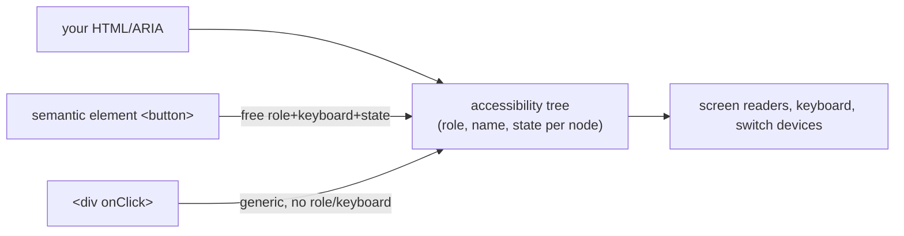

> **Prerequisites:** understanding of semantic HTML elements and their built-in focus/keyboard behavior, and awareness of how virtualized lists (which remove off-screen DOM nodes) create accessibility challenges for screen readers and find-in-page.

---

## Problem

Your app looks perfect visually. But for assistive technology, it is invisible. A clickable `<div>` shows nothing to a screen reader. It is not focusable. It has no keyboard behavior. You built a wall between your app and users who rely on accessibility tools.

```jsx
// Looks like a button, but for the accessibility tree it is nothing.
<div className="btn" onClick={save}>Save</div>
```

The browser builds two trees from your HTML. One is the DOM you know. The other is the ACCESSIBILITY TREE. Assistive technology reads the accessibility tree, not the DOM. Your `<div>` is a generic node with no role, no name, and no state. It might as well not exist.

## Why Existing Solution Failed

Developers assumed visual UI equals accessible UI. You see a styled `<div>` that looks like a button. You click it. It works. But the accessibility tree does not see styles or click handlers. It sees the underlying semantics. A `<div>` is a generic container. Period.

Before ARIA and modern accessibility practices, developers created custom widgets with `<div>` and JavaScript. Each team reinvented keyboard handling, focus management, and screen reader support. Most got it wrong. Users of assistive technology got broken or unusable experiences.

The fix is simple and cheap: use the right HTML element. `<button>` gives role, focusability, keyboard activation, and disabled state for free. No ARIA needed. No custom JavaScript.

```jsx
<button onClick={save}>Save</button>   // role, focusable, Enter/Space, disabled. All free.
```

This is the entire philosophy: the right element is the cheapest, most correct accessibility.

## Mental Model

The browser builds a second, invisible UI from your markup. It is called the ACCESSIBILITY TREE. Screen readers, keyboards, and other assistive tech operate on that tree, not your pixels. Each node has a ROLE (what it is), a NAME (what it is called), and STATE (checked/expanded/disabled).

Semantic HTML elements populate this tree correctly AND come with keyboard behavior for free. The rule is: use the right element first. Reach for ARIA only to patch what no element provides. Bad ARIA actively lies to the accessibility tree.

From "there is an accessibility tree driven by role/name/state" you can see why `<button>` beats a clickable `<div>`, why "no ARIA is better than bad ARIA," why keyboard and focus management matter, and how to make a virtualized table accessible.

## Visualization



Your HTML feeds the accessibility tree. Semantic elements like `<button>` give free role, keyboard, and state. Generic `<div>` elements give nothing.

## Engine Simulation

Take two elements that look the same visually:

```jsx
// Element 1: button element
<button onClick={save} disabled={isSaving}>Save</button>

// Element 2: styled div
<div className="btn" onClick={save} aria-disabled={isSaving}>Save</div>
```

Both look like buttons on screen. Here is what the accessibility tree sees for each:

| Property | `<button>` | `<div>` |
|---|---|---|
| Role | `button` | `generic` (no role) |
| Focusable | Yes (Tab key) | No (need `tabIndex=0`) |
| Keyboard | Enter/Space activate | Nothing (need `onKeyDown`) |
| Disabled state | Built-in `disabled` attribute | Nothing (need `aria-disabled` plus logic) |
| Activation sound | Screen reader announces "button" | Generic "clickable" or nothing |

To make the `<div>` match the `<button>`, you must add:
- `role="button"` for the role
- `tabIndex={0}` for focusability
- `onKeyDown` handler for Enter and Space
- `aria-disabled` for disabled state
- CSS for `:focus-visible`

You are reinventing a `<button>` badly. The semantic element gives all of this for free.

## Internal Implementation

The browser builds the accessibility tree from the DOM tree. Step by step:

1. The browser parses HTML into the DOM tree.
2. For each DOM node, it computes the accessible node. It looks at the HTML tag name first.
3. `<button>` maps to `role="button"`. `<input type="checkbox">` maps to `role="checkbox"` with `aria-checked` state. `<a href>` maps to `role="link"`.
4. These roles come with default behavior. The browser handles keyboard events. For example, pressing Enter on a `<button>` dispatches a click event.
5. ARIA attributes override or augment the computed role, name, or state. `role="button"` on a `<div>` changes the role but does not add the keyboard behavior. That is "ARIA changes the tree, not behavior."
6. The accessible name is computed from content, `aria-label`, `aria-labelledby`, or associated `<label>` element.
7. The state comes from HTML attributes like `disabled`, `checked`, `aria-expanded`.

ARIA works in layers. You use it to fill gaps in what native HTML can express. For example, `aria-live="polite"` announces dynamic content changes without moving focus. No HTML element provides this natively.

## Real World Example

You maintain a custom combobox (autocomplete input). It has no native HTML equivalent. You build it with ARIA:

```jsx
<div role="combobox" aria-expanded={isOpen} aria-haspopup="listbox">
  <input
    aria-autocomplete="list"
    aria-controls="listbox-id"
    aria-activedescendant={activeOptionId}
    value={value}
    onChange={handleChange}
    onKeyDown={handleKeyDown}
  />
  {isOpen && (
    <ul role="listbox" id="listbox-id">
      {options.map((opt) => (
        <li
          key={opt.value}
          role="option"
          aria-selected={opt.value === value}
          id={`opt-${opt.value}`}
        >
          {opt.label}
        </li>
      ))}
    </ul>
  )}
</div>
```

Every ARIA attribute here does something specific:
- `role="combobox"` tells AT this is an autocomplete widget.
- `aria-expanded` and `aria-haspopup` describe the widget's state.
- `aria-autocomplete="list"` tells AT how the autocomplete works.
- `aria-controls` links the input to the listbox.
- `aria-activedescendant` tells AT which option is highlighted.
- `role="listbox"` and `role="option"` make the list accessible.
- `aria-selected` marks the current selection.

You also implement keyboard handling: Arrow keys navigate options, Enter selects, Esc closes. This is the responsibility you take on when using ARIA. The browser provides none of it.

## Tradeoffs

**Semantic HTML vs custom widgets:** Semantic HTML is always preferred. It is free, correct, and maintained by browser vendors. Custom widgets (tabs, comboboxes, tree views) need ARIA plus full keyboard handling. Use them only when no native element works.

**ARIA changes the tree, not behavior:** This is the most common source of bugs. `role="button"` on a `<div>` does not make it keyboard-operable. You must add tabIndex, onKeyDown, and every behavior the native `<button>` gives you.

**No ARIA vs bad ARIA:** Wrong ARIA lies to assistive technology. It tells AT something false. For example, `role="heading"` on a `<div>` without proper heading semantics confuses navigation. No ARIA is better than wrong ARIA.

**Accessibility vs virtualization:** Virtualization removes off-screen DOM nodes. This breaks table semantics and find-in-page. Fix with `aria-rowcount`/`aria-rowindex`, focus management, and a search path. This is a real tradeoff. Windowed lists save performance but cost accessibility.

**Color as the only signal:** Error states that only use red text fail color-blind users and contrast requirements. Add icons, text labels, or patterns as secondary signals.

## Common Mistakes

- Clickable `<div>`/`<span>` instead of `<button>`/`<a>`. Not focusable, no keyboard behavior.
- `outline: none` with no visible focus replacement. Keyboard users cannot see where they are.
- Bad or excess ARIA (`aria-*` that contradicts the element). Worse than no ARIA.
- Modals without focus trap, focus restore, or Esc handling.
- Images without `alt`, inputs without labels, icon buttons without `aria-label`.
- Color as the only signal. Fails color-blind users and contrast checks.

## SDE-2 Interview Answer

**Question: "How do you make a React application accessible?"**

### Mid-level

"I use semantic HTML first. Buttons should be `<button>`, links should be `<a>`. I add ARIA only when no native element fits. I make sure every interactive element is keyboard-operable with visible focus. Images have alt text. Forms have labels. I use `aria-live` for dynamic updates. I test with a screen reader."

### Senior

"Accessibility starts with the accessibility tree. The browser builds a second UI from your markup. It has role, name, and state per node. Assistive technology reads this tree, not the DOM.

Semantic HTML populates this tree correctly for free. `<button>` gives role, focus, keyboard behavior, and disabled state. A clickable `<div>` gives none of it.

I use ARIA to patch gaps that no native element covers. Custom widgets like comboboxes, tabs, and tree views need ARIA. But ARIA changes the tree, not behavior. I still add keyboard handling myself.

The rules: native first. No ARIA beats bad ARIA. Every interactive ARIA widget must be keyboard-operable. Every control needs an accessible name.

For virtualization, I use `aria-rowcount`/`aria-rowindex` so AT knows the total size. I manage focus when rows recycle. I provide a search path since Ctrl-F cannot see unmounted rows."

### Engineering Lead

"I establish accessibility as a non-negotiable baseline. The team uses semantic HTML by default. Linting catches `<div onClick>` without `role`. CI runs automated accessibility checks (axe-core). Manual testing includes screen reader verification.

We provide accessible component primitives (based on Radix or shadcn) so developers do not recreate patterns. Modals have focus trap built in. Tabs have keyboard navigation built in. This prevents accessibility regressions at scale.

I also make sure the team understands the virtualization tradeoff. When we use windowed lists, we budget time for the accessible version. It is not an afterthought.

The organizational pattern: default to semantic HTML, lint it, audit it in CI, test it manually."

## Follow-up Questions

1. What is the accessibility tree, and what three things does each node carry? (foundational)

2. List everything `<button>` gives you that a `<div onClick>` does not. (application)

3. State the cardinal rules of ARIA. When is ARIA the wrong tool? (application)

4. Build an accessible modal: show the name, focus trap, focus restore, and Esc handling. (application plus analysis)

5. Make a virtualized table accessible. What breaks and how do you fix each issue? (synthesis)

## Mental Trigger

**Second UI: role, name, state. Native first, ARIA for gaps.**

## One Page Revision

- Browser builds accessibility tree (role + name + state per node) from your HTML.
- Semantic HTML gives free, correct accessibility.
- ARIA changes the tree but not behavior. You add keyboard handling yourself.
- Native first. No ARIA is better than bad ARIA.
- Keyboard operability and visible focus are the baseline.
- Modals need focus trap, focus restore, and Esc.
- `aria-live="polite"` announces async updates.
- Virtualized tables need `aria-rowcount`/`rowindex`, focus management, and a search path.
- Lint, audit, and test accessibility in CI.
