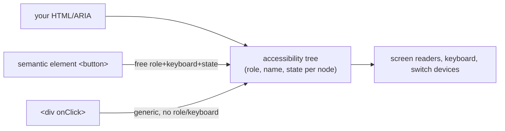

> **Prerequisites:** understanding of semantic HTML elements and their built-in focus/keyboard behavior, and awareness of how virtualized lists (which remove off-screen DOM nodes) create accessibility challenges for screen readers and find-in-page.

---

## The one mental model

> **The browser builds a second, invisible UI from your markup. It is called the ACCESSIBILITY TREE. Screen
> readers, keyboards, and other assistive tech operate on THAT tree, not your pixels. Each node
> has a ROLE (what it is), a NAME (what it's called), and STATE (checked/expanded/disabled).
> Semantic HTML elements populate this tree correctly AND come with keyboard behavior for free.
> So the rule is: use the right element first. Reach for ARIA only to patch what no element
> provides. Bad ARIA actively lies to the accessibility tree.**

From "there's an accessibility tree driven by role/name/state" you can see why `<button>` beats a
clickable `<div>`, why "no ARIA is better than bad ARIA," why keyboard and focus management matter,
and how to make a virtualized table accessible.

---

## Learning Objectives

1. Explain the accessibility tree (role/name/state) and semantic-HTML-first.
2. Use ARIA only to fill gaps; know the common roles/attributes and the cardinal rules.
3. Handle keyboard navigation, visible focus, and focus traps (modals).
4. Announce async updates (`aria-live`) and make a virtualized table accessible.

---

## Key Mental Models

- **Accessibility tree = role + name + state per node.** It comes from your HTML and ARIA.
- **Semantic HTML gives free a11y.** `<button>` provides role, focusability, Enter/Space, disabled
  state. A `<div onClick>` gives none of that.
- **ARIA changes the tree, not behavior.** `role="button"` on a div doesn't add keyboard
  handling. You must add it yourself. So prefer real elements.
- **Keyboard is the baseline interface;** if it works by keyboard with visible focus, most AT works.

---

## Introduction

Accessibility is an ethical and legal baseline. In this JD, it is also an explicit evaluation axis
(Interviewer probed it under virtualization). The whole topic clicks once you stop thinking "extra
attributes" and start thinking "I'm building a second UI. That second UI is the accessibility tree."

---

## Problem: the clickable div

```jsx
// ❌ looks like a button, but for the accessibility tree it's nothing
<div className="btn" onClick={save}>Save</div>
```

The accessibility tree sees a generic `<div>` with no role. A screen reader does not announce it
as a button. It is **not focusable** (no Tab). It has **no keyboard activation** (Enter/Space do
nothing) and no disabled state. To fix it you would have to add `role="button"`, `tabIndex=0`,
`onKeyDown` for Enter/Space, `aria-disabled`, and more. You would be reinventing `<button>` badly. So:

```jsx
<button onClick={save}>Save</button>   // ✅ role, focusable, Enter/Space, disabled. All free.
```

This is the entire philosophy: **the right element is the cheapest, most correct a11y.**



---

## ARIA: patch gaps only (the cardinal rules)

ARIA = attributes that set role/state/properties when no native element fits. This applies to custom widgets like
tabs, comboboxes, and tree views. Rules of ARIA, from "it changes the tree, not behavior":
1. **Prefer a native element** over ARIA whenever one exists.
2. **Don't change native semantics** (`<button role="heading">` is not allowed).
3. **All interactive ARIA must be keyboard-operable** (you add the key handling).
4. **Don't use `role="presentation"`/`aria-hidden` on focusable elements.**
5. **Every control needs an accessible name** (label/`aria-label`/`aria-labelledby`).

Common pieces: `aria-label`/`aria-labelledby` (name), `aria-expanded`/`aria-selected`/`aria-checked`
(state), `aria-live` (announce dynamic changes), `role="dialog"`, `aria-describedby`. "**No ARIA
is better than bad ARIA**." Wrong ARIA tells assistive technology something false. That is worse than nothing.

---

## Keyboard, focus & traps

- **Everything operable by mouse must work by keyboard.** Tab order follows DOM order; don't break
  it with positive `tabIndex`. `tabIndex={0}` makes a custom widget focusable; `-1` makes it
  programmatically focusable (for managing focus) but not in the Tab order.
- **Visible focus indicator.** Never set `outline: none` without a replacement. Keyboard users need
  to see where they are.
- **Focus trap in modals:** when a dialog opens, move focus into it. Keep Tab cycling within it.
  Restore focus to the trigger on close. Close on Esc. (Radix/shadcn provide accessible primitives that handle focus trapping and Esc natively. See Ch 11.)

```jsx
<div role="dialog" aria-modal="true" aria-labelledby="title">
  <h2 id="title">Delete contact?</h2>      {/* names the dialog */}
  {/* focus moves here on open; Tab cycles inside; Esc closes; focus returns to trigger */}
</div>
```

- **`aria-live="polite"`** region announces async updates (a toast, "3 contacts updated") without
  moving focus. This is the accessible version of the real-time status changes in Ch 08.

---

## Accessible virtualized table (Interviewer's link)

Virtualization (Ch 08) removes off-screen rows from the DOM, which breaks default table semantics
and find. To keep it accessible:
- Use `role="grid"`/`row`/`gridcell` (or `<table>` semantics) and **`aria-rowcount`/`aria-rowindex`**
  so AT knows the *total* size and each row's real index even though only ~20 are in the DOM.
- Manage focus: when focus is on a row that gets recycled, move it deliberately (roving tabindex)
  rather than letting it vanish.
- Provide a non-virtualized path or search for "find," since Ctrl-F won't see off-screen rows.

This is exactly why Interviewer lists a11y as a virtualization *tradeoff* (interview guide §2d).

---

## Interview Discussion (reason first)

**Q1. "Why is `<button>` better than a `<div onClick>`?"**
> "The accessibility tree sees `<button>` as a button. It is focusable, announces its role,
> activates on Enter/Space, and supports disabled. All free. A `<div>` is generic. It is not focusable,
> has no keyboard activation, and has no role. To match `<button>` I would have to add role, tabIndex, key
> handlers, and disabled semantics. That is reinventing it worse."

**Q2. "When do you use ARIA?"**
> "Only to fill gaps native HTML cannot express. For example, custom widgets like tabs or comboboxes. ARIA
> changes the accessibility tree, not behavior. So I still add keyboard handling myself. The rule
> is native first. No ARIA beats bad ARIA, which lies to assistive tech."

**Q3. "How do you make a virtualized list accessible?"**
> "Off-screen rows are not in the DOM. So I show the true structure via `aria-rowcount` and
> `aria-rowindex`. I manage focus when rows recycle (roving tabindex). I also give a way to search, since
> Ctrl-F cannot find unmounted rows. It is a real tradeoff of virtualization."

*Scoring:* full = accessibility-tree model + native-first/ARIA-gaps + focus/keyboard + virtual a11y.

---

## Common Mistakes

- **Clickable `<div>`/`<span>`** instead of `<button>`/`<a>` → not focusable, no keyboard.
- **`outline: none`** with no visible focus replacement.
- **Bad/excess ARIA** (`aria-*` that contradicts the element) → worse than none.
- **Modals without focus trap / focus restore / Esc.**
- **Images without `alt`, inputs without labels, icon buttons without `aria-label`.**
- **Color as the only signal** (fails color-blind users / contrast).

---

## Interview Questions

1. What is the accessibility tree, and what three things does each node carry?
2. Everything `<button>` gives you that a `<div onClick>` does not. List them.
3. State the cardinal rules of ARIA; when is ARIA the wrong tool?
4. Build an accessible modal: name, focus trap, restore, Esc.
5. Make a virtualized table accessible. What breaks and how do you fix it?

---

## Homework

1. Take a `<div onClick>` "button," tab to it (you can't), then convert to `<button>` and confirm
   focus + Enter/Space work. Inspect both in DevTools' Accessibility pane.
2. Build a modal with focus trap, focus restore, and Esc (or read Radix Dialog's implementation).
3. In `NOTES.md`: the accessibility-tree model + "native-first, ARIA for gaps" in one line.

---

## Summary

- The browser builds an **accessibility tree** (role + name + state per node) that assistive tech uses.
  You are building a second UI.
- **Semantic HTML is free, correct a11y** (`<button>` = role + focus + keyboard + state). A
  clickable `<div>` provides none of it.
- **ARIA patches gaps only.** It changes the tree, not behavior. So keep it native-first and add
  keyboard handling yourself. **No ARIA > bad ARIA**.
- **Keyboard operability, visible focus, and focus traps** (modals) are the baseline. **`aria-live`**
  announces async updates.
- **Virtualized tables** need `aria-rowcount`/`rowindex`, focus management, and a search path.
  This is the a11y tradeoff of windowing (Ch 08).

## Go deeper
Ch 16 (semantics/focus), Ch 08 (virtualization tradeoff), Ch 11 (Radix/shadcn give accessible
primitives). The WAI-ARIA Authoring Practices are the reference once this model is solid.
