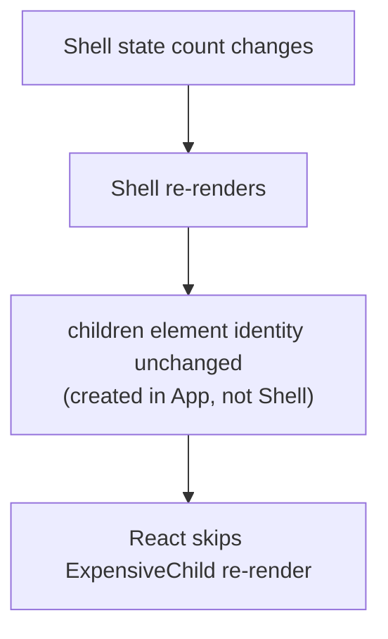

> **Prerequisites:** understanding of React's rendering process (how component functions produce elements and how state changes trigger re-render) and hooks (useState, useContext), plus familiarity with component composition patterns from shadcn/Radix.

---

## The Component With 15 Props

A 12th boolean prop is being added to a component. The component started simple. Now it has 15 props. Some only apply in specific combinations. Every new variant adds a prop. The component tries to predict every use case and fails at all of them.

```jsx
// Configuration approach: every new need adds a prop. Rigid, huge API.
<Dialog
  title="Delete?" body="Sure?" icon="warn"
  showCancel cancelText="No" confirmText="Yes"
  footerAlign="right" onConfirm={...} onCancel={...} />
```

Each variation grows the prop surface. You cannot express "a custom footer with two buttons and a checkbox" without yet more props. The component tries to predict every use. It cannot.

Here is the mistake that creates this: **the component owns too many decisions.** The caller should own more. The fix is not more props. The fix is letting the caller pass in the pieces.

## Why Configuration Always Hits a Wall

The old approach was configuration. You listed every possible variation as a prop. The component grew and grew. Breaking changes were common. Teams forked the component and maintained their own versions.

Render props and HOCs tried to fix this. Render props let you pass a function instead of a prop. HOCs wrapped a component to add behavior. But both had problems.

Render props created deeply nested trees. HOCs caused wrapper hell and prop collisions. Neither solved the core problem: the component still owned too much of the decision. The caller needed more control.

```jsx
// HOC wrapper hell
export default withAuth(withRouter(withTheme(MyComponent)));

// Render prop nesting
<DataProvider>
  {data => (
    <AuthProvider>
      {auth => (
        <ThemeProvider>
          {theme => <MyComponent data={data} auth={auth} theme={theme} />}
        </ThemeProvider>
      )}
    </AuthProvider>
  )}
</DataProvider>
```

Custom hooks replaced both. They share logic without modifying the component tree. They compose flat instead of nested.

Think of it like a restaurant. Configuration is a fixed menu — you get what the chef decided. Composition is a build-your-own bowl — you pick the ingredients. The restaurant stays simple. The customer stays happy.

## The Mental Model: Composition Over Configuration

Every React pattern answers one question: "who owns this state or behavior, and how do I let the consumer customize without me predicting every case?" The tool is almost always COMPOSITION over CONFIGURATION. Instead of growing a component's props to cover every variation, let the caller pass in the pieces (elements, render functions, children). Composition pushes decisions outward to where the context is. It keeps components open to extension. And it preserves element identity so React skips needless re-renders.

The core insight: **the more decisions a component makes, the more props it needs. Push decisions to the caller. The component stays simple. The caller stays in control.**

From "composition over configuration" you can see compound components, slots, render props, custom hooks, controlled vs uncontrolled, and why passing `children` fixes re-renders. You do not need to memorize a pattern catalog. Each pattern is a way to move a decision to the caller.

## Visualization



When `children` are created in a parent that does not re-render, their identity stays stable. The re-rendering parent sees the same element reference. React skips re-rendering it.

## Engine Simulation

```jsx
// Problem: ExpensiveChild re-renders every time count changes
function App() {
  const [count, setCount] = useState(0);
  return <div onClick={() => setCount(count+1)}>
    {count}
    <ExpensiveChild />
  </div>;
}

// Solution: pass it as children from a stable parent
function Shell({ children }) {
  const [count, setCount] = useState(0);
  return <div onClick={() => setCount(count+1)}>{count}{children}</div>;
}
function App() {
  return <Shell><ExpensiveChild /></Shell>;   // ExpensiveChild created here, not in Shell
}
```

Here is why the solution works. `<ExpensiveChild/>` is created as a JSX element in `App`, not inside `Shell`. `App` does not own the `count` state so it never re-renders. When `Shell` re-renders because `count` changed, it reuses the *same* `children` prop reference.

In JavaScript, objects are compared by reference. The `children` prop is the same object reference from the previous render. React treats it as unchanged. React does not call `ExpensiveChild`'s function. There is no re-render.

This is the structural alternative to `React.memo`. It is often cleaner. `React.memo` has a comparison cost and does nothing if props are unstable. Composition avoids both problems.

## Internal Implementation

React reconciliation compares elements by reference using `Object.is`. When you pass `<ExpensiveChild />` as `children` to `Shell`, the element object is created in the caller (`App`). `App` does not re-render. So the same element object is passed to `Shell` every time. `Shell` re-renders, but its render returns the same `children` element object. React sees the same type and key. It skips the child.

This is different from embedding `<ExpensiveChild />` inside `Shell`:

```jsx
// Bad: new element created every render
function Shell() {
  const [count, setCount] = useState(0);
  return <div>{count}<ExpensiveChild /></div>;  // new element every time
}
```

Here, `<ExpensiveChild />` is created in `Shell`'s render function. Every time `Shell` renders, a new element object is created. React sees a different reference. It re-renders `ExpensiveChild`.

Compound components use Context to share state implicitly. Each sub-component reads from Context instead of receiving props. This lets the caller arrange the pieces freely.

```jsx
const TabsCtx = createContext();
function Tabs({ children, defaultTab }) {
  const [active, setActive] = useState(defaultTab);
  return <TabsCtx.Provider value={{ active, setActive }}>{children}</TabsCtx.Provider>;
}
Tabs.Tab = function Tab({ id, children }) {
  const { active, setActive } = useContext(TabsCtx);
  return <button aria-selected={active===id} onClick={() => setActive(id)}>{children}</button>;
};
Tabs.Panel = function Panel({ id, children }) {
  const { active } = useContext(TabsCtx);
  return active === id ? <div role="tabpanel">{children}</div> : null;
};
```

State is shared via Context. The caller puts together structure freely. This is how Radix and shadcn build accessible primitives.

## Real World Example

You have a notification component. The first version uses configuration:

```jsx
<Notification
  type="success"
  title="Saved"
  message="Your changes were saved."
  showIcon={true}
  iconPosition="left"
  dismissible={true}
  autoDismiss={5000}
/>
```

Then the design team wants variations: a notification with an action button, one with a progress bar, one with custom content. The prop surface explodes. You refactor to composition:

```jsx
<Notification>
  <Notification.Icon />
  <Notification.Content>
    <Notification.Title>Saved</Notification.Title>
    <Notification.Message>Your changes were saved.</Notification.Message>
  </Notification.Content>
  <Notification.Actions>
    <Button size="sm" onClick={undo}>Undo</Button>
  </Notification.Actions>
  <Notification.DismissButton />
</Notification>
```

No new props needed for the new variations. Each variation just composes the existing sub-components differently. The component stays stable. The design system stays flexible.

## Tradeoffs

**Composition vs Configuration:** Composition is flexible but requires more code from the caller. Configuration is simple for common cases but rigid for edge cases. Good components support both: sensible defaults (configuration) with escape hatches (composition).

**Compound components:** Flexible but require Context. Context has a re-render cost if not managed carefully. Keep shared state small and stable.

**children identity fix vs React.memo:** Composition fixes re-renders structurally. No comparison cost. `React.memo` wraps the child and compares props. It works when you cannot change the parent structure. Use composition first, memo for measured hot spots.

**Custom hooks vs HOCs vs render props:** Hooks compose flat and explicit. HOCs create wrapper hell and prop collisions. Render props create deep nesting. Use hooks for logic reuse. Use HOCs only when hooks are not available (class components in legacy code). Use render props when the caller needs to control rendering with component-internal state.

**Controlled vs uncontrolled:** Controlled gives the caller full control of the value. Uncontrolled is simpler for basic use. Support both. The pattern matches form elements (`value`/`onChange` vs `defaultValue`).

## Common Mistakes

- Boolean-prop explosion instead of putting together structure.
- Reaching for `memo` when a composition (`children`) fix is cleaner.
- HOC wrapper hell or prop collisions where a custom hook would be flat and clear.
- Compound components without Context, forcing the caller to wire state manually.
- Supporting only controlled or only uncontrolled when both are easy to allow.

## SDE-2 Interview Answer

**Question: "How do you design reusable React components?"**

### Mid-level

"I use composition over configuration. Instead of adding more props, I let callers pass `children` or render functions. Compound components with Context share state implicitly. I support both controlled and uncontrolled patterns. I use custom hooks for logic reuse instead of HOCs."

### Senior

"Every pattern answers: who owns this state or behavior, and how does the caller customize without me predicting every case? The answer is almost always composition.

Configuration adds props. Composition passes pieces. Compound components with Context share state implicitly. The caller arranges the structure.

The `children` composition pattern also fixes unnecessary re-renders. When `children` are created in a parent that does not re-render, their element identity stays stable. The re-rendering parent sees the same reference. React skips the child. This is the structural alternative to `React.memo`.

Custom hooks replaced HOCs and render props for logic reuse. They compose flat, are explicit about what state they manage, and do not change the component tree.

For controlled vs uncontrolled, I follow the form element pattern. Support both. The caller decides who owns the value."

### Engineering Lead

"I standardize on composition patterns across the team. We use compound components with Context for most UI primitives. We build on Radix or shadcn so we do not reinvent accessibility patterns.

Code reviews check for composition over configuration. When someone adds the nth boolean prop, we discuss whether a compound approach is better. We keep components focused. Each component does one thing.

We document the patterns. New developers learn: composition first, hooks for logic, Context for shared component state, controlled/uncontrolled for form-like components.

The organizational pattern: standardize on a small set of patterns, build on existing primitives, review for composition, keep it simple."

## Follow-up Questions

1. Refactor a 10-prop `<Dialog>` into a compound component. Where does shared state live?

**Q1: Refactor a 10-prop `<Dialog>` into a compound component. Where does shared state live?**

Before (configuration hell):

```jsx
<Dialog
  title="Delete?" body="Are you sure?" icon="warn"
  showCancel cancelText="No" confirmText="Yes"
  footerAlign="right" onConfirm={handleDelete} onCancel={handleClose}
  size="sm" closeOnOverlayClick={true}
/>
```

After (compound component):

```jsx
// Shared state lives in a Context
const DialogCtx = createContext();

function Dialog({ children, onClose }) {
  return (
    <DialogCtx.Provider value={{ onClose }}>
      <div role="dialog" aria-modal="true">
        {children}
      </div>
    </DialogCtx.Provider>
  );
}

Dialog.Title = function Title({ children }) {
  return <h2>{children}</h2>;
};

Dialog.Body = function Body({ children }) {
  return <div>{children}</div>;
};

Dialog.Footer = function Footer({ children, align = "right" }) {
  return <div style={{ textAlign: align }}>{children}</div>;
};

Dialog.CloseButton = function CloseButton({ onClick }) {
  const { onClose } = useContext(DialogCtx);
  return <button onClick={onClick || onClose}>Close</button>;
};
```

Usage — the caller composes the structure:

```jsx
<Dialog onClose={handleClose}>
  <Dialog.Title>Are you sure?</Dialog.Title>
  <Dialog.Body>This action cannot be undone.</Dialog.Body>
  <Dialog.Footer>
    <Dialog.CloseButton>Cancel</Dialog.CloseButton>
    <button onClick={handleDelete}>Delete</button>
  </Dialog.Footer>
</Dialog>
```

**Shared state lives in Context** (`DialogCtx`). The `onClose` callback is shared via Context so any sub-component (like `CloseButton`) can close the dialog without prop drilling. The Context holds only the minimal shared state — the close handler. Layout decisions (footer alignment, title styling) are left to the caller. No new props are needed for new variations — the caller arranges the pieces. This is how Radix and shadcn/ui build their dialog primitives.

2. A child re-renders when an unrelated parent state changes. Show two ways to fix it and argue when composition beats `memo`.

**Q2: A child re-renders when an unrelated parent state changes. Show two ways to fix it and argue when composition beats `memo`.**

The problem: `ExpensiveChild` re-renders every time `count` changes in the parent, even though it doesn't use `count`.

```jsx
function Parent() {
  const [count, setCount] = useState(0);
  const [text, setText] = useState("");
  return (
    <div>
      <button onClick={() => setCount(c => c + 1)}>{count}</button>
      <ExpensiveChild /> {/* re-renders on every count change */}
    </div>
  );
}
```

**Fix 1: `React.memo`**

```jsx
const ExpensiveChild = React.memo(function ExpensiveChild() {
  console.log("ExpensiveChild rendered");
  return <div>Heavy computation...</div>;
});
```

`React.memo` wraps the component and shallow-compares its props before re-rendering. If props haven't changed, the render is skipped. This works when the child receives no props or stable props. But if the parent passes inline functions or objects, `React.memo` is defeated because new references are created every render.

**Fix 2: Composition (pass as `children` from a stable parent)**

```jsx
function Parent() {
  return <Shell><ExpensiveChild /></Shell>;
}

function Shell({ children }) {
  const [count, setCount] = useState(0);
  return <div onClick={() => setCount(c => c + 1)}>{count}{children}</div>;
}
```

`ExpensiveChild` is created in `Parent` as JSX. `Parent` never re-renders (it has no state). When `Shell` re-renders, it receives the same `children` prop reference. React's reconciliation compares elements by reference (`Object.is`). Same reference = skip re-render.

**When composition beats `memo`:** Composition is better when you control the parent structure. It's a structural fix — no comparison cost, no risk of unstable props defeating memo. Use composition when the child doesn't need data from the re-rendering parent. `React.memo` is better when you can't change the parent (e.g., a third-party wrapper) or when the child genuinely receives props that need to be compared. Composition is the first choice; memo is the fallback for measured hot spots.

3. Why did hooks largely replace HOCs and render props? When is a render prop still useful?

**Q3: Why did hooks largely replace HOCs and render props? When is a render prop still useful?**

Hooks replaced HOCs and render props because they solve the same problem — sharing logic between components — without the downsides:

**HOCs problems:** HOCs wrap a component and return a new component. This creates **wrapper hell** (`withAuth(withRouter(withTheme(Component)))`). Each wrapper adds a layer to the React DevTools tree. Worse, HOCs can cause **prop collisions** — two HOCs might inject a prop named `data` or `onError`, and the inner component gets the wrong one. HOCs also make the data flow implicit — you can't tell where a prop comes from by reading the JSX.

**Render props problems:** Render props use a function-as-child pattern. This creates **deeply nested callback trees** that are hard to read and maintain. Each level of nesting adds indentation and makes the component tree harder to follow.

**Why hooks are better:** Hooks compose **flat** — `const data = useData(); const auth = useAuth();` is explicit, readable, and doesn't change the component tree. Hooks are just function calls. They don't create wrapper components. They're explicit about what state they manage. The data flow is visible in the component body.

**When a render prop is still useful:** When the **caller needs access to the component's internal state to control rendering**. For example, a `<VirtualList>` that exposes its scroll position and visible range to the caller:

```jsx
<VirtualList items={items}>
  {({ index, style, isScrolling }) => (
    <div style={style}>
      {isScrolling ? <Placeholder /> : <Row data={items[index]} />}
    </div>
  )}
</VirtualList>
```

Here, the render prop pattern lets the caller decide what to render based on internal state (scroll position, visibility) that no hook can expose. The component owns the scrolling logic; the caller owns the rendering. This is a valid use case where hooks alone can't replace the pattern.

4. Make a `<Select>` support both controlled and uncontrolled use.

**Q4: Make a `<Select>` support both controlled and uncontrolled use.**

```jsx
function Select({ value, defaultValue, onChange, children }) {
  const [internalValue, setInternalValue] = useState(defaultValue);
  const isControlled = value !== undefined;
  const currentValue = isControlled ? value : internalValue;

  function handleChange(e) {
    const newValue = e.target.value;
    if (!isControlled) {
      setInternalValue(newValue);
    }
    onChange?.(newValue);
  }

  return (
    <select value={currentValue} onChange={handleChange}>
      {children}
    </select>
  );
}
```

This follows the same pattern as native `<select>` and React's form elements:

- **Controlled:** Pass `value` and `onChange`. The caller owns the state. `<Select value={color} onChange={setColor}>` — the component is a controlled form element. Useful when you need to validate, transform, or synchronize the value with other state.

- **Uncontrolled:** Pass only `defaultValue`. The component manages its own state internally. `<Select defaultValue="red">` — simpler for basic use, no parent state needed.

The key implementation detail: `value !== undefined` is the check for controlled mode. If `value` is passed (even `null`), it's controlled. If `value` is `undefined` (not passed), it's uncontrolled. The `defaultValue` prop only has effect on the first render (like native inputs). After that, the internal state is authoritative in uncontrolled mode. The `onChange` callback is optional in both modes — controlled callers use it to update their state, uncontrolled callers can skip it if they don't need notification. This pattern is called "controlled with a fallback" and is how React's own `<input>`, `<select>`, and `<textarea>` work internally.

5. Design a component API for a data table that supports sorting, filtering, pagination, custom cell renderers, and row selection. How do you avoid the 15-prop trap?

**Q5: Design a component API for a data table that supports sorting, filtering, pagination, custom cell renderers, and row selection.**

The answer is always **composition over configuration**. Instead of one component with 15+ props, use a compound component pattern with render props for customization:

```jsx
<DataTable data={users} onSort={handleSort}>
  <DataTable.Toolbar>
    <DataTable.Search value={filter} onChange={setFilter} />
    <DataTable.Export onClick={exportCSV} />
  </DataTable.Toolbar>

  <DataTable.Columns>
    <DataTable.Column key="name" sortable>
      {({ row }) => row.name}
    </DataTable.Column>
    <DataTable.Column key="email">
      {({ row }) => <a href={`mailto:${row.email}`}>{row.email}</a>}
    </DataTable.Column>
    <DataTable.Column key="role">
      {({ row }) => <Badge variant={row.role}>{row.role}</Badge>}
    </DataTable.Column>
  </DataTable.Columns>

  <DataTable.Pagination pageSize={20} />

  <DataTable.Selection
    selected={selected}
    onSelectionChange={setSelected}
    renderActions={(selectedIds) => (
      <BulkActions count={selectedIds.length} onDelete={handleBulkDelete} />
    )}
  />
</DataTable>
```

**Why this avoids the 15-prop trap:**

- **Sorting** is handled by `<DataTable.Column sortable>` — the column knows if it's sortable. No `sortableColumns` array prop needed.
- **Filtering** is a child `<DataTable.Search>` — the toolbar layout is the caller's choice. No `showSearch` boolean prop.
- **Custom cell renderers** are render props on `<DataTable.Column>` — `{({ row }) => ...}`. No `renderCell` prop that takes a key string.
- **Row selection** is a separate `<DataTable.Selection>` compound — the caller decides where selection UI goes. No `selectable`, `selectedRows`, `onSelectionChange` props on the main component.
- **Pagination** is a child `<DataTable.Pagination>` — optional, positionable. No `pageSize`, `currentPage`, `onPageChange` props cluttering the main API.

The main `<DataTable>` only needs `data` and optionally `onSort`. Everything else is composed. New features (column resizing, row expansion, export) are new compound sub-components, not new props. The API stays stable as features grow — you add children, not props.

## Mental Trigger

**Composition over configuration. Push decisions to the caller.**

## One Page Revision

- Every pattern answers: who owns it, how does caller customize?
- Composition over configuration: pass pieces (children/slots/render fns) instead of listing props.
- Compound components share state implicitly via Context.
- Passing `children` keeps element identity stable. Skips re-renders without memo.
- Composition fixes re-renders structurally. memo compares props and has a cost.
- Custom hooks share logic. Components share UI.
- Hooks replaced HOCs/render props. They compose flat and are explicit.
- Support both controlled and uncontrolled (value/defaultValue pattern).
- Radix and shadcn are built on compound components with Context.
