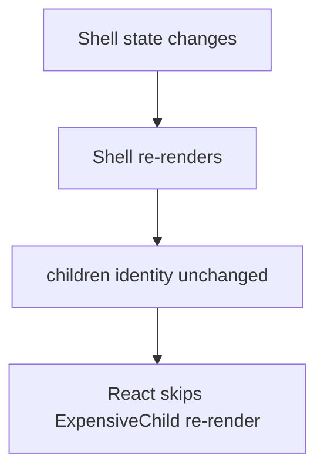

## The Component With 15 Props

A 12th boolean prop is being added to a component. The component started simple. Now it has 15 props, some only apply in specific combinations. Every new variant adds a prop. The component tries to predict every use case and fails.

```jsx
<Dialog
  title="Delete?" body="Sure?" icon="warn"
  showCancel cancelText="No" confirmText="Yes"
  footerAlign="right" onConfirm={...} onCancel={...} />
```

Each variation grows the prop surface. You cannot express "a custom footer with two buttons and a checkbox" without yet more props. The mistake: **the component owns too many decisions.** The caller should own more.

## The Mental Model

Every React pattern answers one question: **who owns this state or behavior, and how does the consumer customize without me predicting every case?** The tool is almost always composition over configuration. Instead of growing props, let the caller pass in the pieces — elements, render functions, children.

**Analogy:** A fixed menu is configuration — you get what the chef decided. A build-your-own bowl is composition — you pick the ingredients. The restaurant stays simple. The customer stays happy.

The core insight: **the more decisions a component makes, the more props it needs. Push decisions to the caller.**



## Composition Fixes Re-renders

```jsx
// Problem: ExpensiveChild re-renders on every count change
function App() {
  const [count, setCount] = useState(0);
  return <div onClick={() => setCount(count+1)}>
    {count}
    <ExpensiveChild />
  </div>;
}

// Solution: pass as children from a stable parent
function Shell({ children }) {
  const [count, setCount] = useState(0);
  return <div onClick={() => setCount(count+1)}>{count}{children}</div>;
}
function App() {
  return <Shell><ExpensiveChild /></Shell>;
}
```

`<ExpensiveChild/>` is created as JSX in `App`, which never re-renders (no state). When `Shell` re-renders, it receives the same `children` prop reference. React compares elements by `Object.is` — same reference means skip re-render. No `React.memo` needed, no comparison cost.

This is the structural alternative to `React.memo`. Composition avoids both the comparison cost and the risk of unstable props defeating memo.

## Compound Components

State is shared implicitly via Context. The caller arranges the pieces freely.

```jsx
const TabsCtx = createContext();
function Tabs({ children, defaultTab }) {
  const [active, setActive] = useState(defaultTab);
  return <TabsCtx.Provider value={{ active, setActive }}>{children}</TabsCtx.Provider>;
}
Tabs.Tab = function Tab({ id, children }) {
  const { active, setActive } = useContext(TabsCtx);
  return <button aria-selected={active===id} onClick={() => setActive(id)}>{children}</button>;
};
Tabs.Panel = function Panel({ id, children }) {
  const { active } = useContext(TabsCtx);
  return active === id ? <div role="tabpanel">{children}</div> : null;
};
```

Usage — the caller composes structure freely:

```jsx
<Tabs defaultTab="account">
  <Tabs.Tab id="account">Account</Tabs.Tab>
  <Tabs.Tab id="security">Security</Tabs.Tab>
  <Tabs.Panel id="account"><AccountForm /></Tabs.Panel>
  <Tabs.Panel id="security"><SecurityForm /></Tabs.Panel>
</Tabs>
```

This is how Radix and shadcn build accessible primitives. No new props for new variations — just compose differently.

## Hooks Replaced HOCs and Render Props

HOCs create wrapper hell (`withAuth(withRouter(withTheme(Component)))`) and prop collisions. Render props create deeply nested callback trees. Hooks compose flat and explicit:

```js
const data = useData();
const auth = useAuth();
```

Just function calls. No wrapper components. No hidden data flow. When is a render prop still useful? When the caller needs access to the component's internal state to control rendering:

```jsx
<VirtualList items={items}>
  {({ index, style, isScrolling }) => (
    <div style={style}>
      {isScrolling ? <Placeholder /> : <Row data={items[index]} />}
    </div>
  )}
</VirtualList>
```

## Controlled + Uncontrolled

```jsx
function Select({ value, defaultValue, onChange, children }) {
  const [internalValue, setInternalValue] = useState(defaultValue);
  const isControlled = value !== undefined;
  const currentValue = isControlled ? value : internalValue;

  function handleChange(e) {
    const newValue = e.target.value;
    if (!isControlled) setInternalValue(newValue);
    onChange?.(newValue);
  }

  return <select value={currentValue} onChange={handleChange}>{children}</select>;
}
```

Controlled: pass `value` + `onChange`. Caller owns state. Uncontrolled: pass only `defaultValue`. Component manages internally. Support both — it is how React's own form elements work.

## Common Mistakes

- Boolean-prop explosion instead of composition — new variations need new props.
- Reaching for `React.memo` when a composition fix is cleaner.
- HOC wrapper hell where a custom hook would be flat.
- Supporting only controlled or only uncontrolled when both are easy to allow.

## Q&A

**Q: How do you refactor a 10-prop Dialog into a compound component?**
Shared state (like `onClose`) goes in Context. Sub-components (`Dialog.Title`, `Dialog.Body`, `Dialog.Footer`) read from Context. The caller arranges structure freely. No new props needed for new variations — just compose the pieces differently.

**Q: A child re-renders when unrelated parent state changes. Composition or memo?**
Composition first — pass the child as `children` from a stable parent. The element reference stays the same, React skips re-render. No comparison cost. Use `React.memo` when you cannot change the parent structure (third-party wrapper) or when the child genuinely receives props that need comparison.

**Q: Why did hooks replace HOCs and render props?**
Hooks compose flat — just function calls, no wrapper hell, no prop collisions, no deep nesting. Data flow is explicit in the component body. HOCs create implicit data flow and wrapper layers. Render props create nested callback trees.

**Q: When is a render prop still useful?**
When the caller needs access to the component's internal state to control rendering. A `<VirtualList>` exposing scroll position and visible range to the caller — no hook can expose that, but a render prop can.

## Mental Trigger

**Composition over configuration. Push decisions to the caller.**
