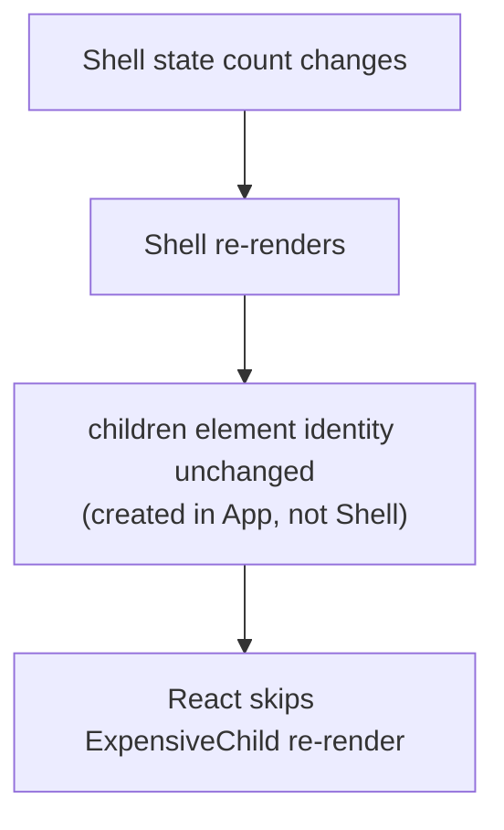

> **Prerequisites:** understanding of React's rendering process (how component functions produce elements and how state changes trigger re-render) and hooks (useState, useContext), plus familiarity with component composition patterns from shadcn/Radix.

---

## Problem

A 12th boolean prop is being added to a component. The component started simple. Now it has 15 props. Some only apply in specific combinations. Every new variant adds a prop. The component tries to predict every use case and fails at all of them.

```jsx
// Configuration approach: every new need adds a prop. Rigid, huge API.
<Dialog
  title="Delete?" body="Sure?" icon="warn"
  showCancel cancelText="No" confirmText="Yes"
  footerAlign="right" onConfirm={...} onCancel={...} />
```

Each variation grows the prop surface. You cannot express "a custom footer with two buttons and a checkbox" without yet more props. The component tries to predict every use. It cannot.

## Why Existing Solution Failed

The old approach was configuration. You listed every possible variation as a prop. The component grew and grew. Breaking changes were common. Teams forked the component and maintained their own versions.

Render props and HOCs tried to fix this. Render props let you pass a function instead of a prop. HOCs wrapped a component to add behavior. But both had problems.

Render props created deeply nested trees. HOCs caused wrapper hell and prop collisions. Neither solved the core problem: the component still owned too much of the decision. The caller needed more control.

```jsx
// HOC wrapper hell
export default withAuth(withRouter(withTheme(MyComponent)));

// Render prop nesting
<DataProvider>
  {data => (
    <AuthProvider>
      {auth => (
        <ThemeProvider>
          {theme => <MyComponent data={data} auth={auth} theme={theme} />}
        </ThemeProvider>
      )}
    </AuthProvider>
  )}
</DataProvider>
```

Custom hooks replaced both. They share logic without modifying the component tree. They compose flat instead of nested.

## Mental Model

Every React pattern answers one question: "who owns this state or behavior, and how do I let the consumer customize without me predicting every case?" The tool is almost always COMPOSITION over CONFIGURATION. Instead of growing a component's props to cover every variation, let the caller pass in the pieces (elements, render functions, children). Composition pushes decisions outward to where the context is. It keeps components open to extension. And it preserves element identity so React skips needless re-renders.

From "composition over configuration" you can see compound components, slots, render props, custom hooks, controlled vs uncontrolled, and why passing `children` fixes re-renders. You do not need to memorize a pattern catalog. Each pattern is a way to move a decision to the caller.

## Visualization



When `children` are created in a parent that does not re-render, their identity stays stable. The re-rendering parent sees the same element reference. React skips re-rendering it.

## Engine Simulation

```jsx
// Problem: ExpensiveChild re-renders every time count changes
function App() {
  const [count, setCount] = useState(0);
  return <div onClick={() => setCount(count+1)}>
    {count}
    <ExpensiveChild />
  </div>;
}

// Solution: pass it as children from a stable parent
function Shell({ children }) {
  const [count, setCount] = useState(0);
  return <div onClick={() => setCount(count+1)}>{count}{children}</div>;
}
function App() {
  return <Shell><ExpensiveChild /></Shell>;   // ExpensiveChild created here, not in Shell
}
```

Here is why the solution works. `<ExpensiveChild/>` is created as a JSX element in `App`, not inside `Shell`. `App` does not own the `count` state so it never re-renders. When `Shell` re-renders because `count` changed, it reuses the *same* `children` prop reference.

In JavaScript, objects are compared by reference. The `children` prop is the same object reference from the previous render. React treats it as unchanged. React does not call `ExpensiveChild`'s function. There is no re-render.

This is the structural alternative to `React.memo`. It is often cleaner. `React.memo` has a comparison cost and does nothing if props are unstable. Composition avoids both problems.

## Internal Implementation

React reconciliation compares elements by reference using `Object.is`. When you pass `<ExpensiveChild />` as `children` to `Shell`, the element object is created in the caller (`App`). `App` does not re-render. So the same element object is passed to `Shell` every time. `Shell` re-renders, but its render returns the same `children` element object. React sees the same type and key. It skips the child.

This is different from embedding `<ExpensiveChild />` inside `Shell`:

```jsx
// Bad: new element created every render
function Shell() {
  const [count, setCount] = useState(0);
  return <div>{count}<ExpensiveChild /></div>;  // new element every time
}
```

Here, `<ExpensiveChild />` is created in `Shell`'s render function. Every time `Shell` renders, a new element object is created. React sees a different reference. It re-renders `ExpensiveChild`.

Compound components use Context to share state implicitly. Each sub-component reads from Context instead of receiving props. This lets the caller arrange the pieces freely.

```jsx
const TabsCtx = createContext();
function Tabs({ children, defaultTab }) {
  const [active, setActive] = useState(defaultTab);
  return <TabsCtx.Provider value={{ active, setActive }}>{children}</TabsCtx.Provider>;
}
Tabs.Tab = function Tab({ id, children }) {
  const { active, setActive } = useContext(TabsCtx);
  return <button aria-selected={active===id} onClick={() => setActive(id)}>{children}</button>;
};
Tabs.Panel = function Panel({ id, children }) {
  const { active } = useContext(TabsCtx);
  return active === id ? <div role="tabpanel">{children}</div> : null;
};
```

State is shared via Context. The caller puts together structure freely. This is how Radix and shadcn build accessible primitives.

## Real World Example

You have a notification component. The first version uses configuration:

```jsx
<Notification
  type="success"
  title="Saved"
  message="Your changes were saved."
  showIcon={true}
  iconPosition="left"
  dismissible={true}
  autoDismiss={5000}
/>
```

Then the design team wants variations: a notification with an action button, one with a progress bar, one with custom content. The prop surface explodes. You refactor to composition:

```jsx
<Notification>
  <Notification.Icon />
  <Notification.Content>
    <Notification.Title>Saved</Notification.Title>
    <Notification.Message>Your changes were saved.</Notification.Message>
  </Notification.Content>
  <Notification.Actions>
    <Button size="sm" onClick={undo}>Undo</Button>
  </Notification.Actions>
  <Notification.DismissButton />
</Notification>
```

No new props needed for the new variations. Each variation just composes the existing sub-components differently. The component stays stable. The design system stays flexible.

## Tradeoffs

**Composition vs Configuration:** Composition is flexible but requires more code from the caller. Configuration is simple for common cases but rigid for edge cases. Good components support both: sensible defaults (configuration) with escape hatches (composition).

**Compound components:** Flexible but require Context. Context has a re-render cost if not managed carefully. Keep shared state small and stable.

**children identity fix vs React.memo:** Composition fixes re-renders structurally. No comparison cost. `React.memo` wraps the child and compares props. It works when you cannot change the parent structure. Use composition first, memo for measured hot spots.

**Custom hooks vs HOCs vs render props:** Hooks compose flat and explicit. HOCs create wrapper hell and prop collisions. Render props create deep nesting. Use hooks for logic reuse. Use HOCs only when hooks are not available (class components in legacy code). Use render props when the caller needs to control rendering with component-internal state.

**Controlled vs uncontrolled:** Controlled gives the caller full control of the value. Uncontrolled is simpler for basic use. Support both. The pattern matches form elements (`value`/`onChange` vs `defaultValue`).

## Common Mistakes

- Boolean-prop explosion instead of putting together structure.
- Reaching for `memo` when a composition (`children`) fix is cleaner.
- HOC wrapper hell or prop collisions where a custom hook would be flat and clear.
- Compound components without Context, forcing the caller to wire state manually.
- Supporting only controlled or only uncontrolled when both are easy to allow.

## SDE-2 Interview Answer

**Question: "How do you design reusable React components?"**

### Mid-level

"I use composition over configuration. Instead of adding more props, I let callers pass `children` or render functions. Compound components with Context share state implicitly. I support both controlled and uncontrolled patterns. I use custom hooks for logic reuse instead of HOCs."

### Senior

"Every pattern answers: who owns this state or behavior, and how does the caller customize without me predicting every case? The answer is almost always composition.

Configuration adds props. Composition passes pieces. Compound components with Context share state implicitly. The caller arranges the structure.

The `children` composition pattern also fixes unnecessary re-renders. When `children` are created in a parent that does not re-render, their element identity stays stable. The re-rendering parent sees the same reference. React skips the child. This is the structural alternative to `React.memo`.

Custom hooks replaced HOCs and render props for logic reuse. They compose flat, are explicit about what state they manage, and do not change the component tree.

For controlled vs uncontrolled, I follow the form element pattern. Support both. The caller decides who owns the value."

### Engineering Lead

"I standardize on composition patterns across the team. We use compound components with Context for most UI primitives. We build on Radix or shadcn so we do not reinvent accessibility patterns.

Code reviews check for composition over configuration. When someone adds the nth boolean prop, we discuss whether a compound approach is better. We keep components focused. Each component does one thing.

We document the patterns. New developers learn: composition first, hooks for logic, Context for shared component state, controlled/uncontrolled for form-like components.

The organizational pattern: standardize on a small set of patterns, build on existing primitives, review for composition, keep it simple."

## Follow-up Questions

1. Refactor a 10-prop `<Dialog>` into a compound component. Where does shared state live? (application)

2. A child re-renders when an unrelated parent state changes. Show two ways to fix it and argue when composition beats `memo`. (application plus analysis)

3. Why did hooks largely replace HOCs and render props? When is a render prop still useful? (analysis)

4. Make a `<Select>` support both controlled and uncontrolled use. (application)

5. Design a component API for a data table that supports sorting, filtering, pagination, custom cell renderers, and row selection. How do you avoid the 15-prop trap? (synthesis)

## Mental Trigger

**Composition over configuration. Push decisions to the caller.**

## One Page Revision

- Every pattern answers: who owns it, how does caller customize?
- Composition over configuration: pass pieces (children/slots/render fns) instead of listing props.
- Compound components share state implicitly via Context.
- Passing `children` keeps element identity stable. Skips re-renders without memo.
- Composition fixes re-renders structurally. memo compares props and has a cost.
- Custom hooks share logic. Components share UI.
- Hooks replaced HOCs/render props. They compose flat and are explicit.
- Support both controlled and uncontrolled (value/defaultValue pattern).
- Radix and shadcn are built on compound components with Context.
