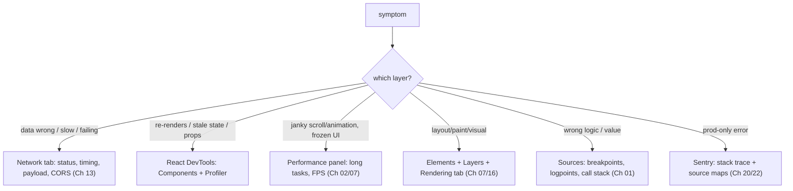

> **Prerequisites:** understanding of the browser's event loop and long tasks (Ch 02), React's render/commit cycle and hooks (Ch 04/05), the rendering pipeline (layout, paint, compositing, Ch 07/08), and the Network tab for inspecting API calls (Ch 13). This chapter turns those into a methodical debugging practice.

---

## The one mental model

> **Debugging is a SCIENCE experiment, not a guessing game. Form a hypothesis about where the
> bug is. Then use the tool that OBSERVES that layer to confirm or kill it. Let the
> observation, not your hunch, pick the next step. Each layer has its instrument: network
> issues go to the Network tab. Render/state issues go to React DevTools. Jank/slowness goes to the Performance panel.
> Layout/paint goes to Elements plus Layers. Logic goes to breakpoints. Bisect: cut the problem space in half
> each step until the cause is cornered.**

From "observe the layer, bisect" you can see why `console.log` spam is the slow path. You learn how to find
*why* a component re-renders, how to locate a long task, and how to tell "is it the network or my
code." No memorizing tool menus. You map symptom to layer to instrument.

---

## Learning Objectives

1. Turn a vague bug into a hypothesis and the tool that tests it (symptom to layer to instrument).
2. Use React DevTools (Profiler "why did this render", Components) for render/state bugs.
3. Use the Performance panel to find long tasks and jank (Ch 02/07) and the Network tab for network issues.
4. Use breakpoints (conditional, logpoints) instead of `console.log` archaeology.

---

## Key Mental Models

- **Symptom to layer to instrument.** Do not open a random tool. Pick the one that observes the
  suspected layer.
- **Bisect.** Cut the search space in half each step (disable half, binary-search a commit, comment out
  a subtree).
- **Reproduce reliably first.** A bug you cannot trigger on demand, you cannot fix with confidence.
- **Observe, don't assume.** The cause is usually not where you first think.

---

## Introduction

The JD and Interviewer both reward methodical debugging. Most engineers guess and use `console.log`. A
senior reproduces, forms a hypothesis, and picks the right tool. That discipline is a
direct interview signal ("walk me through debugging X") and a daily speed multiplier.

---

## Symptom → instrument map



---

## Engine Simulation: three common bugs, methodically

**1. "My component re-renders too much" (Ch 03/05/08).**
Hypothesis: an unstable prop or a parent re-render. Instrument: **React DevTools Profiler**.
Record an interaction. Click the component. **"Why did this render?"** tells you if props
changed, hooks changed, or parent rendered. If a prop is "changed" every time, it has an unstable
object or function identity. In JS, inline objects and functions like `style={{}}` or `onClick={() => {}}`
create new references each render. So React sees a "different" prop. Use `useCallback`/`useMemo` or
composition (Ch 24). You *observed*
the cause instead of sprinkling `memo` and hoping.

**2. "The page janks while scrolling" (Ch 02/07).**
Hypothesis: a long task or layout thrash. Instrument: **Performance panel**. Record, then look for
**long tasks** (red-flagged, over 50ms) and the flame chart. If you see "Recalculate Style/Layout"
repeatedly, that is layout thrashing (Ch 07). Batch reads and writes. If it is a big JS function, chunk it
or move it to a Worker (Ch 17). The bar colors map straight to the pipeline (Ch 07).

**3. "Data is wrong or missing" (Ch 13/10).**
Hypothesis: bad request or response. Instrument: **Network tab**. Find the request, check the status
(401? 304? 500?), the payload, timing, and CORS headers (Ch 13). This rules out "is it the backend or
my rendering" in seconds. Often it is the network, not React.

---

## Breakpoints > console.log

```js
// Slow path: edit code, add logs, reload, read, repeat, remove logs...
console.log("here", value);
```

Faster: set a **breakpoint** in Sources (or a **logpoint** which logs without editing code). Inspect
the live **scope** and **call stack** (Ch 01, you can literally see the frames). Step through.
**Conditional breakpoints** (`break when id === 7000`) pinpoint the one iteration that is wrong.
This is invaluable for the "row 7000 misbehaves" bug. The `debugger;` statement works
too. Save `console.log` for quick checks, not investigations.

---

## Other high-leverage tools

- **React DevTools → Components:** inspect props/state/hooks live; edit them to test hypotheses.
- **Rendering tab:** "Paint flashing" (what repaints), "Layout Shift regions" (CLS, Ch 08),
  FPS meter.
- **`$0`** in console = the selected element; **`$_`** = last result; `monitorEvents($0)`.
- **`why-did-you-render`** library for automatic re-render logging in dev.
- **Sentry** (Ch 22) for prod errors with source maps (Ch 20) → real line numbers.

---

## Interview Discussion (reason first)

**Q1. "A component re-renders too often. How do you find why without guessing?"**
> "React DevTools Profiler. Record the interaction. Select the component. Read 'Why did this
> render?' It says props/hooks/parent. If a prop shows changed every render, it has unstable
> identity (Ch 01). So I stabilize it or restructure with composition. I confirm with the
> Profiler rather than blindly adding memo."

**Q2. "The UI is janky. Walk your process."**
> "Reproduce. Then Performance panel. Record and look for long tasks (over 50ms) and the flame chart.
> Repeated Layout or Style means thrashing, so batch reads and writes (Ch 07). A heavy JS function means chunk it or
> put it in a Worker (Ch 17). The symptom points me at the instrument."

**Q3. "Data looks wrong. Is it backend or frontend?"**
> "Network tab first. Check status, payload, timing, CORS. If the response is wrong, it is the backend or the
> request. If the response is right but the UI is wrong, it is my rendering or state. Two minutes to
> bisect the layer."

*Scoring:* full = symptom→instrument + Profiler "why rendered" + Network-first triage + breakpoints.

---

## Common Mistakes

- **Guess and `console.log`** instead of picking the instrument for the layer.
- **Adding `memo` without using the Profiler** to confirm the cause (Ch 08).
- **Not reproducing reliably** before trying to fix.
- **Ignoring the Network tab** and blaming React for a 401, CORS, or slow API.
- **Reading production stack traces without source maps** (Ch 20) gives minified gibberish.

---

## Interview Questions

1. Map these symptoms to a tool: 401 on save, janky scroll, a value that is wrong on row 7000, too
   many re-renders.
2. How does the Profiler tell you *why* a component rendered, and what do you do for each cause?
3. What is a long task and how do you spot it? What fixes layout thrashing?
4. Conditional breakpoint vs console.log. When is each right?
5. Why are source maps essential for prod debugging?

---

## Homework

1. Use the Profiler's "Why did this render?" on a component re-rendering from an unstable prop;
   fix it and confirm in the Profiler.
2. Record a janky interaction in the Performance panel; identify a long task or a Layout spike and
   tie it to Ch 02/07.
3. Set a conditional breakpoint to catch one bad iteration in a list; inspect the scope/call stack.
4. In `NOTES.md`: the symptom→instrument map.

---

## Summary

- Debug like an experiment. Form a **hypothesis, observe the right layer, let data pick the next step**,
  and **bisect** the search space.
- **Symptom to instrument.** Network goes to Network tab (Ch 13). Re-renders/state goes to React DevTools
  Profiler ("why did this render?"). Jank goes to Performance panel (long tasks, Ch 02/07). Layout/paint
  goes to Elements/Layers/Rendering (Ch 07). Logic goes to breakpoints (Ch 01). Production goes to Sentry and source maps
  (Ch 20/22).
- **Breakpoints, logpoints, and conditional breakpoints** beat `console.log` archaeology.
- **Reproduce first. Observe, don't assume.** The cause is rarely where you guessed.

## Go deeper
Ch 08 (Profiler for perf), Ch 07 (reading paint/layout), Ch 22 (Sentry). The Chrome DevTools docs
are the reference once the symptom→instrument reflex is built.
