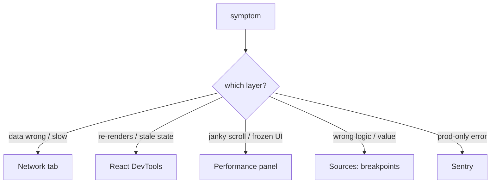

## The Problem That Hooks You

Your API returned data. You can see it in the Network tab. But the component shows nothing. You add a `console.log`. Reload. See the data. Add another log. Reload. Still no clue.

`console.log` isn't debugging. It's guessing with extra steps.

## The One Insight

**Debugging is a science experiment, not a treasure hunt.** You form a hypothesis about which layer the bug lives in, pick the instrument that observes that layer, and let the evidence confirm or kill your hypothesis. No guessing. No sprinkling logs and hoping.

Think of it like a doctor. You don't ask "where does it hurt?" and guess. You run blood work, X-rays, MRI. Each test observes a specific system. DevTools are your instruments — one per layer.

Each layer has its own instrument:
- **Network issues** → Network tab
- **Render or state issues** → React DevTools
- **Jank or slowness** → Performance panel
- **Layout or paint issues** → Elements + Layers
- **Logic bugs** → breakpoints
- **Production errors** → Sentry + source maps

## Three Bugs, One Method

**Bug 1: Component re-renders too much.**

Hypothesis: an unstable prop or parent re-render. Instrument: React DevTools Profiler. Record an interaction. Click the component. "Why did this render?" says props changed. The prop is an inline object `style={{}}`. Every render creates a new object reference. Fix with `useCallback`, `useMemo`, or component composition. Confirm in the Profiler.

**Bug 2: Page janks while scrolling.**

Hypothesis: a long task or layout thrash. Instrument: Performance panel. Record the interaction. Look for long tasks flagged in red (over 50ms). Examine the flame chart. Repeated "Recalculate Style" blocks mean layout thrashing. Fix: batch DOM reads before writes. Move expensive JS to a Web Worker.

**Bug 3: Data is wrong or missing.**

Hypothesis: bad request or bad response. Instrument: Network tab. Find the request. Check the status code (401, 304, 500). Inspect the payload, timing, and CORS headers. This rules out the backend in seconds.

## How the Tools Actually Work

**Breakpoints:** V8 replaces the target line with a debug break instruction. Execution pauses before that runs. The debugger serializes the call stack, scope chain, and variable values. Conditional breakpoints add a check — V8 evaluates the expression each time, pausing only when it returns true.

**React DevTools Profiler:** Instruments the React reconciler. During profiling, React records timing and cause data for every render: which component, which props changed, which hooks changed. The "Why did this render?" feature compares previous and current props using `Object.is`.

**Performance panel:** Samples the call stack every millisecond. The flame chart stacks these samples. Long tasks are groups exceeding 50ms — the RAIL model threshold where the browser must respond to input.

## Real World: Dashboard Shows Blank

1. **Reproduce** reliably. Clear cache, refresh. Blank every time.
2. **Network hypothesis.** Open Network tab. API returns 200 with correct data. Not the network.
3. **Render hypothesis.** React DevTools Components. Data prop exists, but the child that renders content is absent.
4. **Deeper hypothesis.** A conditional render hides it. Set a breakpoint. The condition evaluates to `false` because a boolean flag is inverted.
5. **Confirm.** Fix the condition. Reload. Dashboard shows data. Under 5 minutes. No `console.log`.

## Performance Panel Deep Dive

Record a profile during the janky interaction. Enable screenshots and CPU throttling (4x) to simulate real-world devices.

**Reading the flame chart:**
- Yellow bars = scripting (JS). If yellow stretches across the timeline, JS is the bottleneck.
- Purple bars = layout. Large purple means the browser recalculates geometry.
- Green bars = paint. Large green means rasterizing pixels.
- Red triangles on bars = long tasks (>50ms).

**Layout thrashing:** Alternating "Recalculate Style" blocks and script execution. JavaScript reads a layout property (`offsetHeight`, `getBoundingClientRect`), then writes to the DOM (`style.width`). Each read forces synchronous reflow. Fix: batch all reads first, then all writes.

## React Profiler Walkthrough

Enable "Record why each component rendered" before profiling. After recording, click any component:
- **"Why did this render?"** — tells you if it was props, hooks, state, or parent rendered.
- **"What changed?"** — shows before/after values for each prop and hook.

The render phase calls component functions and diffs virtual DOM (can be interrupted). The commit phase applies changes to real DOM and runs effects (synchronous). A long render duration means slow component functions. A long commit duration means expensive effects.

## Network Panel Mastery

The waterfall chart is a timeline, not just a list. Each colored bar shows: Stalled → DNS → Connection → Request sent → TTFB → Content Download.

**Key patterns:**
- **Wide TTFB bars** → server is slow (not a frontend problem unless you're sending a bad query).
- **Stacked stalled phases** → connection limits (HTTP/1.1 caps at 6 concurrent connections per domain).

Check the "Size" column: `"(from disk cache)"` means the browser cached it. `"3.2 kB"` means it downloaded again. Check `Cache-Control` and `ETag` headers for re-load performance.

## Memory Profiling

Take three heap snapshots: baseline, after one action cycle, after a second cycle. Compare pairs. Filter for "Detached" DOM nodes. Trace the retaining tree upward to find the root cause.

Classic patterns:
- **Forgotten event listeners** — `scroll` listener added in `useEffect` without cleanup.
- **Timers outliving components** — `setInterval` without `clearInterval`.
- **Closures capturing large objects** — callback closes over a large array stored globally.

The fix is always cleanup: `removeEventListener`, `clearInterval`, nullify references in `useEffect` return.

## Console Techniques (Done Right)

The console is a **presentation tool**, not an investigation tool.

- `console.table(users)` — sortable table for arrays of objects.
- `console.group("label")` — collapsible output for nested state.
- `performance.mark("start")` / `performance.measure("name", "start", "end")` — timing data queryable in the Performance panel.
- `debugger` with a condition — a breakpoint in code. `if (id === 7000) debugger;` pauses only for the specific case.

## Common Mistakes

- Sprinkling `console.log` instead of picking the right instrument.
- Adding `memo` without using the Profiler to confirm the cause.
- Skipping reliable reproduction before attempting a fix.
- Blaming React for a problem in the Network tab.
- Investigating too wide — bisect to narrow faster.

## Follow-up Questions

**Q1: How does the React DevTools Profiler know why a component rendered?**
It compares previous and current values of every prop and hook using `Object.is` at the reconciler level. Enable "Record why each component rendered" before profiling to capture comparison data.

**Q2: A scroll handler fires 60 times per second and the UI janks. What two instruments do you use?**
Performance panel to find layout thrashing (repeated "Recalculate Style" blocks), and React DevTools Profiler to check if the handler triggers re-renders via `setState`.

**Q3: You set a breakpoint but the debugger never pauses. What's wrong?**
Source maps are missing/stale, the breakpoint is in code that isn't hit, or the file is loaded from a different origin without CORS headers.

**Q4: Why does the Performance panel flag tasks longer than 50ms?**
At 60fps, each frame has ~16.6ms. The browser needs ~50% for layout/paint/composite, leaving ~50ms for JS. The RAIL model specifies 50ms for the browser to process input + 50ms for JS to produce a visual response.

## Mental Trigger

Observe the layer, bisect the space. Every leak is a forgotten cleanup. Every jank is a blocked main thread.

## One Page Revision

- Debugging = hypothesis → instrument → observation → conclusion. Not guessing.
- Each layer has one instrument: Network tab, React DevTools, Performance panel, breakpoints, Sentry.
- Bisect the problem. Cut the search space in half each step.
- Performance panel: yellow = scripting, purple = layout, green = paint. Red triangles = long tasks.
- React Profiler: "Why did this render?" tells you the cause. Render vs commit duration.
- Network waterfall: wide TTFB = slow server. Stacked stalls = connection limits.
- Memory profiling: 3 snapshots, compare pairs, filter for Detached DOM, trace retaining paths.
- Console = presentation tool. `console.table` for readability, `debugger` for investigation.
