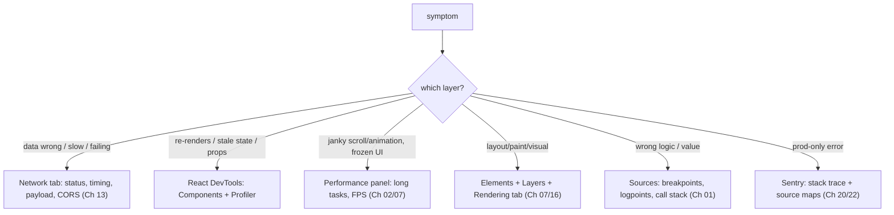

## The Problem That Hooks You

You're staring at a blank screen. The API returned data. You can see it in the Network tab. But the component shows nothing. You add a `console.log`. Reload. See the data. Add another log. Reload. Still no clue. Twenty minutes later, you're deeper in log statements than when you started.

Sound familiar? Here's the thing — `console.log` isn't debugging. It's guessing with extra steps.

## Why console.log Fails

Think of debugging like a doctor diagnosing a patient. You wouldn't just ask "where does it hurt?" and then guess. You'd run tests — blood work, X-rays, MRI. Each test tells you something specific about a specific system.

`console.log` is like asking the patient to describe their symptoms. Helpful, but it won't tell you if it's the heart or the liver. You need instruments that observe specific layers of the system.

Here's what's actually wrong with console.log:
- You modify source code to add it, then remove it. That's two edits per investigation.
- Logs show values at one moment. They don't show the call stack, the scope chain, or the execution path.
- Logs can't filter. A loop of 10,000 iterations prints 10,000 lines. Good luck finding the one where `id === 7000`.
- Logs tell you nothing about layout, paint, network, or rendering.

## The One Insight

**Debugging is a science experiment, not a treasure hunt.** You form a hypothesis about which layer the bug lives in, pick the instrument that observes that layer, and let the evidence confirm or kill your hypothesis.

That's it. No guessing. No sprinkling logs and hoping. Hypothesis → instrument → observation → conclusion.

Each layer has its own instrument:
- **Network issues** → Network tab
- **Render or state issues** → React DevTools
- **Jank or slowness** → Performance panel
- **Layout or paint issues** → Elements + Layers
- **Logic bugs** → breakpoints
- **Production errors** → Sentry + source maps

Bisect the problem. Cut it in half each step. Disable half the code. Comment out a subtree. Narrow until the cause has nowhere to hide.

## Visualization



## Three Bugs, One Method

Let's walk through the method with real bugs.

**Bug 1: Component re-renders too much.**

Hypothesis: an unstable prop or parent re-render. Instrument: React DevTools Profiler. Record an interaction. Click the component. Read "Why did this render?" It says props changed. Look at the prop — it's an inline object `style={{}}`. Every render creates a new object reference. React sees a new object each time, so it re-renders. Fix with `useCallback`, `useMemo`, or component composition. Confirm in the Profiler.

You observed the cause. You didn't sprinkle `memo` and hope.

**Bug 2: Page janks while scrolling.**

Hypothesis: a long task or layout thrash. Instrument: Performance panel. Record the interaction. Look for long tasks flagged in red (over 50ms). Examine the flame chart. Repeated "Recalculate Style" or "Layout" entries mean layout thrashing. The fix is to batch DOM reads before writes. If a JavaScript function takes too long, chunk it or move it to a Web Worker.

**Bug 3: Data is wrong or missing.**

Hypothesis: bad request or bad response. Instrument: Network tab. Find the request. Check the status code (401, 304, 500). Inspect the payload, timing, and CORS headers. This rules out the backend in seconds. Often the problem is the network, not React.

## How the Tools Actually Work

When you set a breakpoint in DevTools Sources, the V8 debugger replaces the target line with a debug break instruction. Execution pauses before that runs. The debugger serializes the call stack, scope chain, and variable values. Conditional breakpoints add a check — V8 evaluates the expression each time the breakpoint is hit, pausing only when it returns true.

The React DevTools Profiler instruments the React reconciler. During profiling, React records timing and cause data for every render: which component, which props changed, which hooks changed. The "Why did this render?" feature compares previous and current props using `Object.is`. If either differs, it reports the cause.

The Performance panel samples the call stack every millisecond. Each sample captures the current function and whether layout or paint is running. The flame chart stacks these samples. Long tasks are groups of samples exceeding 50ms. This threshold comes from the RAIL model: the browser needs 50ms to respond to input and 50ms to render the frame.

## Real World: Dashboard Shows Blank

Your team's dashboard loads data but shows a blank screen. No error logged. Here's the methodical approach.

Step 1: reproduce reliably. Clear cache, refresh. Blank screen every time. Good.

Step 2: layer hypothesis. Is it network or rendering? Open Network tab. Reload. Find the API call. Status is 200. Response looks correct. Not the network.

Step 3: new hypothesis. Component renders but produces no output. Open React DevTools Components. Browse the tree. The data prop exists. But a child component that renders the main content is absent.

Step 4: deeper hypothesis. A conditional render hides it. Set a breakpoint in the parent's render. Step through. The condition evaluates to `false` because a boolean flag is inverted.

Step 5: confirm. Fix the condition. Remove breakpoint. Reload. Dashboard shows data.

Total time: under 5 minutes. No console.log. No guessing. Each step used the right instrument.

## Tradeoffs

**console.log vs breakpoints.** Logs are fine for quick sanity checks. They're terrible for investigations. Breakpoints preserve the full execution context. Use logs for confirmation. Use breakpoints for exploration.

**React DevTools Profiler vs Performance panel.** The Profiler tells you *why* React rendered. The Performance panel tells you *how long* it took. The Profiler gives the cause. The Performance panel gives the cost. Use both.

**Local debugging vs Sentry.** Local DevTools can't reproduce production data. Sentry captures real errors with source maps. Use DevTools for development. Use Sentry for production.

**DevTools vs automated tests.** Tests catch regressions before they ship. DevTools find problems in running code. They're complementary. Write a test after you find a bug so it never comes back.

## Common Mistakes

- Sprinkle `console.log` instead of picking the instrument for the layer.
- Add `memo` without using the Profiler to confirm the cause.
- Skip reliable reproduction before attempting a fix.
- Blame React for a problem in the Network tab (401, CORS, slow API).
- Read production stack traces without source maps.
- Investigate too wide. Bisect to narrow faster.
- Keep debugging after a fix without confirming it works.

## Performance Panel Deep Dive

You notice the tab is freezing during a scroll-heavy page. Users complain about jank. You open the Performance panel, hit record, scroll for a few seconds, and stop. Now what?

### Recording a Profile

Click the record button (circle icon). The panel prompts you to perform the interaction you want to profile — scroll, click, type, anything. Perform the action. Click stop. The panel processes the data and renders a timeline.

The key controls:
- **Screenshots checkbox**: enable this. It captures frames so you can see what the user actually saw at each moment. Without it, you're reading numbers blind.
- **CPU throttling**: simulate a slower device. Set to 4x or 6x slowdown. If the page is fine at normal speed but janky under throttling, you've found a CPU-bound problem that affects real users on mid-range phones.
- **Network throttling**: simulate slow 3G. Useful for profiling loading behavior, not scroll jank.

### Reading the Flame Chart

The flame chart is the centerpiece. The x-axis is time. The y-axis is the call stack depth. Each bar is a function call. Wider bars mean more time in that function. The bottom bars are what the browser called (scripting, layout, paint). The top bars are your code.

Here's how to read it:
1. Look for the yellow bars (scripting). If the yellow stretches across a large chunk of the timeline, JavaScript is the bottleneck.
2. Look for purple bars (layout) and green bars (paint). Large purple means the browser is recalculating geometry. Large green means it's rasterizing pixels. Both are expensive.
3. Red triangles on the top-right corner of any bar flag "long tasks" — JavaScript execution blocks exceeding 50ms.

Click any bar to see details in the Summary pane below: the function name, self time, total time, and the call path that led there.

### Identifying Long Tasks

Long tasks are red-flagged in the "Main" thread row. They appear as a red right-triangle marker. A 200ms long task means the browser couldn't respond to input for 200ms. Users feel this as a freeze.

To diagnose what's inside a long task:
1. Click the task to zoom in. The flame chart expands to show only that task.
2. Look at the widest bars. That's where the time went.
3. Common culprits: a tight loop doing DOM manipulation, a large JSON parse, an expensive regex, a recursive function with no base case.

### Layout Thrashing in the Wild

Layout thrashing happens when JavaScript reads a layout property (like `offsetHeight`, `getBoundingClientRect`, `getComputedStyle`) and then writes to the DOM (like setting `style.width`) in an alternating pattern. Each read forces the browser to synchronously recalculate layout. Each write invalidates the layout, so the next read triggers another recalculation.

In the Performance panel, you'll see this pattern:
- A "Recalculate Style" or "Layout" block
- Followed by script execution
- Followed by another "Recalculate Style" or "Layout"
- Repeated multiple times in quick succession

The fix is batching. Read all the measurements you need first, then do all the writes. The `ResizeObserver` callback and `requestAnimationFrame` are your allies here.

**Common mistake:** Assuming the Performance panel is only for production. It works in development. Profile early. Don't wait for users to complain.

**Interview answer (mid-level):** "I record a Performance profile during the janky interaction. I look for long tasks flagged in red on the main thread. I zoom into the longest task and find the widest bar in the flame chart — that's where time is spent. If I see repeated Layout blocks between script execution, it's layout thrashing. I batch reads before writes to fix it."

**Interview answer (senior):** "I use CPU throttling to simulate real-world devices. I enable screenshots to correlate timeline events with visual output. I look for the pattern of Recalculate Style blocks alternating with script — that's the layout thrash signature. Beyond that, I check for forced synchronous layouts using the Layout Instability API, and I profile on actual mobile devices because DevTools throttling doesn't perfectly simulate thermal throttling or memory pressure."

---

## React Profiler Walkthrough

You suspect a component is re-rendering when it shouldn't. The UI feels sluggish after a state change. You open React DevTools, click the Profiler tab, and hit record. Now what?

### Why Did This Render?

After recording an interaction, the Profiler shows a flame chart of the commit. Each row is a component. The color intensity shows how long it took. Click any component and the right panel shows two critical details:

- **"Why did this render?"**: This is React comparing the previous and current render. It checks props, hooks, and state. If `props.name` changed from `"Alice"` to `"Bob"`, it says "props.name changed from Alice to Bob." If nothing changed and the component still rendered, it says "The parent component rendered." That's your clue — the parent is the problem, not the child.

- **"What changed?"**: Shows the exact before/after values for each prop and hook. This is how you catch the inline object `style={{}}` that creates a new reference every render, or the `onClick={() => doSomething()}` arrow function that breaks `React.memo`.

### Commit Phases

React's render cycle has two phases:
1. **Render phase** (the "what"): React calls your component functions, calculates the new virtual DOM tree, and diffs it against the previous tree. This phase can be interrupted by concurrent features. It's pure computation — no DOM side effects.
2. **Commit phase** (the "how"): React applies the diff to the real DOM. This is synchronous. It runs layout effects (`useLayoutEffect`), then paint happens, then React runs passive effects (`useEffect`).

The Profiler separates these. In the flame chart, look at the summary bar at the top. It shows "Render duration" and "Commit duration." If the commit is long, effects are expensive. If the render is long, component functions are slow.

A common trap: a `useEffect` that does `document.title = ...` without a dependency array. It runs after every commit. The Profiler won't flag it as a re-render, but the flame chart will show the effect duration growing.

### Profiling a Real Component Tree

Let's walk through a real scenario. Your data table has 500 rows and feels sluggish when you sort.

1. Open Profiler, enable "Record why each component rendered while profiling."
2. Click the sort button. Wait for the UI to settle. Stop recording.
3. The flame chart shows 500+ renders. Most rows are yellow (fast). But the `TableHeader` row is deep red — 300ms.
4. Click `TableHeader`. "Why did this render?" says "The parent component rendered." The parent is `DataTable`, which re-rendered because its `sortConfig` state changed.
5. `TableHeader` has `React.memo`, so it should skip re-rendering. But its `children` prop is an inline JSX tree, creating new references every time.
6. Fix: extract `children` into a memoized variable, or restructure so `TableHeader` doesn't receive volatile children.

**Common mistake:** Using the Profiler to check if `React.memo` works. `React.memo` is a micro-optimization. Profile first to find the actual bottleneck. Then decide if `memo` is the right fix or if component composition is better.

**Interview answer (mid-level):** "I use the Profiler's 'Why did this render?' feature to identify the cause. If it says 'props changed,' I trace which prop is unstable and memoize it. If it says 'parent rendered,' the issue is upstream. I also check the commit phase duration to see if effects are the bottleneck."

**Interview answer (senior):** "The Profiler is my instrument for the 'why' of React performance. I enable 'Record why each component rendered' before profiling. I look for the most expensive commit in the flame chart and trace upward — the most expensive component is often not the root cause. The root cause is usually an unstable parent, a context that changes too broadly, or a side effect that forces re-renders. I differentiate between render-phase cost (component function speed) and commit-phase cost (DOM mutations and effects). For concurrent features, I also check Suspense boundaries because they affect how commits are batched."

---

## Network Panel Mastery

The page loads slowly. Users report it. You open the Network tab, reload, and see 47 requests. Where do you start?

### Waterfall Analysis

The waterfall chart is the most important view. Each row is a request. The horizontal axis is time. The colored bars show the phases:
- **Stalled** (grey): Browser couldn't start the request — connection limit, queuing, priority.
- **DNS Lookup**: Resolving the domain name.
- **Initial Connection / SSL**: TCP handshake and TLS negotiation.
- **Request sent**: Time to upload the request body.
- **Waiting (TTFB)**: Time until the first byte of the response arrives. This is the server's response time.
- **Content Download**: Time to download the response body.

The key insight: requests that start late are blocked by earlier requests. HTTP/1.1 limits to 6 concurrent connections per domain. If 6 requests are in flight, the 7th waits. HTTP/2 multiplexes, but prioritization can still cause delays.

Look for two patterns:
1. **Wide TTFB bars**: The server is slow. Not a frontend problem (unless you're sending a bad query).
2. **Narrow bars stacked vertically**: Many small requests that each add latency. The fix is bundling or code-splitting.

### Identifying Blocking Requests

A blocking request is one that prevents other work. Two types:
- **Render-blocking resources**: CSS files and synchronous scripts in the `<head>`. The browser won't render until they load. In the waterfall, they're at the very top with no overlap with other requests.
- **Long-polling or large downloads**: A single request that takes 5 seconds. Other requests queue behind it.

To find them:
1. Filter by "Blocking" in the Network panel's filter bar.
2. Look for requests with a grey "stalled" phase that extends significantly.
3. Check the "Initiator" column. If a script tag in your HTML initiates a blocking request, it's a render blocker.

The fix for render-blocking CSS: use `media="print"` with `onload` swap, or inline critical CSS. The fix for blocking scripts: add `async` or `defer`.

### Caching Headers

Many slow initial loads are actually slow re-loads. The browser caches aggressively when headers are right. Check the "Size" column:
- **"(from disk cache)"** or **"(from memory cache)"**: The browser used its cache. Good.
- **"3.2 kB"**: The browser downloaded it again. Check if it should have been cached.

Look at the response headers:
- `Cache-Control: max-age=31536000`: Cached for 1 year. Perfect for hashed static assets.
- `Cache-Control: no-cache`: Must revalidate with the server before using cache. Good for HTML documents.
- `Cache-Control: no-store`: Never cache. Used for sensitive data.
- `ETag` + `If-None-Match`: The browser sends the ETag back. If the resource hasn't changed, the server returns 304 (no body). This saves bandwidth.

A common mistake: serving `index.html` with `Cache-Control: max-age=31536000`. Users get a stale HTML that references old JS bundles. Hash your assets but never cache HTML aggressively.

**Common mistake:** Only looking at the total load time. Break it down. Is it 10 requests at 200ms each (network-bound) or 1 request at 2000ms (server-bound)? The fix is different for each.

**Interview answer (mid-level):** "I look at the waterfall to find the bottleneck. If many requests are stacked with stalled phases, I'm hitting connection limits — I'd bundle or use HTTP/2. If one request has a wide TTFB, the server is slow. If the 'Size' column shows download instead of cache hit, I check Cache-Control headers. For render-blocking resources, I check if scripts have async/defer."

**Interview answer (senior):** "The waterfall is a timeline, not just a list. I look at request ordering and dependency chains. A script that loads late blocks its dependent requests even if there are available connections. I use the 'Initiator' column to trace dependency chains. I also check Priority columns — low-priority requests (like images below the fold) may be starved by high-priority ones. For SPAs, I focus on the critical path: what's the minimum set of resources needed to render above-the-fold content? Everything else should be deferred. I also check Service Worker interceptors because they can silently delay or transform requests."

---

## Memory Profiling

Users report the tab gets slower the longer it stays open. After an hour, scrolling stutters. You suspect a memory leak.

### Heap Snapshots

The Memory panel lets you take heap snapshots — a freeze-frame of every JavaScript object in memory. Take three:
1. **Snapshot 1**: Right after page load. This is your baseline.
2. **Snapshot 2**: After performing the action you suspect leaks (open and close a modal, navigate between tabs, etc.) and then performing the same action again.
3. **Snapshot 3**: Repeat the action one more time.

Compare Snapshot 1 to Snapshot 2, then Snapshot 2 to Snapshot 3. Use the "Summary" view. Look at the "Size Delta" and "# Delta" columns. Objects that grow between every snapshot are leaking.

### Finding Memory Leaks

The classic patterns:

**Forgotten event listeners.** You add a `scroll` listener in a `useEffect` but never remove it. Every time the component mounts, a new listener is added. After 10 mounts, there are 10 listeners. In the heap snapshot, look for detached DOM nodes with attached event handlers.

**Timers that outlive their component.** `setInterval` in a `useEffect` without cleanup. The callback holds a reference to the component's scope, preventing garbage collection. The timer keeps firing even after the component unmounts.

**Closures capturing large objects.** A callback closes over a large array or object. The callback is stored somewhere (an event emitter, a global state). The closure keeps the large object alive even after the component that created it unmounts.

To find these in a heap snapshot:
1. Switch to "Objects allocated between Snapshot 1 and Snapshot 2."
2. Filter by "Detached" to find DOM nodes no longer in the document tree.
3. Expand the retaining tree. Follow the chain upward to find what's holding the reference.

### Detached DOM Nodes

A detached DOM node is a node that was removed from the document but still exists in memory because something holds a reference to it. This is the most common memory leak in SPAs.

In the heap snapshot:
1. Group by "Object" type.
2. Filter the search by "Detached."
3. Look for `Detached HTMLDivElement`, `Detached HTMLElement`, etc.
4. Click to see the retaining path. A common pattern: a closure inside an event listener holds a reference to the DOM node.

The fix is always cleanup: remove event listeners, clear timers, nullify references in `useEffect` cleanup functions.

**Common mistake:** Taking only one heap snapshot and looking at total size. You need at least two snapshots to see growth. A single snapshot shows you what's in memory, not what's leaking.

**Interview answer (mid-level):** "I take three heap snapshots: baseline, after one action cycle, and after a second cycle. I compare them to find objects that grow between every snapshot. I filter for detached DOM nodes and trace their retaining paths. The most common leaks I find are event listeners not cleaned up in useEffect, timers that outlive components, and closures capturing large objects."

**Interview answer (senior):** "Memory profiling in React requires understanding the garbage collector. I take snapshots at strategic points — baseline, after the suspected leak action, and after repetition to confirm the pattern. I use the 'Comparison' view between snapshots and sort by size delta. Detached DOM nodes are the first thing I check because they're the most common SPA leak. I also look for growing arrays in global stores (Redux, Zustand) because unbounded state is a silent leak. For production, I use `performance.measureUserAgentSpecificMemory()` to track memory usage over time and alert when it crosses thresholds."

---

## Live Debugging Scenarios

Theory is one thing. Let's walk through four real debugging sessions from first symptom to root cause.

### Scenario A: Janky Scroll

**Symptom:** A product page with infinite scroll stutters. Frames drop to 20fps when scrolling past the 50th item.

**Step 1: Profile.** Open Performance panel, enable screenshots, record while scrolling through 50 items. The flame chart shows the Main thread is mostly yellow (scripting) with periodic purple spikes (layout).

**Step 2: Identify the pattern.** Zoom into a 500ms window. Every 200ms there's a "Recalculate Style" block, then script, then another "Recalculate Style." That's layout thrashing.

**Step 3: Find the code.** Click a "Recalculate Style" block. The call stack shows `IntersectionObserver` callback → `item.style.opacity = ...`. The observer fires, reads `getBoundingClientRect()` to decide visibility, then writes `style.opacity`. That read-then-write pattern triggers layout recalculation.

**Step 4: Fix.** Batch the writes. Instead of setting opacity inside the observer callback, collect all items that need updating, then apply all opacity changes in a single `requestAnimationFrame` callback. One layout pass instead of 50.

**Step 5: Verify.** Re-profile. The purple spikes are gone. FPS stays above 55. Done.

### Scenario B: Memory Leak

**Symptom:** A dashboard app gets progressively slower. After 30 minutes, Chrome Task Manager shows memory at 800MB (started at 120MB).

**Step 1: Baseline snapshot.** Take a heap snapshot. Note the total size.

**Step 2: Reproduce.** Navigate away from the dashboard, then back. Repeat 5 times. Take a second snapshot.

**Step 3: Compare.** Use the "Comparison" view between the two snapshots. Sort by "# Delta." You see 200 new `HTMLDivElement` objects that are "Detached."

**Step 4: Trace.** Click a detached node. The retaining tree shows: `Window` → `EventListeners` → `scroll` callback → closure → `HTMLDivElement`. The scroll listener was added in `useEffect` but never removed.

**Step 5: Fix.** Add a cleanup function to the `useEffect` that calls `removeEventListener`. Re-profile. Memory stabilizes at 150MB after 30 minutes.

### Scenario C: Race Condition

**Symptom:** A search input sometimes shows results from a previous query. Type "react," wait, then type "vue." Occasionally the results show React articles.

**Step 1: Hypothesis.** The earlier request resolves after the later one. The later response overwrites the state, but then the earlier response arrives and overwrites again.

**Step 2: Verify.** Set a breakpoint in the API response handler. Filter by the request URL. You see the "react" response arrives after "vue" in the Network tab (check the timing column).

**Step 3: Confirm.** Log the request timestamp in the handler. The "react" request was sent at T1, "vue" at T2. The "react" response arrives at T3 (after T2 + network delay). The handler doesn't check if the response is stale.

**Step 4: Fix.** Use an `AbortController`. In the `useEffect` cleanup, abort the previous request. When typing a new query, the old request is cancelled. No stale response can arrive. Alternative: check a request ID counter in the response handler and discard responses whose ID doesn't match the latest request.

**Step 5: Verify.** Type rapidly. Results always match the latest input. Done.

### Scenario D: Slow Initial Load

**Symptom:** First Contentful Paint takes 4.5 seconds. The page shows a white screen until then.

**Step 1: Profile the load.** Open Performance panel, reload with profiling enabled. The flame chart shows a 3-second scripting block before any paint.

**Step 2: Identify.** The scripting block is one large function call: `bootstrapApplication`. Inside it, three sequential steps: parse a 500KB JSON config file synchronously, initialize 12 third-party SDKs, then render the app.

**Step 3: Prioritize.** Which of these blocks rendering? The JSON parse and SDK initialization. The app render itself takes 200ms.

**Step 4: Fix.** Defer SDK initialization. Move the JSON parse to a Web Worker or load it as a `<script type="module">` that sets a global. Render the app immediately with a loading skeleton. Initialize SDKs lazily after first paint. Use dynamic `import()` for non-critical SDKs.

**Step 5: Verify.** FCP drops to 1.2 seconds. The skeleton shows immediately. SDKs initialize in the background. Time to Interactive drops from 5 seconds to 2 seconds.

**Common mistake across all scenarios:** Jumping to a fix without confirming the diagnosis. Profile first, hypothesize, fix, re-profile. The re-profile step is what separates debugging from guessing.

---

## Console Techniques

Console.log gets a bad reputation in this chapter, but the console has real power when used correctly. The key distinction: use the console for **readable output**, not for investigation. Breakpoints investigate. The console presents.

### console.table

Instead of `console.log(users)` which dumps an unreadable object, use `console.table(users)`. It renders a sortable table with column headers. For arrays of objects, it shows each property as a column. For maps and sets, pass `Object.fromEntries(myMap)` first.

This is especially useful for debugging API responses. `console.table(response.data.results)` shows the entire result set in a scannable grid. You can sort by clicking column headers.

### console.group and console.groupCollapsed

When debugging a tree structure (React component tree, nested state), wrap output in groups:

```javascript
console.group("User state");
console.log("name:", state.name);
console.log("permissions:", state.permissions);
console.group("Preferences");
console.log("theme:", state.preferences.theme);
console.log("language:", state.preferences.language);
console.groupEnd();
console.groupEnd();
```

The output is collapsible. `console.groupCollapsed` starts collapsed, so you only see the group label until you expand it. This keeps the console clean when you log a lot of related data.

### performance.mark and performance.measure

These are the console's answer to timing without the Performance panel.

```javascript
performance.mark("start-fetch");
const res = await fetch(url);
const data = await res.json();
performance.mark("end-fetch");
performance.measure("fetch-duration", "start-fetch", "end-fetch");
```

The `measure` appears in the Performance panel's "User Timing" section and in `performance.getEntriesByType("measure")`. You can stack marks:

```javascript
performance.mark("render-start");
// ... component renders
performance.mark("render-end");
performance.measure("react-render", "render-start", "render-end");
```

This gives you timing data without adding overhead to your code. Unlike `console.time`, measures are queryable and appear in profiling tools.

### The debugger Statement

`debugger` is a breakpoint in code. When DevTools is open, execution pauses at that line. When DevTools is closed, it's a no-op. Unlike `console.log`, it gives you the full execution context: call stack, scope, local variables.

The power move: conditional debugger statements.

```javascript
if (userId === 7000) {
  debugger;
}
```

This is a conditional breakpoint without needing DevTools to set it. It pauses only for the specific case you care about. No need to modify and remove — the `debugger` is harmless in production if DevTools is closed.

**Common mistake:** Leaving `console.log` statements in production code. Use `debugger` for investigation, `console.table` for readability, and `performance.mark/measure` for timing. Remove all temporary logs before committing.

**Interview answer (mid-level):** "I use console.table for debugging arrays and objects because it produces readable output. For timing, I use performance.mark and performance.measure — they're queryable and appear in the Performance panel's user timing section. For quick breakpoints, I use the debugger statement with a condition instead of setting breakpoints in DevTools."

**Interview answer (senior):** "The console is a presentation tool, not an investigation tool. I use console.group for structured output when debugging nested state. I use performance.mark/measure to instrument production code — they're lightweight and don't affect performance profiling. The debugger statement with a condition is my go-to for one-off investigation because it gives full execution context without modifying the code. I also use console.trace() to see the full call stack without setting a breakpoint, and console.assert() for runtime type checks that only fire when the assertion fails."

## SDE-2 Interview Answer

**Mid-level variant.** "I start by reproducing the bug reliably. Then I pick the DevTools panel that matches the symptom. For re-renders, I use React DevTools Profiler. For jank, the Performance panel. For API issues, the Network tab. For logic bugs, breakpoints. I look at the evidence and fix the root cause instead of guessing."

**Senior variant.** "Debugging is a science experiment. I form a hypothesis about which layer the bug lives in, pick the instrument that observes that layer, and let the data confirm or kill my hypothesis. I bisect the problem space: disable half, binary-search commits, or comment out subtrees. Reproduce first, fix second, confirm third. The method is more important than the tool."

**Engineering Lead variant.** "I teach this method to the team. Debugging is guess-free. We map symptoms to layers and instruments in our runbook. We write tests after finding bugs so they never ship again. We invest in monitoring so we catch issues before users report them. The team standard is: reproduce, instrument, bisect, fix, test. No console.log archaeology."

## Follow-up Questions

**Q1: How does the React DevTools Profiler know why a component rendered?**
The Profiler instruments the React reconciler during a profiling session. When React commits a render, it compares the previous and current values of every prop and hook using `Object.is`. If `Object.is(prevProp, nextProp)` returns false for any prop, the Profiler records which specific prop changed and its before/after values. This comparison happens at the reconciler level, not inside your component — React passes the profiling data as metadata attached to each fiber node. You enable this by checking "Record why each component rendered" before starting a profile. Without that flag, React still renders but doesn't capture the comparison data.

```jsx
// The Profiler would report: "props.name changed from Alice to Bob"
// because Object.is("Alice", "Bob") === false
<ProfiledComponent name={user.name} />
```

**Q2: A scroll handler fires 60 times per second and the UI janks. What two instruments do you use?**
First, open the **Performance panel** and record while scrolling. Look for long tasks (red triangles) and the pattern of "Recalculate Style" blocks alternating with script — that's layout thrashing. The scroll handler likely reads layout properties like `getBoundingClientRect()` and then writes to the DOM, forcing synchronous reflow on every frame. Second, use the **React DevTools Profiler** to check if the scroll handler is triggering React re-renders. If the handler calls `setState`, each scroll event forces a re-render, compounding the jank. The Performance panel tells you *where* time is spent; the Profiler tells you *why* React is re-rendering.

**Q3: You set a breakpoint but the debugger never pauses even though the code runs. What's wrong?**
Three likely causes: (1) **Source maps are missing or stale** — the browser is executing minified production code, not the original source. Rebuild with source maps enabled and hard-refresh. (2) **The breakpoint is in a file loaded from a different origin** without proper CORS headers — the browser can't access the source for debugging. Add `Access-Control-Allow-Origin` to the server. (3) **The code path isn't actually hit** — the breakpoint is in a branch that doesn't execute, or a conditional `debugger` statement evaluates to false. Verify by setting a breakpoint at the function entry point instead.

**Q4: Why does the Performance panel flag tasks longer than 50ms?**
At 60fps, each frame has a 16.6ms budget (1000ms ÷ 60). The browser needs roughly 50% of that for layout, paint, and composite — leaving about 50ms for JavaScript. The 50ms threshold comes from the **RAIL model** (Response, Animation, Idle, Load): the browser must respond to user input within 100ms, split as 50ms for the browser to process input + 50ms for JavaScript to produce a visual response. A 60ms task exceeds this budget, delaying frame delivery by over 3 frames. Users perceive this as a freeze. Tasks under 50ms are flagged as long tasks because they risk missing the frame deadline.

**Q5: A production-only bug can't be reproduced locally. Describe your pipeline without touching local DevTools.**
Step 1: Check **Sentry** for the stack trace with source maps resolved — this tells you the exact file, line, and function. Step 2: Look at the **request payload and response** in Sentry's Breadcrumbs or Network context. Step 3: Add **structured logging** (e.g., `logger.info('checkout_step', { step, userId })`) behind a feature flag. Step 4: Deploy to production with the flag targeted to the affected user segment or percentage. Step 5: Monitor the structured logs in your observability tool (Datadog, LogRocket). Step 6: Once you've identified the root cause, write a **regression test** that covers the exact scenario, fix the bug, and remove the flag.

```js
// Structured logging behind a feature flag
if (featureFlags.isEnabled('debug-checkout')) {
  logger.info('checkout_step', { step: 'payment', userId, cartTotal });
}
```

**Q6: How do you detect layout thrashing in a Performance profile?**
Look for a **repeating pattern** in the Main thread: a "Recalculate Style" or "Layout" block, followed by script execution, followed by another "Recalculate Style" or "Layout" — repeated in quick succession. Each cycle represents a read-then-write pattern where JavaScript reads a layout property (`offsetHeight`, `getBoundingClientRect`, `getComputedStyle`) and then writes to the DOM (`element.style.width = ...`). The read forces the browser to synchronously calculate layout; the write invalidates it, so the next read recalculates again. Click the "Layout" blocks to see the call stack — trace it to the offending code. The fix is to **batch all reads first**, then do all writes in a single pass.

**Q7: You take two heap snapshots and see 200 new Detached HTMLDivElement objects. Walk through your investigation.**
Open the Memory panel and select the "Comparison" view between Snapshot 1 and Snapshot 2. Filter by "Objects allocated between Snapshot 1 and Snapshot 2." Group by object type and look for `Detached HTMLDivElement` — the Delta column shows 200 new instances. Click one to see the **retaining tree**: the chain of references preventing garbage collection. Common patterns: `Window → EventListeners → scroll callback → closure → HTMLDivElement` (forgotten event listener), or `Timer → callback → setState → DOM reference` (unstopped interval). Trace upward until you find the root cause — typically a `useEffect` missing its cleanup function. Add `return () =>.removeEventListener(...)` or `return () => clearInterval(...)` to the effect.

**Q8: How do you use AbortController to fix a race condition in a search component?**
Store the `AbortController` in a `useRef`. On each keystroke that triggers a search, abort the previous controller and create a new one. Pass the new controller's `signal` to `fetch`. In the response handler, check `if (signal.aborted) return` to discard late responses.

```jsx
const controllerRef = useRef(null);

useEffect(() => {
  if (!query) return;
  controllerRef.current?.abort();
  const controller = new AbortController();
  controllerRef.current = controller;

  fetch(`/api/search?q=${query}`, { signal: controller.signal })
    .then(res => res.json())
    .then(data => setResults(data))
    .catch(err => {
      if (err.name !== 'AbortError') setError(err);
    });

  return () => controller.abort();
}, [query]);
```

When `query` changes, the cleanup runs `controller.abort()`, cancelling the in-flight request. The new search starts with a fresh controller. Stale responses are either rejected by the network (aborted) or caught by the `AbortError` check.

**Q9: Describe the difference between the render phase and commit phase in React, and how the Profiler shows each.**
The **render phase** calls your component functions, builds a new virtual DOM tree, and diffs it against the previous one. It's pure computation with no DOM side effects — React can pause, abort, or restart it (concurrent features). The **commit phase** is synchronous: React applies the diff to the real DOM, runs `useLayoutEffect` cleanup and setup, the browser paints, then React runs `useEffect` cleanup and setup. The Profiler shows these as separate durations in the summary bar. A long **render duration** means your component functions are doing expensive work (complex calculations, large object creation). A long **commit duration** means your effects or DOM mutations are expensive (measuring layout, updating many DOM nodes).

```jsx
// This creates render-phase cost — called every render
const sorted = items.sort((a, b) => a.name.localeCompare(b.name));

// This creates commit-phase cost — runs after every commit
useEffect(() => {
  document.title = `${count} items`;
}, [count]);
```

**Q10: You notice a tab consuming 2GB of memory after 10 minutes. Your first three steps?**
Step 1: Open **Chrome Task Manager** (Shift+Esc) to confirm the tab's memory usage and establish a baseline. Step 2: Open the Memory panel and take a **baseline heap snapshot** right after page load. Step 3: Perform the suspected leak action (navigate between pages, open/close modals) **3 times**, then take a second snapshot. Use the **Comparison** view between snapshots, sort by Size Delta, and filter for Detached DOM nodes. Objects that grow between every snapshot are leaking. Expand the retaining tree to trace the reference chain back to its source — usually an uncleared event listener, a timer outliving its component, or a closure capturing a large object.

## Mental Trigger

Observe the layer, bisect the space. Profile first, fix second, re-profile third. Every leak is a forgotten cleanup. Every jank is a blocked main thread.

## One Page Revision

- Debugging is a science experiment. Hypothesis → instrument → observation → conclusion.
- Each layer has one instrument: Network tab, React DevTools, Performance panel, Elements, breakpoints, Sentry.
- Bisect the problem. Cut the search space in half each step.
- console.log is the slow path. Use breakpoints, conditional breakpoints, and logpoints.
- Reproduce reliably before fixing.
- React DevTools Profiler records render causes by comparing props and hooks with Object.is.
- Performance panel samples call stacks every 1ms. Long tasks are over 50ms and cause dropped frames.
- Network tab rules out backend issues in seconds.
- Confirm every fix. Write a test after finding a bug.
- Teach the method to the team. Remove guesses from debugging.
- **Performance Panel**: Record with screenshots and CPU throttling. Read the flame chart — yellow is scripting, purple is layout, green is paint. Red triangles flag long tasks. Layout thrashing shows as repeated "Recalculate Style" blocks between script execution.
- **React Profiler**: Enable "Record why each component rendered." Click any component to see the cause. Distinguish render-phase cost (component functions) from commit-phase cost (effects and DOM mutations). The root cause is usually upstream.
- **Network Mastery**: The waterfall is a timeline, not a list. Wide TTFB = slow server. Stacked stalled phases = connection limits. Check Cache-Control and ETag headers for re-load performance. Trace request dependency chains with the Initiator column.
- **Memory Profiling**: Take 3 heap snapshots — baseline, after one action cycle, after a second. Compare pairs. Filter for Detached DOM nodes. Trace retaining paths. Common leaks: uncleaned event listeners, orphaned timers, closures capturing large objects.
- **Live Debugging**: Always profile → hypothesize → fix → re-profile. Don't skip the diagnosis step. The re-profile is what separates debugging from guessing.
- **Console as Presentation Tool**: console.table for readable arrays, console.group for nested data, performance.mark/measure for timing, debugger for code-level breakpoints. Remove temporary logs before committing.
