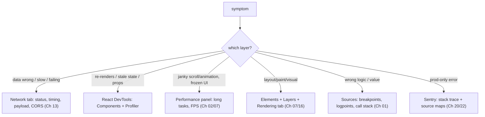

## Problem

You see a bug. Component re-renders too much. Page janks on scroll. Data shows wrong value. Your instinct says add a `console.log`, reload, read the output, edit code, repeat. This takes forever. You waste time guessing. You fix symptoms, not root causes.

The real problem is not the bug. It is the process. Most engineers have no debugging process. They open random tools and hope something helps. They sprinkle `memo` on every component. They blame React when the API returns a 401.

## Why Existing Solution Failed

`console.log` is the default debugging tool. It fails because:

- You modify source code to add logs, then remove them. That is two edits per investigation.
- Logs show values at one point in time. They do not show the call stack, the scope chain, or the execution path.
- Logs cannot filter. A loop of 10000 iterations prints 10000 lines. Good luck finding the one where `id === 7000`.
- Logs observe nothing about layout, paint, network, or rendering decisions.

Guessing where to look fails because bugs cross layers. A slow UI could be a long task (event loop), a layout thrash (rendering pipeline), a slow API (network), or too many re-renders (React). Without a layer map, you pick wrong every time.

## Mental Model

Debugging is a science experiment. Form a hypothesis about which layer the bug lives in. Pick the tool that observes that layer. Let the observation confirm or kill your hypothesis. Repeat until the cause is cornered.

Each layer has one instrument:
- Network issues go to the **Network tab**.
- Render or state issues go to **React DevTools**.
- Jank or slowness goes to the **Performance panel**.
- Layout or paint issues go to **Elements plus Layers**.
- Logic bugs go to **breakpoints**.
- Production errors go to **Sentry** plus source maps.

Bisect the problem space. Cut it in half each step. Disable half the code. Binary search a commit. Comment out a subtree. Narrow the search until the cause has nowhere to hide.

## Visualization

## Engine Simulation

Run through three common bugs with this mental model.

**Bug 1: component re-renders too much.**

Hypothesis: an unstable prop or a parent re-render. Instrument: React DevTools Profiler. Record an interaction. Click the component. Read "Why did this render?" The output says props changed, hooks changed, or parent rendered. If a prop shows "changed" every render, it has unstable identity. In JavaScript, inline objects and functions like `style={{}}` or `onClick={() => {}}` create new references each render cycle. React sees a different object each time, so it re-renders. Fix with `useCallback`, `useMemo`, or component composition. Confirm in the Profiler. You observed the cause. You did not sprinkle `memo` and hope.

**Bug 2: page janks while scrolling.**

Hypothesis: a long task or layout thrash. Instrument: Performance panel. Record the interaction. Look for long tasks flagged in red (over 50ms) and examine the flame chart. Repeated "Recalculate Style" or "Layout" entries mean layout thrashing. The fix is to batch DOM reads before writes. If a JavaScript function takes too long, chunk it or move it to a Web Worker. The bar colors in the Performance panel map directly to the rendering pipeline stages.

**Bug 3: data is wrong or missing.**

Hypothesis: bad request or bad response. Instrument: Network tab. Find the request. Check the status code (401, 304, 500). Inspect the payload, timing, and CORS headers. This rules out the backend in seconds. Often the problem is the network, not React. If the response is correct but the UI shows wrong data, the bug is in your rendering or state logic.

## Internal Implementation

Breakpoints work at the JavaScript engine level. When you set a breakpoint in DevTools Sources, the V8 debugger replaces the target line with a debug break instruction. Execution pauses before that instruction runs. The debugger serializes the current call stack, scope chain, and variable values. DevTools displays them in the Sources panel. Conditional breakpoints add a check: V8 evaluates the condition expression each time the breakpoint is hit. Execution pauses only when the condition returns true.

The React DevTools Profiler works by instrumenting the React reconciler. During a profiling session, React records timing and cause data for every render: which component rendered, which props changed, which hooks changed, which parent triggered the render. The Profiler stores this in a tree structure. The "Why did this render?" feature compares the previous and current props or hooks using `Object.is`. If either differs, it reports the cause.

The Performance panel uses the Chrome tracing infrastructure. It samples the call stack at regular intervals (typically every millisecond). Each sample captures the current function, the call stack, and whether layout or paint is running. The flame chart stacks these samples. Long tasks are groups of samples that exceed 50ms without yielding to the browser. This 50ms threshold comes from the RAIL model: the browser needs to respond to user input within 100ms, and it can process tasks in between frames (every 16.6ms at 60fps). Tasks longer than 50ms push frame processing past the deadline.

## Real World Example

Your team's dashboard page loads data but shows a blank screen. No error logged. Here is the methodical approach.

Step 1: reproduce reliably. Clear cache, refresh. Blank screen every time. Good.

Step 2: layer hypothesis. Is it the network or rendering? Open Network tab. Reload. Find the API call. Status is 200. The response payload looks correct. The data arrives. The problem is not the network.

Step 3: new hypothesis. The component renders but produces no output. Open React DevTools Components. Browse the component tree. The data prop exists and has values. But a child component that renders the main content is absent from the tree.

Step 4: deeper hypothesis. A conditional render hides it. Set a breakpoint in the parent component's render. Step through. The condition evaluates to `false` because a boolean flag is inverted. The fix: correct the condition.

Step 5: confirm. Remove breakpoint. Reload. Dashboard shows data.

Total time: under 5 minutes. No console.log. No guessing. Each step used the right instrument to observe the right layer.

## Tradeoffs

**console.log vs breakpoints.** Logs are fine for quick sanity checks. They are terrible for investigations. Breakpoints preserve the full execution context. They cost setup time but save debugging time. Logpoints are a middle ground: they log without editing code but cannot step through. Use logs for confirmation. Use breakpoints for exploration.

**React DevTools Profiler vs Performance panel.** The Profiler tells you why React rendered. The Performance panel tells you how long it took and whether layout or paint caused jank. They overlap for re-render slowness. The Profiler gives the cause. The Performance panel gives the cost. Use both.

**Local debugging vs Sentry.** Local DevTools cannot reproduce production data or environments. Sentry captures real errors with stack traces, source maps, and context. But Sentry adds latency and cost. Use DevTools for local development. Use Sentry for production observability.

**DevTools vs automated tests.** Tests catch regressions before they ship. DevTools find problems in running code. They are complementary. Write a test after you find a bug so it never comes back.

## Common Mistakes

- Sprinkle `console.log` instead of picking the instrument for the layer.
- Add `memo` without using the Profiler to confirm the cause.
- Skip reliable reproduction before attempting a fix.
- Blame React for a problem visible in the Network tab (401, CORS, slow API).
- Read production stack traces without source maps, getting minified garbage.
- Investigate too wide. Bisect to narrow faster.
- Keep debugging after a fix without confirming the fix works.

## SDE-2 Interview Answer

**Mid-level variant.** "I start by reproducing the bug reliably. Then I pick the DevTools panel that matches the symptom. For re-renders, I use React DevTools Profiler. For jank, I use the Performance panel. For API issues, I use the Network tab. For logic bugs, I set breakpoints. I look at the evidence and fix the root cause instead of guessing."

**Senior variant.** "Debugging is a science experiment. I form a hypothesis about which layer the bug lives in. I pick the instrument that observes that layer. I let the data confirm or kill my hypothesis. Then I iterate. I bisect the problem space: disable half, binary-search commits, or comment out subtrees. This corners the cause quickly. I reproduce first, fix second, confirm third. The method is more important than the tool."

**Engineering Lead variant.** "I teach this method to the team. Debugging is guess-free. We map symptoms to layers and instruments in our runbook. We write tests after finding bugs so they never ship again. We invest in monitoring (Sentry, performance tracking) so we catch issues before users report them. The team standard is: reproduce, instrument, bisect, fix, test. No console.log archaeology."

## Follow-up Questions

1. How does the React DevTools Profiler know why a component rendered? What comparison algorithm does it use? (Answer: it uses `Object.is` to compare previous and current props and hooks, captured during a profiling session where React instruments the reconciler.)

2. A scroll handler fires 60 times per second and the UI janks. What two instruments do you use to figure out which layer is slow? (Answer: Performance panel to find long tasks or layout thrash. Also check if the handler triggers re-renders using React DevTools Profiler.)

3. You set a breakpoint but the debugger never pauses even though the code definitely runs. What is wrong? (Answer: probable causes: source maps are wrong and the breakpoint mapped to the wrong line, the code is minified and the original source map is missing, or the breakpoint is in a file loaded from a different origin and DevTools blocked it.)

4. Why does the Performance panel flag tasks longer than 50ms? What happens to the user experience at 60fps when a task takes 60ms? (Answer: at 60fps, each frame has 16.6ms. A 60ms task delays frame processing by over 3 frames. The user sees dropped frames or frozen UI. The 50ms threshold comes from the RAIL model where the browser needs 50ms to process input and 50ms to render the frame.)

5. A production-only bug cannot be reproduced locally. Describe your full debugging pipeline from symptom to fix without touching local DevTools. (Answer: check Sentry for stack trace and source-mapped location. Add structured logging around the suspected code path. Deploy with verbose logging behind a feature flag. Target the flag to affected users. Inspect logs. Use a session replay tool if available. Once identified, write a regression test and fix.)

## Mental Trigger

Observe the layer, bisect the space.

## One Page Revision

- Debugging is a science experiment. Hypothesis, instrument, observation, conclusion.
- Each layer has one instrument: Network tab, React DevTools, Performance panel, Elements, breakpoints, Sentry.
- Bisect the problem. Cut the search space in half each step.
- console.log is the slow path. Use breakpoints, conditional breakpoints, and logpoints.
- Reproduce reliably before fixing.
- React DevTools Profiler records render causes by comparing props and hooks with Object.is.
- Performance panel samples call stacks every 1ms. Long tasks are over 50ms and cause dropped frames.
- Network tab rules out backend issues in seconds.
- Confirm every fix. Write a test after finding a bug.
- Teach the method to the team. Remove guesses from debugging.
