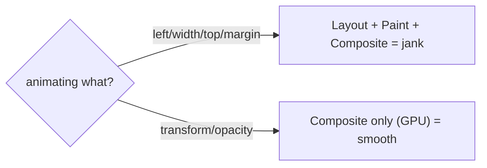

## The Problem That Hooks You

You add a hover effect. The box moves right when the user hovers. You use `left` and `width` because they seem natural. The animation stutters. CPU spikes. Users see jank.

Or you build a modal that should fade out when closed. You toggle a state. The modal disappears instantly. No exit animation.

These are the two animation problems developers face daily: janky motion and missing exit transitions.

## The One Insight

**Only `transform` and `opacity` are compositor-friendly.** Everything else triggers layout or paint. That's the whole secret.

Think of it like a painter. The compositor thread is a separate artist who can move, rotate, and fade pre-painted layers without asking the main artist to repaint anything. If you ask the main artist to repaint every frame (layout properties), you get lag. If you let the compositor artist do the moving (`transform`/`opacity`), it's smooth.



## The Two Scenarios

**The expensive way:**
```css
.box { transition: left 300ms; }
.box:hover { left: 200px; }
```
`left` triggers layout every frame. The browser recalculates positions, repaints, then composites. Each frame runs the full pipeline.

**The right way:**
```css
.box { transition: transform 300ms ease; }
.box:hover { transform: translateX(200px) scale(1.1); }
```
`transform` is compositor-only. The GPU applies the transformation as a matrix multiplication. No layout. No paint. Smooth even at 60fps with hundreds of elements.

## How the Compositor Works

The browser has four pipeline stages: Style → Layout → Paint → Composite. `transform` and `opacity` skip Layout and Paint entirely — the compositor thread on the GPU handles them without involving the main thread.

When you change `left`, the main thread must recalculate layout (synchronous and blocking), then paint, then composite. That's three extra steps per frame.

## The FLIP Technique

For layout animations (items reordering, size changes), Framer Motion uses FLIP:
1. **First** — record the element's current position.
2. **Last** — let the layout change happen. Record the new position.
3. **Invert** — apply a `transform` that makes the element appear in its old position.
4. **Play** — animate the `transform` to zero, sliding the element to its new position.

All animation frames use compositor-only properties. One layout read in step 1, then pure compositor work.

## Real World: Notification Toast

```jsx
import { motion, AnimatePresence } from "framer-motion";

function ToastContainer({ toasts, onRemove }) {
  return (
    <div className="toast-container">
      <AnimatePresence>
        {toasts.map(toast => (
          <motion.div
            key={toast.id}
            initial={{ opacity: 0, x: 100 }}
            animate={{ opacity: 1, x: 0 }}
            exit={{ opacity: 0, x: 100, transition: { duration: 0.15 } }}
            transition={{ duration: 0.3 }}
            className="toast"
          >
            {toast.message}
            <button onClick={() => onRemove(toast.id)}>x</button>
          </motion.div>
        ))}
      </AnimatePresence>
    </div>
  );
}
```

Without `AnimatePresence`, React unmounts the element the moment the condition becomes false. There's no hook for "animate first, then unmount." `AnimatePresence` keeps the element mounted during the exit animation, then signals React to remove it.

## Tradeoffs

**CSS transitions vs Framer Motion.** CSS transitions work for simple state changes — lightweight, off the main thread. Framer Motion handles complex sequences, spring physics, exit animations, and layout transitions.

**requestAnimationFrame vs setInterval.** rAF aligns with the browser's paint cycle. setInterval fires on a timer that drifts and has no relation to paint. Never use `setInterval` for animation.

**opacity vs visibility.** `opacity` is compositor-friendly. `visibility` triggers paint. Animate `opacity` to zero for smooth hiding.

## Common Mistakes

- Animating `top`, `left`, `width`, `height`, or `margin` — triggers layout per frame.
- Using `setInterval` for animation — off-frame timing and drift.
- Forgetting exit animations need `AnimatePresence` — React unmounts instantly.
- Ignoring `prefers-reduced-motion` — motion makes some users physically ill.
- Over-animating — motion distracts instead of communicating.

## Follow-up Questions

**Q1: Why does animating `width` on a flex child cause other elements to move?**
`width` triggers Layout. When a flex child's width changes, the browser recalculates geometry for the entire flex container and every sibling. `transform: scaleX()` avoids this — the element visually stretches without changing its layout box. Siblings stay in place.

**Q2: A user sets `prefers-reduced-motion: reduce`. How do you handle it globally?**
Wrap motion components in a wrapper that checks `useReducedMotion()`. If true, override `initial`, `animate`, and `exit` to `{ opacity: 1 }` (no motion). Or add a CSS rule: `@media (prefers-reduced-motion: reduce) { *, *::before, *::after { animation-duration: 0.01ms !important; } }`.

**Q3: You have a drag-and-drop grid where items swap positions. After the animation, DOM order must match visual order for keyboard users. How?**
Use Framer Motion's `layoutId` to animate position changes. Each item gets a stable `layoutId` based on its data ID. After the animation completes, commit the actual DOM reorder in `onAnimationComplete`. Keyboard tab order follows DOM order, so the DOM must eventually match the visual layout.

**Q4: What's the difference between `transform: translateX(100px)` and `left: 100px` at the browser level?**
`left` triggers Style → Layout → Paint → Composite on every frame. `transform` triggers Style → Composite only. The browser's compositor thread applies the matrix on the GPU without recalculating geometry or repainting pixels. This is why `transform` is always smoother for position changes.

## Mental Trigger

Animate cheap props on the compositor. Only `transform` and `opacity` skip layout.

## One Page Revision

- Only `transform` and `opacity` are compositor-friendly. Everything else triggers layout or paint.
- Pipeline: Style → Layout → Paint → Composite. Transform/opacity skip Layout and Paint.
- FLIP: First, Last, Invert, Play. Animates layout changes using compositor-only properties.
- `AnimatePresence` delays removal for exit animations. Without it, React unmounts instantly.
- CSS transitions for simple hovers. Framer Motion for rich interactions and exit animations.
- `requestAnimationFrame` for custom JS animation. Never `setInterval`.
- Respect `prefers-reduced-motion`. Disable non-essential animation.
