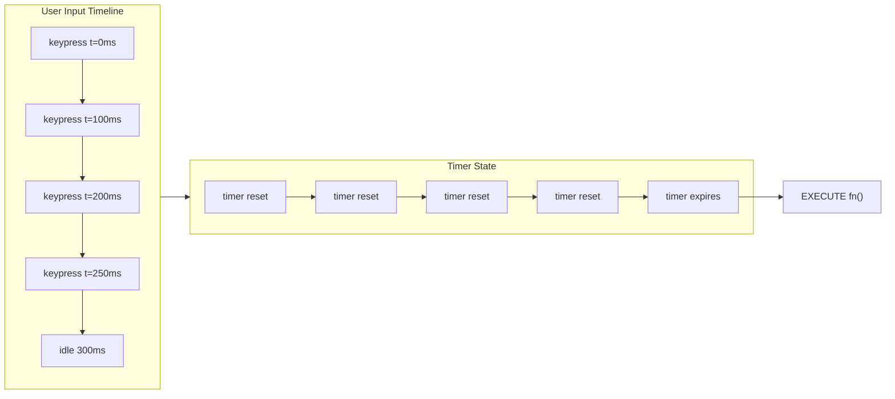

## Problem

You add a hover effect. The box moves right when the user hovers. You use `left` and `width` because they seem natural. The animation is choppy. The box stutters. CPU spikes. Users see jank.

Or you build a modal that should fade out when closed. You toggle a state variable. The modal disappears instantly. No exit animation. The user is confused about where the modal went.

Or you build a list that reorders. Items jump to new positions instead of sliding smoothly.

These are the three animation problems developers face daily: janky motion, missing exit transitions, and layout jumping.

## Why Existing Solution Failed

Naive animation uses the obvious CSS properties that describe position and size: `left`, `top`, `width`, `height`, `margin`. These trigger the browser's layout step on every animation frame. At 60fps, the browser recalculates layout 60 times per second. Layout recalculates geometry for the element and all its descendants. Then paint runs. Then composite runs. That is three pipeline steps per frame.

The rendering pipeline has four stages: Style, Layout, Paint, Composite. When you animate a layout property, all four stages run every frame. When you animate `transform` or `opacity`, only the composite stage runs. The difference is the difference between smooth and janky.

For exit animations, React unmounts components the moment the condition becomes false. There is no hook for "wait, animate first, then unmount." Without a tool that delays removal, exit animations are impossible.

## Mental Model

Smooth animation means animate only compositor-friendly properties: `transform` and `opacity`. These stay on the GPU compositor thread. They never trigger layout or paint.

Let the browser drive timing. Use CSS transitions, CSS keyframes, or `requestAnimationFrame`. Never use `setInterval`. The browser knows when frames are due. You do not.

A library like Framer Motion is a declarative layer over this truth. You declare start and end states. It interpolates compositor properties. It handles enter, exit, and layout transitions for you.

Animation is communication. It shows continuity, cause, and effect. A button that moves down when pressed communicates that it was pressed. A modal that slides in from the right communicates its origin. Animation must be purposeful and must respect users who cannot tolerate motion.

## Visualization




## Engine Simulation

Run three scenarios through the animation engine.

**Scenario 1: move a card on hover the expensive way.**

```css
.box { transition: left 300ms, width 300ms; }
.box:hover { left: 200px; width: 400px; }
```

Internally, the browser sees `left` change. It marks the layout as dirty. Each frame of the transition runs the full pipeline: layout recalculates positions, paint paints the new pixels, composite layers them. With many elements, each layout recalculates the entire subtree. Frames drop.

**Scenario 2: move the same card with `transform`.**

```css
.box { transition: transform 300ms ease, opacity 300ms; }
.box:hover { transform: translateX(200px) scale(1.1); }
```

Internally, the browser sees `transform` change. It marks only the composite step as dirty. The compositor thread on the GPU applies the transformation as a matrix multiplication. No layout. No paint. The matrix is combined with the existing layer and displayed. This stays smooth even at 60fps with hundreds of elements.

**Scenario 3: exit animation without and with `AnimatePresence`.**

Without `AnimatePresence`, when `isOpen` becomes `false`, React removes the modal from the virtual DOM immediately. The next commit removes the DOM node. The browser paints the frame without it. The modal vanishes. No transition runs.

With `AnimatePresence`, Framer Motion intercepts the removal. It keeps the element in the DOM tree. It changes the animation target to the `exit` props and starts the animation. When the animation completes, Framer Motion signals React to remove the element.

## Internal Implementation

The browser compositor is a separate thread from the main JavaScript thread. Its job is to take layer bitmaps and composite them into the final screen image. When you change `transform`, the main thread marks the layer as dirty. The compositor thread reads the new transform value, applies it using the GPU, and composites the frame. The main thread never needs to recalculate layout or repaint.

When you change `left`, the main thread must recalculate layout. Layout is a synchronous, blocking operation. The main thread walks the DOM tree, computes new geometries, and marks paint regions. Then paint runs. Only then does the compositor get new bitmaps to composite.

The FLIP technique that Framer Motion uses for `layout` animations works like this:
- First: record the element's current position and size (First).
- Last: record the element's new position and size after layout change (Last).
- Invert: calculate the difference (old minus new). Apply a `transform` to make the element appear in its old position.
- Play: animate the `transform` to zero, so the element slides to its new position.

All steps except the initial layout read use compositor-only properties. The `layout` prop does this automatically. It uses `ResizeObserver` and mutation observers to detect position changes, then applies the FLIP transform.

Framer Motion drives animation timing using `requestAnimationFrame`. The rAF callback receives a high-resolution timestamp. Framer Motion calculates the interpolated value based on the animation duration and easing curve. It sets the property directly on the element's style. For composite properties, this triggers only a composite frame.

## Real World Example

You build a notification toast system. Toasts appear from the top right, stay for 3 seconds, then disappear. Each toast should slide in and fade out.

Step 1: decide animation strategy. Each toast enters and exits independently. Use Framer Motion.

Step 2: implement the component.

```jsx
import { motion, AnimatePresence } from "framer-motion";

function ToastContainer({ toasts, onRemove }) {
  return (
    <div className="toast-container">
      <AnimatePresence>
        {toasts.map(toast => (
          <motion.div
            key={toast.id}
            initial={{ opacity: 0, x: 100 }}
            animate={{ opacity: 1, x: 0 }}
            exit={{ opacity: 0, x: 100, transition: { duration: 0.15 } }}
            transition={{ duration: 0.3 }}
            className="toast"
          >
            {toast.message}
            <button onClick={() => onRemove(toast.id)}>x</button>
          </motion.div>
        ))}
      </AnimatePresence>
    </div>
  );
}
```

Step 3: understand what happens internally. When a toast is added, Framer Motion creates the element with `opacity: 0` and `transform: translateX(100px)`. On the next frame, it animates to `opacity: 1` and `transform: translateX(0)`. The browser composites these changes on the GPU. When the toast is removed, `AnimatePresence` keeps the element mounted. Framer Motion animates back to the exit values. After 150ms, it signals removal. The DOM node is removed.

Step 4: add accessibility. Use `useReducedMotion()` or a CSS media query to disable motion when the user prefers reduced motion. Provide a simpler visual cue like a border highlight.

## Tradeoffs

**CSS transitions vs Framer Motion.** CSS transitions work for simple state changes. They are lightweight and run off the main thread. But they cannot orchestrate complex sequences, spring physics, or exit animations. Framer Motion gives more control but adds bundle size (around 30KB gzipped). Use CSS for simple hovers and toggles. Use Framer Motion for rich interactions and exit animations.

**requestAnimationFrame vs setInterval.** rAF aligns with the browser's paint cycle. It fires before the next paint, so you write one frame of changes at the right time. setInterval fires on a timer that drifts and bears no relation to the paint cycle. It can fire multiple times between frames (wasted work) or fire mid-frame (partial paint). Never use setInterval for animation.

**Opacity vs visibility.** `opacity` is compositor-friendly. `visibility` triggers paint. If you need to hide something smoothly, animate `opacity` to zero. If you need to hide it instantly, use `visibility` or `display: none`.

**transform vs geometry.** `transform: translateX()` creates the same visual result as `left` for position changes. But `transform` is compositor-only. Always prefer `transform` for position and `scale` for size changes.

## Common Mistakes

- Animate `top`, `left`, `width`, `height`, or `margin`. These trigger layout per frame.
- Use `setInterval` for animation instead of CSS or rAF. Off-frame timing and drift.
- Forget exit animations need `AnimatePresence`. React unmounts instantly.
- Ignore `prefers-reduced-motion`. Motion makes some users physically ill.
- Over-animate. Motion distracts or delays the user instead of communicating.
- Animate huge lists without virtualization. The browser composites many elements even if invisible.
- Use `display: none` to hide animated elements mid-transition. The browser cannot animate elements that are not displayed.

## SDE-2 Interview Answer

**Mid-level variant.** "I animate only `transform` and `opacity` because they skip layout and paint. Those properties run on the compositor thread on the GPU. Geometry properties like `left` and `width` trigger layout every frame, which causes jank. For exit animations, I use `AnimatePresence` because React unmounts immediately. I respect `prefers-reduced-motion` by disabling non-essential animation."

**Senior variant.** "Animation performance comes down to the rendering pipeline. Layout properties rerun Style, Layout, Paint, and Composite on every frame. Transform and opacity run only Composite. I choose the animation tool based on complexity: CSS transitions for simple hovers, Framer Motion for rich interactions and exit animations, rAF for physics. I always include a reduced-motion path. I measure with the Performance panel to confirm the animation stays on the compositor."

**Engineering Lead variant.** "I enforce an animation system that defaults to compositor-only properties. We use Framer Motion for all UI animation because it handles enter, exit, and layout transitions uniformly. We define animation tokens (duration, easing) so every animation feels consistent. The Performance panel is part of our review checklist. We audit animations for accessibility by testing with reduced motion enabled. Every animation must have a purpose. No motion for its own sake."

## Follow-up Questions

1. What is the rendering pipeline and which stages does `transform` skip? (Answer: Style, Layout, Paint, Composite. Transform skips Layout and Paint, running only Style and Composite on the compositor thread.)

2. Why does animating `width` on a flex child cause other elements to move? What does that mean for performance? (Answer: `width` change triggers layout, which recalculates the geometry of sibling and parent elements. The browser must recompute the entire flex layout. This multiplies cost by the number of affected elements. With `transform: scaleX()`, no layout recalculates and no sibling moves.)

3. Framer Motion's `layout` prop uses FLIP internally. Walk through the FLIP steps and explain why it stays on the compositor. (Answer: First, Last, Invert, Play. First captures the old position. Last captures the new position after layout runs once. Invert applies a transform to make the element appear in its old position. Play animates the transform to zero. The Invert and Play steps use only transform, which is compositor-friendly. The initial layout runs once, not per frame.)

4. A user sets `prefers-reduced-motion: reduce`. Your animation library does not respect this. How do you handle it without rewriting every component? (Answer: wrap the animation library's components. Create a custom `MotionDiv` that checks `useReducedMotion()` and overrides animation values to skip motion. Or add a CSS rule that disables all animations and transitions when the media query matches.)

5. You have a drag-and-drop grid where items swap positions. Animating the swap with `transform` works. But after the animation, the actual DOM order must match the visual order for keyboard users. How do you reconcile this? (Answer: use Framer Motion's `layoutId` to animate position while keeping DOM order correct. Or apply the FLIP technique manually: animate positions with transform, then commit the actual DOM reorder in a rAF callback after the animation completes. Keyboard focus order must match visual order, so the DOM reorder must happen before the user can tab through.)

## Mental Trigger

Animate cheap props on the compositor.

## One Page Revision

- Only `transform` and `opacity` are compositor-friendly. Everything else triggers layout or paint.
- Rendering pipeline: Style, Layout, Paint, Composite. Transform and opacity skip Layout and Paint.
- Compositior thread runs on GPU, separate from main thread. No main thread blocking.
- Use CSS transitions for simple hover or toggle effects.
- Use Framer Motion for rich interactions, spring physics, exit animations, layout transitions.
- Use requestAnimationFrame for custom JS animation. Never use setInterval.
- React unmounts components immediately. AnimatePresence delays removal for exit animations.
- FLIP technique: First, Last, Invert, Play. Uses transform to animate layout changes smoothly.
- Respect prefers-reduced-motion. Disable non-essential animation.
- Measure with Performance panel. Confirm animation stays on compositor.
