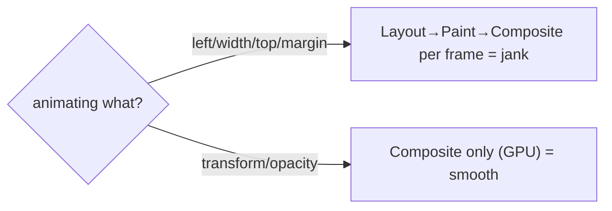

> **Prerequisites:** understanding of the browser rendering pipeline and why `transform`/`opacity` stay on the compositor (no layout/paint per frame, Ch 07), `requestAnimationFrame` for JS-driven animation timing (Ch 17), and respecting `prefers-reduced-motion` for accessibility (Ch 23).

---

## The one mental model

> **Smooth animation means animate ONLY the cheap properties (`transform` and `opacity`). This way the
> browser stays on the compositor and never re-runs layout or paint per frame (Ch 07). Let the
> browser drive timing (CSS transitions or rAF, Ch 17), not `setInterval`. A library like Framer
> Motion is just an easy layer over that truth. You declare the start and end state. It
> interpolates cheap properties on the compositor. It handles enter, exit, and layout transitions for you.
> Animation is communication. It shows cause and effect and continuity. So it must also respect users
> who don't want motion.**

From "animate cheap props, browser-driven, motion is communication" you can see why `transform`
beats animating `top` or `width`. You understand why `AnimatePresence` exists (React unmounts immediately, so exit
animations need help). And you see why you honor `prefers-reduced-motion`.

---

## Learning Objectives

1. Animate only compositor-friendly properties (`transform`/`opacity`) and explain why (Ch 07).
2. Choose between CSS transitions/animations and JS (rAF or Framer Motion) based on the task.
3. Use Framer Motion's model: `motion` components, `animate`, `AnimatePresence`, layout animations.
4. Respect `prefers-reduced-motion` and keep animation purposeful.

---

## Key Mental Models

- **Cheap = `transform` + `opacity`** (composite only, GPU). Everything else risks layout and paint
  per frame (Ch 07), which causes jank.
- **Browser-driven timing.** Use CSS transitions/animations or `requestAnimationFrame`. Never
  use `setInterval` (it drifts and runs off-frame, Ch 02).
- **React unmounts instantly.** So **exit** animations need a tool that delays removal.
  That tool is `AnimatePresence`.
- **Animation is communication.** It shows continuity and cause and effect. It is optional for users who
  set reduced motion.

---

## Introduction

Polished micro-interactions are listed in the job description. Animation is where Ch 07's pipeline shows
its value. The whole topic is "animate the cheap things, let the browser time it, make it mean
something."

---

## Problem: why naive animation janks

```css
/* ❌ animating layout properties → reflow every frame (Ch 07) → dropped frames */
.box { transition: left 300ms, width 300ms; }
.box:hover { left: 200px; width: 400px; }
```

`left` and `width` restart at **Layout** each frame. In the rendering pipeline, layout to paint to
composite is far more expensive than composite-only (Ch 07). So a 60fps animation does about 60
layouts per second, causing jank. This is especially bad with many elements. The fix is to express the same motion with
a compositor-only property:

```css
/* ✅ transform → composite only, GPU, smooth */
.box { transition: transform 300ms ease, opacity 300ms; }
.box:hover { transform: translateX(200px) scale(1.1); }
```



---

## CSS vs JS animation

- **CSS transitions.** They interpolate between two states on a property change. Best for simple
  hover, toggle, or enter effects. They run off the main thread for compositor props.
- **CSS keyframe animations.** Multi-step, looping (spinners, pulses). Declarative and performant.
- **JS via `requestAnimationFrame`** (Ch 17). Use when you need per-frame logic, physics, or values
  CSS cannot express. Read and write in the rAF callback. Never use `setInterval`.
- **Framer Motion or Web Animations API.** This is declarative JS animation with spring physics, gesture,
  layout, and orchestration. It is the easy choice for rich React UIs.

---

## Engine Simulation: Framer Motion's model

```jsx
import { motion, AnimatePresence } from "framer-motion";

// 1. Declare states; FM interpolates transform/opacity on the compositor
<motion.div
  initial={{ opacity: 0, y: 8 }}     // start
  animate={{ opacity: 1, y: 0 }}     // end (y → translateY, cheap)
  transition={{ duration: 0.2 }}
/>

// 2. Exit animations: React would unmount instantly; AnimatePresence delays removal
<AnimatePresence>
  {isOpen && (
    <motion.div key="modal"
      initial={{ opacity: 0 }} animate={{ opacity: 1 }}
      exit={{ opacity: 0 }} />     // runs BEFORE the node is removed
  )}
</AnimatePresence>
```

Here is why `AnimatePresence` exists. When `isOpen` goes false, React removes the node from the tree
*immediately* (Ch 03/06). There is no frame to animate out. `AnimatePresence` keeps the element
mounted until its `exit` animation finishes. Then it removes it. That is the one Framer Motion concept
people miss.

**Layout animations** (`layout` prop). Framer Motion measures the element's box before and after a layout
change (FLIP technique). It animates the difference with `transform`. So reordering a list
animates smoothly without animating layout properties directly. It is Ch 07's "transform is cheap"
applied automatically.

---

## Reduced motion (Ch 23)

```css
@media (prefers-reduced-motion: reduce) {
  * { animation: none !important; transition: none !important; }
}
```
```jsx
const reduce = useReducedMotion();            // Framer Motion hook
<motion.div animate={reduce ? {} : { y: 0 }} />
```

Vestibular disorders make motion physically unpleasant. Respect the OS setting. Disable or
minimize non-essential motion. This is part of accessibility (Ch 23), not a nice-to-have.

---

## Interview Discussion (reason first)

**Q1. "Why animate `transform` instead of `top` or `width`?"**
> "Geometry properties restart the pipeline at Layout every frame (Ch 07). So a 60fps animation
> means about 60 layouts per second, causing jank. `transform` and `opacity` are handled by the compositor on the GPU.
> There is no layout or paint per frame. So they stay smooth. Same visual result, far cheaper."

**Q2. "Why does Framer Motion need `AnimatePresence`?"**
> "React unmounts a removed element immediately. That leaves no time to animate it out.
> `AnimatePresence` keeps it mounted until its `exit` animation completes. Then it removes it. That is
> how you get exit transitions."

**Q3. "How do you keep animations accessible?"**
> "Honor `prefers-reduced-motion` (media query or `useReducedMotion`). Disable non-essential
> motion. Keep animation purposeful (showing continuity and cause-effect). Keep it short. Never block
> interaction."

*Scoring:* full = compositor-cheap-props (Ch 07) + AnimatePresence-because-unmount + reduced-motion.

---

## Common Mistakes

- **Animating `top`/`left`/`width`/`height`/`margin`** causes reflow per frame and jank.
- **Using `setInterval` for animation** instead of CSS or rAF causes off-frame timing and drifts (Ch 02).
- **Forgetting exit animations need `AnimatePresence`.**
- **Ignoring `prefers-reduced-motion`** (Ch 23).
- **Over-animating.** Motion distracts or delays the user instead of communicating.
- **Animating huge lists** without virtualization (Ch 08). Animate only what is visible.

---

## Interview Questions

1. Which properties animate cheaply and why (tie to Ch 07's pipeline)?
2. CSS transition vs keyframes vs rAF vs Framer Motion. When to use each?
3. Why is `AnimatePresence` necessary? What would happen without it?
4. What does Framer Motion's `layout` prop do (FLIP), and why is it smooth?
5. How do you make animations respect accessibility?

---

## Homework

1. Animate a card two ways (`left` vs `transform`); record both in the Performance panel and
   compare layout/paint cost (Ch 07).
2. Build a modal with Framer Motion enter + exit using `AnimatePresence`; remove `AnimatePresence`
   and watch the exit disappear instantly.
3. Add a `prefers-reduced-motion` path. In `NOTES.md`: cheap-props + AnimatePresence-why in 2 lines.

---

## Summary

- **Animate only `transform`/`opacity`** so the browser stays on the **compositor** (GPU) and
  skips layout and paint per frame (Ch 07). That is the line between smooth and janky.
- **Browser-driven timing.** Use CSS transitions, keyframes, or `requestAnimationFrame` (Ch 17).
  Never use `setInterval`.
- **Framer Motion** declares start and end states. It interpolates cheap props. **`AnimatePresence`**
  enables **exit** animations (React unmounts instantly otherwise). **`layout`** animates position
  changes via FLIP and transform.
- **Animation is communication** and must respect **`prefers-reduced-motion`** (Ch 23).

## Go deeper
Ch 07 (the pipeline this rests on), Ch 17 (rAF), Ch 23 (reduced motion). Framer Motion (motion.dev)
docs are the reference once the cheap-property model is solid.
